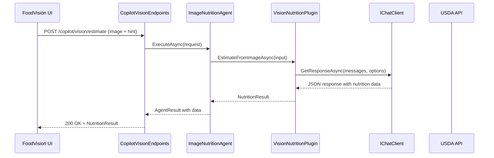
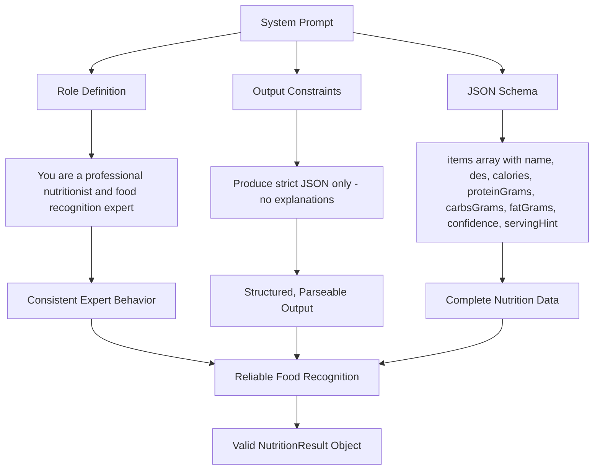
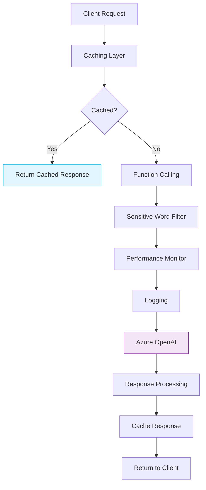
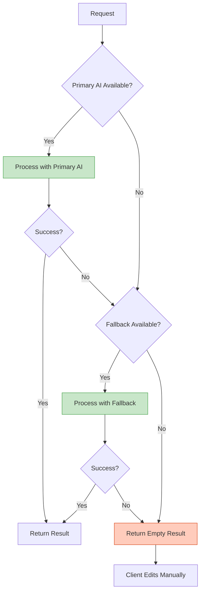

# AI & Semantic Kernel Integration

<cite>
**Referenced Files in This Document**   
- [ImageNutritionAgent.cs](file://FitTrack.Copilot/Agent/ImageNutritionAgent.cs)
- [VisionNutritionPlugin.cs](file://FitTrack.Copilot/SemanticKernel/Plugins/VisionNutritionPlugin.cs)
- [vision_nutrition.system.md](file://FitTrack.Copilot/SemanticKernel/Plugins/SystemPrompt/vision_nutrition.system.md)
- [FoodParsingSkill.cs](file://FitTrack.Copilot/Tools/FoodParsingSkill.cs)
- [CopilotServiceCollectionExtensions.cs](file://FitTrack.Copilot/Extension/CopilotServiceCollectionExtensions.cs)
- [appsettings.json](file://FitTrack.Copilot/appsettings.json)
- [SensitiveWordFilterChatClient.cs](file://FitTrack.Copilot/Middleware/SensitiveWordFilterChatClient.cs)
- [PerformanceMonitorChatClient.cs](file://FitTrack.Copilot/Middleware/PerformanceMonitorChatClient.cs)
- [LoggingChatClient.cs](file://FitTrack.Copilot/Middleware/LoggingChatClient.cs)
- [CopilotVisionEndpoints.cs](file://FitTrack.Copilot/Endpoints/CopilotVisionEndpoints.cs)
- [FoodVision.razor](file://FitTrack.Copilot/Components/Pages/FoodVision.razor)
- [FoodVision.razor.cs](file://FitTrack.Copilot/Components/Pages/FoodVision.razor.cs)
</cite>

## Table of Contents
1. [Agent Architecture](#agent-architecture)
2. [VisionNutritionPlugin Implementation](#visionnutritionplugin-implementation)
3. [System Prompt Engineering](#system-prompt-engineering)
4. [FoodParsingSkill and Data Extraction](#foodparsing skill-and-data-extraction)
5. [AI Provider Configuration](#ai-provider-configuration)
6. [Prompt Templating and Function Calling](#prompt-templating-and-function-calling)
7. [Response Validation and Sanitization](#response-validation-and-sanitization)
8. [Latency Considerations and Fallback Strategies](#latency-considerations-and-fallback-strategies)

## Agent Architecture

The AI integration in FitTrack is orchestrated through a modular agent architecture centered around the `ImageNutritionAgent` class. This agent serves as the primary interface for vision-based nutrition estimation, handling requests with the intent "vision.nutrition.estimate". The agent follows a clean separation of concerns, delegating the actual AI processing to the `VisionNutritionPlugin` while maintaining responsibility for request validation, file type checking, and error handling.

The agent receives image inputs through multipart form data and supports optional hint parameters to guide the analysis. It validates that at least one image file is provided and ensures the content type begins with "image/". The agent constructs a `FunctionContext` from the incoming request and delegates the core vision analysis to the injected `VisionNutritionPlugin`. After receiving results, the agent performs basic sanity checks, such as verifying that food items were detected with sufficient confidence, before returning structured nutrition data to the client.

**Diagram sources**
- [ImageNutritionAgent.cs](file://FitTrack.Copilot/Agent/ImageNutritionAgent.cs)
- [CopilotVisionEndpoints.cs](file://FitTrack.Copilot/Endpoints/CopilotVisionEndpoints.cs)
- [VisionNutritionPlugin.cs](file://FitTrack.Copilot/SemanticKernel/Plugins/VisionNutritionPlugin.cs)

**Section sources**
- [ImageNutritionAgent.cs](file://FitTrack.Copilot/Agent/ImageNutritionAgent.cs#L11-L56)
- [CopilotVisionEndpoints.cs](file://FitTrack.Copilot/Endpoints/CopilotVisionEndpoints.cs#L14-L39)

## VisionNutritionPlugin Implementation

The `VisionNutritionPlugin` is the core component responsible for interfacing with AI models through Microsoft's Semantic Kernel framework. It acts as a bridge between the application logic and the underlying AI provider, encapsulating the complexity of constructing chat messages, configuring model parameters, and processing responses.

The plugin accepts an `IChatClient` and `PromptLoader` through dependency injection, enabling flexible configuration of AI backends. Its primary method, `EstimateFromImageAsync`, constructs a multi-modal chat message sequence that includes the system prompt, optional user hints, and the image data encoded as a data URL. The plugin configures specific model parameters optimized for nutrition analysis, including a temperature of 0.2 for deterministic responses, a maximum output of 800 tokens, and JSON response format to ensure structured output.

The image processing workflow converts uploaded image bytes to base64 encoding and constructs a data URL with the appropriate MIME type. This data URL is included in the chat message alongside a text instruction to "Respond JSON only." The plugin then invokes the AI model and deserializes the response into a `NutritionResult` object, providing a clean, type-safe interface for the rest of the application.

**Section sources**
- [VisionNutritionPlugin.cs](file://FitTrack.Copilot/SemanticKernel/Plugins/VisionNutritionPlugin.cs#L14-L70)

## System Prompt Engineering

The system prompt defined in `vision_nutrition.system.md` plays a critical role in guiding the AI model's behavior and ensuring consistent, structured output. This prompt establishes the AI's role as a professional nutritionist and food recognition expert, setting clear expectations for its analytical approach.

The prompt enforces strict JSON output requirements, instructing the model to produce only JSON without any additional explanations, markdown, or text. It defines a comprehensive JSON schema that specifies the exact structure of the response, including food name, description, macronutrient values (calories, protein, carbohydrates, and fat in grams), confidence score, and serving size hints.

Key prompt engineering techniques include:
- **Role definition**: Establishing the AI as a "professional nutritionist and food recognition expert" to guide its analytical approach
- **Output constraints**: Requiring "strict JSON object" with "no explanations, no markdown, no text outside JSON"
- **Schema specification**: Providing a complete JSON schema with detailed field descriptions
- **Consistency enforcement**: Using visual markers (🧩) and clear section headers to structure the prompt

This carefully crafted prompt ensures that the AI produces predictable, parseable output that can be reliably consumed by the application without complex post-processing.

**Diagram sources**
- [vision_nutrition.system.md](file://FitTrack.Copilot/SemanticKernel/Plugins/SystemPrompt/vision_nutrition.system.md)

**Section sources**
- [vision_nutrition.system.md](file://FitTrack.Copilot/SemanticKernel/Plugins/SystemPrompt/vision_nutrition.system.md#L1-L26)
- [VisionNutritionPlugin.cs](file://FitTrack.Copilot/SemanticKernel/Plugins/VisionNutritionPlugin.cs#L39-L40)

## FoodParsing Skill and Data Extraction

The `FoodParsingSkill` component (currently implemented as `FoodLookupSkill`) demonstrates the integration of external knowledge sources with the AI system. This skill enables the application to validate and enhance AI-generated nutrition estimates by cross-referencing with authoritative data from the USDA FoodData Central API.

The skill implements a `LookupCalories` function that accepts a food name and returns calorie information by querying the USDA database. It first searches for the food item using the name, then retrieves detailed nutritional information for the matched item. The function specifically looks for the "Energy" nutrient to extract calorie values, demonstrating a targeted approach to data extraction from complex API responses.

This skill represents a function calling pattern where the AI system can invoke external tools to augment its knowledge. While not currently integrated into the vision analysis workflow, this architecture provides a foundation for future enhancements where the AI could validate its estimates against official nutritional databases or fill in missing information for recognized food items.

**Section sources**
- [FoodParsingSkill.cs](file://FitTrack.Copilot/Tools/FoodParsingSkill.cs#L7-L25)
- [UsdaClient.cs](file://FitTrack.Copilot/Api/Usda/UsdaClient.cs)

## AI Provider Configuration

The AI integration supports multiple providers through flexible configuration in `appsettings.json`. The primary configuration includes settings for Azure OpenAI (referred to as "AI") and TokenAI as alternative backends. Each provider configuration specifies the endpoint URL, model ID, API key, token limits, temperature, and caching behavior.

The `CopilotServiceCollectionExtensions` class handles the registration of AI services, creating an `AzureOpenAIClient` with the configured endpoint and API key. The system uses `gpt-4o` as the default model for the primary AI service and `gpt-4o-mini` specifically for vision analysis in the `VisionNutritionPlugin`. This model selection reflects a balance between capability and cost-effectiveness for image analysis tasks.

A sophisticated middleware pipeline enhances the basic AI client with additional capabilities:
- **Caching**: Responses are cached in memory to improve performance and reduce API costs
- **Function calling**: Enables the AI to invoke external tools and skills
- **Sensitive word filtering**: Monitors both input and output for potentially inappropriate content
- **Performance monitoring**: Tracks response times, token usage, and system performance
- **Comprehensive logging**: Records detailed information about each AI interaction

The middleware is applied in a specific order: caching, function calling, sensitive word filtering, performance monitoring, and finally logging. This layered approach ensures that expensive AI calls are minimized through caching while maintaining visibility into system behavior.

**Diagram sources**
- [CopilotServiceCollectionExtensions.cs](file://FitTrack.Copilot/Extension/CopilotServiceCollectionExtensions.cs)
- [appsettings.json](file://FitTrack.Copilot/appsettings.json)

**Section sources**
- [CopilotServiceCollectionExtensions.cs](file://FitTrack.Copilot/Extension/CopilotServiceCollectionExtensions.cs#L28-L83)
- [appsettings.json](file://FitTrack.Copilot/appsettings.json#L12-L29)

## Prompt Templating and Function Calling

The system employs a sophisticated prompt templating approach that combines system prompts, user hints, and image data into a cohesive multi-modal input for the AI model. The `PromptLoader` service loads the system prompt from the `vision_nutrition.system.md` file, ensuring that prompt content is externalized and easily modifiable without code changes.

The prompt engineering strategy follows several key principles:
- **Context isolation**: The system prompt establishes role and output format expectations before any user content
- **Multi-modal composition**: Image data is embedded as a data URL alongside text instructions
- **Output format enforcement**: Explicit instructions to "Respond JSON only" are included in the user message
- **Hint integration**: Optional user-provided hints are incorporated to guide the analysis

The function calling infrastructure is configured through the `ChatClientBuilder.UseFunctionInvocation()` method, which enables the AI model to recognize and call registered functions. Although the current vision analysis workflow doesn't utilize function calling, the infrastructure is in place to support more complex interactions where the AI could invoke the `FoodLookupSkill` or other tools to validate or enhance its responses.

The system also supports prompt configuration through the `Prompts` section in `appsettings.json`, which specifies the root directory and resource prefix for prompt files. This allows for easy management of multiple prompt templates across different domains and use cases.

**Section sources**
- [VisionNutritionPlugin.cs](file://FitTrack.Copilot/SemanticKernel/Plugins/VisionNutritionPlugin.cs#L37-L68)
- [CopilotServiceCollectionExtensions.cs](file://FitTrack.Copilot/Extension/CopilotServiceCollectionExtensions.cs#L49)
- [appsettings.json](file://FitTrack.Copilot/appsettings.json#L46-L49)

## Response Validation and Sanitization

The system implements multiple layers of validation and sanitization to ensure the reliability and safety of AI-generated content. At the agent level, basic validation checks that required image files are present and that the request intent is supported. The `ImageNutritionAgent` performs a simple sanity check on results, verifying that food items were detected with sufficient confidence.

The middleware pipeline provides comprehensive content monitoring:
- **Sensitive word filtering**: The `SensitiveWordFilterChatClient` scans both user inputs and AI responses for a configurable list of sensitive terms. When detected, these are logged as warnings, allowing for monitoring without blocking legitimate content.
- **Input validation**: The system validates that uploaded files are images and enforces size limits (20MB) through form options configuration.
- **Structured output enforcement**: By requesting JSON responses and defining a strict schema, the system ensures that AI outputs are predictable and easily validated.

The response deserialization process includes null checking, with a fallback to an empty `NutritionResult` object if deserialization fails. This defensive programming approach prevents cascading failures while maintaining system availability.

The sensitive word filter maintains a case-insensitive hash set of prohibited terms and provides methods for both detection and replacement (though replacement is not currently enabled). This design allows for flexible content moderation policies that can be adjusted based on application requirements.

**Section sources**
- [SensitiveWordFilterChatClient.cs](file://FitTrack.Copilot/Middleware/SensitiveWordFilterChatClient.cs#L10-L148)
- [ImageNutritionAgent.cs](file://FitTrack.Copilot/Agent/ImageNutritionAgent.cs#L48-L49)
- [VisionNutritionPlugin.cs](file://FitTrack.Copilot/SemanticKernel/Plugins/VisionNutritionPlugin.cs#L33-L34)

## Latency Considerations and Fallback Strategies

The system addresses latency and reliability concerns through several architectural strategies. The performance monitoring middleware (`PerformanceMonitorChatClient`) tracks response times, token usage, and request frequency, providing visibility into system performance and potential bottlenecks.

Key latency mitigation strategies include:
- **Response caching**: Results are cached in memory to avoid redundant AI calls for identical or similar requests
- **Streaming support**: The system supports streaming responses, allowing partial results to be delivered to the client before processing is complete
- **Performance monitoring**: Long-running requests (>5 seconds) trigger warnings, enabling proactive identification of performance issues
- **First token timing**: For streaming responses, the time to first token is measured, providing insight into model initialization latency

The fallback strategy is currently implicit rather than explicit:
- **Graceful degradation**: When no food items are confidently detected, the system returns an empty result with a descriptive message rather than failing
- **Error handling**: Exceptions during AI processing are caught and converted to user-friendly error messages
- **Client-side handling**: The `FoodVision` component displays appropriate notifications when analysis fails or returns no results

The architecture supports the addition of explicit fallback strategies, such as:
- **Model fallback**: Switching to a different AI provider (e.g., from OpenAI to TokenAI) when the primary service is unavailable
- **Hybrid analysis**: Combining AI estimates with database lookups for known food items
- **Progressive enhancement**: Providing basic food recognition when detailed nutrition analysis fails

The system's modular design, with clear separation between the agent, plugin, and AI client layers, facilitates the implementation of more sophisticated fallback mechanisms in the future.

**Diagram sources**
- [PerformanceMonitorChatClient.cs](file://FitTrack.Copilot/Middleware/PerformanceMonitorChatClient.cs)
- [ImageNutritionAgent.cs](file://FitTrack.Copilot/Agent/ImageNutritionAgent.cs)
- [VisionNutritionPlugin.cs](file://FitTrack.Copilot/SemanticKernel/Plugins/VisionNutritionPlugin.cs)

**Section sources**
- [PerformanceMonitorChatClient.cs](file://FitTrack.Copilot/Middleware/PerformanceMonitorChatClient.cs#L1-L139)
- [ImageNutritionAgent.cs](file://FitTrack.Copilot/Agent/ImageNutritionAgent.cs#L50-L54)
- [appsettings.json](file://FitTrack.Copilot/appsettings.json#L36-L40)