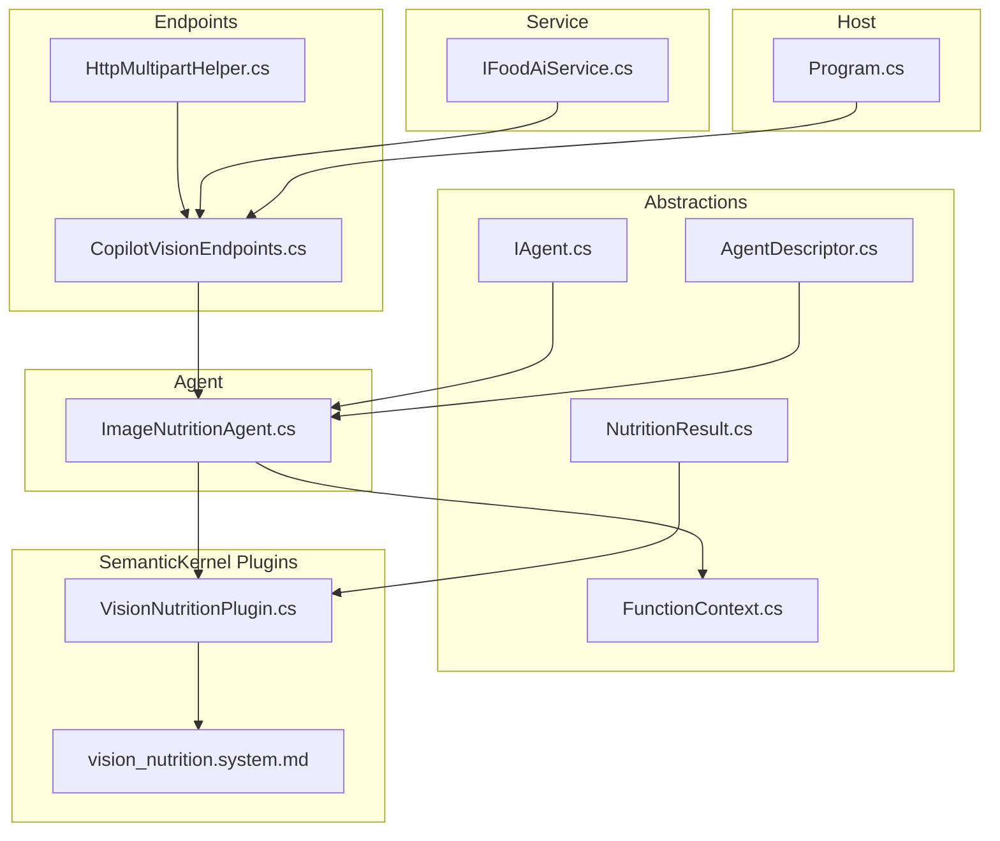
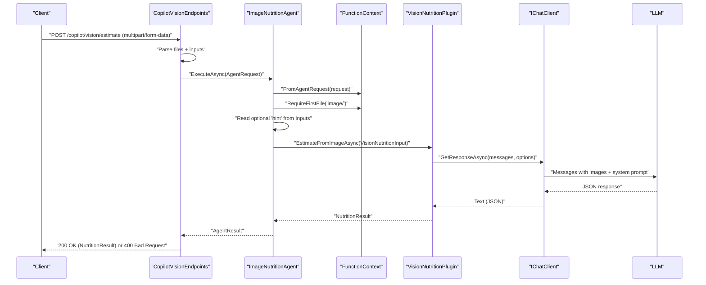
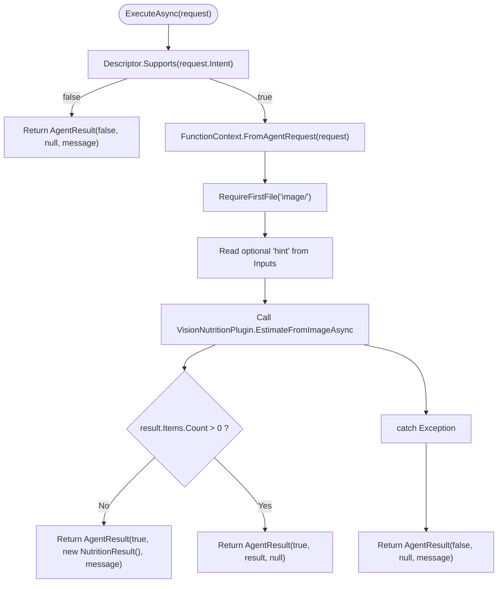
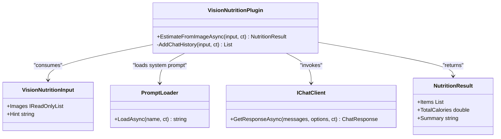
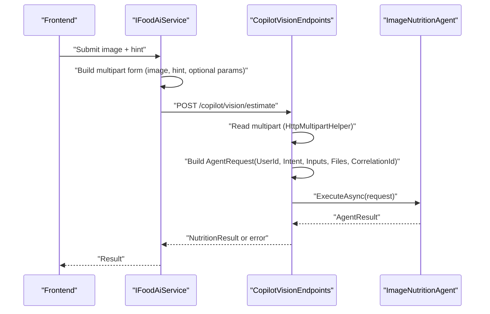
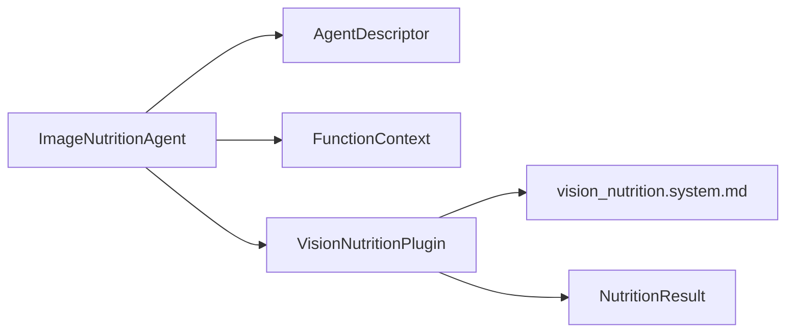

# AI Agents

<cite>
**Referenced Files in This Document**
- [ImageNutritionAgent.cs](file://FitTrack/FitTrack.Copilot/Agent/ImageNutritionAgent.cs)
- [IAgent.cs](file://FitTrack/FitTrack.Copilot/Abstractions/Agents/IAgent.cs)
- [AgentDescriptor.cs](file://FitTrack/FitTrack.Copilot/Abstractions/Agents/AgentDescriptor.cs)
- [FunctionContext.cs](file://FitTrack/FitTrack.Copilot/Abstractions/Plugins/FunctionContext.cs)
- [VisionNutritionPlugin.cs](file://FitTrack/FitTrack.Copilot/SemanticKernel/Plugins/VisionNutritionPlugin.cs)
- [vision_nutrition.system.md](file://FitTrack/FitTrack.Copilot/SemanticKernel/Plugins/SystemPrompt/vision_nutrition.system.md)
- [NutritionResult.cs](file://FitTrack/FitTrack.Copilot/Abstractions/Models/NutritionResult.cs)
- [CopilotVisionEndpoints.cs](file://FitTrack/FitTrack.Copilot/Endpoints/CopilotVisionEndpoints.cs)
- [HttpMultipartHelper.cs](file://FitTrack/FitTrack.Copilot/Api/HttpMultipartHelper.cs)
- [Program.cs](file://FitTrack/FitTrack.Copilot/Program.cs)
- [IFoodAiService.cs](file://FitTrack/FitTrack.Copilot/Service/IFoodAiService.cs)
</cite>

## Table of Contents
1. [Introduction](#introduction)
2. [Project Structure](#project-structure)
3. [Core Components](#core-components)
4. [Architecture Overview](#architecture-overview)
5. [Detailed Component Analysis](#detailed-component-analysis)
6. [Dependency Analysis](#dependency-analysis)
7. [Performance Considerations](#performance-considerations)
8. [Troubleshooting Guide](#troubleshooting-guide)
9. [Conclusion](#conclusion)
10. [Appendices](#appendices)

## Introduction
This document explains the ImageNutritionAgent implementation that processes food images to estimate macro and calorie content. It covers how the agent validates intent via AgentDescriptor, orchestrates image-based requests, delegates to the VisionNutritionPlugin, and integrates with the broader AI system through FunctionContext. It also documents error handling strategies, confidence-based fallback logic, and performance considerations such as image size limits and timeouts.

## Project Structure
The ImageNutritionAgent resides in the Copilot subsystem under the Agent folder and collaborates with abstractions, plugins, endpoints, and utilities.

**Diagram sources**
- [ImageNutritionAgent.cs](file://FitTrack/FitTrack.Copilot/Agent/ImageNutritionAgent.cs#L1-L56)
- [IAgent.cs](file://FitTrack/FitTrack.Copilot/Abstractions/Agents/IAgent.cs#L1-L54)
- [AgentDescriptor.cs](file://FitTrack/FitTrack.Copilot/Abstractions/Agents/AgentDescriptor.cs#L1-L38)
- [FunctionContext.cs](file://FitTrack/FitTrack.Copilot/Abstractions/Plugins/FunctionContext.cs#L1-L154)
- [VisionNutritionPlugin.cs](file://FitTrack/FitTrack.Copilot/SemanticKernel/Plugins/VisionNutritionPlugin.cs#L1-L70)
- [vision_nutrition.system.md](file://FitTrack/FitTrack.Copilot/SemanticKernel/Plugins/SystemPrompt/vision_nutrition.system.md#L1-L26)
- [NutritionResult.cs](file://FitTrack/FitTrack.Copilot/Abstractions/Models/NutritionResult.cs#L1-L54)
- [CopilotVisionEndpoints.cs](file://FitTrack/FitTrack.Copilot/Endpoints/CopilotVisionEndpoints.cs#L1-L47)
- [HttpMultipartHelper.cs](file://FitTrack/FitTrack.Copilot/Api/HttpMultipartHelper.cs#L1-L39)
- [Program.cs](file://FitTrack/FitTrack.Copilot/Program.cs#L1-L131)
- [IFoodAiService.cs](file://FitTrack/FitTrack.Copilot/Service/IFoodAiService.cs#L40-L109)

**Section sources**
- [ImageNutritionAgent.cs](file://FitTrack/FitTrack.Copilot/Agent/ImageNutritionAgent.cs#L1-L56)
- [CopilotVisionEndpoints.cs](file://FitTrack/FitTrack.Copilot/Endpoints/CopilotVisionEndpoints.cs#L1-L47)
- [Program.cs](file://FitTrack/FitTrack.Copilot/Program.cs#L1-L131)

## Core Components
- ImageNutritionAgent: Implements IAgent and validates intent via AgentDescriptor. It extracts files and inputs from AgentRequest, validates the first file’s content type, incorporates optional user hints, and delegates to VisionNutritionPlugin. It returns a structured NutritionResult or a graceful fallback when no items are confidently detected.
- FunctionContext: Provides a framework-agnostic execution context carrying inputs, files, user identity, and correlation ID. It includes helpers to require and enumerate files, including MIME prefix validation.
- VisionNutritionPlugin: Orchestrates a chat client with a system prompt and optional user hint, constructs messages with base64-encoded image data URLs, and returns a NutritionResult parsed from JSON.
- AgentDescriptor: Declares agent metadata and capabilities, enabling intent routing and guardrails.
- NutritionResult: Defines the structured output model for nutrition analysis.

**Section sources**
- [ImageNutritionAgent.cs](file://FitTrack/FitTrack.Copilot/Agent/ImageNutritionAgent.cs#L1-L56)
- [FunctionContext.cs](file://FitTrack/FitTrack.Copilot/Abstractions/Plugins/FunctionContext.cs#L1-L154)
- [VisionNutritionPlugin.cs](file://FitTrack/FitTrack.Copilot/SemanticKernel/Plugins/VisionNutritionPlugin.cs#L1-L70)
- [AgentDescriptor.cs](file://FitTrack/FitTrack.Copilot/Abstractions/Agents/AgentDescriptor.cs#L1-L38)
- [NutritionResult.cs](file://FitTrack/FitTrack.Copilot/Abstractions/Models/NutritionResult.cs#L1-L54)

## Architecture Overview
The agent orchestration pipeline begins at an HTTP endpoint that parses multipart/form-data into an AgentRequest. The endpoint locates an agent capable of handling the intent “vision.nutrition.estimate”, constructs an AgentRequest, and invokes the agent. The agent validates intent and file content type, builds a FunctionContext, optionally reads a user hint, and delegates to VisionNutritionPlugin. The plugin returns a NutritionResult, which the agent wraps into an AgentResult.

**Diagram sources**
- [CopilotVisionEndpoints.cs](file://FitTrack/FitTrack.Copilot/Endpoints/CopilotVisionEndpoints.cs#L1-L47)
- [ImageNutritionAgent.cs](file://FitTrack/FitTrack.Copilot/Agent/ImageNutritionAgent.cs#L1-L56)
- [FunctionContext.cs](file://FitTrack/FitTrack.Copilot/Abstractions/Plugins/FunctionContext.cs#L1-L154)
- [VisionNutritionPlugin.cs](file://FitTrack/FitTrack.Copilot/SemanticKernel/Plugins/VisionNutritionPlugin.cs#L1-L70)

## Detailed Component Analysis

### ImageNutritionAgent
- Role: Validates intent via AgentDescriptor.Supports, enforces image/* content type for the first file, accepts optional user hints, and delegates to VisionNutritionPlugin.
- ExecuteAsync workflow:
  - Intent validation: returns failure if intent is unsupported.
  - Context creation: FunctionContext.FromAgentRequest(request).
  - File validation: RequireFirstFile("image/") ensures the first file is an image.
  - Hint handling: Reads optional "hint" from Inputs; defaults to a Chinese hint if missing.
  - Delegation: Calls VisionNutritionPlugin.EstimateFromImageAsync with images and hint.
  - Fallback: If no items are detected, returns a successful AgentResult with an empty NutritionResult and a message indicating no confident detections.
  - Error handling: Catches exceptions and returns a failure AgentResult with a descriptive message.

**Diagram sources**
- [ImageNutritionAgent.cs](file://FitTrack/FitTrack.Copilot/Agent/ImageNutritionAgent.cs#L1-L56)
- [FunctionContext.cs](file://FitTrack/FitTrack.Copilot/Abstractions/Plugins/FunctionContext.cs#L111-L125)
- [VisionNutritionPlugin.cs](file://FitTrack/FitTrack.Copilot/SemanticKernel/Plugins/VisionNutritionPlugin.cs#L1-L70)
- [NutritionResult.cs](file://FitTrack/FitTrack.Copilot/Abstractions/Models/NutritionResult.cs#L1-L54)

**Section sources**
- [ImageNutritionAgent.cs](file://FitTrack/FitTrack.Copilot/Agent/ImageNutritionAgent.cs#L1-L56)

### FunctionContext
- Purpose: Encapsulates inputs, files, user identity, and correlation ID for function-like execution.
- Key helpers:
  - FromAgentRequest: Adapts AgentRequest to FunctionContext.
  - RequireFirstFile(expectedMimePrefix): Validates presence and MIME prefix of the first file.
  - EnumerateFiles(mimePrefix): Iterates files filtered by MIME prefix.
  - Input helpers: TryGet, Get, Require for typed inputs.
- Integration: Used by ImageNutritionAgent to validate image content type and pass inputs to downstream plugins.

**Section sources**
- [FunctionContext.cs](file://FitTrack/FitTrack.Copilot/Abstractions/Plugins/FunctionContext.cs#L1-L154)

### VisionNutritionPlugin
- Purpose: Builds a chat history with a system prompt and optional user hint, attaches base64-encoded images as data URLs, and requests a JSON response from the chat client.
- Behavior:
  - Loads system prompt from vision_nutrition.system.md.
  - Adds user hint if present.
  - Converts FilePart bytes to base64 and constructs data URLs with content types.
  - Sets model, temperature, max output tokens, and response format.
  - Deserializes the LLM response into a NutritionResult.

**Diagram sources**
- [VisionNutritionPlugin.cs](file://FitTrack/FitTrack.Copilot/SemanticKernel/Plugins/VisionNutritionPlugin.cs#L1-L70)
- [vision_nutrition.system.md](file://FitTrack/FitTrack.Copilot/SemanticKernel/Plugins/SystemPrompt/vision_nutrition.system.md#L1-L26)
- [NutritionResult.cs](file://FitTrack/FitTrack.Copilot/Abstractions/Models/NutritionResult.cs#L1-L54)

**Section sources**
- [VisionNutritionPlugin.cs](file://FitTrack/FitTrack.Copilot/SemanticKernel/Plugins/VisionNutritionPlugin.cs#L1-L70)
- [vision_nutrition.system.md](file://FitTrack/FitTrack.Copilot/SemanticKernel/Plugins/SystemPrompt/vision_nutrition.system.md#L1-L26)
- [NutritionResult.cs](file://FitTrack/FitTrack.Copilot/Abstractions/Models/NutritionResult.cs#L1-L54)

### AgentDescriptor and Intent Routing
- AgentDescriptor declares the agent’s Name, Purpose, Capabilities, and Metadata.
- ImageNutritionAgent advertises the capability "vision.nutrition.estimate".
- Endpoints route requests to agents based on intent using Descriptor.Supports.

**Section sources**
- [AgentDescriptor.cs](file://FitTrack/FitTrack.Copilot/Abstractions/Agents/AgentDescriptor.cs#L1-L38)
- [CopilotVisionEndpoints.cs](file://FitTrack/FitTrack.Copilot/Endpoints/CopilotVisionEndpoints.cs#L1-L47)
- [ImageNutritionAgent.cs](file://FitTrack/FitTrack.Copilot/Agent/ImageNutritionAgent.cs#L1-L56)

### Integration with the Broader AI System
- FunctionContext bridges AgentRequest to plugin-style execution, carrying inputs and files.
- VisionNutritionPlugin uses a chat client configured with model, temperature, and response format.
- System prompt enforces strict JSON output schema for reliable parsing.

**Section sources**
- [FunctionContext.cs](file://FitTrack/FitTrack.Copilot/Abstractions/Plugins/FunctionContext.cs#L1-L154)
- [VisionNutritionPlugin.cs](file://FitTrack/FitTrack.Copilot/SemanticKernel/Plugins/VisionNutritionPlugin.cs#L1-L70)
- [vision_nutrition.system.md](file://FitTrack/FitTrack.Copilot/SemanticKernel/Plugins/SystemPrompt/vision_nutrition.system.md#L1-L26)

### Constructing AgentRequest with Image Files and Inputs
- Endpoints parse multipart/form-data into files and inputs.
- AgentRequest is constructed with:
  - UserId: identity scoped to the request.
  - Intent: "vision.nutrition.estimate".
  - Inputs: optional parameters such as "hint", "serviceId", "modelId".
  - Files: uploaded image(s).
  - CorrelationId: trace identifier for cross-service correlation.

**Diagram sources**
- [IFoodAiService.cs](file://FitTrack/FitTrack.Copilot/Service/IFoodAiService.cs#L40-L109)
- [CopilotVisionEndpoints.cs](file://FitTrack/FitTrack.Copilot/Endpoints/CopilotVisionEndpoints.cs#L1-L47)
- [HttpMultipartHelper.cs](file://FitTrack/FitTrack.Copilot/Api/HttpMultipartHelper.cs#L1-L39)
- [ImageNutritionAgent.cs](file://FitTrack/FitTrack.Copilot/Agent/ImageNutritionAgent.cs#L1-L56)

**Section sources**
- [CopilotVisionEndpoints.cs](file://FitTrack/FitTrack.Copilot/Endpoints/CopilotVisionEndpoints.cs#L1-L47)
- [HttpMultipartHelper.cs](file://FitTrack/FitTrack.Copilot/Api/HttpMultipartHelper.cs#L1-L39)
- [IFoodAiService.cs](file://FitTrack/FitTrack.Copilot/Service/IFoodAiService.cs#L40-L109)

## Dependency Analysis
- ImageNutritionAgent depends on:
  - AgentDescriptor for intent validation.
  - FunctionContext for request adaptation and file validation.
  - VisionNutritionPlugin for image analysis.
- VisionNutritionPlugin depends on:
  - PromptLoader for system prompt.
  - IChatClient for model invocation.
  - NutritionResult for structured output.

**Diagram sources**
- [ImageNutritionAgent.cs](file://FitTrack/FitTrack.Copilot/Agent/ImageNutritionAgent.cs#L1-L56)
- [AgentDescriptor.cs](file://FitTrack/FitTrack.Copilot/Abstractions/Agents/AgentDescriptor.cs#L1-L38)
- [FunctionContext.cs](file://FitTrack/FitTrack.Copilot/Abstractions/Plugins/FunctionContext.cs#L1-L154)
- [VisionNutritionPlugin.cs](file://FitTrack/FitTrack.Copilot/SemanticKernel/Plugins/VisionNutritionPlugin.cs#L1-L70)
- [NutritionResult.cs](file://FitTrack/FitTrack.Copilot/Abstractions/Models/NutritionResult.cs#L1-L54)

**Section sources**
- [ImageNutritionAgent.cs](file://FitTrack/FitTrack.Copilot/Agent/ImageNutritionAgent.cs#L1-L56)
- [VisionNutritionPlugin.cs](file://FitTrack/FitTrack.Copilot/SemanticKernel/Plugins/VisionNutritionPlugin.cs#L1-L70)

## Performance Considerations
- Image size limits:
  - Form body length limit is configured to 20 MB at the host level.
  - Frontend upload stream is constrained to 10 MB during Blazor file read.
- Timeout handling:
  - The chat client invocation is cancellation-aware via CancellationToken.
  - Host-level HTTP client timeouts and request timeouts should be considered when integrating external services.
- Tokenization and model cost:
  - The plugin sets a modest MaxOutputTokens and low temperature for deterministic JSON output.
- Recommendations:
  - Validate image dimensions and aspect ratios upstream if needed.
  - Consider pre-processing images to reduce size while preserving quality.
  - Use streaming or chunked uploads for very large images if supported by the transport.

**Section sources**
- [Program.cs](file://FitTrack/FitTrack.Copilot/Program.cs#L91-L94)
- [IFoodAiService.cs](file://FitTrack/FitTrack.Copilot/Service/IFoodAiService.cs#L40-L109)
- [VisionNutritionPlugin.cs](file://FitTrack/FitTrack.Copilot/SemanticKernel/Plugins/VisionNutritionPlugin.cs#L1-L70)

## Troubleshooting Guide
- Unsupported intent:
  - Symptom: Immediate failure with an unsupported intent message.
  - Resolution: Ensure the request Intent matches "vision.nutrition.estimate".
- Missing or invalid image file:
  - Symptom: Exception thrown when RequireFirstFile("image/") fails.
  - Resolution: Verify multipart contains at least one file with an image/* content type.
- No confident detections:
  - Behavior: Agent returns a successful AgentResult with an empty NutritionResult and a message indicating no items were confidently detected.
  - Resolution: Ask the user to retake the photo or provide a clearer image.
- General analysis failure:
  - Symptom: Exception caught and wrapped into a failure AgentResult.
  - Resolution: Inspect logs and retry with corrected inputs or a different image.

**Section sources**
- [ImageNutritionAgent.cs](file://FitTrack/FitTrack.Copilot/Agent/ImageNutritionAgent.cs#L1-L56)
- [FunctionContext.cs](file://FitTrack/FitTrack.Copilot/Abstractions/Plugins/FunctionContext.cs#L111-L125)
- [NutritionResult.cs](file://FitTrack/FitTrack.Copilot/Abstractions/Models/NutritionResult.cs#L1-L54)

## Conclusion
ImageNutritionAgent provides a focused, intent-driven pathway for processing food images. By validating intent and content type, incorporating optional user hints, and delegating to VisionNutritionPlugin, it delivers structured nutrition insights. The system’s design emphasizes clear separation of concerns, robust error handling, and extensibility through FunctionContext and AgentDescriptor.

## Appendices

### Example: How to construct AgentRequest with image files and inputs
- Use the endpoint to submit multipart/form-data with:
  - An image file field.
  - Optional inputs such as "hint", "serviceId", "modelId".
- The endpoint parses the multipart and constructs an AgentRequest with:
  - Intent: "vision.nutrition.estimate".
  - Files: the uploaded image(s).
  - Inputs: parsed form values.
  - CorrelationId: trace identifier for observability.

**Section sources**
- [CopilotVisionEndpoints.cs](file://FitTrack/FitTrack.Copilot/Endpoints/CopilotVisionEndpoints.cs#L1-L47)
- [HttpMultipartHelper.cs](file://FitTrack/FitTrack.Copilot/Api/HttpMultipartHelper.cs#L1-L39)
- [IFoodAiService.cs](file://FitTrack/FitTrack.Copilot/Service/IFoodAiService.cs#L40-L109)