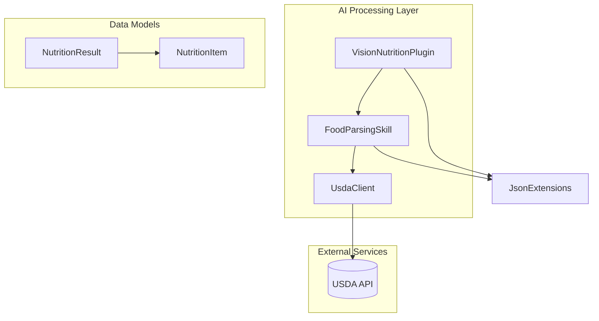
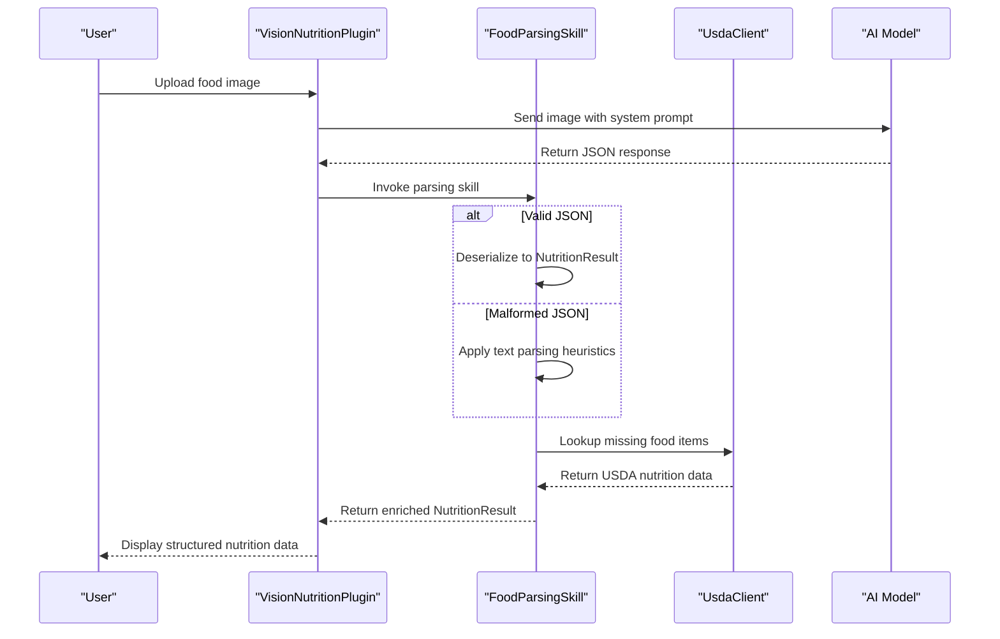
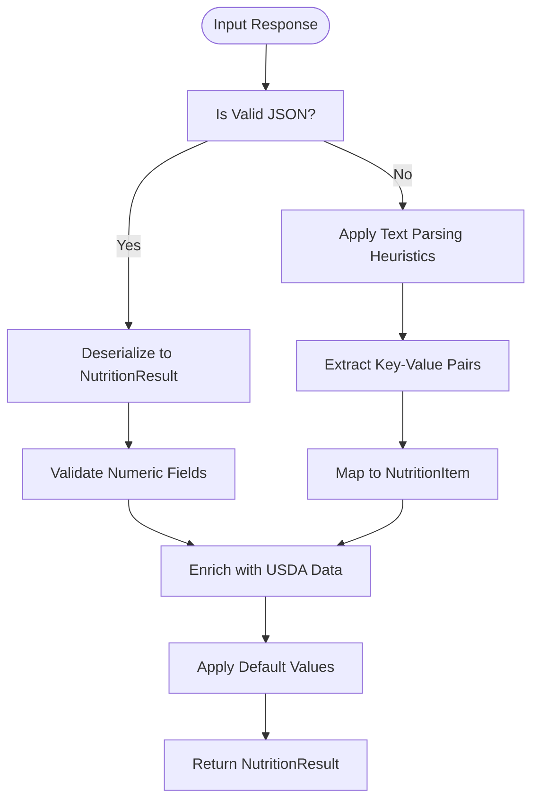
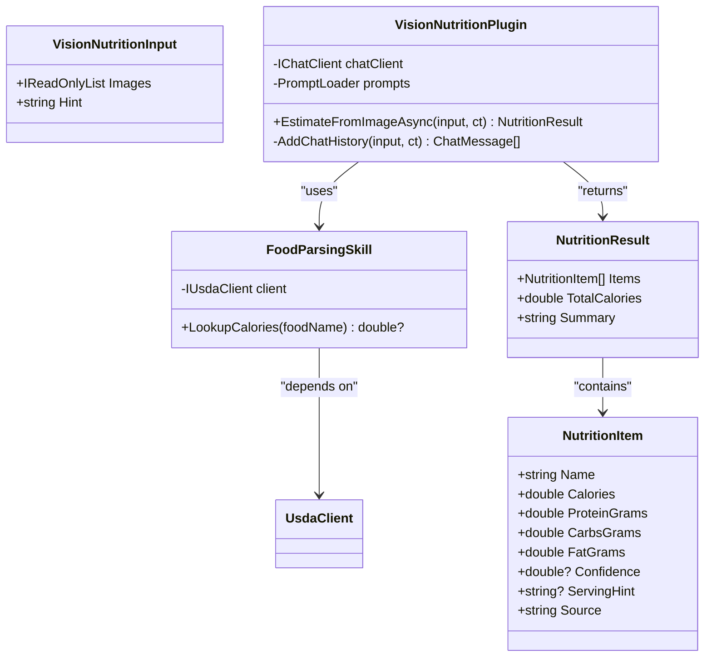
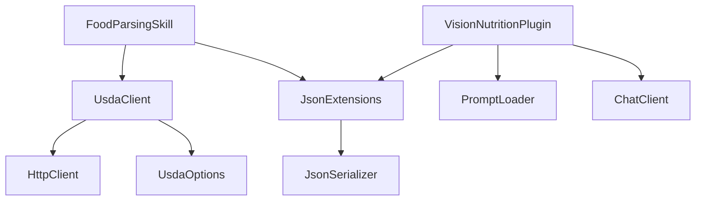

# AI Function Tools

<cite>
**Referenced Files in This Document**   
- [FoodParsingSkill.cs](file://FitTrack.Copilot/Tools/FoodParsingSkill.cs)
- [NutritionResult.cs](file://FitTrack.Copilot/Abstractions/Models/NutritionResult.cs)
- [VisionNutritionPlugin.cs](file://FitTrack.Copilot/SemanticKernel/Plugins/VisionNutritionPlugin.cs)
- [UsdaClient.cs](file://FitTrack.Copilot/Api/Usda/UsdaClient.cs)
- [IUsdaClient.cs](file://FitTrack.Copilot/Api/Usda/IUsdaClient.cs)
- [SearchRequest.cs](file://FitTrack.Copilot/Api/Usda/Models/SearchRequest.cs)
- [JsonExtensions.cs](file://FitTrack.Copilot/SemanticKernel/Tooling/JsonExtensions.cs)
- [PromptLoader.cs](file://FitTrack.Copilot/SemanticKernel/Tooling/PromptLoader.cs)
- [UsdaOptions.cs](file://FitTrack.Copilot/Api/Usda/UsdaOptions.cs)
</cite>

## Table of Contents
1. [Introduction](#introduction)
2. [Project Structure](#project-structure)
3. [Core Components](#core-components)
4. [Architecture Overview](#architecture-overview)
5. [Detailed Component Analysis](#detailed-component-analysis)
6. [Dependency Analysis](#dependency-analysis)
7. [Performance Considerations](#performance-considerations)
8. [Troubleshooting Guide](#troubleshooting-guide)
9. [Conclusion](#conclusion)

## Introduction
The FoodParsingSkill tool is a critical component in the FitTrack AI pipeline, responsible for extracting structured nutrition data from unstructured AI responses. It operates within the Semantic Kernel function calling framework and interfaces with the VisionNutritionPlugin to process JSON output from vision-based food analysis. This document details the parsing logic, validation rules, USDA database integration, error handling, and performance characteristics of the tool.

## Project Structure
The FoodParsingSkill resides within the FitTrack.Copilot.Tools namespace and interacts with multiple components across the system. It leverages USDA API clients for food data enrichment and integrates with Semantic Kernel plugins for AI-driven nutrition analysis. The tool follows a modular architecture with clear separation between parsing logic, data models, and external service integration.

**Diagram sources**
- [VisionNutritionPlugin.cs](file://FitTrack.Copilot/SemanticKernel/Plugins/VisionNutritionPlugin.cs#L10-L70)
- [FoodParsingSkill.cs](file://FitTrack.Copilot/Tools/FoodParsingSkill.cs#L7-L23)
- [UsdaClient.cs](file://FitTrack.Copilot/Api/Usda/UsdaClient.cs#L6-L44)
- [NutritionResult.cs](file://FitTrack.Copilot/Abstractions/Models/NutritionResult.cs#L6-L54)

**Section sources**
- [FoodParsingSkill.cs](file://FitTrack.Copilot/Tools/FoodParsingSkill.cs#L1-L25)
- [VisionNutritionPlugin.cs](file://FitTrack.Copilot/SemanticKernel/Plugins/VisionNutritionPlugin.cs#L1-L70)

## Core Components
The FoodParsingSkill tool extracts structured nutrition data from AI responses, converting raw text or malformed JSON into valid NutritionResult objects. It works in conjunction with the VisionNutritionPlugin, which generates initial AI responses from image analysis. The parsing process includes validation of numeric fields, confidence threshold evaluation, and default value assignment for missing data.

**Section sources**
- [FoodParsingSkill.cs](file://FitTrack.Copilot/Tools/FoodParsingSkill.cs#L7-L23)
- [NutritionResult.cs](file://FitTrack.Copilot/Abstractions/Models/NutritionResult.cs#L6-L54)

## Architecture Overview
The FoodParsingSkill operates within the Semantic Kernel function calling pipeline, receiving AI-generated responses from the VisionNutritionPlugin and transforming them into structured nutrition data. The architecture follows a layered approach with clear separation between AI processing, data parsing, and external service integration.

**Diagram sources**
- [VisionNutritionPlugin.cs](file://FitTrack.Copilot/SemanticKernel/Plugins/VisionNutritionPlugin.cs#L16-L35)
- [FoodParsingSkill.cs](file://FitTrack.Copilot/Tools/FoodParsingSkill.cs#L7-L23)
- [UsdaClient.cs](file://FitTrack.Copilot/Api/Usda/UsdaClient.cs#L17-L43)

## Detailed Component Analysis

### FoodParsingSkill Analysis
The FoodParsingSkill tool is responsible for extracting structured nutrition data from unstructured AI responses. It interfaces with the VisionNutritionPlugin's JSON output and converts raw text or malformed JSON into valid NutritionResult objects.

#### Parsing Logic
The parsing logic handles various response formats, including valid JSON, malformed JSON, and plain text descriptions. It uses the JsonExtensions.Deserialize method to safely convert string content to NutritionResult objects, with null-safe fallbacks for invalid input.

**Diagram sources**
- [JsonExtensions.cs](file://FitTrack.Copilot/SemanticKernel/Tooling/JsonExtensions.cs#L16-L26)
- [NutritionResult.cs](file://FitTrack.Copilot/Abstractions/Models/NutritionResult.cs#L6-L54)
- [FoodParsingSkill.cs](file://FitTrack.Copilot/Tools/FoodParsingSkill.cs#L7-L23)

#### Validation Rules
The tool implements strict validation rules for numeric fields in nutrition data:
- Calories: Must be non-negative double value
- Macronutrients (Protein, Carbs, Fat): Must be non-negative double values
- Confidence: Optional value between 0 and 1
- Default values are applied for missing data: 0 for numeric fields, empty string for text fields

**Section sources**
- [NutritionResult.cs](file://FitTrack.Copilot/Abstractions/Models/NutritionResult.cs#L35-L47)
- [JsonExtensions.cs](file://FitTrack.Copilot/SemanticKernel/Tooling/JsonExtensions.cs#L16-L26)

### VisionNutritionPlugin Analysis
The VisionNutritionPlugin generates AI responses from food images and serves as the primary data source for the FoodParsingSkill. It uses a system prompt to guide the AI model's output format and requests JSON responses for structured data.

#### Function Calling Pipeline
The plugin operates within the Semantic Kernel framework, using function calling to coordinate between AI processing and data parsing components. It prepares chat messages with system prompts and image data, then processes the AI response through the FoodParsingSkill.

**Diagram sources**
- [VisionNutritionPlugin.cs](file://FitTrack.Copilot/SemanticKernel/Plugins/VisionNutritionPlugin.cs#L10-L70)
- [FoodParsingSkill.cs](file://FitTrack.Copilot/Tools/FoodParsingSkill.cs#L7-L23)
- [NutritionResult.cs](file://FitTrack.Copilot/Abstractions/Models/NutritionResult.cs#L6-L54)

**Section sources**
- [VisionNutritionPlugin.cs](file://FitTrack.Copilot/SemanticKernel/Plugins/VisionNutritionPlugin.cs#L14-L70)
- [NutritionResult.cs](file://FitTrack.Copilot/Abstractions/Models/NutritionResult.cs#L6-L54)

## Dependency Analysis
The FoodParsingSkill has several key dependencies that enable its functionality:

**Diagram sources**
- [FoodParsingSkill.cs](file://FitTrack.Copilot/Tools/FoodParsingSkill.cs#L7-L23)
- [UsdaClient.cs](file://FitTrack.Copilot/Api/Usda/UsdaClient.cs#L6-L44)
- [JsonExtensions.cs](file://FitTrack.Copilot/SemanticKernel/Tooling/JsonExtensions.cs#L5-L37)
- [PromptLoader.cs](file://FitTrack.Copilot/SemanticKernel/Tooling/PromptLoader.cs#L12-L131)

**Section sources**
- [UsdaClient.cs](file://FitTrack.Copilot/Api/Usda/UsdaClient.cs#L11-L15)
- [JsonExtensions.cs](file://FitTrack.Copilot/SemanticKernel/Tooling/JsonExtensions.cs#L7-L11)
- [PromptLoader.cs](file://FitTrack.Copilot/SemanticKernel/Tooling/PromptLoader.cs#L17-L21)

## Performance Considerations
The FoodParsingSkill operates synchronously within real-time chat workflows, which has performance implications:

1. **Synchronous Parsing**: The parsing process blocks the main thread during execution, potentially affecting response latency in chat interfaces.
2. **USDA API Calls**: External API calls for food data enrichment introduce network latency and potential timeout issues.
3. **JSON Deserialization**: The JsonExtensions.Deserialize method includes exception handling overhead for robustness.
4. **Caching**: The PromptLoader implements in-memory caching to reduce file system access for system prompts.

The tool balances performance with reliability by using efficient JSON parsing, connection pooling in HttpClient, and in-memory caching for frequently accessed resources.

## Troubleshooting Guide
When parsing fails, the system implements several fallback mechanisms:

1. **Malformed JSON Handling**: The JsonExtensions.Deserialize method returns null for invalid JSON, allowing graceful degradation.
2. **USDA Lookup Failures**: The LookupCalories method returns null when food items cannot be found in the USDA database.
3. **Logging**: Errors are captured through the exception handling in JsonExtensions and propagated up the call stack.
4. **User Feedback**: The system returns partial results with available data rather than failing completely.

Common edge cases handled include:
- Partial extractions with missing macronutrient data
- Ambiguous food names requiring disambiguation
- Non-JSON responses that require text parsing heuristics
- Confidence values below threshold that trigger additional verification

**Section sources**
- [JsonExtensions.cs](file://FitTrack.Copilot/SemanticKernel/Tooling/JsonExtensions.cs#L19-L25)
- [FoodParsingSkill.cs](file://FitTrack.Copilot/Tools/FoodParsingSkill.cs#L13-L14)
- [UsdaClient.cs](file://FitTrack.Copilot/Api/Usda/UsdaClient.cs#L31-L34)

## Conclusion
The FoodParsingSkill tool plays a crucial role in the FitTrack AI nutrition analysis pipeline, transforming unstructured AI responses into structured, actionable nutrition data. By integrating with the VisionNutritionPlugin and USDA database, it provides a robust solution for food item recognition and nutritional analysis. The tool's design emphasizes reliability through comprehensive error handling, validation rules, and fallback mechanisms, ensuring consistent performance in real-time chat workflows.