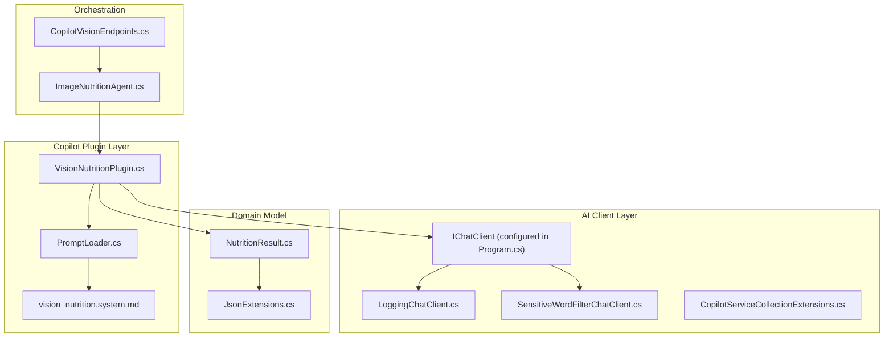
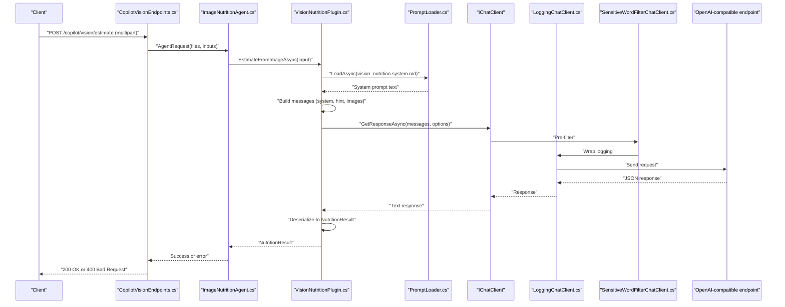
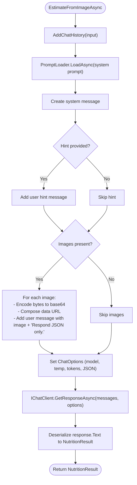
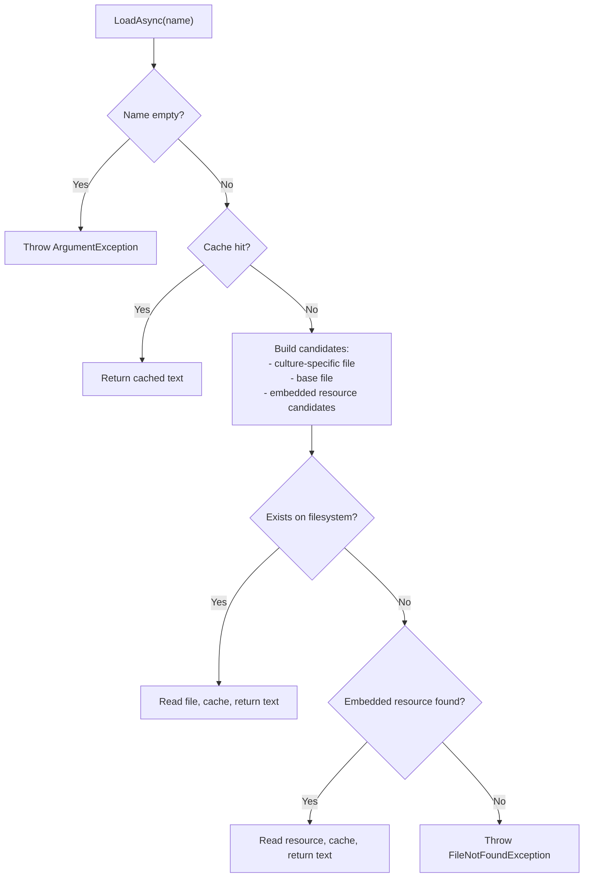
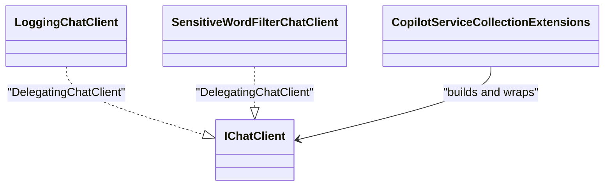
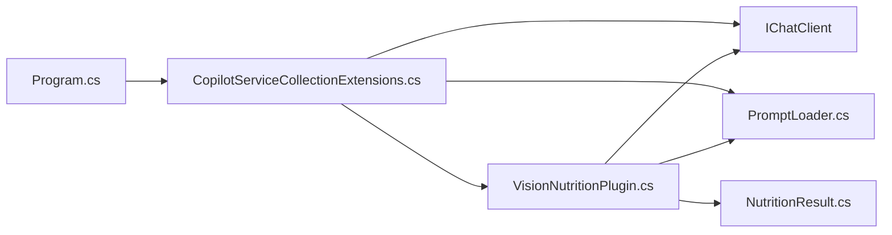

# Semantic Kernel Plugins

<cite>
**Referenced Files in This Document**
- [VisionNutritionPlugin.cs](file://FitTrack/FitTrack.Copilot/SemanticKernel/Plugins/VisionNutritionPlugin.cs)
- [PromptLoader.cs](file://FitTrack/FitTrack.Copilot/SemanticKernel/Tooling/PromptLoader.cs)
- [vision_nutrition.system.md](file://FitTrack/FitTrack.Copilot/SemanticKernel/Plugins/SystemPrompt/vision_nutrition.system.md)
- [NutritionResult.cs](file://FitTrack/FitTrack.Copilot/Abstractions/Models/NutritionResult.cs)
- [JsonExtensions.cs](file://FitTrack/FitTrack.Copilot/SemanticKernel/Tooling/JsonExtensions.cs)
- [CopilotServiceCollectionExtensions.cs](file://FitTrack/FitTrack.Copilot/Extension/CopilotServiceCollectionExtensions.cs)
- [LoggingChatClient.cs](file://FitTrack/FitTrack.Copilot/Middleware/LoggingChatClient.cs)
- [SensitiveWordFilterChatClient.cs](file://FitTrack/FitTrack.Copilot/Middleware/SensitiveWordFilterChatClient.cs)
- [ImageNutritionAgent.cs](file://FitTrack/FitTrack.Copilot/Agent/ImageNutritionAgent.cs)
- [CopilotVisionEndpoints.cs](file://FitTrack/FitTrack.Copilot/Endpoints/CopilotVisionEndpoints.cs)
- [Program.cs](file://FitTrack/FitTrack.Copilot/Program.cs)
</cite>

## Table of Contents
1. [Introduction](#introduction)
2. [Project Structure](#project-structure)
3. [Core Components](#core-components)
4. [Architecture Overview](#architecture-overview)
5. [Detailed Component Analysis](#detailed-component-analysis)
6. [Dependency Analysis](#dependency-analysis)
7. [Performance Considerations](#performance-considerations)
8. [Troubleshooting Guide](#troubleshooting-guide)
9. [Conclusion](#conclusion)

## Introduction
This document explains the VisionNutritionPlugin class that integrates with Microsoft Semantic Kernel for AI-driven nutrition analysis. It covers dependency injection of IChatClient and PromptLoader, construction of chat messages for vision-based LLM inference, model configuration and response formatting, asynchronous loading of system prompts, and error resilience during JSON deserialization. It also describes integration with AI middleware such as logging and filtering through the IChatClient abstraction, and provides an example of the message payload structure sent to OpenAI-compatible endpoints.

## Project Structure
The VisionNutritionPlugin resides in the Copilot project under Semantic Kernel plugins and tooling. It collaborates with:
- PromptLoader for asynchronous system prompt loading
- IChatClient configured via service collection extensions
- Middleware for logging, sensitive word filtering, and performance monitoring
- ImageNutritionAgent for orchestrating requests
- Endpoints for ingestion of multipart form data

**Diagram sources**
- [VisionNutritionPlugin.cs](file://FitTrack/FitTrack.Copilot/SemanticKernel/Plugins/VisionNutritionPlugin.cs#L1-L70)
- [PromptLoader.cs](file://FitTrack/FitTrack.Copilot/SemanticKernel/Tooling/PromptLoader.cs#L1-L131)
- [vision_nutrition.system.md](file://FitTrack/FitTrack.Copilot/SemanticKernel/Plugins/SystemPrompt/vision_nutrition.system.md#L1-L26)
- [CopilotServiceCollectionExtensions.cs](file://FitTrack/FitTrack.Copilot/Extension/CopilotServiceCollectionExtensions.cs#L1-L149)
- [LoggingChatClient.cs](file://FitTrack/FitTrack.Copilot/Middleware/LoggingChatClient.cs#L1-L135)
- [SensitiveWordFilterChatClient.cs](file://FitTrack/FitTrack.Copilot/Middleware/SensitiveWordFilterChatClient.cs#L1-L148)
- [ImageNutritionAgent.cs](file://FitTrack/FitTrack.Copilot/Agent/ImageNutritionAgent.cs#L1-L56)
- [CopilotVisionEndpoints.cs](file://FitTrack/FitTrack.Copilot/Endpoints/CopilotVisionEndpoints.cs#L1-L47)
- [NutritionResult.cs](file://FitTrack/FitTrack.Copilot/Abstractions/Models/NutritionResult.cs#L1-L54)
- [JsonExtensions.cs](file://FitTrack/FitTrack.Copilot/SemanticKernel/Tooling/JsonExtensions.cs#L1-L37)

**Section sources**
- [VisionNutritionPlugin.cs](file://FitTrack/FitTrack.Copilot/SemanticKernel/Plugins/VisionNutritionPlugin.cs#L1-L70)
- [CopilotServiceCollectionExtensions.cs](file://FitTrack/FitTrack.Copilot/Extension/CopilotServiceCollectionExtensions.cs#L1-L149)
- [Program.cs](file://FitTrack/FitTrack.Copilot/Program.cs#L1-L131)

## Core Components
- VisionNutritionPlugin: Orchestrates vision-based nutrition estimation by constructing chat messages, setting model options, invoking IChatClient, and deserializing JSON responses into NutritionResult.
- PromptLoader: Asynchronously loads system prompts from disk or embedded resources with in-memory caching and culture-aware resolution.
- ImageNutritionAgent: Bridges HTTP requests to the plugin, validates inputs, and returns structured results.
- IChatClient and Middleware: Configured in service collection extensions and wrapped with logging, sensitive word filtering, and performance monitoring.

**Section sources**
- [VisionNutritionPlugin.cs](file://FitTrack/FitTrack.Copilot/SemanticKernel/Plugins/VisionNutritionPlugin.cs#L1-L70)
- [PromptLoader.cs](file://FitTrack/FitTrack.Copilot/SemanticKernel/Tooling/PromptLoader.cs#L1-L131)
- [ImageNutritionAgent.cs](file://FitTrack/FitTrack.Copilot/Agent/ImageNutritionAgent.cs#L1-L56)
- [CopilotServiceCollectionExtensions.cs](file://FitTrack/FitTrack.Copilot/Extension/CopilotServiceCollectionExtensions.cs#L1-L149)

## Architecture Overview
The plugin participates in a layered architecture:
- Endpoint layer parses multipart/form-data and builds an AgentRequest.
- Agent layer validates intent and delegates to VisionNutritionPlugin.
- Plugin composes system prompt, user hint, and image content, then invokes IChatClient.
- Middleware intercepts requests for logging, filtering, and performance metrics.
- Response is deserialized into NutritionResult.

**Diagram sources**
- [CopilotVisionEndpoints.cs](file://FitTrack/FitTrack.Copilot/Endpoints/CopilotVisionEndpoints.cs#L1-L47)
- [ImageNutritionAgent.cs](file://FitTrack/FitTrack.Copilot/Agent/ImageNutritionAgent.cs#L1-L56)
- [VisionNutritionPlugin.cs](file://FitTrack/FitTrack.Copilot/SemanticKernel/Plugins/VisionNutritionPlugin.cs#L1-L70)
- [PromptLoader.cs](file://FitTrack/FitTrack.Copilot/SemanticKernel/Tooling/PromptLoader.cs#L1-L131)
- [LoggingChatClient.cs](file://FitTrack/FitTrack.Copilot/Middleware/LoggingChatClient.cs#L1-L135)
- [SensitiveWordFilterChatClient.cs](file://FitTrack/FitTrack.Copilot/Middleware/SensitiveWordFilterChatClient.cs#L1-L148)

## Detailed Component Analysis

### VisionNutritionPlugin
- Dependency Injection:
  - IChatClient: Provided by service collection extensions and wrapped with middleware.
  - PromptLoader: Injected to load system prompts asynchronously.
- Message Construction:
  - System prompt is loaded via PromptLoader and added as a system message.
  - If a hint is provided, it is appended as a user message.
  - For each image, a user message is constructed containing:
    - Base64-encoded data URL derived from image bytes.
    - A text content requesting JSON-only responses.
- Model Configuration:
  - ModelId: "gpt-4o-mini"
  - Temperature: 0.2
  - MaxOutputTokens: 800
  - ResponseFormat: JSON
- JSON Deserialization:
  - The plugin deserializes the response text into NutritionResult using a safe extension method that returns a default instance on failure.

**Diagram sources**
- [VisionNutritionPlugin.cs](file://FitTrack/FitTrack.Copilot/SemanticKernel/Plugins/VisionNutritionPlugin.cs#L1-L70)
- [PromptLoader.cs](file://FitTrack/FitTrack.Copilot/SemanticKernel/Tooling/PromptLoader.cs#L1-L131)
- [JsonExtensions.cs](file://FitTrack/FitTrack.Copilot/SemanticKernel/Tooling/JsonExtensions.cs#L1-L37)

**Section sources**
- [VisionNutritionPlugin.cs](file://FitTrack/FitTrack.Copilot/SemanticKernel/Plugins/VisionNutritionPlugin.cs#L1-L70)
- [JsonExtensions.cs](file://FitTrack/FitTrack.Copilot/SemanticKernel/Tooling/JsonExtensions.cs#L1-L37)

### PromptLoader
- Responsibilities:
  - Asynchronously loads prompt text by name with culture-aware precedence.
  - Supports filesystem and embedded resource fallbacks.
  - Caches loaded prompts in memory for performance.
- Behavior:
  - Attempts culture-specific file first, then base file, then embedded resource.
  - Throws a file-not-found exception if prompt cannot be located.
  - Provides a template variant to apply placeholder replacements.

**Diagram sources**
- [PromptLoader.cs](file://FitTrack/FitTrack.Copilot/SemanticKernel/Tooling/PromptLoader.cs#L1-L131)

**Section sources**
- [PromptLoader.cs](file://FitTrack/FitTrack.Copilot/SemanticKernel/Tooling/PromptLoader.cs#L1-L131)
- [vision_nutrition.system.md](file://FitTrack/FitTrack.Copilot/SemanticKernel/Plugins/SystemPrompt/vision_nutrition.system.md#L1-L26)

### ImageNutritionAgent
- Role:
  - Validates that the request intent is supported.
  - Requires an image file and extracts a hint from inputs.
  - Delegates to VisionNutritionPlugin and wraps results into AgentResult.
- Error Handling:
  - Returns a failure result with a message if unsupported or if an exception occurs.

**Section sources**
- [ImageNutritionAgent.cs](file://FitTrack/FitTrack.Copilot/Agent/ImageNutritionAgent.cs#L1-L56)

### Endpoints and Orchestration
- Endpoint:
  - Accepts multipart/form-data with files and inputs.
  - Extracts files and inputs, constructs an AgentRequest, and executes the agent.
- Agent:
  - Executes the request and returns either success with NutritionResult or a bad request with a message.

**Section sources**
- [CopilotVisionEndpoints.cs](file://FitTrack/FitTrack.Copilot/Endpoints/CopilotVisionEndpoints.cs#L1-L47)
- [ImageNutritionAgent.cs](file://FitTrack/FitTrack.Copilot/Agent/ImageNutritionAgent.cs#L1-L56)

### AI Middleware Integration
- LoggingChatClient:
  - Logs request metadata, user input, finish reason, tool calls, and token usage.
  - Supports both synchronous and streaming responses.
- SensitiveWordFilterChatClient:
  - Scans user input and AI responses for sensitive words and logs detections.
  - Preserves original behavior in this demo; can be extended to block or redact.
- Service Collection Extensions:
  - Builds IChatClient from configuration and applies middleware in order:
    - Function invocation
    - Sensitive word filter
    - Performance monitor
    - Logging (outermost wrapper)

**Diagram sources**
- [LoggingChatClient.cs](file://FitTrack/FitTrack.Copilot/Middleware/LoggingChatClient.cs#L1-L135)
- [SensitiveWordFilterChatClient.cs](file://FitTrack/FitTrack.Copilot/Middleware/SensitiveWordFilterChatClient.cs#L1-L148)
- [CopilotServiceCollectionExtensions.cs](file://FitTrack/FitTrack.Copilot/Extension/CopilotServiceCollectionExtensions.cs#L1-L149)

**Section sources**
- [LoggingChatClient.cs](file://FitTrack/FitTrack.Copilot/Middleware/LoggingChatClient.cs#L1-L135)
- [SensitiveWordFilterChatClient.cs](file://FitTrack/FitTrack.Copilot/Middleware/SensitiveWordFilterChatClient.cs#L1-L148)
- [CopilotServiceCollectionExtensions.cs](file://FitTrack/FitTrack.Copilot/Extension/CopilotServiceCollectionExtensions.cs#L1-L149)

## Dependency Analysis
- VisionNutritionPlugin depends on:
  - IChatClient for inference
  - PromptLoader for system prompt
  - NutritionResult for typed output
- PromptLoader depends on:
  - PromptOptions for configuration
  - Filesystem and embedded resources for prompt storage
- Service collection wiring:
  - Adds PromptLoader, IChatClient, and VisionNutritionPlugin
  - Wraps IChatClient with middleware based on configuration flags

**Diagram sources**
- [Program.cs](file://FitTrack/FitTrack.Copilot/Program.cs#L1-L131)
- [CopilotServiceCollectionExtensions.cs](file://FitTrack/FitTrack.Copilot/Extension/CopilotServiceCollectionExtensions.cs#L1-L149)
- [VisionNutritionPlugin.cs](file://FitTrack/FitTrack.Copilot/SemanticKernel/Plugins/VisionNutritionPlugin.cs#L1-L70)
- [PromptLoader.cs](file://FitTrack/FitTrack.Copilot/SemanticKernel/Tooling/PromptLoader.cs#L1-L131)
- [NutritionResult.cs](file://FitTrack/FitTrack.Copilot/Abstractions/Models/NutritionResult.cs#L1-L54)

**Section sources**
- [Program.cs](file://FitTrack/FitTrack.Copilot/Program.cs#L1-L131)
- [CopilotServiceCollectionExtensions.cs](file://FitTrack/FitTrack.Copilot/Extension/CopilotServiceCollectionExtensions.cs#L1-L149)
- [VisionNutritionPlugin.cs](file://FitTrack/FitTrack.Copilot/SemanticKernel/Plugins/VisionNutritionPlugin.cs#L1-L70)

## Performance Considerations
- Prompt caching: PromptLoader caches loaded prompts in memory to reduce IO and improve latency.
- Streaming vs. non-streaming: The middleware supports streaming responses; choose the appropriate mode based on UX needs.
- Token limits: MaxOutputTokens is set to balance cost and completeness.
- Middleware overhead: Logging and filtering add minimal overhead; disable where not needed in performance-critical paths.

[No sources needed since this section provides general guidance]

## Troubleshooting Guide
- Prompt not found:
  - Ensure the prompt file exists in the configured root directory or as an embedded resource.
  - Verify culture-specific naming and resource prefix configuration.
- JSON deserialization failures:
  - The plugin safely falls back to a default NutritionResult when deserialization fails.
  - Confirm the model responds with strict JSON matching the expected schema.
- Middleware interference:
  - If logging or filtering alters behavior, temporarily disable middleware to isolate issues.
- Endpoint errors:
  - Verify multipart upload includes at least one image file.
  - Confirm the intent is supported by the agent.

**Section sources**
- [PromptLoader.cs](file://FitTrack/FitTrack.Copilot/SemanticKernel/Tooling/PromptLoader.cs#L1-L131)
- [VisionNutritionPlugin.cs](file://FitTrack/FitTrack.Copilot/SemanticKernel/Plugins/VisionNutritionPlugin.cs#L1-L70)
- [JsonExtensions.cs](file://FitTrack/FitTrack.Copilot/SemanticKernel/Tooling/JsonExtensions.cs#L1-L37)
- [CopilotVisionEndpoints.cs](file://FitTrack/FitTrack.Copilot/Endpoints/CopilotVisionEndpoints.cs#L1-L47)

## Conclusion
The VisionNutritionPlugin provides a robust, configurable pathway for vision-based nutrition analysis using Microsoft Semantic Kernel. It integrates cleanly with IChatClient and middleware, loads system prompts efficiently, constructs precise chat messages with base64-encoded images, and safely deserializes structured results. The orchestration through ImageNutritionAgent and endpoints ensures a cohesive developer and user experience.