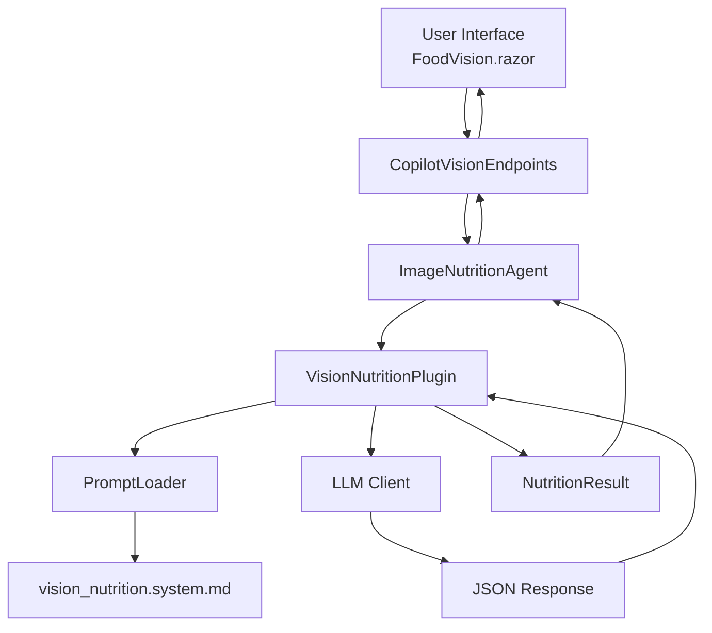
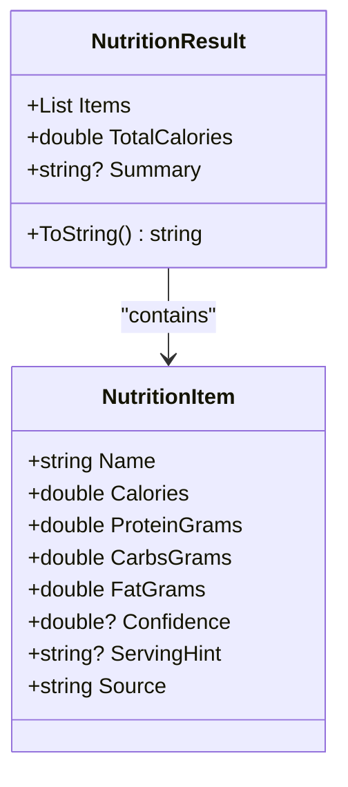
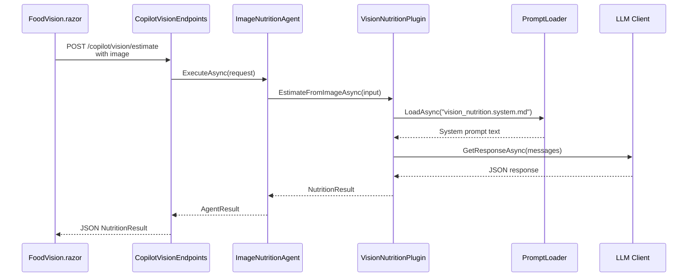
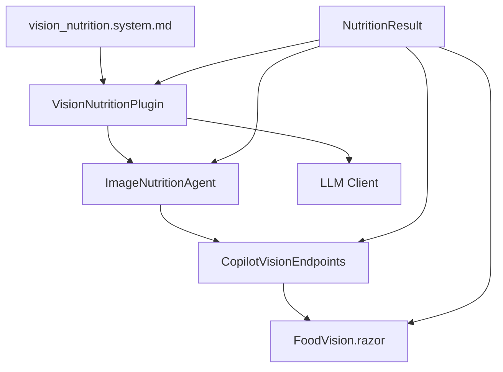

# System Prompts & Prompt Engineering

<cite>
**Referenced Files in This Document**   
- [vision_nutrition.system.md](file://FitTrack/FitTrack.Copilot/SemanticKernel/Plugins/SystemPrompt/vision_nutrition.system.md)
- [NutritionResult.cs](file://FitTrack/FitTrack.Copilot/Abstractions/Models/NutritionResult.cs)
- [PromptLoader.cs](file://FitTrack/FitTrack.Copilot/SemanticKernel/Tooling/PromptLoader.cs)
- [VisionNutritionPlugin.cs](file://FitTrack/FitTrack.Copilot/SemanticKernel/Plugins/VisionNutritionPlugin.cs)
- [ImageNutritionAgent.cs](file://FitTrack/FitTrack.Copilot/Agent/ImageNutritionAgent.cs)
- [FoodVision.razor.cs](file://FitTrack/FitTrack.Copilot/Components/Pages/FoodVision.razor.cs)
- [CopilotVisionEndpoints.cs](file://FitTrack/FitTrack.Copilot/Endpoints/CopilotVisionEndpoints.cs)
- [vision_nutrition_cn.system.md](file://FitTrack/FitTrack.Copilot/SemanticKernel/Plugins/SystemPrompt/vision_nutrition_cn.system.md)
</cite>

## Table of Contents
1. [Introduction](#introduction)
2. [Core Components](#core-components)
3. [Architecture Overview](#architecture-overview)
4. [Detailed Component Analysis](#detailed-component-analysis)
5. [Dependency Analysis](#dependency-analysis)
6. [Performance Considerations](#performance-considerations)
7. [Troubleshooting Guide](#troubleshooting-guide)
8. [Conclusion](#conclusion)

## Introduction
This document provides comprehensive documentation for the `vision_nutrition.system.md` system prompt used in AI-driven food analysis within the FitTrack application. The prompt is designed to guide a large language model (LLM) to act as a professional nutritionist and food recognition expert, analyzing food images and returning structured nutritional estimates. It enforces a strict JSON-only output format to ensure compatibility with downstream parsing and integration into the application's data model. The document details the prompt engineering techniques used, including role definition, output formatting instructions, and suppression of explanatory text. It also explains how the prompt is dynamically loaded and injected into the chat sequence via the `PromptLoader`, and outlines best practices for modifying the prompt while maintaining compatibility with the `FoodParsingSkill` and `NutritionResult` deserialization process.

## Core Components
The system revolves around a specialized system prompt that defines the behavior of an AI agent responsible for vision-based nutrition estimation. This prompt is consumed by the `VisionNutritionPlugin`, which orchestrates communication with an LLM through a chat interface. The plugin receives image inputs and optional hints, constructs a message sequence that includes the system prompt, and processes the JSON response into a `NutritionResult` object. The `PromptLoader` service handles loading and caching of the prompt from either the file system or embedded resources, supporting culture-specific variations. The entire workflow is triggered through a web interface (`FoodVision.razor`) and exposed via API endpoints (`CopilotVisionEndpoints`). The system ensures consistent, machine-readable output that can be reliably parsed and stored in the user's food diary.

**Section sources**
- [vision_nutrition.system.md](file://FitTrack/FitTrack.Copilot/SemanticKernel/Plugins/SystemPrompt/vision_nutrition.system.md)
- [VisionNutritionPlugin.cs](file://FitTrack/FitTrack.Copilot/SemanticKernel/Plugins/VisionNutritionPlugin.cs)
- [NutritionResult.cs](file://FitTrack/FitTrack.Copilot/Abstractions/Models/NutritionResult.cs)

## Architecture Overview
The architecture follows a layered pattern where user interaction triggers a backend process that leverages AI for food analysis. The frontend (`FoodVision.razor`) captures an image and sends it to a backend API endpoint. The endpoint routes the request to an appropriate agent (`ImageNutritionAgent`) based on the intent. The agent delegates the task to the `VisionNutritionPlugin`, which uses the `PromptLoader` to retrieve the system prompt. The plugin constructs a chat message sequence, including the system prompt, user hints, and image data, and sends it to an LLM client. The LLM returns a JSON response, which is deserialized into a `NutritionResult` and sent back to the frontend. This design separates concerns, allowing for flexible prompt management and easy integration of different AI models.

**Diagram sources**
- [FoodVision.razor.cs](file://FitTrack/FitTrack.Copilot/Components/Pages/FoodVision.razor.cs)
- [CopilotVisionEndpoints.cs](file://FitTrack/FitTrack.Copilot/Endpoints/CopilotVisionEndpoints.cs)
- [ImageNutritionAgent.cs](file://FitTrack/FitTrack.Copilot/Agent/ImageNutritionAgent.cs)
- [VisionNutritionPlugin.cs](file://FitTrack/FitTrack.Copilot/SemanticKernel/Plugins/VisionNutritionPlugin.cs)
- [PromptLoader.cs](file://FitTrack/FitTrack.Copilot/SemanticKernel/Tooling/PromptLoader.cs)
- [NutritionResult.cs](file://FitTrack/FitTrack.Copilot/Abstractions/Models/NutritionResult.cs)

## Detailed Component Analysis

### System Prompt Analysis
The `vision_nutrition.system.md` prompt is engineered to produce consistent, structured output. It begins by defining the LLM's role as a professional nutritionist and food recognition expert, establishing the expected domain expertise. The prompt explicitly instructs the model to produce only a strict JSON object, with no additional explanations, markdown, or text. This ensures the output is immediately parsable by the application. The JSON schema is clearly defined, specifying the structure of the `items` array and the required fields for each food item.

**Diagram sources**
- [vision_nutrition.system.md](file://FitTrack/FitTrack.Copilot/SemanticKernel/Plugins/SystemPrompt/vision_nutrition.system.md)
- [NutritionResult.cs](file://FitTrack/FitTrack.Copilot/Abstractions/Models/NutritionResult.cs)

### Prompt Loading and Injection
The `PromptLoader` is responsible for dynamically loading the system prompt. It first checks for a culture-specific version (e.g., `vision_nutrition_cn.system.md` for Chinese), then falls back to the base prompt. If the file is not found on disk, it attempts to load it as an embedded resource. The loader caches prompts in memory to avoid repeated file I/O. The `VisionNutritionPlugin` uses the `PromptLoader` to retrieve the prompt text, which is then injected as the first message in the chat sequence with the role of "system". This ensures the LLM is properly primed before receiving the image and any user hints.

**Diagram sources**
- [VisionNutritionPlugin.cs](file://FitTrack/FitTrack.Copilot/SemanticKernel/Plugins/VisionNutritionPlugin.cs)
- [PromptLoader.cs](file://FitTrack/FitTrack.Copilot/SemanticKernel/Tooling/PromptLoader.cs)
- [ImageNutritionAgent.cs](file://FitTrack/FitTrack.Copilot/Agent/ImageNutritionAgent.cs)
- [CopilotVisionEndpoints.cs](file://FitTrack/FitTrack.Copilot/Endpoints/CopilotVisionEndpoints.cs)

### Output Schema and Deserialization
The output schema defined in the system prompt maps directly to the `NutritionResult` and `NutritionItem` classes in the codebase. The `items` array in the JSON corresponds to the `Items` property of `NutritionResult`. Each item must include the `name`, `des`, `calories`, `proteinGrams`, `carbsGrams`, `fatGrams`, `confidence`, and `servingHint` fields. The `NutritionResult` class provides a `TotalCalories` property that sums the calories of all items, and a `ToString` method for debugging. The deserialization is handled by the LLM client's `Deserialize` method, which converts the JSON string into a strongly-typed `NutritionResult` object.

**Section sources**
- [vision_nutrition.system.md](file://FitTrack/FitTrack.Copilot/SemanticKernel/Plugins/SystemPrompt/vision_nutrition.system.md)
- [NutritionResult.cs](file://FitTrack/FitTrack.Copilot/Abstractions/Models/NutritionResult.cs)
- [VisionNutritionPlugin.cs](file://FitTrack/FitTrack.Copilot/SemanticKernel/Plugins/VisionNutritionPlugin.cs)

## Dependency Analysis
The system prompt is a critical dependency for the `VisionNutritionPlugin`, which in turn is a dependency of the `ImageNutritionAgent`. The `PromptLoader` is injected into the plugin, creating a loose coupling that allows for easy testing and replacement. The `NutritionResult` model is used throughout the system, from the plugin to the frontend, ensuring data consistency. The use of JSON as the interchange format minimizes coupling between the AI component and the rest of the application, as any system that can produce the correct JSON schema can be integrated.

**Diagram sources**
- [vision_nutrition.system.md](file://FitTrack/FitTrack.Copilot/SemanticKernel/Plugins/SystemPrompt/vision_nutrition.system.md)
- [VisionNutritionPlugin.cs](file://FitTrack/FitTrack.Copilot/SemanticKernel/Plugins/VisionNutritionPlugin.cs)
- [ImageNutritionAgent.cs](file://FitTrack/FitTrack.Copilot/Agent/ImageNutritionAgent.cs)
- [CopilotVisionEndpoints.cs](file://FitTrack/FitTrack.Copilot/Endpoints/CopilotVisionEndpoints.cs)
- [FoodVision.razor.cs](file://FitTrack/FitTrack.Copilot/Components/Pages/FoodVision.razor.cs)
- [NutritionResult.cs](file://FitTrack/FitTrack.Copilot/Abstractions/Models/NutritionResult.cs)

## Performance Considerations
The system is designed for efficient operation. The `PromptLoader` caches prompts in memory, eliminating the need for repeated file system access. The use of a dedicated LLM model (`gpt-4o-mini`) with a controlled temperature setting (0.2) ensures fast and deterministic responses. The JSON-only output requirement reduces parsing overhead and network transfer time. The frontend allows users to edit the results before saving, reducing the need for repeated AI calls. The system also includes error handling and fallback mechanisms, such as returning an empty `NutritionResult` if no items are detected, to maintain a smooth user experience.

**Section sources**
- [PromptLoader.cs](file://FitTrack/FitTrack.Copilot/SemanticKernel/Tooling/PromptLoader.cs)
- [VisionNutritionPlugin.cs](file://FitTrack/FitTrack.Copilot/SemanticKernel/Plugins/VisionNutritionPlugin.cs)
- [ImageNutritionAgent.cs](file://FitTrack/FitTrack.Copilot/Agent/ImageNutritionAgent.cs)

## Troubleshooting Guide
Common issues include the prompt not being found, which can be resolved by ensuring the file is in the correct location or embedded as a resource. If the LLM returns invalid JSON, the deserialization will fail, and the system will return an empty result. This can be mitigated by refining the prompt to emphasize the JSON-only requirement. If food items are not detected, the user can provide a hint to guide the analysis. The system logs errors at each stage, from the endpoint to the agent, which can be used for debugging. Monitoring the confidence scores can also help assess the reliability of the results.

**Section sources**
- [PromptLoader.cs](file://FitTrack/FitTrack.Copilot/SemanticKernel/Tooling/PromptLoader.cs)
- [VisionNutritionPlugin.cs](file://FitTrack/FitTrack.Copilot/SemanticKernel/Plugins/VisionNutritionPlugin.cs)
- [ImageNutritionAgent.cs](file://FitTrack/FitTrack.Copilot/Agent/ImageNutritionAgent.cs)
- [CopilotVisionEndpoints.cs](file://FitTrack/FitTrack.Copilot/Endpoints/CopilotVisionEndpoints.cs)

## Conclusion
The `vision_nutrition.system.md` prompt is a well-engineered component that enables accurate and reliable AI-driven food analysis in the FitTrack application. Its strict JSON-only output requirement ensures seamless integration with the application's data model, while its clear role definition and output schema guide the LLM to produce consistent results. The dynamic loading mechanism supports localization and easy updates, and the overall architecture promotes loose coupling and maintainability. By following best practices in prompt engineering and system design, this component provides a robust foundation for vision-based nutrition tracking.