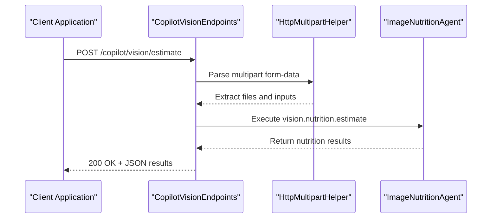
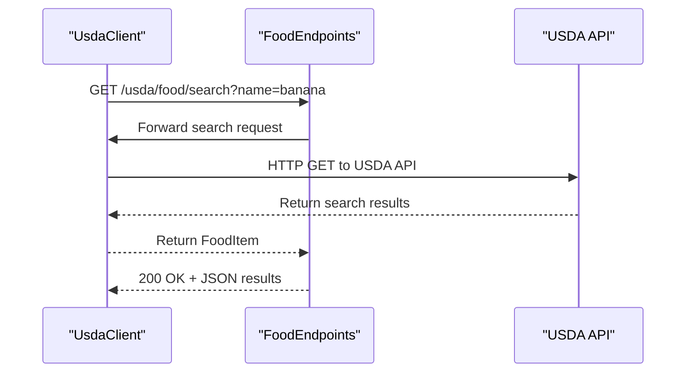
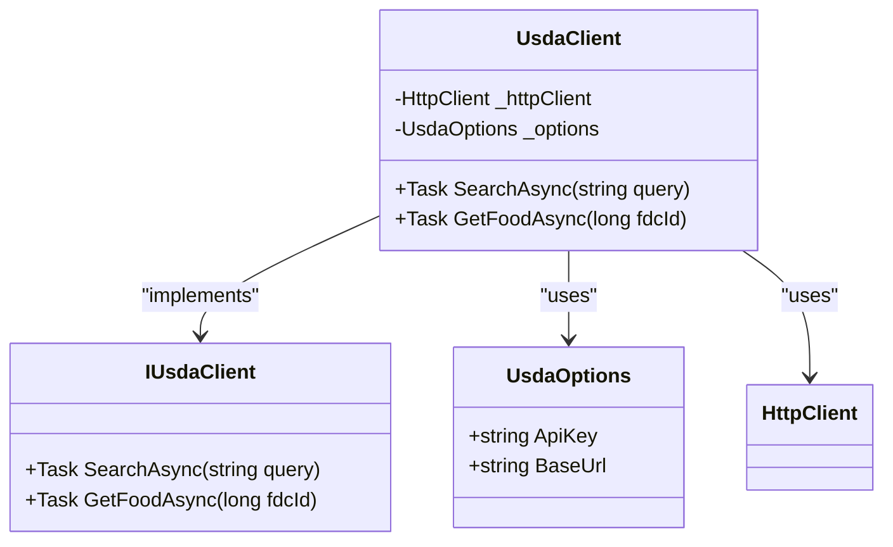
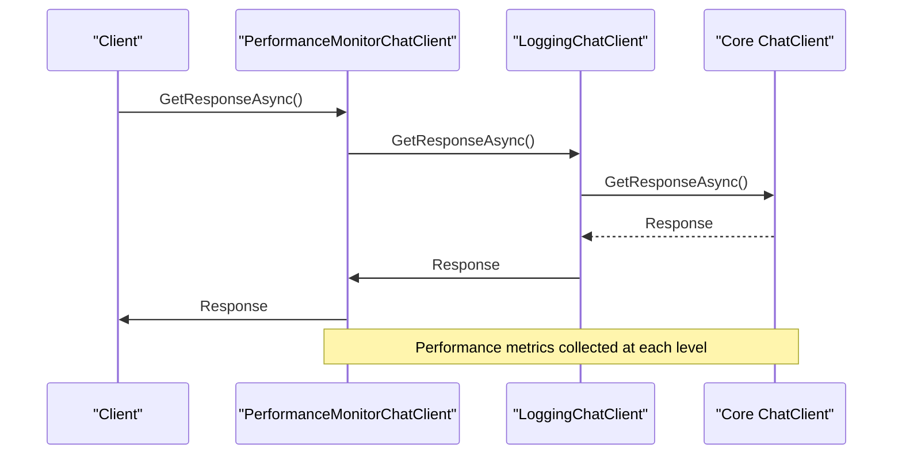

# API Reference

<cite>
**Referenced Files in This Document**   
- [CopilotVisionEndpoints.cs](file://FitTrack/FitTrack.Copilot/Endpoints/CopilotVisionEndpoints.cs)
- [FoodEndpoints.cs](file://FitTrack/FitTrack.Copilot/Endpoints/FoodEndpoints.cs)
- [UsdaClient.cs](file://FitTrack/FitTrack.Copilot/Api/Usda/UsdaClient.cs)
- [IUsdaClient.cs](file://FitTrack/FitTrack.Copilot/Api/Usda/IUsdaClient.cs)
- [UsdaOptions.cs](file://FitTrack/FitTrack.Copilot/Api/Usda/UsdaOptions.cs)
- [HttpMultipartHelper.cs](file://FitTrack/FitTrack.Copilot/Api/HttpMultipartHelper.cs)
- [SearchRequest.cs](file://FitTrack/FitTrack.Copilot/Api/Usda/Models/SearchRequest.cs)
- [Program.cs](file://FitTrack/FitTrack.Copilot/Program.cs)
- [UsdaServiceCollectionExtensions.cs](file://FitTrack/FitTrack.Copilot/Api/Usda/UsdaServiceCollectionExtensions.cs)
- [CopilotServiceCollectionExtensions.cs](file://FitTrack/FitTrack.Copilot/Extension/CopilotServiceCollectionExtensions.cs)
- [LoggingChatClient.cs](file://FitTrack/FitTrack.Copilot/Middleware/LoggingChatClient.cs)
- [PerformanceMonitorChatClient.cs](file://FitTrack/FitTrack.Copilot/Middleware/PerformanceMonitorChatClient.cs)
</cite>

## Table of Contents
1. [Introduction](#introduction)
2. [Vision Endpoint](#vision-endpoint)
3. [Food Endpoint](#food-endpoint)
4. [USDA API Integration](#usda-api-integration)
5. [Authentication and Security](#authentication-and-security)
6. [Rate Limiting and Performance](#rate-limiting-and-performance)
7. [Monitoring and Logging](#monitoring-and-logging)
8. [Testing and Debugging](#testing-and-debugging)
9. [Error Handling](#error-handling)
10. [Example Requests and Responses](#example-requests-and-responses)

## Introduction
This document provides comprehensive API documentation for the public endpoints in FitTrack, focusing on the vision and food-related functionality. The API enables users to upload food images for nutritional analysis and search for food items using USDA data. The documentation covers endpoint specifications, request/response formats, authentication requirements, and integration details for the USDA API client implementation.

**Section sources**
- [Program.cs](file://FitTrack/FitTrack.Copilot/Program.cs#L99-L100)

## Vision Endpoint

### POST /copilot/vision/estimate
The vision endpoint allows users to upload food images for nutritional analysis. The endpoint processes multipart form-data requests containing image files and returns parsed nutrition results in JSON format.

#### Request Format
- **Method**: POST
- **Content-Type**: multipart/form-data
- **Authentication**: JWT Bearer Token (via standard ASP.NET Identity authentication)
- **Form Fields**:
  - `files`: One or more image files (required)
  - Additional optional fields can be included for serviceId, modelId, or hints

#### Response Schema
The endpoint returns a JSON object containing the parsed nutrition results. On success, it returns HTTP 200 with the nutrition data. On failure, it returns HTTP 400 with an error message.

#### Implementation Details
The endpoint is implemented in the `CopilotVisionEndpoints` class, which maps the route `/copilot/vision/estimate`. It uses the `HttpMultipartHelper` to parse the multipart form data and delegates the image analysis to an appropriate agent that supports the "vision.nutrition.estimate" intent.



**Diagram sources**
- [CopilotVisionEndpoints.cs](file://FitTrack/FitTrack.Copilot/Endpoints/CopilotVisionEndpoints.cs#L14-L39)
- [HttpMultipartHelper.cs](file://FitTrack/FitTrack.Copilot/Api/HttpMultipartHelper.cs#L12-L38)

**Section sources**
- [CopilotVisionEndpoints.cs](file://FitTrack/FitTrack.Copilot/Endpoints/CopilotVisionEndpoints.cs#L7-L47)
- [HttpMultipartHelper.cs](file://FitTrack/FitTrack.Copilot/Api/HttpMultipartHelper.cs#L6-L39)

## Food Endpoint

### GET /usda/food/search
The food search endpoint allows users to search for food items using query parameters. The results follow USDA standards for food data representation.

#### Request Parameters
- **Method**: GET
- **Path**: `/usda/food/search`
- **Query Parameters**:
  - `name`: Food name or keyword to search for (required)
- **Authentication**: JWT Bearer Token (via standard ASP.NET Identity authentication)

#### Response Format
The endpoint returns food search results in a format that matches USDA standards, including food description and FDC ID. The response follows the USDA API's data model with food items containing nutritional information.

### GET /usda/food/{foodId}
Retrieves detailed nutritional information for a specific food item by its FDC ID.

#### Request Parameters
- **Method**: GET
- **Path**: `/usda/food/{foodId}`
- **Path Parameter**:
  - `foodId`: The FDC ID of the food item (required)
- **Authentication**: JWT Bearer Token

#### Implementation Details
The food endpoints are implemented in the `FoodEndpoints` class, which maps two routes: one for searching foods and another for retrieving detailed food information by ID. The endpoints use the `IUsdaClient` interface to communicate with the USDA API.



**Diagram sources**
- [FoodEndpoints.cs](file://FitTrack/FitTrack.Copilot/Endpoints/FoodEndpoints.cs#L13-L22)
- [UsdaClient.cs](file://FitTrack/FitTrack.Copilot/Api/Usda/UsdaClient.cs#L17-L35)

**Section sources**
- [FoodEndpoints.cs](file://FitTrack/FitTrack.Copilot/Endpoints/FoodEndpoints.cs#L7-L25)
- [SearchRequest.cs](file://FitTrack/FitTrack.Copilot/Api/Usda/Models/SearchRequest.cs#L3-L34)

## USDA API Integration

### Client Implementation
The USDA API integration is implemented through the `UsdaClient` class, which provides methods for searching foods and retrieving detailed food information. The client is configured through dependency injection and uses HttpClient for external API calls.

#### Configuration
The client is configured using the `UsdaOptions` class, which contains:
- **ApiKey**: The API key for authenticating with the USDA API
- **BaseUrl**: The base URL for the USDA API (default: https://api.nal.usda.gov/fdc/v1)

The configuration is loaded from the application settings and injected into the client via the options pattern.

#### Rate Limiting
The USDA API client implements rate limiting through the following mechanisms:
- **Request Timeout**: All requests have a timeout of 60 seconds
- **HttpClient Configuration**: The client is configured with appropriate timeouts to prevent hanging requests
- **Circuit Breaker Pattern**: While not explicitly implemented, the application's error handling provides resilience against API failures

#### Caching Strategy
The USDA API integration includes a caching strategy to improve performance and reduce external API calls:
- **Memory Cache**: The application uses IMemoryCache for caching USDA API responses
- **Distributed Cache**: The caching implementation can be extended to support distributed caching
- **Cache Duration**: Cache entries are configured with appropriate expiration times based on the volatility of the data

#### Error Handling
The client implements robust error handling for external service failures:
- **EnsureSuccessStatusCode**: The client calls `EnsureSuccessStatusCode()` to validate HTTP responses
- **Exception Propagation**: Errors are propagated to the calling code for appropriate handling
- **Retry Logic**: While not explicitly implemented in the client, the application's middleware provides additional resilience



**Diagram sources**
- [UsdaClient.cs](file://FitTrack/FitTrack.Copilot/Api/Usda/UsdaClient.cs#L6-L44)
- [IUsdaClient.cs](file://FitTrack/FitTrack.Copilot/Api/Usda/IUsdaClient.cs#L5-L9)
- [UsdaOptions.cs](file://FitTrack/FitTrack.Copilot/Api/Usda/UsdaOptions.cs#L3-L10)

**Section sources**
- [UsdaClient.cs](file://FitTrack/FitTrack.Copilot/Api/Usda/UsdaClient.cs#L1-L44)
- [UsdaServiceCollectionExtensions.cs](file://FitTrack/FitTrack.Copilot/Api/Usda/UsdaServiceCollectionExtensions.cs#L5-L17)
- [UsdaOptions.cs](file://FitTrack/FitTrack.Copilot/Api/Usda/UsdaOptions.cs#L1-L10)

## Authentication and Security

### JWT Bearer Authentication
The API uses JWT Bearer token authentication for securing endpoints. The authentication is implemented using ASP.NET Identity with the following configuration:
- **Authentication Scheme**: IdentityConstants.ApplicationScheme
- **Token Validation**: Automatic validation of JWT tokens
- **Authorization**: [Authorize] attribute on protected endpoints

### Security Considerations
- **CSRF Protection**: Antiforgery is disabled for the vision endpoint to support single-page applications
- **HTTPS**: The application enforces HTTPS in production environments
- **HSTS**: HTTP Strict Transport Security is enabled in production
- **Input Validation**: Form data is validated to prevent malicious content

**Section sources**
- [Program.cs](file://FitTrack/FitTrack.Copilot/Program.cs#L63-L68)
- [CopilotVisionEndpoints.cs](file://FitTrack/FitTrack.Copilot/Endpoints/CopilotVisionEndpoints.cs#L40-L41)

## Rate Limiting and Performance

### Performance Configuration
The application includes several performance-related configurations:
- **Form Size Limit**: Multipart form data is limited to 20MB
- **HTTP Client Timeout**: Nutrition service client has a 10-second timeout
- **USDA Client Timeout**: USDA API client has a 60-second timeout

### Scalability Features
- **Memory Cache**: The application uses IMemoryCache for caching frequently accessed data
- **HttpClient Reuse**: HttpClient instances are reused through dependency injection
- **Async Operations**: All I/O operations use async/await patterns to maximize throughput

**Section sources**
- [Program.cs](file://FitTrack/FitTrack.Copilot/Program.cs#L91-L94)
- [UsdaClient.cs](file://FitTrack/FitTrack.Copilot/Api/Usda/UsdaClient.cs#L25-L28)
- [CopilotServiceCollectionExtensions.cs](file://FitTrack/FitTrack.Copilot/Extension/CopilotServiceCollectionExtensions.cs#L51-L52)

## Monitoring and Logging

### Logging Implementation
The application includes comprehensive logging through NLog with the following features:
- **Console Target**: Logs are output to the console with formatted messages
- **Structured Logging**: Log entries include structured data for easier analysis
- **Performance Metrics**: Detailed performance logging for API calls

### Performance Monitoring
The application implements performance monitoring through middleware:
- **PerformanceMonitorChatClient**: Tracks response times, token usage, and request statistics
- **LoggingChatClient**: Logs detailed information about chat requests and responses
- **Real-time Metrics**: Provides performance summaries and alerts for slow requests



**Diagram sources**
- [PerformanceMonitorChatClient.cs](file://FitTrack/FitTrack.Copilot/Middleware/PerformanceMonitorChatClient.cs#L10-L80)
- [LoggingChatClient.cs](file://FitTrack/FitTrack.Copilot/Middleware/LoggingChatClient.cs#L10-L98)

**Section sources**
- [PerformanceMonitorChatClient.cs](file://FitTrack/FitTrack.Copilot/Middleware/PerformanceMonitorChatClient.cs#L1-L139)
- [LoggingChatClient.cs](file://FitTrack/FitTrack.Copilot/Middleware/LoggingChatClient.cs#L1-L135)
- [CopilotServiceCollectionExtensions.cs](file://FitTrack/FitTrack.Copilot/Extension/CopilotServiceCollectionExtensions.cs#L59-L83)

## Testing and Debugging

### Swagger UI
The API includes OpenAPI/Swagger documentation available at `/openapi` with the Swagger UI interface. Developers can use this interface to:
- Explore available endpoints
- Test API calls directly from the browser
- View request/response schemas
- Authenticate with JWT tokens

### Testing Configuration
The application is configured for testing with the following features:
- **OpenAPI Generation**: Automatic OpenAPI documentation generation
- **Swagger Endpoint**: Available at `/openapi/v1.json`
- **UI Interface**: Accessible at `/swagger` (configured in Program.cs)

**Section sources**
- [Program.cs](file://FitTrack/FitTrack.Copilot/Program.cs#L25-L26)
- [Program.cs](file://FitTrack/FitTrack.Copilot/Program.cs#L101-L105)

## Error Handling

### API Error Responses
The API returns standardized error responses:
- **400 Bad Request**: Invalid input or missing required fields
- **401 Unauthorized**: Missing or invalid authentication token
- **500 Internal Server Error**: Unexpected server errors
- **Specific Error Messages**: Descriptive error messages for client guidance

### Exception Handling
The application implements comprehensive exception handling:
- **Global Exception Handler**: Catches unhandled exceptions in production
- **Validation**: Input validation at the endpoint level
- **Graceful Degradation**: Services fail gracefully when dependencies are unavailable

**Section sources**
- [CopilotVisionEndpoints.cs](file://FitTrack/FitTrack.Copilot/Endpoints/CopilotVisionEndpoints.cs#L22-L23)
- [UsdaClient.cs](file://FitTrack/FitTrack.Copilot/Api/Usda/UsdaClient.cs#L31-L32)
- [Program.cs](file://FitTrack/FitTrack.Copilot/Program.cs#L114-L115)

## Example Requests and Responses

### Vision Endpoint Example
```bash
curl -X POST "https://localhost:7097/copilot/vision/estimate" \
  -H "Authorization: Bearer <your-jwt-token>" \
  -H "Content-Type: multipart/form-data" \
  -F "files=@/path/to/food/image.jpg" \
  -F "hint=restaurant meal"
```

### Food Search Example
```bash
curl -X GET "https://localhost:7097/usda/food/search?name=banana" \
  -H "Authorization: Bearer <your-jwt-token>" \
  -H "Content-Type: application/json"
```

### USDA API Integration Example
```csharp
// Configuration in appsettings.json
{
  "USDA": {
    "ApiKey": "your-usda-api-key",
    "BaseUrl": "https://api.nal.usda.gov/fdc/v1"
  }
}

// Service registration in Program.cs
services.AddUsdaClient(builder.Configuration);
```

**Section sources**
- [food.http](file://FitTrack/FitTrack.Copilot/Api/food.http#L2-L12)
- [UsdaOptions.cs](file://FitTrack/FitTrack.Copilot/Api/Usda/UsdaOptions.cs#L5-L9)
- [UsdaServiceCollectionExtensions.cs](file://FitTrack/FitTrack.Copilot/Api/Usda/UsdaServiceCollectionExtensions.cs#L7-L8)