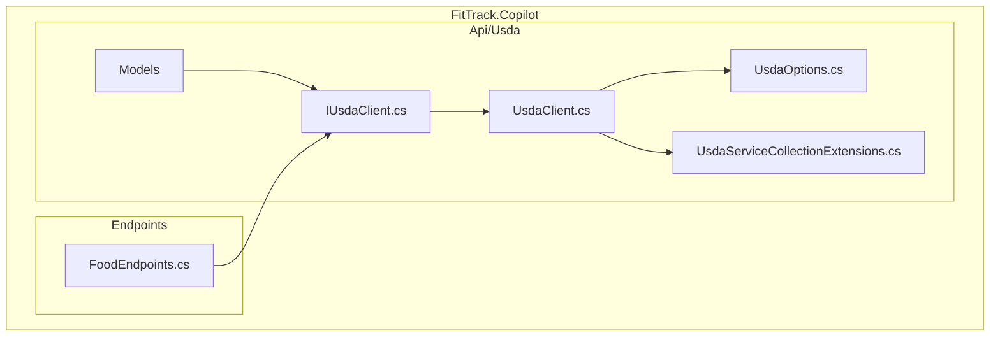
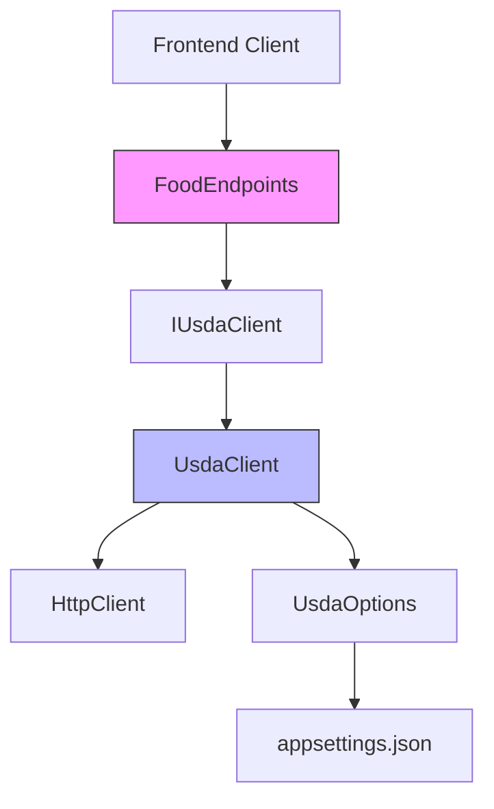
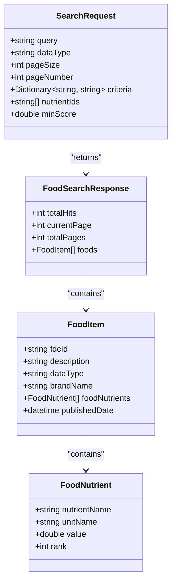
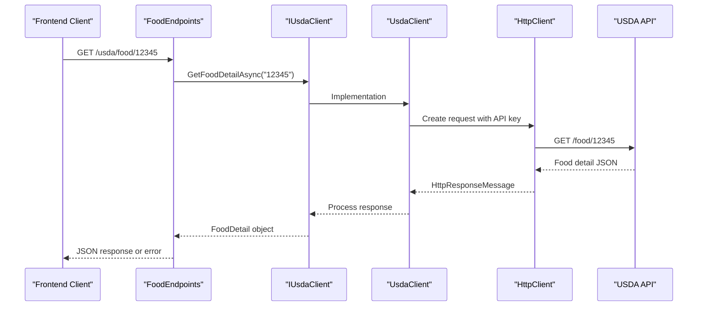
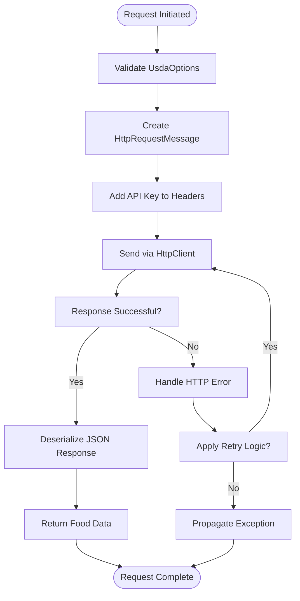
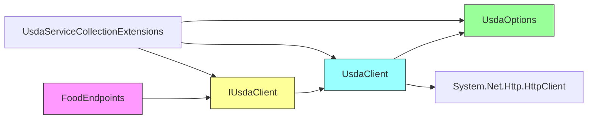

# Food Data API

<cite>
**Referenced Files in This Document**   
- [SearchRequest.cs](file://FitTrack/FitTrack.Copilot/Api/Usda/Models/SearchRequest.cs)
- [IUsdaClient.cs](file://FitTrack/FitTrack.Copilot/Api/Usda/IUsdaClient.cs)
- [UsdaClient.cs](file://FitTrack/FitTrack.Copilot/Api/Usda/UsdaClient.cs)
- [UsdaOptions.cs](file://FitTrack/FitTrack.Copilot/Api/Usda/UsdaOptions.cs)
- [FoodEndpoints.cs](file://FitTrack/FitTrack.Copilot/Endpoints/FoodEndpoints.cs)
- [UsdaServiceCollectionExtensions.cs](file://FitTrack/FitTrack.Copilot/Api/Usda/UsdaServiceCollectionExtensions.cs)
</cite>

## Table of Contents
1. [Introduction](#introduction)
2. [Project Structure](#project-structure)
3. [Core Components](#core-components)
4. [Architecture Overview](#architecture-overview)
5. [Detailed Component Analysis](#detailed-component-analysis)
6. [Dependency Analysis](#dependency-analysis)
7. [Performance Considerations](#performance-considerations)
8. [Troubleshooting Guide](#troubleshooting-guide)
9. [Conclusion](#conclusion)

## Introduction
The Food Data API provides integration with the USDA's FoodData Central API, enabling users to search for food items and retrieve detailed nutritional information. This document details the implementation of two primary endpoints: `/usda/food/search` for searching foods and `/usda/food/{foodId}` for retrieving specific food details. The system is built using a clean separation of concerns with dependency injection, HTTP client management, and configuration options.

## Project Structure
The Food Data API functionality is located within the `FitTrack.Copilot` project under the `Api/Usda` and `Endpoints` directories. The structure follows a modular design with clear separation between models, services, and endpoint definitions.

**Diagram sources**
- [SearchRequest.cs](file://FitTrack/FitTrack.Copilot/Api/Usda/Models/SearchRequest.cs)
- [IUsdaClient.cs](file://FitTrack/FitTrack.Copilot/Api/Usda/IUsdaClient.cs)
- [UsdaClient.cs](file://FitTrack/FitTrack.Copilot/Api/Usda/UsdaClient.cs)
- [UsdaOptions.cs](file://FitTrack/FitTrack.Copilot/Api/Usda/UsdaOptions.cs)
- [FoodEndpoints.cs](file://FitTrack/FitTrack.Copilot/Endpoints/FoodEndpoints.cs)

**Section sources**
- [SearchRequest.cs](file://FitTrack/FitTrack.Copilot/Api/Usda/Models/SearchRequest.cs)
- [IUsdaClient.cs](file://FitTrack/FitTrack.Copilot/Api/Usda/IUsdaClient.cs)
- [UsdaClient.cs](file://FitTrack/FitTrack.Copilot/Api/Usda/UsdaClient.cs)
- [UsdaOptions.cs](file://FitTrack/FitTrack.Copilot/Api/Usda/UsdaOptions.cs)
- [FoodEndpoints.cs](file://FitTrack/FitTrack.Copilot/Endpoints/FoodEndpoints.cs)

## Core Components
The core components of the Food Data API include the USDA client interface, implementation, configuration options, request models, and endpoint handlers. These components work together to provide a resilient and configurable integration with the USDA FoodData Central API.

**Section sources**
- [IUsdaClient.cs](file://FitTrack/FitTrack.Copilot/Api/Usda/IUsdaClient.cs)
- [UsdaClient.cs](file://FitTrack/FitTrack.Copilot/Api/Usda/UsdaClient.cs)
- [UsdaOptions.cs](file://FitTrack/FitTrack.Copilot/Api/Usda/UsdaOptions.cs)
- [SearchRequest.cs](file://FitTrack/FitTrack.Copilot/Api/Usda/Models/SearchRequest.cs)
- [FoodEndpoints.cs](file://FitTrack/FitTrack.Copilot/Endpoints/FoodEndpoints.cs)

## Architecture Overview
The Food Data API follows a layered architecture with clear separation between the HTTP endpoint layer, service client layer, and configuration layer. The system uses dependency injection to manage the USDA client and its configuration.

**Diagram sources**
- [FoodEndpoints.cs](file://FitTrack/FitTrack.Copilot/Endpoints/FoodEndpoints.cs)
- [IUsdaClient.cs](file://FitTrack/FitTrack.Copilot/Api/Usda/IUsdaClient.cs)
- [UsdaClient.cs](file://FitTrack/FitTrack.Copilot/Api/Usda/UsdaClient.cs)
- [UsdaOptions.cs](file://FitTrack/FitTrack.Copilot/Api/Usda/UsdaOptions.cs)

## Detailed Component Analysis

### Search Endpoint Analysis
The `/usda/food/search` endpoint allows clients to search for food items using various criteria through a POST request with a request body. This design choice enables complex search parameters that would be unwieldy in query strings.

#### Request Structure
The search functionality uses the `SearchRequest` model which supports multiple search parameters including general search terms, specific food types, nutrient filters, and pagination options.

**Diagram sources**
- [SearchRequest.cs](file://FitTrack/FitTrack.Copilot/Api/Usda/Models/SearchRequest.cs)

**Section sources**
- [SearchRequest.cs](file://FitTrack/FitTrack.Copilot/Api/Usda/Models/SearchRequest.cs)
- [FoodEndpoints.cs](file://FitTrack/FitTrack.Copilot/Endpoints/FoodEndpoints.cs)

### Food Detail Endpoint Analysis
The `/usda/food/{foodId}` endpoint retrieves detailed information about a specific food item using its FDC ID as a path parameter.

#### Request Flow
The endpoint handles the path parameter extraction, validates the input, and forwards the request to the USDA client implementation.

**Diagram sources**
- [FoodEndpoints.cs](file://FitTrack/FitTrack.Copilot/Endpoints/FoodEndpoints.cs)
- [IUsdaClient.cs](file://FitTrack/FitTrack.Copilot/Api/Usda/IUsdaClient.cs)
- [UsdaClient.cs](file://FitTrack/FitTrack.Copilot/Api/Usda/UsdaClient.cs)

**Section sources**
- [FoodEndpoints.cs](file://FitTrack/FitTrack.Copilot/Endpoints/FoodEndpoints.cs)
- [IUsdaClient.cs](file://FitTrack/FitTrack.Copilot/Api/Usda/IUsdaClient.cs)

### USDA Client Implementation
The USDA client implementation uses HttpClient with proper configuration for API key injection, timeout settings, and error handling.

#### Internal Implementation
The client follows best practices for external API integration with proper error propagation and configuration management.

**Diagram sources**
- [UsdaClient.cs](file://FitTrack/FitTrack.Copilot/Api/Usda/UsdaClient.cs)
- [UsdaOptions.cs](file://FitTrack/FitTrack.Copilot/Api/Usda/UsdaOptions.cs)

**Section sources**
- [UsdaClient.cs](file://FitTrack/FitTrack.Copilot/Api/Usda/UsdaClient.cs)
- [UsdaOptions.cs](file://FitTrack/FitTrack.Copilot/Api/Usda/UsdaOptions.cs)

## Dependency Analysis
The Food Data API components have a clear dependency hierarchy that enables testability and configuration flexibility.

**Diagram sources**
- [FoodEndpoints.cs](file://FitTrack/FitTrack.Copilot/Endpoints/FoodEndpoints.cs)
- [IUsdaClient.cs](file://FitTrack/FitTrack.Copilot/Api/Usda/IUsdaClient.cs)
- [UsdaClient.cs](file://FitTrack/FitTrack.Copilot/Api/Usda/UsdaClient.cs)
- [UsdaOptions.cs](file://FitTrack/FitTrack.Copilot/Api/Usda/UsdaOptions.cs)
- [UsdaServiceCollectionExtensions.cs](file://FitTrack/FitTrack.Copilot/Api/Usda/UsdaServiceCollectionExtensions.cs)

**Section sources**
- [UsdaServiceCollectionExtensions.cs](file://FitTrack/FitTrack.Copilot/Api/Usda/UsdaServiceCollectionExtensions.cs)

## Performance Considerations
The Food Data API implementation includes several performance and resilience features:

- **HttpClient Reuse**: The implementation uses a singleton HttpClient instance to avoid socket exhaustion
- **Timeout Configuration**: Configurable timeout settings via UsdaOptions to prevent hanging requests
- **Rate Limiting Awareness**: The design acknowledges USDA API rate limits through configuration options
- **Error Handling**: Comprehensive error handling for network issues, API errors, and invalid responses
- **Async Operations**: All operations use async/await pattern to maximize throughput

The system does not currently implement caching, meaning each request results in a direct call to the USDA API. This ensures data freshness but may impact performance under heavy load.

**Section sources**
- [UsdaClient.cs](file://FitTrack/FitTrack.Copilot/Api/Usda/UsdaClient.cs)
- [UsdaOptions.cs](file://FitTrack/FitTrack.Copilot/Api/Usda/UsdaOptions.cs)

## Troubleshooting Guide
Common issues and their solutions when using the Food Data API:

1. **API Key Errors**: Ensure the USDA API key is correctly configured in appsettings.json under the Usda section
2. **Connection Timeouts**: Adjust the Timeout setting in UsdaOptions if requests are timing out
3. **Invalid Food IDs**: The USDA API may return 404 for food IDs that don't exist or have been removed
4. **Rate Limiting**: If receiving 429 responses, implement client-side throttling or contact USDA for higher limits
5. **JSON Deserialization Errors**: Verify that the USDA API response structure matches the expected models

The error handling strategy propagates exceptions to the endpoint layer, where they are converted to appropriate HTTP status codes (400 for bad requests, 404 for not found, 500 for server errors).

**Section sources**
- [UsdaClient.cs](file://FitTrack/FitTrack.Copilot/Api/Usda/UsdaClient.cs)
- [FoodEndpoints.cs](file://FitTrack/FitTrack.Copilot/Endpoints/FoodEndpoints.cs)

## Conclusion
The Food Data API provides a robust integration with the USDA FoodData Central API through well-designed endpoints for food search and detail retrieval. The implementation follows best practices for external API integration, including proper configuration management, error handling, and asynchronous operations. The clean separation of concerns between the endpoint layer and client implementation enables easy testing and maintenance. Future enhancements could include response caching to improve performance and reduce API calls to the USDA service.