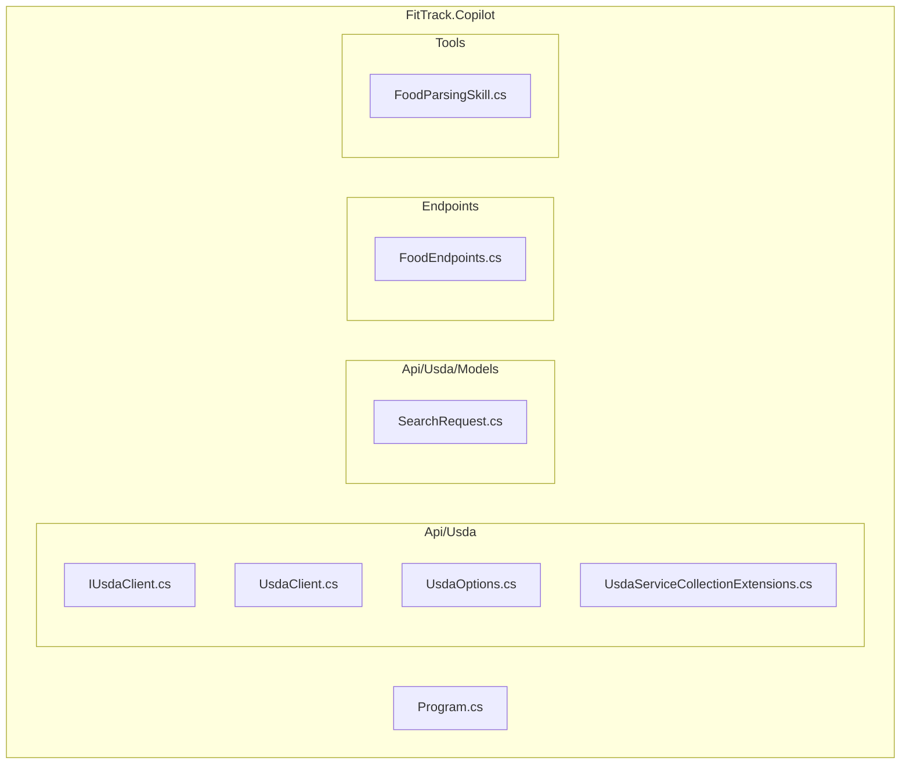
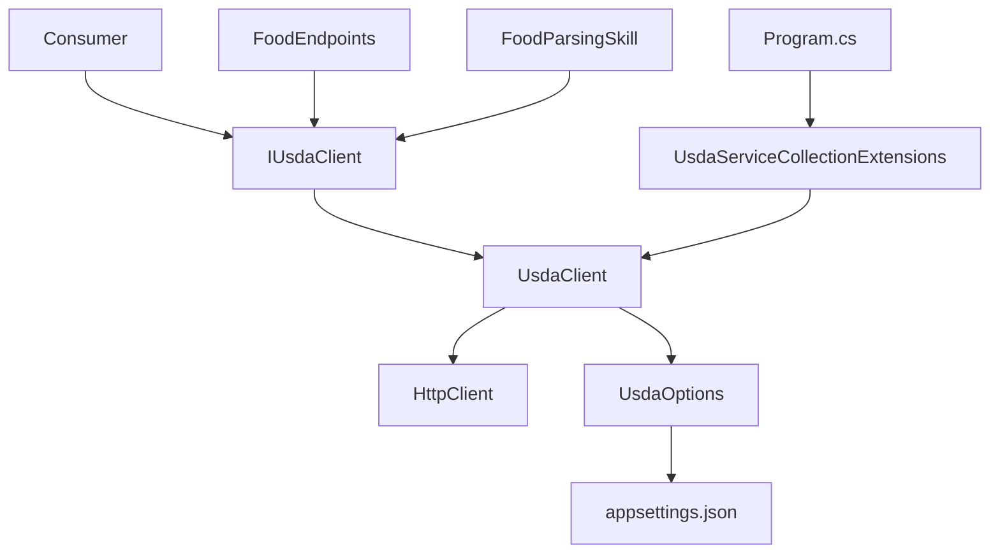
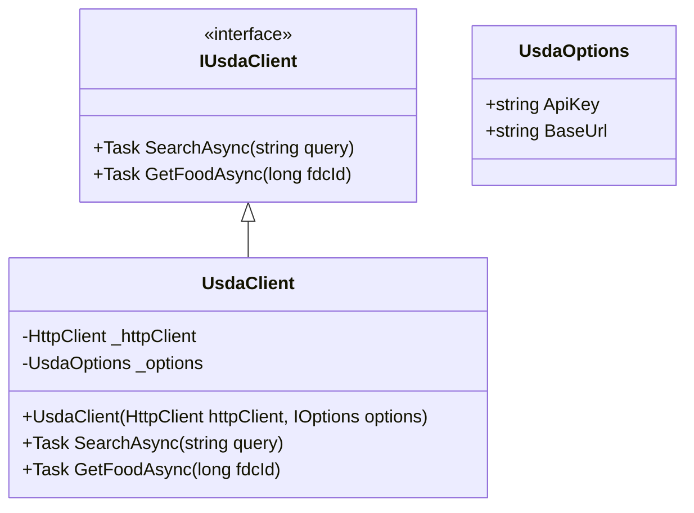
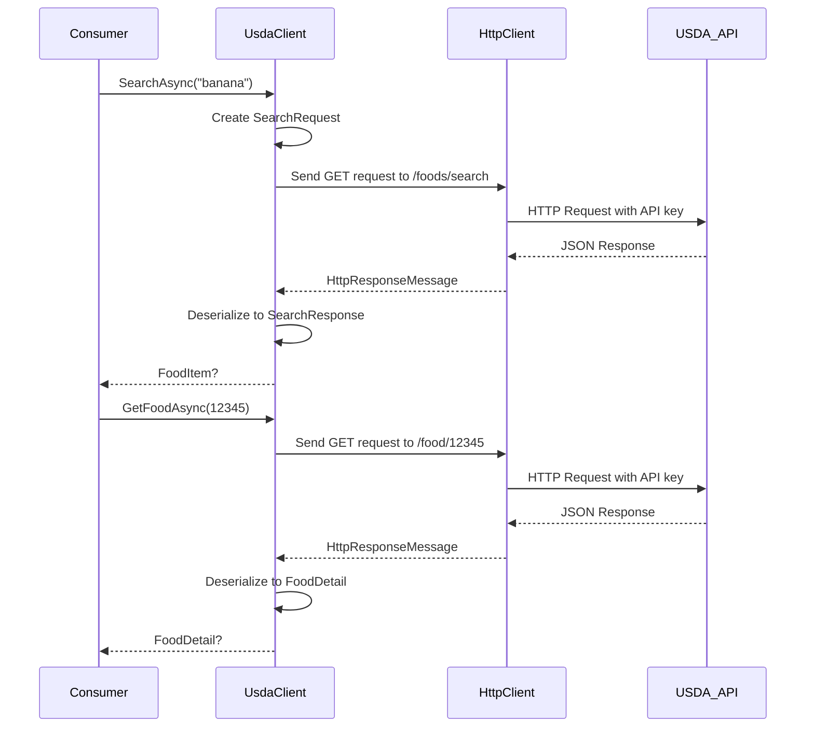
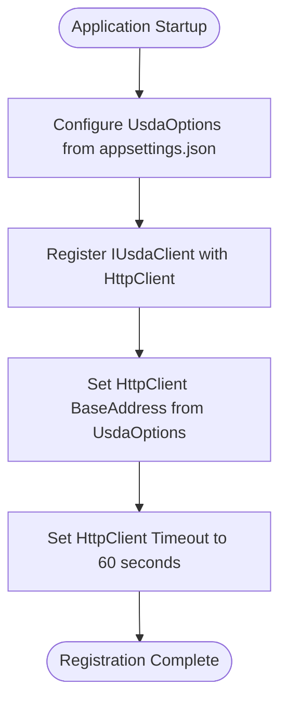
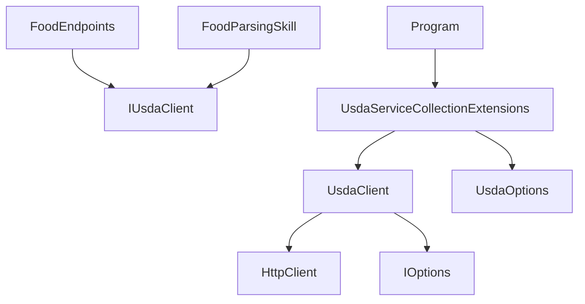

# USDA API Integration

<cite>
**Referenced Files in This Document**   
- [IUsdaClient.cs](file://FitTrack.Copilot/Api/Usda/IUsdaClient.cs)
- [UsdaClient.cs](file://FitTrack.Copilot/Api/Usda/UsdaClient.cs)
- [UsdaOptions.cs](file://FitTrack.Copilot/Api/Usda/UsdaOptions.cs)
- [UsdaServiceCollectionExtensions.cs](file://FitTrack.Copilot/Api/Usda/UsdaServiceCollectionExtensions.cs)
- [SearchRequest.cs](file://FitTrack.Copilot/Api/Usda/Models/SearchRequest.cs)
- [appsettings.json](file://FitTrack.Copilot/appsettings.json)
- [Program.cs](file://FitTrack.Copilot/Program.cs)
- [FoodEndpoints.cs](file://FitTrack.Copilot/Endpoints/FoodEndpoints.cs)
- [FoodParsingSkill.cs](file://FitTrack.Copilot/Tools/FoodParsingSkill.cs)
</cite>

## Table of Contents
1. [Introduction](#introduction)
2. [Project Structure](#project-structure)
3. [Core Components](#core-components)
4. [Architecture Overview](#architecture-overview)
5. [Detailed Component Analysis](#detailed-component-analysis)
6. [Dependency Analysis](#dependency-analysis)
7. [Performance Considerations](#performance-considerations)
8. [Troubleshooting Guide](#troubleshooting-guide)
9. [Conclusion](#conclusion)

## Introduction
This document provides comprehensive documentation for the USDA API client integration within the FitTrack.Copilot application. The integration enables food data retrieval from the USDA FoodData Central API, supporting nutritional analysis features in the application. The documentation covers the UsdaClient implementation, configuration requirements, error handling strategies, and usage patterns across the application.

## Project Structure
The USDA API integration is located in the `FitTrack.Copilot` project under the `Api/Usda` directory. This modular structure separates the USDA client implementation from other application concerns, following clean architecture principles. The integration includes interface definitions, client implementation, configuration models, and extension methods for service registration.



**Diagram sources**
- [UsdaClient.cs](file://FitTrack.Copilot/Api/Usda/UsdaClient.cs)
- [UsdaOptions.cs](file://FitTrack.Copilot/Api/Usda/UsdaOptions.cs)
- [UsdaServiceCollectionExtensions.cs](file://FitTrack.Copilot/Api/Usda/UsdaServiceCollectionExtensions.cs)
- [FoodEndpoints.cs](file://FitTrack.Copilot/Endpoints/FoodEndpoints.cs)
- [FoodParsingSkill.cs](file://FitTrack.Copilot/Tools/FoodParsingSkill.cs)

**Section sources**
- [UsdaClient.cs](file://FitTrack.Copilot/Api/Usda/UsdaClient.cs)
- [UsdaOptions.cs](file://FitTrack.Copilot/Api/Usda/UsdaOptions.cs)

## Core Components
The USDA API integration consists of several core components that work together to provide food data retrieval capabilities. The main components include the IUsdaClient interface, UsdaClient implementation, UsdaOptions configuration model, and associated data models for request and response payloads. These components follow the dependency injection pattern and are designed for testability and maintainability.

**Section sources**
- [IUsdaClient.cs](file://FitTrack.Copilot/Api/Usda/IUsdaClient.cs)
- [UsdaClient.cs](file://FitTrack.Copilot/Api/Usda/UsdaClient.cs)
- [UsdaOptions.cs](file://FitTrack.Copilot/Api/Usda/UsdaOptions.cs)
- [SearchRequest.cs](file://FitTrack.Copilot/Api/Usda/Models/SearchRequest.cs)

## Architecture Overview
The USDA API integration follows a clean architecture pattern with clear separation of concerns. The client implementation uses HttpClient for external API communication, with configuration managed through the Options pattern. The integration is exposed through well-defined interfaces, enabling dependency injection and testability. The architecture supports both direct consumption and indirect usage through higher-level services and endpoints.



**Diagram sources**
- [UsdaClient.cs](file://FitTrack.Copilot/Api/Usda/UsdaClient.cs)
- [UsdaOptions.cs](file://FitTrack.Copilot/Api/Usda/UsdaOptions.cs)
- [UsdaServiceCollectionExtensions.cs](file://FitTrack.Copilot/Api/Usda/UsdaServiceCollectionExtensions.cs)
- [FoodEndpoints.cs](file://FitTrack.Copilot/Endpoints/FoodEndpoints.cs)
- [FoodParsingSkill.cs](file://FitTrack.Copilot/Tools/FoodParsingSkill.cs)
- [Program.cs](file://FitTrack.Copilot/Program.cs)

## Detailed Component Analysis

### UsdaClient Implementation
The UsdaClient class implements the IUsdaClient interface and provides methods for searching foods and retrieving detailed food information from the USDA FoodData Central API. The client uses dependency injection to receive HttpClient and UsdaOptions instances, promoting testability and configuration flexibility.

#### Class Diagram


**Diagram sources**
- [IUsdaClient.cs](file://FitTrack.Copilot/Api/Usda/IUsdaClient.cs)
- [UsdaClient.cs](file://FitTrack.Copilot/Api/Usda/UsdaClient.cs)
- [UsdaOptions.cs](file://FitTrack.Copilot/Api/Usda/UsdaOptions.cs)

**Section sources**
- [UsdaClient.cs](file://FitTrack.Copilot/Api/Usda/UsdaClient.cs)

### SearchAsync and GetFoodAsync Methods
The UsdaClient provides two primary methods for interacting with the USDA API: SearchAsync and GetFoodAsync. These methods map directly to USDA FoodData Central endpoints and handle JSON serialization/deserialization of request and response payloads.

#### Sequence Diagram


**Diagram sources**
- [UsdaClient.cs](file://FitTrack.Copilot/Api/Usda/UsdaClient.cs)

**Section sources**
- [UsdaClient.cs](file://FitTrack.Copilot/Api/Usda/UsdaClient.cs)

### Configuration and Service Registration
The USDA client configuration is managed through the UsdaOptions class and registered in the service container using extension methods. The configuration supports API key, base URL, and timeout settings, with defaults appropriate for the USDA API.

#### Flowchart


**Diagram sources**
- [UsdaOptions.cs](file://FitTrack.Copilot/Api/Usda/UsdaOptions.cs)
- [UsdaServiceCollectionExtensions.cs](file://FitTrack.Copilot/Api/Usda/UsdaServiceCollectionExtensions.cs)
- [Program.cs](file://FitTrack.Copilot/Program.cs)

**Section sources**
- [UsdaOptions.cs](file://FitTrack.Copilot/Api/Usda/UsdaOptions.cs)
- [UsdaServiceCollectionExtensions.cs](file://FitTrack.Copilot/Api/Usda/UsdaServiceCollectionExtensions.cs)
- [Program.cs](file://FitTrack.Copilot/Program.cs)

### Data Models and Schema Mapping
The USDA integration includes data models that map to the USDA FoodData Central API schema. These models handle the serialization and deserialization of JSON payloads, providing a strongly-typed interface for consuming the API responses.

#### Data Model Diagram
```mermaid
erDiagram
SEARCH_REQUEST {
string Query
int PageSize
string DataType
}
SEARCH_RESPONSE {
List<FoodItem> Foods
}
FOOD_ITEM {
string Description
long FdcId
}
FOOD_DETAIL {
long FdcId
string Description
List<Nutrient> FoodNutrients
}
NUTRIENT {
int NutrientId
string Name
double Amount
string UnitName
}
SEARCH_REQUEST ||--o{ SEARCH_RESPONSE : "contains"
SEARCH_RESPONSE ||--o{ FOOD_ITEM : "contains"
FOOD_DETAIL ||--o{ NUTRIENT : "contains"
```

**Diagram sources**
- [SearchRequest.cs](file://FitTrack.Copilot/Api/Usda/Models/SearchRequest.cs)

**Section sources**
- [SearchRequest.cs](file://FitTrack.Copilot/Api/Usda/Models/SearchRequest.cs)

## Dependency Analysis
The USDA API integration has well-defined dependencies that follow dependency inversion principles. The client depends on abstractions rather than concrete implementations, enabling flexibility and testability. The integration is consumed by various components across the application, demonstrating its central role in nutritional data retrieval.



**Diagram sources**
- [UsdaClient.cs](file://FitTrack.Copilot/Api/Usda/UsdaClient.cs)
- [FoodEndpoints.cs](file://FitTrack.Copilot/Endpoints/FoodEndpoints.cs)
- [FoodParsingSkill.cs](file://FitTrack.Copilot/Tools/FoodParsingSkill.cs)
- [UsdaServiceCollectionExtensions.cs](file://FitTrack.Copilot/Api/Usda/UsdaServiceCollectionExtensions.cs)
- [Program.cs](file://FitTrack.Copilot/Program.cs)

**Section sources**
- [UsdaClient.cs](file://FitTrack.Copilot/Api/Usda/UsdaClient.cs)
- [FoodEndpoints.cs](file://FitTrack.Copilot/Endpoints/FoodEndpoints.cs)
- [FoodParsingSkill.cs](file://FitTrack.Copilot/Tools/FoodParsingSkill.cs)
- [UsdaServiceCollectionExtensions.cs](file://FitTrack.Copilot/Api/Usda/UsdaServiceCollectionExtensions.cs)

## Performance Considerations
The USDA API integration includes several performance considerations for external API calls. The HttpClient is configured with a 60-second timeout to prevent hanging requests. The implementation uses asynchronous methods throughout to avoid blocking threads. While no explicit caching mechanism is implemented in the client itself, the application configuration enables caching at a higher level. External API calls should be monitored for performance, as response times depend on the USDA API's availability and network conditions.

## Troubleshooting Guide
The USDA API integration includes error handling for common issues such as network failures and invalid responses. The EnsureSuccessStatusCode method throws exceptions for HTTP error responses, which are then handled by the application's global exception handling. For rate limiting (429 errors), the USDA API documentation should be consulted for retry-after guidance. API key management is critical for successful integration, and keys should be stored securely using user secrets or environment variables rather than hardcoding in configuration files.

**Section sources**
- [UsdaClient.cs](file://FitTrack.Copilot/Api/Usda/UsdaClient.cs)
- [appsettings.json](file://FitTrack.Copilot/appsettings.json)

## Conclusion
The USDA API integration in FitTrack.Copilot provides a robust and maintainable solution for retrieving nutritional data from the USDA FoodData Central API. The implementation follows best practices for dependency injection, configuration management, and asynchronous programming. The clean separation of concerns and well-defined interfaces make the integration easy to use, test, and extend. By following the documented patterns for configuration and usage, developers can effectively leverage the USDA API to enhance the application's nutritional analysis capabilities.