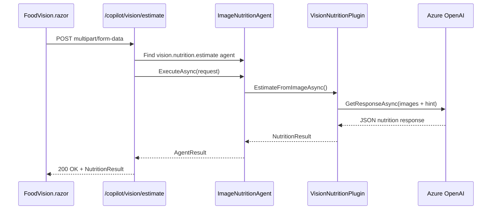
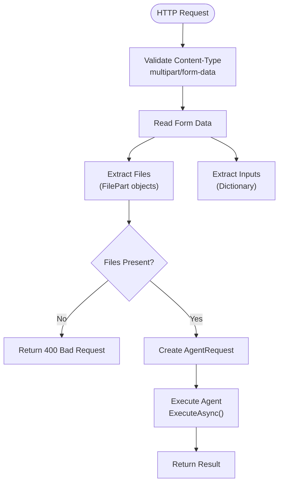
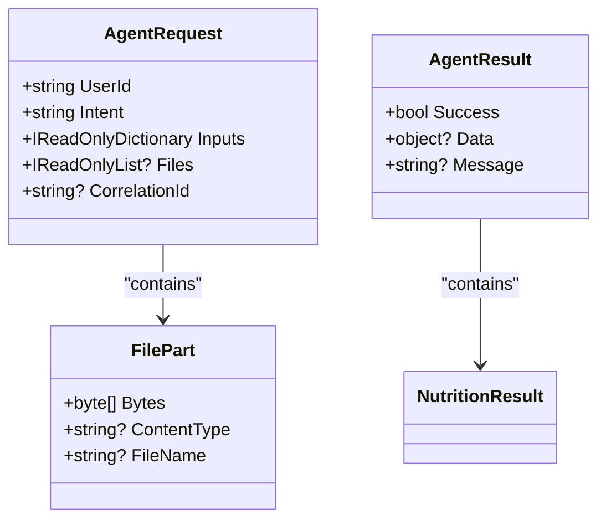
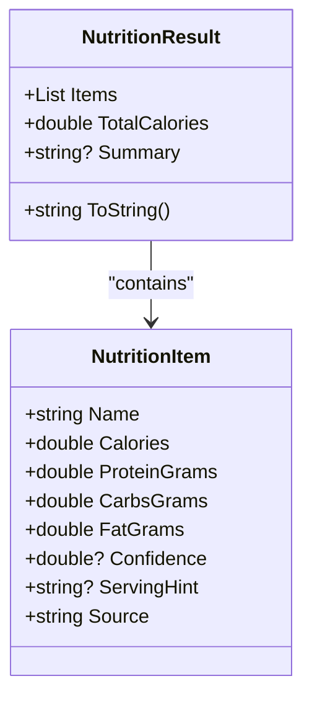
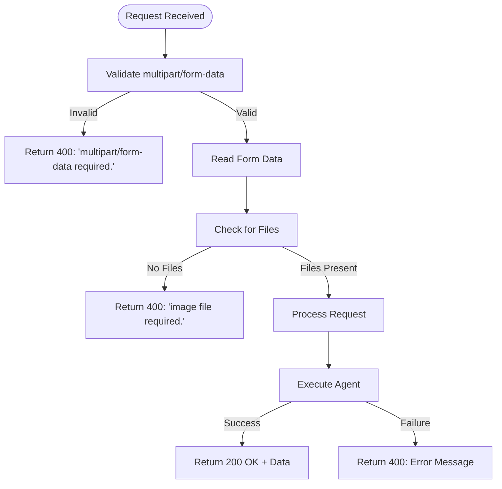
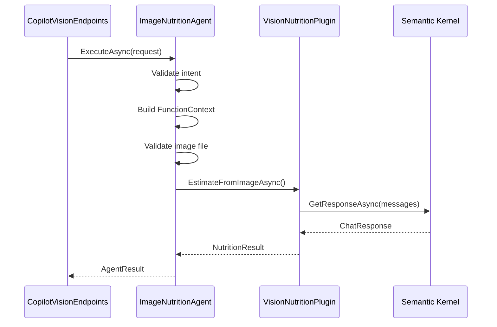
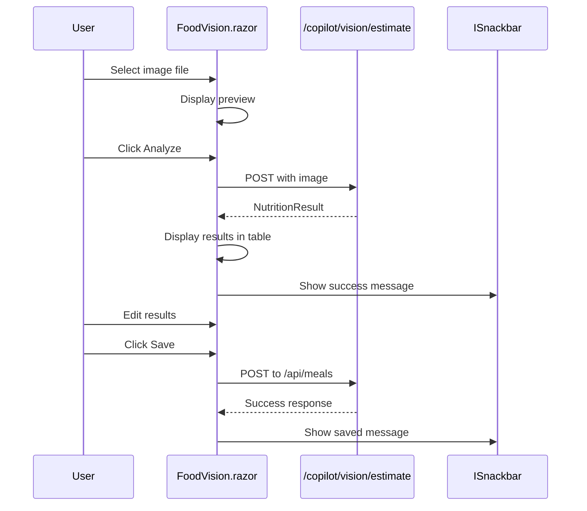
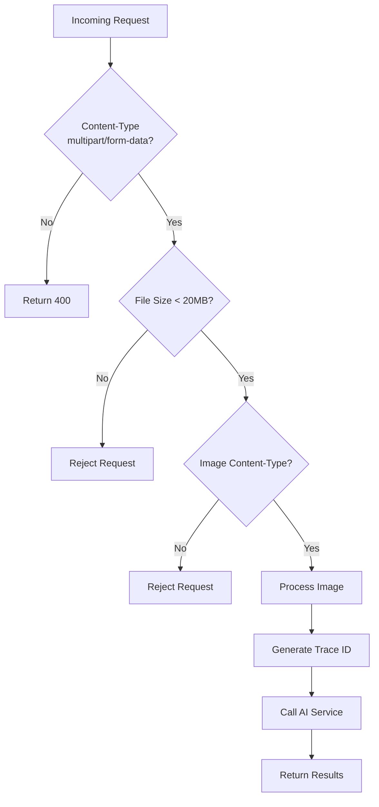

# Vision API

<cite>
**Referenced Files in This Document**   
- [CopilotVisionEndpoints.cs](file://FitTrack.Copilot/Endpoints/CopilotVisionEndpoints.cs)
- [HttpMultipartHelper.cs](file://FitTrack.Copilot/Api/HttpMultipartHelper.cs)
- [FoodVision.razor](file://FitTrack.Copilot/Components/Pages/FoodVision.razor)
- [FoodVision.razor.cs](file://FitTrack.Copilot/Components/Pages/FoodVision.razor.cs)
- [NutritionResult.cs](file://FitTrack.Copilot/Abstractions/Models/NutritionResult.cs)
- [ImageNutritionAgent.cs](file://FitTrack.Copilot/Agent/ImageNutritionAgent.cs)
- [VisionNutritionPlugin.cs](file://FitTrack.Copilot/SemanticKernel/Plugins/VisionNutritionPlugin.cs)
- [Program.cs](file://FitTrack.Copilot/Program.cs)
- [CopilotServiceCollectionExtensions.cs](file://FitTrack.Copilot/Extension/CopilotServiceCollectionExtensions.cs)
</cite>

## Table of Contents
1. [Introduction](#introduction)
2. [Endpoint Overview](#endpoint-overview)
3. [Request Structure](#request-structure)
4. [Authentication and Security](#authentication-and-security)
5. [Response Schema](#response-schema)
6. [Error Handling](#error-handling)
7. [Integration with Semantic Kernel](#integration-with-semantic-kernel)
8. [Frontend Integration](#frontend-integration)
9. [Example Usage](#example-usage)
10. [Security Considerations](#security-considerations)

## Introduction
The Vision API provides AI-powered nutrition analysis from food images through the `/copilot/vision/estimate` endpoint. This documentation details the API's functionality, request/response structure, authentication mechanisms, and integration patterns within the FitTrack application. The endpoint leverages Semantic Kernel and Azure OpenAI to analyze food images and return structured nutrition data for dietary tracking.

**Section sources**
- [CopilotVisionEndpoints.cs](file://FitTrack.Copilot/Endpoints/CopilotVisionEndpoints.cs#L7-L47)
- [Program.cs](file://FitTrack.Copilot/Program.cs#L99-L100)

## Endpoint Overview
The `/copilot/vision/estimate` POST endpoint accepts image uploads via multipart/form-data and returns AI-generated nutrition estimates. The endpoint is part of the Copilot vision system and is designed to integrate with frontend components like FoodVision.razor for seamless user experience.



**Diagram sources**
- [CopilotVisionEndpoints.cs](file://FitTrack.Copilot/Endpoints/CopilotVisionEndpoints.cs#L14-L39)
- [ImageNutritionAgent.cs](file://FitTrack.Copilot/Agent/ImageNutritionAgent.cs#L26-L56)
- [VisionNutritionPlugin.cs](file://FitTrack.Copilot/SemanticKernel/Plugins/VisionNutritionPlugin.cs#L16-L35)

**Section sources**
- [CopilotVisionEndpoints.cs](file://FitTrack.Copilot/Endpoints/CopilotVisionEndpoints.cs#L7-L47)

## Request Structure
The endpoint accepts multipart/form-data requests containing image files and optional form fields. The request structure follows standard multipart conventions with specific requirements for image processing.

### Multipart Request Components
The request must include at least one image file and may include optional form fields:

- **Files**: One or more image files (required)
- **Form Fields**:
  - `serviceId`: Optional service identifier
  - `modelId`: Optional model identifier
  - `hint`: Optional contextual hint for analysis



**Diagram sources**
- [HttpMultipartHelper.cs](file://FitTrack.Copilot/Api/HttpMultipartHelper.cs#L12-L38)
- [CopilotVisionEndpoints.cs](file://FitTrack.Copilot/Endpoints/CopilotVisionEndpoints.cs#L20-L30)

**Section sources**
- [HttpMultipartHelper.cs](file://FitTrack.Copilot/Api/HttpMultipartHelper.cs#L6-L39)
- [CopilotVisionEndpoints.cs](file://FitTrack.Copilot/Endpoints/CopilotVisionEndpoints.cs#L20-L30)

## Authentication and Security
The endpoint currently operates without authentication for development purposes but is designed for JWT/Bearer token integration. The security model includes CSRF exemption for single-page application compatibility.

### Authentication Status
The endpoint is currently configured without authentication (UserId is hardcoded as "me"), but the architecture supports JWT/Bearer token integration through the ASP.NET Identity system.



**Diagram sources**
- [CopilotVisionEndpoints.cs](file://FitTrack.Copilot/Endpoints/CopilotVisionEndpoints.cs#L25-L31)
- [IAgent.cs](file://FitTrack.Copilot/Abstractions/Agents/IAgent.cs#L44-L49)

**Section sources**
- [CopilotVisionEndpoints.cs](file://FitTrack.Copilot/Endpoints/CopilotVisionEndpoints.cs#L26-L30)
- [Program.cs](file://FitTrack.Copilot/Program.cs#L63-L68)

## Response Schema
The endpoint returns a structured JSON response containing nutrition analysis results. The response follows the NutritionResult schema with detailed food item information.

### NutritionResult Structure
```json
{
  "items": [
    {
      "name": "string",
      "calories": 0,
      "proteinGrams": 0,
      "carbsGrams": 0,
      "fatGrams": 0,
      "confidence": 0,
      "servingHint": "string",
      "source": "string"
    }
  ],
  "totalCalories": 0,
  "summary": "string"
}
```



**Diagram sources**
- [NutritionResult.cs](file://FitTrack.Copilot/Abstractions/Models/NutritionResult.cs#L6-L54)
- [FoodVision.razor](file://FitTrack.Copilot/Components/Pages/FoodVision.razor#L43-L53)

**Section sources**
- [NutritionResult.cs](file://FitTrack.Copilot/Abstractions/Models/NutritionResult.cs#L6-L54)

## Error Handling
The endpoint implements comprehensive error handling for various failure scenarios, returning appropriate HTTP status codes and error messages.

### Error Cases
- **400 Bad Request**: Missing image file or invalid content type
- **400 Bad Request**: Unsupported file type
- **500 Internal Server Error**: Image analysis failure



**Diagram sources**
- [CopilotVisionEndpoints.cs](file://FitTrack.Copilot/Endpoints/CopilotVisionEndpoints.cs#L21-L22)
- [HttpMultipartHelper.cs](file://FitTrack.Copilot/Api/HttpMultipartHelper.cs#L14-L15)
- [ImageNutritionAgent.cs](file://FitTrack.Copilot/Agent/ImageNutritionAgent.cs#L51-L54)

**Section sources**
- [CopilotVisionEndpoints.cs](file://FitTrack.Copilot/Endpoints/CopilotVisionEndpoints.cs#L21-L22)
- [ImageNutritionAgent.cs](file://FitTrack.Copilot/Agent/ImageNutritionAgent.cs#L51-L54)

## Integration with Semantic Kernel
The endpoint integrates with the Semantic Kernel agent system through the IAgent interface, enabling AI-powered vision analysis. The architecture follows a plugin-based pattern with middleware support.

### Agent Execution Flow


**Diagram sources**
- [ImageNutritionAgent.cs](file://FitTrack.Copilot/Agent/ImageNutritionAgent.cs#L26-L56)
- [VisionNutritionPlugin.cs](file://FitTrack.Copilot/SemanticKernel/Plugins/VisionNutritionPlugin.cs#L16-L35)

**Section sources**
- [ImageNutritionAgent.cs](file://FitTrack.Copilot/Agent/ImageNutritionAgent.cs#L19-L24)
- [VisionNutritionPlugin.cs](file://FitTrack.Copilot/SemanticKernel/Plugins/VisionNutritionPlugin.cs#L14-L15)

## Frontend Integration
The endpoint is designed for integration with Blazor components, particularly FoodVision.razor, which provides a user-friendly interface for image upload and nutrition analysis.

### FoodVision Component Flow


**Diagram sources**
- [FoodVision.razor](file://FitTrack.Copilot/Components/Pages/FoodVision.razor#L1-L96)
- [FoodVision.razor.cs](file://FitTrack.Copilot/Components/Pages/FoodVision.razor.cs#L33-L72)

**Section sources**
- [FoodVision.razor](file://FitTrack.Copilot/Components/Pages/FoodVision.razor#L1-L96)
- [FoodVision.razor.cs](file://FitTrack.Copilot/Components/Pages/FoodVision.razor.cs#L19-L72)

## Example Usage
The following examples demonstrate how to use the `/copilot/vision/estimate` endpoint for image-based nutrition analysis.

### cURL Command
```bash
curl -X POST https://localhost:5097/copilot/vision/estimate \
  -H "Content-Type: multipart/form-data" \
  -F "image=@/path/to/food.jpg" \
  -F "hint=Analyze this Asian food dish with noodles and vegetables"
```

### Request Structure
```
POST /copilot/vision/estimate HTTP/1.1
Content-Type: multipart/form-data; boundary=----WebKitFormBoundary7MA4YWxkTrZu0gW

------WebKitFormBoundary7MA4YWxkTrZu0gW
Content-Disposition: form-data; name="image"; filename="food.jpg"
Content-Type: image/jpeg

<binary image data>
------WebKitFormBoundary7MA4YWxkTrZu0gW
Content-Disposition: form-data; name="hint"

Analyze this Asian food dish with noodles and vegetables
------WebKitFormBoundary7MA4YWxkTrZu0gW--
```

### Sample Response
```json
{
  "items": [
    {
      "name": "beef noodles",
      "calories": 450,
      "proteinGrams": 25,
      "carbsGrams": 60,
      "fatGrams": 15,
      "confidence": 0.85,
      "servingHint": "one bowl",
      "source": "ai"
    },
    {
      "name": "steamed vegetables",
      "calories": 80,
      "proteinGrams": 3,
      "carbsGrams": 15,
      "fatGrams": 2,
      "confidence": 0.78,
      "servingHint": "side portion",
      "source": "ai"
    }
  ],
  "totalCalories": 530,
  "summary": "Asian-style beef noodle soup with steamed vegetables"
}
```

**Section sources**
- [FoodVision.razor.cs](file://FitTrack.Copilot/Components/Pages/FoodVision.razor.cs#L46-L58)
- [NutritionResult.cs](file://FitTrack.Copilot/Abstractions/Models/NutritionResult.cs#L6-L54)

## Security Considerations
The endpoint implements several security measures to protect against common vulnerabilities while maintaining usability.

### Security Features
- **CSRF Exemption**: Disabled for SPA compatibility
- **File Size Limits**: Configured at 20MB in FormOptions
- **Content-Type Validation**: Enforced for image files
- **Trace Correlation**: HttpContext.TraceIdentifier for request tracking



**Diagram sources**
- [Program.cs](file://FitTrack.Copilot/Program.cs#L91-L94)
- [CopilotVisionEndpoints.cs](file://FitTrack.Copilot/Endpoints/CopilotVisionEndpoints.cs#L40-L41)
- [ImageNutritionAgent.cs](file://FitTrack.Copilot/Agent/ImageNutritionAgent.cs#L37-L38)

**Section sources**
- [Program.cs](file://FitTrack.Copilot/Program.cs#L91-L94)
- [CopilotVisionEndpoints.cs](file://FitTrack.Copilot/Endpoints/CopilotVisionEndpoints.cs#L40-L41)
- [ImageNutritionAgent.cs](file://FitTrack.Copilot/Agent/ImageNutritionAgent.cs#L37-L38)