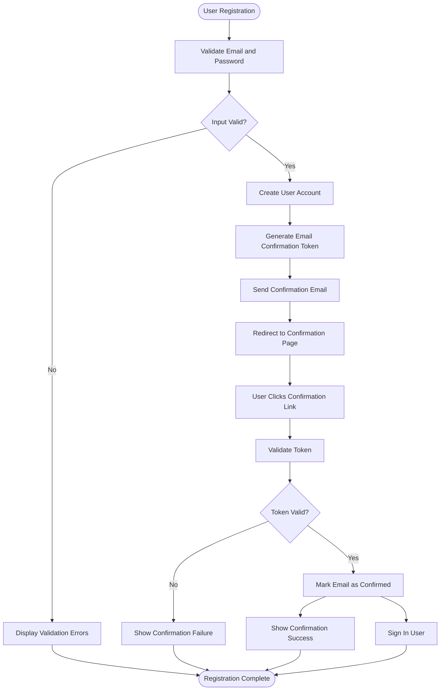
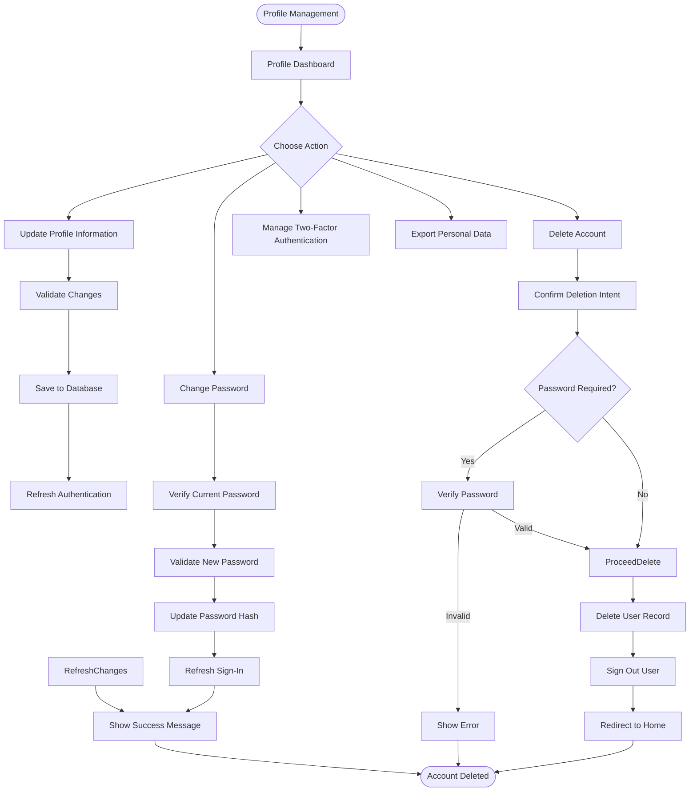
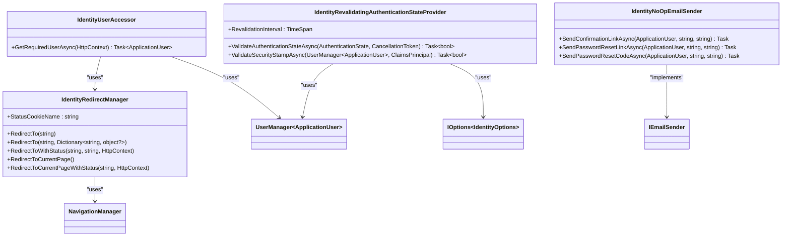

# Authentication & User Management

<cite>
**Referenced Files in This Document**   
- [ApplicationUser.cs](file://FitTrack/FitTrack/Data/ApplicationUser.cs)
- [ApplicationDbContext.cs](file://FitTrack/FitTrack/Data/ApplicationDbContext.cs)
- [Program.cs](file://FitTrack/FitTrack/Program.cs)
- [IdentityUserAccessor.cs](file://FitTrack/FitTrack/Components/Account/IdentityUserAccessor.cs)
- [IdentityRedirectManager.cs](file://FitTrack/FitTrack/Components/Account/IdentityRedirectManager.cs)
- [Register.razor](file://FitTrack/FitTrack/Components/Account/Pages/Register.razor)
- [Login.razor](file://FitTrack/FitTrack/Components/Account/Pages/Login.razor)
- [ConfirmEmail.razor](file://FitTrack/FitTrack/Components/Account/Pages/ConfirmEmail.razor)
- [ChangePassword.razor](file://FitTrack/FitTrack/Components/Account/Pages/Manage/ChangePassword.razor)
- [DeletePersonalData.razor](file://FitTrack/FitTrack/Components/Account/Pages/Manage/DeletePersonalData.razor)
- [PersonalData.razor](file://FitTrack/FitTrack/Components/Account/Pages/Manage/PersonalData.razor)
- [TwoFactorAuthentication.razor](file://FitTrack/FitTrack/Components/Account/Pages/Manage/TwoFactorAuthentication.razor)
- [IdentityRevalidatingAuthenticationStateProvider.cs](file://FitTrack/FitTrack/Components/Account/IdentityRevalidatingAuthenticationStateProvider.cs)
- [IdentityNoOpEmailSender.cs](file://FitTrack/FitTrack/Components/Account/IdentityNoOpEmailSender.cs)
</cite>

## Table of Contents
1. [Authentication System Overview](#authentication-system-overview)
2. [User Registration Flow](#user-registration-flow)
3. [Profile Management Features](#profile-management-features)
4. [Security Implementation](#security-implementation)
5. [Core Identity Components](#core-identity-components)
6. [GDPR Compliance](#gdpr-compliance)
7. [Customization and Extension](#customization-and-extension)

## Authentication System Overview

The FitTrack application implements a comprehensive authentication system using ASP.NET Core Identity with Blazor Server components. The system is configured in the `Program.cs` file where essential services are registered, including identity cookies, user management, and authentication state providers. The `ApplicationUser` class extends `IdentityUser` to support future profile data expansion, while `ApplicationDbContext` inherits from `IdentityDbContext<ApplicationUser>` to manage identity data persistence.

The authentication pipeline includes support for local account login, external authentication providers, and two-factor authentication. The system requires confirmed email addresses for new registrations, enhancing security by verifying user ownership of email accounts. The configuration also includes anti-forgery protection and HTTPS enforcement to protect against common web vulnerabilities.

**Section sources**
- [Program.cs](file://FitTrack/FitTrack/Program.cs#L1-L76)
- [ApplicationUser.cs](file://FitTrack/FitTrack/Data/ApplicationUser.cs#L1-L10)
- [ApplicationDbContext.cs](file://FitTrack/FitTrack/Data/ApplicationDbContext.cs#L1-L17)

## User Registration Flow

The user registration process in FitTrack follows a secure flow that includes email confirmation. When a user registers through the `Register.razor` component, the system creates a new `ApplicationUser` instance and generates an email confirmation token using ASP.NET Core Identity's token provider system. The confirmation link is constructed with the user ID and a Base64Url-encoded token, which is sent to the user's email address.

Since the application currently uses `IdentityNoOpEmailSender`, email functionality is disabled in production, but the framework is in place for future implementation. After registration, if email confirmation is required (which is enabled in the configuration), users are redirected to a confirmation page that instructs them to check their email. The `ConfirmEmail.razor` page handles the confirmation process by validating the token and marking the user's email as confirmed in the identity system.

**Diagram sources**
- [Register.razor](file://FitTrack/FitTrack/Components/Account/Pages/Register.razor#L1-L147)
- [ConfirmEmail.razor](file://FitTrack/FitTrack/Components/Account/Pages/ConfirmEmail.razor#L1-L49)

**Section sources**
- [Register.razor](file://FitTrack/FitTrack/Components/Account/Pages/Register.razor#L1-L147)
- [ConfirmEmail.razor](file://FitTrack/FitTrack/Components/Account/Pages/ConfirmEmail.razor#L1-L49)
- [IdentityNoOpEmailSender.cs](file://FitTrack/FitTrack/Components/Account/IdentityNoOpEmailSender.cs#L1-L23)

## Profile Management Features

FitTrack provides a comprehensive profile management system accessible through the `/Account/Manage` route. The system allows users to update their personal information, change passwords, manage two-factor authentication, and handle personal data according to GDPR requirements.

The `Index.razor` page in the Manage section allows users to update their phone number, which is stored in the identity system. The `ChangePassword.razor` component enables users to modify their password after verifying their current password, with appropriate validation to ensure the new password meets security requirements and matches the confirmation field.

For personal data management, the system provides both download and deletion capabilities. The `PersonalData.razor` page offers a form to download all personal data associated with the account, while `DeletePersonalData.razor` provides a secure process for account deletion that requires password verification when applicable.

**Diagram sources**
- [Index.razor](file://FitTrack/FitTrack/Components/Account/Pages/Manage/Index.razor#L1-L78)
- [ChangePassword.razor](file://FitTrack/FitTrack/Components/Account/Pages/Manage/ChangePassword.razor#L1-L97)
- [DeletePersonalData.razor](file://FitTrack/FitTrack/Components/Account/Pages/Manage/DeletePersonalData.razor#L1-L87)
- [PersonalData.razor](file://FitTrack/FitTrack/Components/Account/Pages/Manage/PersonalData.razor#L1-L36)

**Section sources**
- [Index.razor](file://FitTrack/FitTrack/Components/Account/Pages/Manage/Index.razor#L1-L78)
- [ChangePassword.razor](file://FitTrack/FitTrack/Components/Account/Pages/Manage/ChangePassword.razor#L1-L97)
- [DeletePersonalData.razor](file://FitTrack/FitTrack/Components/Account/Pages/Manage/DeletePersonalData.razor#L1-L87)
- [PersonalData.razor](file://FitTrack/FitTrack/Components/Account/Pages/Manage/PersonalData.razor#L1-L36)

## Security Implementation

The authentication system in FitTrack implements multiple security measures to protect user accounts and prevent common web vulnerabilities. Password policies are enforced through ASP.NET Core Identity's configuration, requiring a minimum length of 6 characters as defined in the registration form validation.

Two-factor authentication (2FA) is fully supported through authenticator apps, with recovery codes generation and management features. The `TwoFactorAuthentication.razor` component displays the user's current 2FA status, recovery code count, and provides options to enable, disable, or reset the authenticator. The system also supports "remember this browser" functionality, which temporarily bypasses 2FA requirements for trusted devices.

To prevent cross-site request forgery (CSRF) attacks, the application uses ASP.NET Core's antiforgery system, with antiforgery tokens included in forms that modify state. The `IdentityRedirectManager` class includes protection against open redirect vulnerabilities by validating URI parameters before redirection. Additionally, the application implements protection against cross-site scripting (XSS) through proper encoding of user content and the use of secure cookie settings.

Session security is enhanced through the `IdentityRevalidatingAuthenticationStateProvider`, which revalidates the user's security stamp every 30 minutes. This ensures that if a user's account is modified (such as password change or role update), the changes are reflected in active sessions.

**Section sources**
- [TwoFactorAuthentication.razor](file://FitTrack/FitTrack/Components/Account/Pages/Manage/TwoFactorAuthentication.razor#L1-L102)
- [IdentityRevalidatingAuthenticationStateProvider.cs](file://FitTrack/FitTrack/Components/Account/IdentityRevalidatingAuthenticationStateProvider.cs#L1-L48)
- [Program.cs](file://FitTrack/FitTrack/Program.cs#L67)
- [Login.razor](file://FitTrack/FitTrack/Components/Account/Pages/Login.razor#L1-L129)

## Core Identity Components

The FitTrack authentication system relies on several custom components that extend the base ASP.NET Core Identity functionality. The `IdentityUserAccessor` service provides a safe way to retrieve the current user from the HTTP context, handling cases where the user cannot be loaded by redirecting to an error page with a descriptive message.

The `IdentityRedirectManager` is responsible for handling navigation within the authentication system. It provides methods for redirecting to specific pages, including the ability to pass status messages through a secure cookie. The status cookie is configured with strict security settings: SameSite mode is set to Strict, the cookie is HTTP-only, and it has a short maximum age of 5 seconds to ensure temporary messages are not persisted.

**Diagram sources**
- [IdentityUserAccessor.cs](file://FitTrack/FitTrack/Components/Account/IdentityUserAccessor.cs#L1-L22)
- [IdentityRedirectManager.cs](file://FitTrack/FitTrack/Components/Account/IdentityRedirectManager.cs#L1-L59)
- [IdentityRevalidatingAuthenticationStateProvider.cs](file://FitTrack/FitTrack/Components/Account/IdentityRevalidatingAuthenticationStateProvider.cs#L1-L48)
- [IdentityNoOpEmailSender.cs](file://FitTrack/FitTrack/Components/Account/IdentityNoOpEmailSender.cs#L1-L23)

**Section sources**
- [IdentityUserAccessor.cs](file://FitTrack/FitTrack/Components/Account/IdentityUserAccessor.cs#L1-L22)
- [IdentityRedirectManager.cs](file://FitTrack/FitTrack/Components/Account/IdentityRedirectManager.cs#L1-L59)
- [IdentityRevalidatingAuthenticationStateProvider.cs](file://FitTrack/FitTrack/Components/Account/IdentityRevalidatingAuthenticationStateProvider.cs#L1-L48)
- [IdentityNoOpEmailSender.cs](file://FitTrack/FitTrack/Components/Account/IdentityNoOpEmailSender.cs#L1-L23)

## GDPR Compliance

FitTrack implements several features to support General Data Protection Regulation (GDPR) compliance, particularly regarding user data rights. The system provides mechanisms for users to access, download, and delete their personal data.

The `PersonalData.razor` page serves as the central interface for GDPR-related actions, offering users the ability to download all personal data associated with their account or initiate the account deletion process. When a user requests data deletion through `DeletePersonalData.razor`, the system requires password verification if the user has a password set, adding an additional security layer to prevent unauthorized account deletion.

The data download functionality is implemented as a form POST to `DownloadPersonalData`, which would generate and return a file containing all user data stored in the system. While the specific implementation details are not visible in the provided code, the routing structure indicates this endpoint exists.

Account deletion is handled through the `UserManager.DeleteAsync` method, which permanently removes the user record from the database. After deletion, the user is signed out, and the system logs the action for audit purposes. This implementation respects the "right to be forgotten" by completely removing user data from the system.

**Section sources**
- [PersonalData.razor](file://FitTrack/FitTrack/Components/Account/Pages/Manage/PersonalData.razor#L1-L36)
- [DeletePersonalData.razor](file://FitTrack/FitTrack/Components/Account/Pages/Manage/DeletePersonalData.razor#L1-L87)
- [Program.cs](file://FitTrack/FitTrack/Program.cs#L49)

## Customization and Extension

The FitTrack authentication system is designed to be extensible, following ASP.NET Core Identity best practices. The `ApplicationUser` class is defined as a simple extension of `IdentityUser`, with a comment indicating that additional profile properties can be added to support application-specific user data.

The service configuration in `Program.cs` demonstrates how custom services can be integrated with the identity system. For example, the `IdentityNoOpEmailSender` is registered as a singleton service implementing `IEmailSender<ApplicationUser>`, showing how email functionality can be replaced with a production implementation when needed.

The component architecture uses dependency injection extensively, with pages injecting services like `UserManager<ApplicationUser>`, `SignInManager<ApplicationUser>`, and custom services like `IdentityUserAccessor` and `IdentityRedirectManager`. This design allows for easy testing and replacement of components.

Developers can extend the system by adding properties to the `ApplicationUser` class, creating custom identity stores, or implementing additional `IEmailSender` services for production email delivery. The use of partial classes and separate files for different components makes it easy to modify specific aspects of the authentication flow without affecting the entire system.

**Section sources**
- [ApplicationUser.cs](file://FitTrack/FitTrack/Data/ApplicationUser.cs#L1-L10)
- [Program.cs](file://FitTrack/FitTrack/Program.cs#L38)
- [Register.razor](file://FitTrack/FitTrack/Components/Account/Pages/Register.razor#L10-L16)
- [Login.razor](file://FitTrack/FitTrack/Components/Account/Pages/Login.razor#L8-L11)