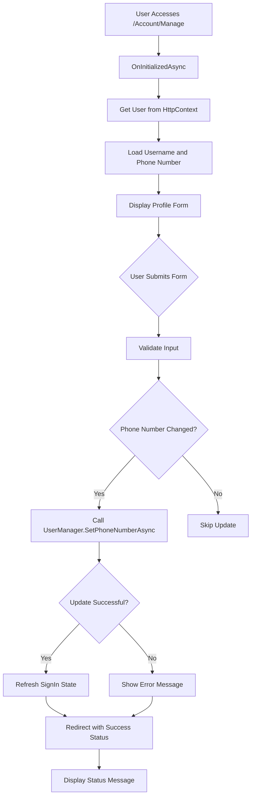
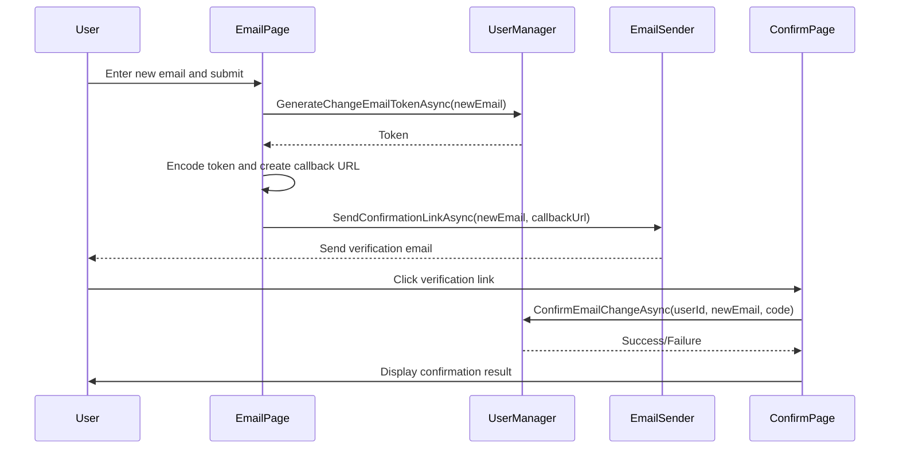
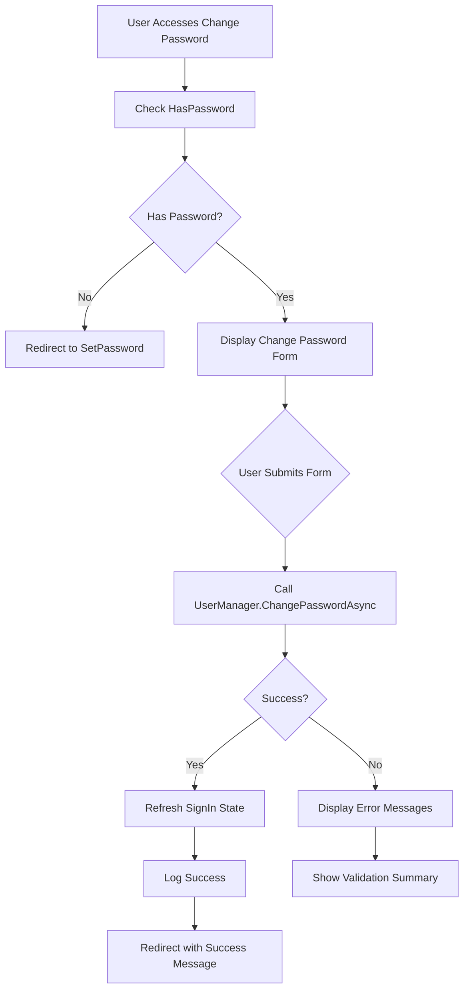
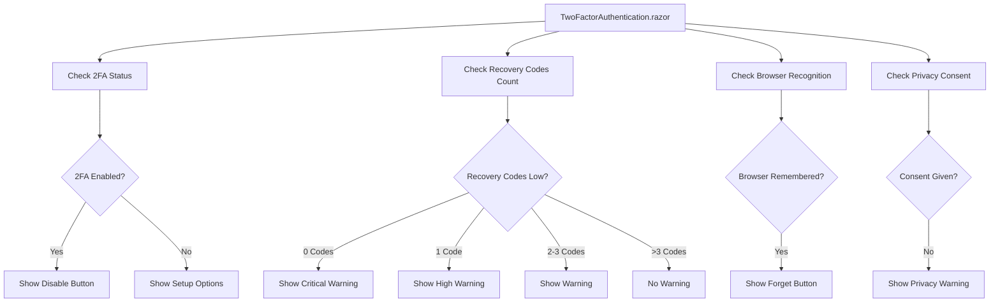
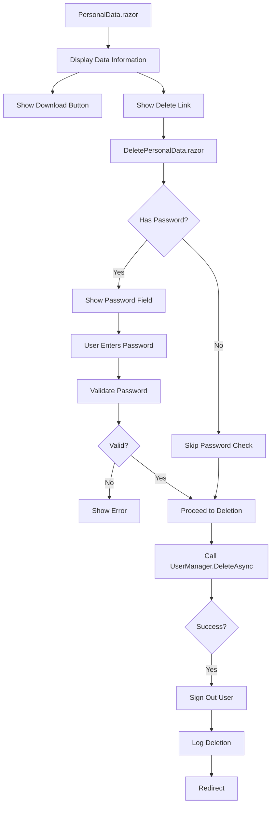
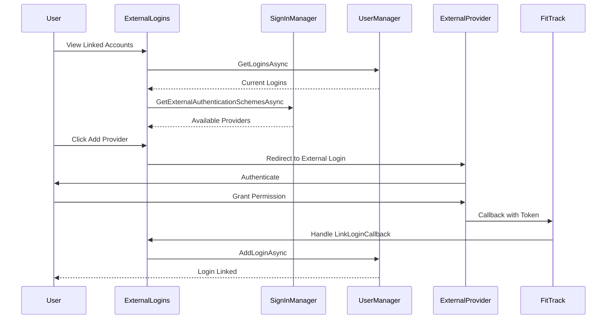
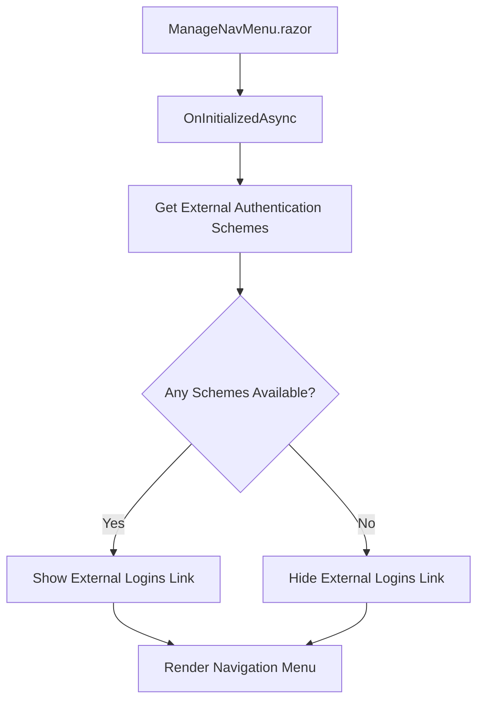

# Profile & Account Management

<cite>
**Referenced Files in This Document**   
- [Index.razor](file://FitTrack/Components/Account/Pages/Manage/Index.razor)
- [Email.razor](file://FitTrack/Components/Account/Pages/Manage/Email.razor)
- [ChangePassword.razor](file://FitTrack/Components/Account/Pages/Manage/ChangePassword.razor)
- [TwoFactorAuthentication.razor](file://FitTrack/Components/Account/Pages/Manage/TwoFactorAuthentication.razor)
- [PersonalData.razor](file://FitTrack/Components/Account/Pages/Manage/PersonalData.razor)
- [ExternalLogins.razor](file://FitTrack/Components/Account/Pages/Manage/ExternalLogins.razor)
- [ManageNavMenu.razor](file://FitTrack/Components/Account/Shared/ManageNavMenu.razor)
- [StatusMessage.razor](file://FitTrack/Components/Account/Shared/StatusMessage.razor)
- [IdentityRedirectManager.cs](file://FitTrack/Components/Account/IdentityRedirectManager.cs)
- [ApplicationUser.cs](file://FitTrack/Data/ApplicationUser.cs)
- [EnableAuthenticator.razor](file://FitTrack/Components/Account/Pages/Manage/EnableAuthenticator.razor)
- [GenerateRecoveryCodes.razor](file://FitTrack/Components/Account/Pages/Manage/GenerateRecoveryCodes.razor)
- [DeletePersonalData.razor](file://FitTrack/Components/Account/Pages/Manage/DeletePersonalData.razor)
- [ManageLayout.razor](file://FitTrack/Components/Account/Shared/ManageLayout.razor)
- [IdentityUserAccessor.cs](file://FitTrack/Components/Account/IdentityUserAccessor.cs)
</cite>

## Table of Contents
1. [Introduction](#introduction)
2. [Modular Structure of the Manage Section](#modular-structure-of-the-manage-section)
3. [Index.razor: Dashboard and Navigation Hub](#indexrazor-dashboard-and-navigation-hub)
4. [Email Management with Confirmation Workflow](#email-management-with-confirmation-workflow)
5. [Password Update with Policy Enforcement](#password-update-with-policy-enforcement)
6. [Two-Factor Authentication Management](#two-factor-authentication-management)
7. [Personal Data Management for GDPR Compliance](#personal-data-management-for-gdpr-compliance)
8. [External Logins Integration](#external-logins-integration)
9. [Core Components and Utilities](#core-components-and-utilities)
10. [Extending the Profile Management Interface](#extending-the-profile-management-interface)

## Introduction
The profile and account management system in FitTrack provides a comprehensive interface for users to manage their identity, security settings, and personal data. Built on ASP.NET Core Identity with Blazor components, the system offers a modular, secure, and user-friendly experience for managing account settings. This documentation details the architecture, implementation, and functionality of the account management features, focusing on the modular design, security workflows, and integration points that enable robust user identity management.

## Modular Structure of the Manage Section
The Manage section in FitTrack follows a modular design pattern, with each Razor component handling a specific aspect of user identity management. This separation of concerns enhances maintainability, improves user experience through focused interfaces, and enables independent development and testing of each functionality area.

The modular pages include:
- **Email.razor**: Handles email address management and verification
- **ChangePassword.razor**: Manages password updates with policy enforcement
- **TwoFactorAuthentication.razor**: Controls 2FA setup, status, and recovery options
- **ExternalLogins.razor**: Manages integration with external identity providers
- **PersonalData.razor**: Provides GDPR-compliant personal data management
- **Index.razor**: Serves as the profile dashboard and primary navigation point

This modular approach allows for clear responsibility boundaries, where each component focuses on a single aspect of account management, reducing complexity and improving code organization.

**Section sources**
- [Email.razor](file://FitTrack/Components/Account/Pages/Manage/Email.razor#L1-L124)
- [ChangePassword.razor](file://FitTrack/Components/Account/Pages/Manage/ChangePassword.razor#L1-L97)
- [TwoFactorAuthentication.razor](file://FitTrack/Components/Account/Pages/Manage/TwoFactorAuthentication.razor#L1-L102)
- [ExternalLogins.razor](file://FitTrack/Components/Account/Pages/Manage/ExternalLogins.razor#L1-L141)
- [PersonalData.razor](file://FitTrack/Components/Account/Pages/Manage/PersonalData.razor#L1-L36)
- [Index.razor](file://FitTrack/Components/Account/Pages/Manage/Index.razor#L1-L78)

## Index.razor: Dashboard and Navigation Hub
The Index.razor component serves as the central dashboard for the account management system, providing both profile information and navigation to specialized management pages. It implements the primary user interface for viewing and editing basic profile information while acting as the entry point to more advanced account settings.

Key features of Index.razor include:
- Display of immutable username information
- Editable phone number field with validation
- Integration with the StatusMessage component for user feedback
- Form submission handling with proper validation and error handling
- Secure state management through HttpContext and UserManager injection

The component follows the standard Blazor form pattern with EditForm, DataAnnotationsValidator, and InputText components, ensuring consistent validation and user experience. Upon successful submission, it updates the user's phone number through UserManager.SetPhoneNumberAsync and refreshes the authentication state.



**Diagram sources**
- [Index.razor](file://FitTrack/Components/Account/Pages/Manage/Index.razor#L36-L78)

**Section sources**
- [Index.razor](file://FitTrack/Components/Account/Pages/Manage/Index.razor#L1-L78)
- [StatusMessage.razor](file://FitTrack/Components/Account/Shared/StatusMessage.razor#L1-L30)

## Email Management with Confirmation Workflow
The Email.razor component implements a secure email change workflow that requires confirmation through a verification link. This process prevents unauthorized email changes and ensures that users have access to the new email address before it becomes active.

The email change workflow follows these steps:
1. User enters a new email address in the change email form
2. System generates a change email token using UserManager.GenerateChangeEmailTokenAsync
3. Token is encoded and included in a callback URL for email confirmation
4. Verification link is sent to the new email address via EmailSender
5. User clicks the link, which directs them to ConfirmEmailChange with the token
6. System validates the token and updates the user's email address

The component also handles email verification for unconfirmed accounts, allowing users to resend verification emails if needed. The interface clearly indicates email confirmation status with visual indicators (checkmark for confirmed emails).



**Diagram sources**
- [Email.razor](file://FitTrack/Components/Account/Pages/Manage/Email.razor#L56-L124)

**Section sources**
- [Email.razor](file://FitTrack/Components/Account/Pages/Manage/Email.razor#L1-L124)
- [IdentityUserAccessor.cs](file://FitTrack/Components/Account/IdentityUserAccessor.cs#L10-L22)

## Password Update with Policy Enforcement
The ChangePassword.razor component handles password updates with comprehensive policy enforcement and validation. It ensures that password changes adhere to security requirements while providing clear feedback to users.

Key aspects of the password update implementation:
- Three-field form requiring current password, new password, and confirmation
- Integration with ASP.NET Core Identity password policies
- Client-side validation using DataAnnotations
- Server-side validation and error handling through UserManager
- Secure password change process that maintains authentication state
- Conditional navigation based on password status (redirects to SetPassword if no password exists)

The component uses UserManager.ChangePasswordAsync to perform the actual password change, which automatically enforces configured password policies (length, complexity, etc.). Upon successful change, it refreshes the sign-in state to maintain the user's session and logs the successful password change.



**Diagram sources**
- [ChangePassword.razor](file://FitTrack/Components/Account/Pages/Manage/ChangePassword.razor#L42-L97)

**Section sources**
- [ChangePassword.razor](file://FitTrack/Components/Account/Pages/Manage/ChangePassword.razor#L1-L97)
- [IdentityRedirectManager.cs](file://FitTrack/Components/Account/IdentityRedirectManager.cs#L18-L59)

## Two-Factor Authentication Management
The TwoFactorAuthentication.razor component provides a comprehensive interface for managing two-factor authentication settings. It displays the current 2FA status, recovery code availability, and browser recognition state, while providing navigation to related functionality.

Key features include:
- Status display for 2FA enabled state
- Recovery code count monitoring with warning thresholds
- Browser recognition management ("forget this browser")
- Navigation to 2FA setup, disable, and recovery code generation
- Privacy policy check before enabling 2FA

The component integrates with several related pages:
- **EnableAuthenticator.razor**: Sets up authenticator app integration
- **Disable2fa.razor**: Disables 2FA for the account
- **GenerateRecoveryCodes.razor**: Generates new recovery codes
- **ResetAuthenticator.razor**: Resets the authenticator key

The recovery code system provides a safety net for users who lose access to their authenticator device, with visual warnings when code counts are low.



**Diagram sources**
- [TwoFactorAuthentication.razor](file://FitTrack/Components/Account/Pages/Manage/TwoFactorAuthentication.razor#L73-L102)
- [EnableAuthenticator.razor](file://FitTrack/Components/Account/Pages/Manage/EnableAuthenticator.razor#L69-L174)

**Section sources**
- [TwoFactorAuthentication.razor](file://FitTrack/Components/Account/Pages/Manage/TwoFactorAuthentication.razor#L1-L102)
- [EnableAuthenticator.razor](file://FitTrack/Components/Account/Pages/Manage/EnableAuthenticator.razor#L1-L174)
- [GenerateRecoveryCodes.razor](file://FitTrack/Components/Account/Pages/Manage/GenerateRecoveryCodes.razor#L41-L69)

## Personal Data Management for GDPR Compliance
The PersonalData.razor component implements GDPR-compliant personal data management functionality, allowing users to download or delete their personal information. This feature addresses data privacy regulations by giving users control over their data.

The component provides:
- Information about the personal data stored in the account
- Download functionality to export all personal data
- Permanent account deletion with appropriate warnings
- Required password confirmation for deletion when applicable

The DeletePersonalData.razor page handles the actual deletion process, requiring password verification when the user has a password set. This adds an additional security layer to prevent accidental account deletion.



**Diagram sources**
- [PersonalData.razor](file://FitTrack/Components/Account/Pages/Manage/PersonalData.razor#L26-L36)
- [DeletePersonalData.razor](file://FitTrack/Components/Account/Pages/Manage/DeletePersonalData.razor#L41-L87)

**Section sources**
- [PersonalData.razor](file://FitTrack/Components/Account/Pages/Manage/PersonalData.razor#L1-L36)
- [DeletePersonalData.razor](file://FitTrack/Components/Account/Pages/Manage/DeletePersonalData.razor#L1-L87)

## External Logins Integration
The ExternalLogins.razor component manages integration with external identity providers, allowing users to link multiple authentication methods to their account. This feature enhances user convenience by enabling login through existing accounts (e.g., Google, Facebook).

Key functionality includes:
- Display of currently linked external logins
- Removal of linked external accounts
- Addition of new external login providers
- Security checks to prevent account isolation
- Callback handling for external login linking

The component implements safety checks to ensure users cannot remove all authentication methods. The showRemoveButton logic prevents removal when it would leave the account with no login options (no password and only one external login).



**Diagram sources**
- [ExternalLogins.razor](file://FitTrack/Components/Account/Pages/Manage/ExternalLogins.razor#L66-L141)

**Section sources**
- [ExternalLogins.razor](file://FitTrack/Components/Account/Pages/Manage/ExternalLogins.razor#L1-L141)

## Core Components and Utilities
The account management system relies on several core components and utilities that provide essential functionality across all management pages.

### ManageNavMenu.razor
The navigation menu component dynamically displays management options based on user capabilities. It conditionally shows the External Logins option only when external authentication schemes are available, maintaining a clean interface.



### StatusMessage Component
The StatusMessage component provides user feedback by displaying success or error messages stored in a cookie. It automatically determines message type based on content and clears the cookie after display.

### IdentityRedirectManager
This utility class handles secure navigation with status messages, preventing open redirect vulnerabilities. It uses a short-lived cookie to pass status messages between requests.

### IdentityUserAccessor
Provides safe access to the current user, redirecting to an error page if the user cannot be loaded, ensuring consistent error handling across components.

**Section sources**
- [ManageNavMenu.razor](file://FitTrack/Components/Account/Shared/ManageNavMenu.razor#L30-L38)
- [StatusMessage.razor](file://FitTrack/Components/Account/Shared/StatusMessage.razor#L9-L30)
- [IdentityRedirectManager.cs](file://FitTrack/Components/Account/IdentityRedirectManager.cs#L6-L59)
- [IdentityUserAccessor.cs](file://FitTrack/Components/Account/IdentityUserAccessor.cs#L10-L22)
- [ManageLayout.razor](file://FitTrack/Components/Account/Shared/ManageLayout.razor#L1-L17)

## Extending the Profile Management Interface
The profile management system can be extended to support additional profile fields and custom functionality. The ApplicationUser class serves as the foundation for profile data extension.

To add custom profile fields:
1. Extend the ApplicationUser class with new properties
2. Update the database schema through migrations
3. Modify the Index.razor form to include new fields
4. Update the InputModel and form handling logic
5. Ensure data consistency across related entities

For example, adding a profile picture URL:

```csharp
public class ApplicationUser : IdentityUser
{
    public string? ProfilePictureUrl { get; set; }
    public DateTime DateOfBirth { get; set; }
    public string? FirstName { get; set; }
    public string? LastName { get; set; }
}
```

Then update Index.razor to include these fields in the form, ensuring proper validation and persistence through the UserManager API. This extensibility allows the profile system to evolve with application requirements while maintaining the security and reliability of the underlying Identity framework.

**Section sources**
- [ApplicationUser.cs](file://FitTrack/Data/ApplicationUser.cs#L7-L10)
- [Index.razor](file://FitTrack/Components/Account/Pages/Manage/Index.razor#L19-L32)