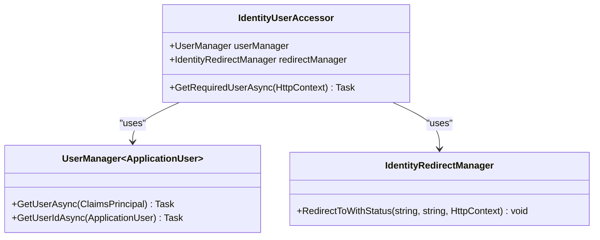
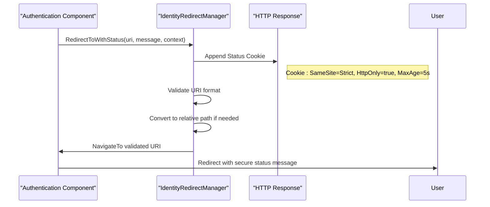
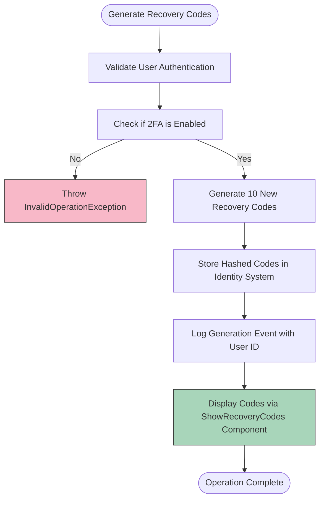
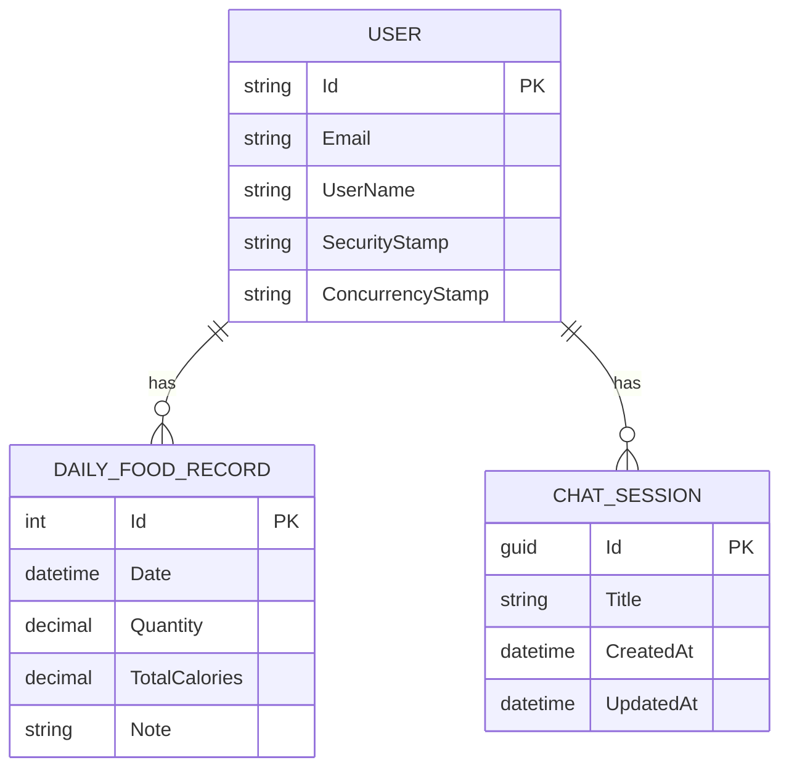
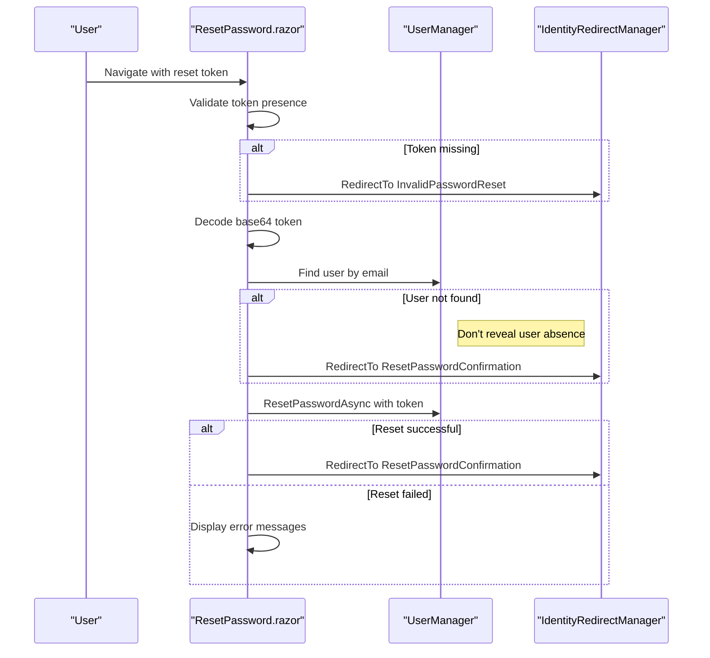
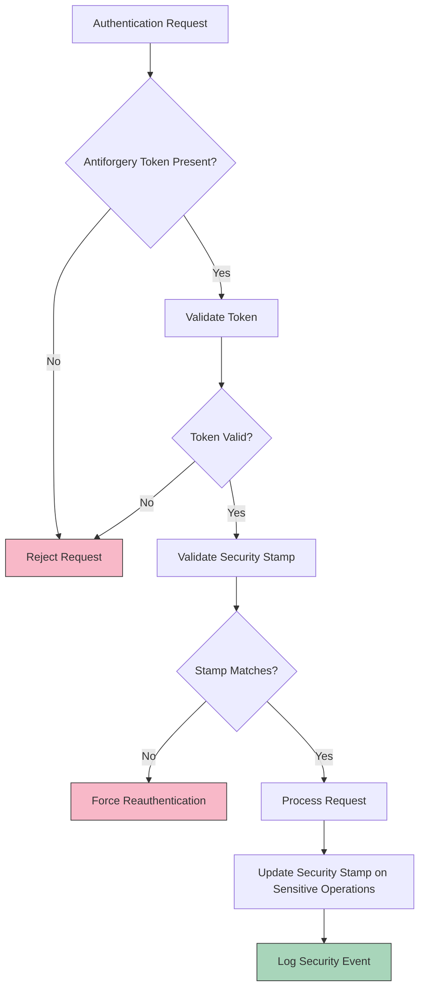
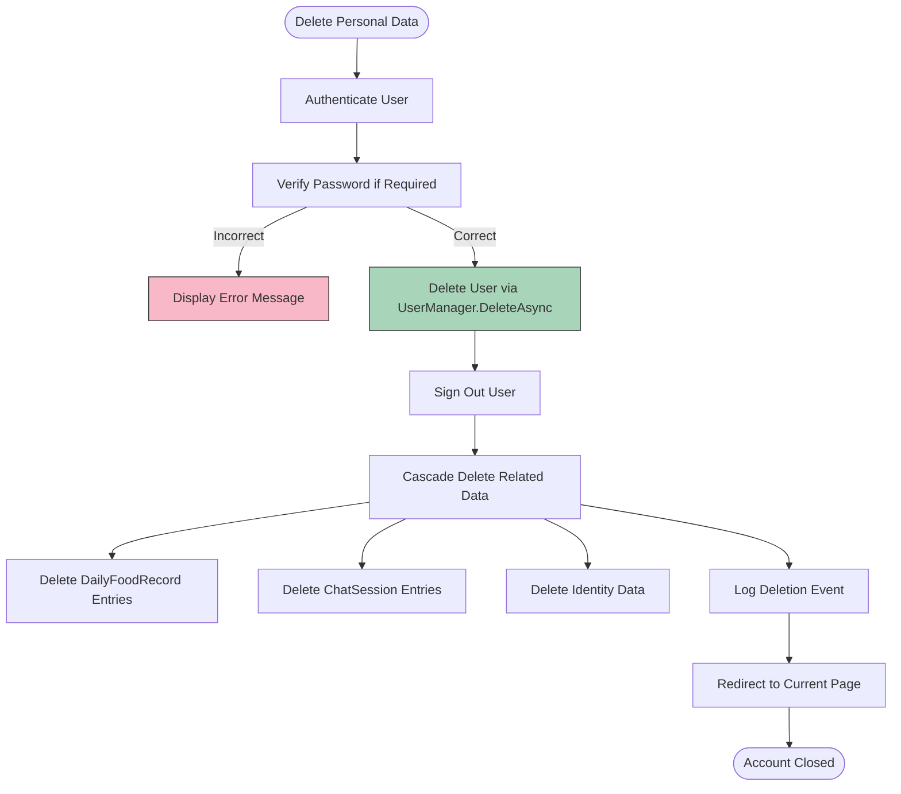

# Security & Compliance Features

<cite>
**Referenced Files in This Document**   
- [IdentityUserAccessor.cs](file://FitTrack/FitTrack/Components/Account/IdentityUserAccessor.cs)
- [IdentityRedirectManager.cs](file://FitTrack/FitTrack/Components/Account/IdentityRedirectManager.cs)
- [GenerateRecoveryCodes.razor](file://FitTrack/FitTrack/Components/Account/Pages/Manage/GenerateRecoveryCodes.razor)
- [DeletePersonalData.razor](file://FitTrack/FitTrack/Components/Account/Pages/Manage/DeletePersonalData.razor)
- [PersonalData.razor](file://FitTrack/FitTrack/Components/Account/Pages/Manage/PersonalData.razor)
- [ResetPassword.razor](file://FitTrack/FitTrack/Components/Account/Pages/ResetPassword.razor)
- [ApplicationUser.cs](file://FitTrack/FitTrack/Data/ApplicationUser.cs)
- [DailyFoodRecord.cs](file://FitTrack/FitTrack/Data/DailyFoodRecord.cs)
- [ApplicationDbContext.cs](file://FitTrack/FitTrack/Data/ApplicationDbContext.cs)
- [IdentityComponentsEndpointRouteBuilderExtensions.cs](file://FitTrack/FitTrack/Components/Account/IdentityComponentsEndpointRouteBuilderExtensions.cs)
- [StatusMessage.razor](file://FitTrack/FitTrack/Components/Account/Shared/StatusMessage.razor)
- [Program.cs](file://FitTrack/FitTrack/Program.cs)
- [ChatSession.cs](file://FitTrack/FitTrack.Copilot/Data/ChatSession.cs)
</cite>

## Table of Contents
1. [Introduction](#introduction)
2. [User Access and Dependency Injection](#user-access-and-dependency-injection)
3. [Secure Redirection and Status Messaging](#secure-redirection-and-status-messaging)
4. [Two-Factor Authentication Recovery](#two-factor-authentication-recovery)
5. [Personal Data Management and GDPR Compliance](#personal-data-management-and-gdpr-compliance)
6. [Password Reset Security](#password-reset-security)
7. [Authentication Endpoint Protection](#authentication-endpoint-protection)
8. [Data Deletion and Related Entity Impact](#data-deletion-and-related-entity-impact)
9. [Security Auditing and Monitoring](#security-auditing-and-monitoring)
10. [Conclusion](#conclusion)

## Introduction
This document details the security and compliance features implemented in FitTrack's authentication system. The analysis covers secure user access patterns, anti-open redirect protections, two-factor authentication recovery mechanisms, GDPR compliance features including data export and deletion, password reset security, and protection against common web vulnerabilities. The system leverages ASP.NET Core Identity with Blazor Server components to provide a robust security framework that protects user data and ensures regulatory compliance.

## User Access and Dependency Injection
The IdentityUserAccessor class provides a secure mechanism for retrieving the current user from HttpContext while integrating seamlessly with dependency injection. This service is registered in the DI container and can be injected into any component that requires access to the authenticated user.



**Diagram sources**
- [IdentityUserAccessor.cs](file://FitTrack/FitTrack/Components/Account/IdentityUserAccessor.cs#L6-L22)
- [IdentityRedirectManager.cs](file://FitTrack/FitTrack/Components/Account/IdentityRedirectManager.cs#L6-L59)

**Section sources**
- [IdentityUserAccessor.cs](file://FitTrack/FitTrack/Components/Account/IdentityUserAccessor.cs#L6-L22)
- [Program.cs](file://FitTrack/FitTrack/Program.cs#L33-L36)

## Secure Redirection and Status Messaging
The IdentityRedirectManager implements comprehensive security measures for redirection operations, including anti-open redirect protections and secure status messaging through HTTP-only cookies with SameSite enforcement.



**Diagram sources**
- [IdentityRedirectManager.cs](file://FitTrack/FitTrack/Components/Account/IdentityRedirectManager.cs#L6-L59)
- [StatusMessage.razor](file://FitTrack/FitTrack/Components/Account/Shared/StatusMessage.razor#L1-L30)

**Section sources**
- [IdentityRedirectManager.cs](file://FitTrack/FitTrack/Components/Account/IdentityRedirectManager.cs#L6-L59)
- [StatusMessage.razor](file://FitTrack/FitTrack/Components/Account/Shared/StatusMessage.razor#L1-L30)

## Two-Factor Authentication Recovery
The two-factor recovery code system provides users with backup access methods while maintaining security through proper validation and audit logging. The GenerateRecoveryCodes.razor component ensures that recovery codes are only generated for users with 2FA enabled.



**Diagram sources**
- [GenerateRecoveryCodes.razor](file://FitTrack/FitTrack/Components/Account/Pages/Manage/GenerateRecoveryCodes.razor#L1-L69)
- [IdentityUserAccessor.cs](file://FitTrack/FitTrack/Components/Account/IdentityUserAccessor.cs#L6-L22)

**Section sources**
- [GenerateRecoveryCodes.razor](file://FitTrack/FitTrack/Components/Account/Pages/Manage/GenerateRecoveryCodes.razor#L1-L69)

## Personal Data Management and GDPR Compliance
FitTrack implements comprehensive GDPR compliance features through the PersonalData.razor component, which enables users to exercise their right to data portability and right to be forgotten. The system provides both data export and deletion capabilities in accordance with privacy regulations.



**Diagram sources**
- [PersonalData.razor](file://FitTrack/FitTrack/Components/Account/Pages/Manage/PersonalData.razor#L1-L36)
- [IdentityComponentsEndpointRouteBuilderExtensions.cs](file://FitTrack/FitTrack/Components/Account/IdentityComponentsEndpointRouteBuilderExtensions.cs#L77-L115)
- [ApplicationDbContext.cs](file://FitTrack/FitTrack/Data/ApplicationDbContext.cs#L6-L17)
- [ChatSession.cs](file://FitTrack/FitTrack.Copilot/Data/ChatSession.cs)

**Section sources**
- [PersonalData.razor](file://FitTrack/FitTrack/Components/Account/Pages/Manage/PersonalData.razor#L1-L36)
- [IdentityComponentsEndpointRouteBuilderExtensions.cs](file://FitTrack/FitTrack/Components/Account/IdentityComponentsEndpointRouteBuilderExtensions.cs#L77-L115)

## Password Reset Security
The password reset functionality incorporates multiple security measures including token expiration, automatic invalidation after use, and proper error handling that prevents information disclosure about user existence.



**Diagram sources**
- [ResetPassword.razor](file://FitTrack/FitTrack/Components/Account/Pages/ResetPassword.razor#L49-L90)
- [InvalidPasswordReset.razor](file://FitTrack/FitTrack/Components/Account/Pages/InvalidPasswordReset.razor#L1-L8)

**Section sources**
- [ResetPassword.razor](file://FitTrack/FitTrack/Components/Account/Pages/ResetPassword.razor#L49-L90)

## Authentication Endpoint Protection
FitTrack employs multiple layers of protection for authentication endpoints, including antiforgery tokens, security stamp validation, and protection against common web vulnerabilities such as XSS and session fixation.



**Diagram sources**
- [Program.cs](file://FitTrack/FitTrack/Program.cs#L67)
- [IdentityRevalidatingAuthenticationStateProvider.cs](file://FitTrack/FitTrack/Components/Account/IdentityRevalidatingAuthenticationStateProvider.cs#L1-L48)
- [GenerateRecoveryCodes.razor](file://FitTrack/FitTrack/Components/Account/Pages/Manage/GenerateRecoveryCodes.razor#L35)

**Section sources**
- [Program.cs](file://FitTrack/FitTrack/Program.cs#L67)
- [IdentityRevalidatingAuthenticationStateProvider.cs](file://FitTrack/FitTrack/Components/Account/IdentityRevalidatingAuthenticationStateProvider.cs#L1-L48)

## Data Deletion and Related Entity Impact
The personal data deletion workflow implements the right to be forgotten by permanently removing user accounts and associated data. The system ensures referential integrity while respecting privacy requirements.



**Diagram sources**
- [DeletePersonalData.razor](file://FitTrack/FitTrack/Components/Account/Pages/Manage/DeletePersonalData.razor#L1-L87)
- [ApplicationDbContext.cs](file://FitTrack/FitTrack/Data/ApplicationDbContext.cs#L6-L17)
- [DailyFoodRecord.cs](file://FitTrack/FitTrack/Data/DailyFoodRecord.cs#L6-L29)
- [ChatSession.cs](file://FitTrack/FitTrack.Copilot/Data/ChatSession.cs)

**Section sources**
- [DeletePersonalData.razor](file://FitTrack/FitTrack/Components/Account/Pages/Manage/DeletePersonalData.razor#L1-L87)
- [ApplicationDbContext.cs](file://FitTrack/FitTrack/Data/ApplicationDbContext.cs#L6-L17)

## Security Auditing and Monitoring
FitTrack implements comprehensive security auditing through structured logging of authentication events, which enables monitoring for suspicious activity and compliance reporting.

```mermaid
classDiagram
class ILogger~T~ {
+LogInformation(string, params object[])
+LogWarning(string, params object[])
+LogError(string, params object[])
}
class GenerateRecoveryCodes {
+Logger : ILogger~GenerateRecoveryCodes~
+OnSubmitAsync()
}
class DeletePersonalData {
+Logger : ILogger~DeletePersonalData~
+OnValidSubmitAsync()
}
class IdentityComponentsEndpointRouteBuilderExtensions {
+downloadLogger : ILogger
+MapPost("/DownloadPersonalData")
}
GenerateRecoveryCodes --> ILogger~T~ : "injects"
DeletePersonalData --> ILogger~T~ : "injects"
IdentityComponentsEndpointRouteBuilderExtensions --> ILogger~T~ : "creates"
note right of GenerateRecoveryCodes
Logs : "User with ID '{UserId}' has generated new 2FA recovery codes."
end
note right of DeletePersonalData
Logs : "User with ID '{UserId}' deleted themselves."
end
note right of IdentityComponentsEndpointRouteBuilderExtensions
Logs : "User with ID '{UserId}' asked for their personal data."
end
```

**Diagram sources**
- [GenerateRecoveryCodes.razor](file://FitTrack/FitTrack/Components/Account/Pages/Manage/GenerateRecoveryCodes.razor#L9)
- [DeletePersonalData.razor](file://FitTrack/FitTrack/Components/Account/Pages/Manage/DeletePersonalData.razor#L11)
- [IdentityComponentsEndpointRouteBuilderExtensions.cs](file://FitTrack/FitTrack/Components/Account/IdentityComponentsEndpointRouteBuilderExtensions.cs#L75-L90)

**Section sources**
- [GenerateRecoveryCodes.razor](file://FitTrack/FitTrack/Components/Account/Pages/Manage/GenerateRecoveryCodes.razor#L9)
- [DeletePersonalData.razor](file://FitTrack/FitTrack/Components/Account/Pages/Manage/DeletePersonalData.razor#L11)
- [IdentityComponentsEndpointRouteBuilderExtensions.cs](file://FitTrack/FitTrack/Components/Account/IdentityComponentsEndpointRouteBuilderExtensions.cs#L75-L90)

## Conclusion
FitTrack's authentication system implements a comprehensive security and compliance framework that addresses modern web application requirements. The system provides secure user access through properly implemented dependency injection, protects against open redirect attacks, and implements secure status messaging with HTTP-only cookies. Two-factor authentication recovery is handled securely with proper validation and audit logging. GDPR compliance is achieved through robust data export and deletion workflows that respect user privacy rights. Password reset functionality incorporates token expiration and prevents information disclosure. Authentication endpoints are protected against CSRF, XSS, and session fixation attacks through antiforgery tokens and security stamp validation. The system also implements comprehensive auditing capabilities that enable monitoring for suspicious activity and support compliance reporting. These security measures work together to create a robust authentication system that protects user data and ensures regulatory compliance.