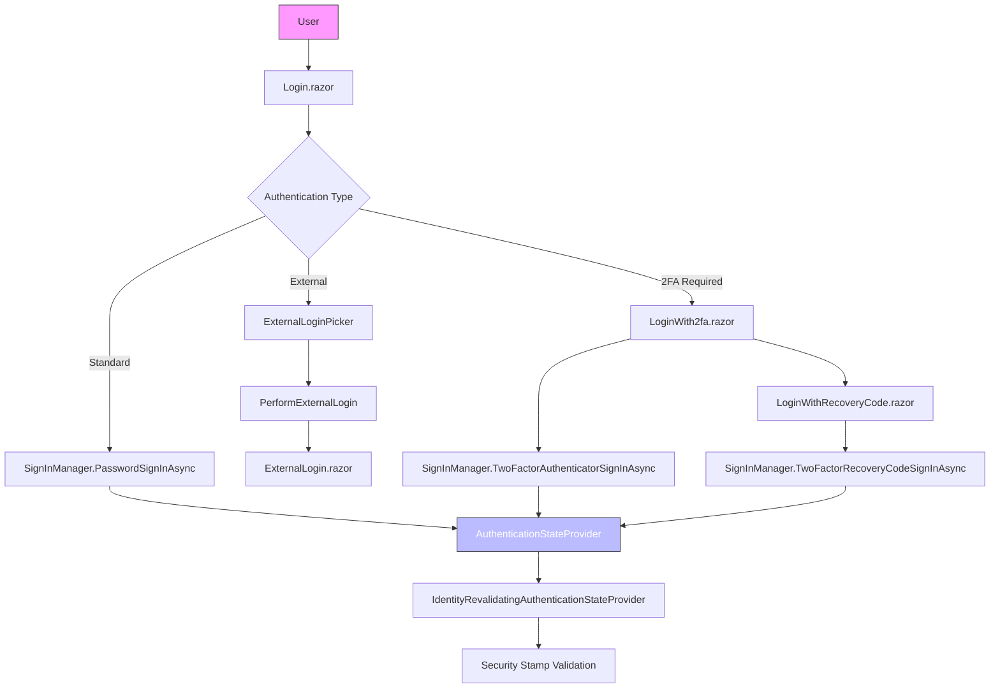
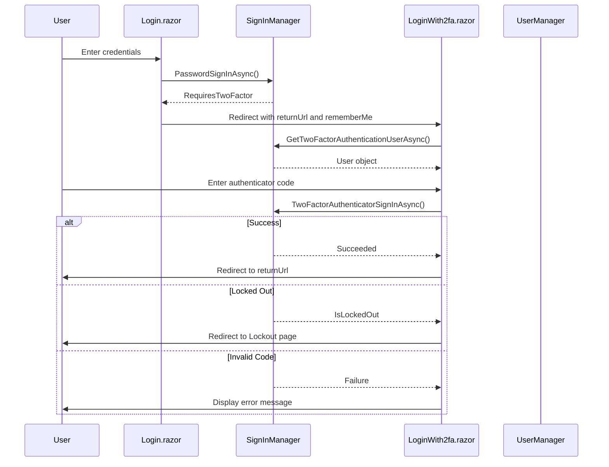
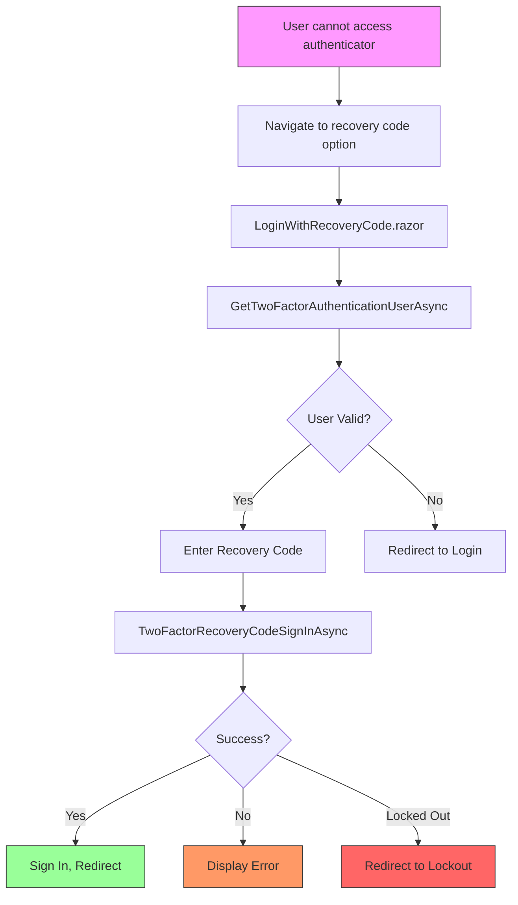
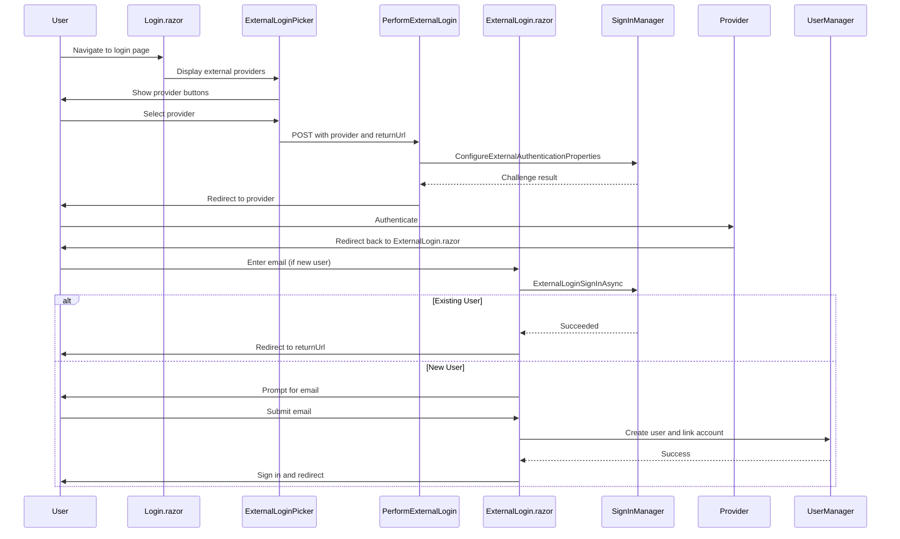
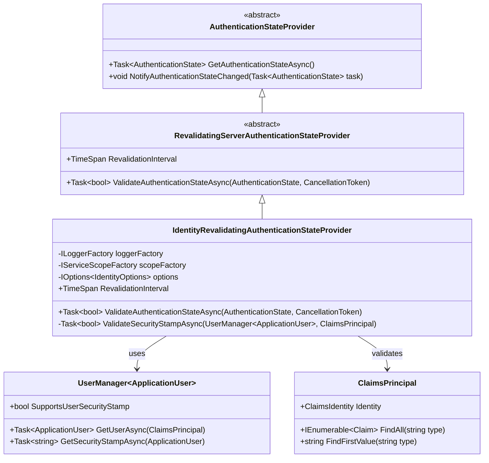

# User Login & Authentication Flow

<cite>
**Referenced Files in This Document**   
- [Login.razor](file://FitTrack/FitTrack/Components/Account/Pages/Login.razor)
- [LoginWith2fa.razor](file://FitTrack/FitTrack/Components/Account/Pages/LoginWith2fa.razor)
- [LoginWithRecoveryCode.razor](file://FitTrack/FitTrack/Components/Account/Pages/LoginWithRecoveryCode.razor)
- [IdentityRevalidatingAuthenticationStateProvider.cs](file://FitTrack/FitTrack/Components/Account/IdentityRevalidatingAuthenticationStateProvider.cs)
- [ExternalLoginPicker.razor](file://FitTrack/FitTrack/Components/Account/Shared/ExternalLoginPicker.razor)
- [IdentityComponentsEndpointRouteBuilderExtensions.cs](file://FitTrack/FitTrack/Components/Account/IdentityComponentsEndpointRouteBuilderExtensions.cs)
- [IdentityRedirectManager.cs](file://FitTrack/FitTrack/Components/Account/IdentityRedirectManager.cs)
- [ExternalLogin.razor](file://FitTrack/FitTrack/Components/Account/ExternalLogin.razor)
- [Program.cs](file://FitTrack/FitTrack/Program.cs)
- [appsettings.json](file://FitTrack/FitTrack/appsettings.json)
- [ApplicationUser.cs](file://FitTrack/FitTrack/Data/ApplicationUser.cs)
- [IdentityUserAccessor.cs](file://FitTrack/FitTrack/Components/Account/IdentityUserAccessor.cs)
</cite>

## Table of Contents
1. [Introduction](#introduction)
2. [Authentication Architecture Overview](#authentication-architecture-overview)
3. [Standard Password Login Flow](#standard-password-login-flow)
4. [Two-Factor Authentication (2FA) Process](#two-factor-authentication-2fa-process)
5. [Recovery Code Authentication](#recovery-code-authentication)
6. [External Authentication Providers](#external-authentication-providers)
7. [User State Management in Blazor Server](#user-state-management-in-blazor-server)
8. [Security Configuration and Policies](#security-configuration-and-policies)
9. [Common Issues and Troubleshooting](#common-issues-and-troubleshooting)
10. [Conclusion](#conclusion)

## Introduction
The FitTrack application implements a comprehensive authentication system that supports multiple login methods, including standard password authentication, two-factor authentication (2FA), recovery codes, and external identity providers. This document details the complete login and authentication flow, focusing on the implementation of secure authentication practices within the Blazor Server framework. The system leverages ASP.NET Core Identity for user management and authentication, with custom components that extend the default behavior to meet the application's security requirements.

## Authentication Architecture Overview



**Diagram sources**
- [Login.razor](file://FitTrack/FitTrack/Components/Account/Pages/Login.razor#L88-L113)
- [LoginWith2fa.razor](file://FitTrack/FitTrack/Components/Account/Pages/LoginWith2fa.razor#L67-L87)
- [LoginWithRecoveryCode.razor](file://FitTrack/FitTrack/Components/Account/Pages/LoginWithRecoveryCode.razor#L53-L75)
- [ExternalLogin.razor](file://FitTrack/FitTrack/Components/Account/ExternalLogin.razor#L106-L120)
- [IdentityRevalidatingAuthenticationStateProvider.cs](file://FitTrack/FitTrack/Components/Account/IdentityRevalidatingAuthenticationStateProvider.cs#L20-L27)

**Section sources**
- [Login.razor](file://FitTrack/FitTrack/Components/Account/Pages/Login.razor)
- [LoginWith2fa.razor](file://FitTrack/FitTrack/Components/Account/Pages/LoginWith2fa.razor)
- [LoginWithRecoveryCode.razor](file://FitTrack/FitTrack/Components/Account/Pages/LoginWithRecoveryCode.razor)
- [ExternalLogin.razor](file://FitTrack/FitTrack/Components/Account/ExternalLogin.razor)
- [IdentityRevalidatingAuthenticationStateProvider.cs](file://FitTrack/FitTrack/Components/Account/IdentityRevalidatingAuthenticationStateProvider.cs)

## Standard Password Login Flow

The standard password login process begins with the `Login.razor` component, which provides a form for users to enter their email and password credentials. The component uses Blazor's EditForm with DataAnnotationsValidator to ensure proper validation of input fields before submission.

When the user submits the form, the `LoginUser` method in the code-behind executes `SignInManager.PasswordSignInAsync` with the provided credentials. Notably, the `lockoutOnFailure` parameter is set to `false`, which means failed password attempts do not immediately contribute to account lockout. This design choice allows the application to handle lockout logic more granularly.

The authentication result determines the next step in the flow:
- If authentication succeeds (`result.Succeeded`), the user is redirected to the return URL
- If 2FA is required (`result.RequiresTwoFactor`), the user is redirected to the 2FA verification page
- If the account is locked out (`result.IsLockedOut`), the user is redirected to the lockout page
- For other failures, an error message is displayed without revealing specific details about the failure

The login page also provides navigation links for password recovery, registration, and email confirmation resend functionality.

**Section sources**
- [Login.razor](file://FitTrack/FitTrack/Components/Account/Pages/Login.razor#L88-L113)

## Two-Factor Authentication (2FA) Process



**Diagram sources**
- [Login.razor](file://FitTrack/FitTrack/Components/Account/Pages/Login.razor#L98-L103)
- [LoginWith2fa.razor](file://FitTrack/FitTrack/Components/Account/Pages/LoginWith2fa.razor#L67-L87)

**Section sources**
- [Login.razor](file://FitTrack/FitTrack/Components/Account/Pages/Login.razor#L98-L103)
- [LoginWith2fa.razor](file://FitTrack/FitTrack/Components/Account/Pages/LoginWith2fa.razor)

The two-factor authentication process is initiated when `SignInManager.PasswordSignInAsync` returns a result indicating that 2FA is required. The user is then redirected to `LoginWith2fa.razor`, which displays a form for entering the authenticator code.

The component first verifies that the user has properly reached this stage by calling `SignInManager.GetTwoFactorAuthenticationUserAsync()`, which retrieves the user who initiated the 2FA process. This ensures that users cannot bypass the initial password authentication step.

When the user submits their authenticator code, the `OnValidSubmitAsync` method processes the request by:
1. Cleaning the input code (removing spaces and hyphens)
2. Calling `SignInManager.TwoFactorAuthenticatorSignInAsync` with the code, remember-me preference, and machine-remembering option
3. Handling the authentication result accordingly

The form includes an option to "Remember this machine," which, when selected, creates a persistent cookie that bypasses 2FA for future logins from the same device for a specified period.

**Section sources**
- [LoginWith2fa.razor](file://FitTrack/FitTrack/Components/Account/Pages/LoginWith2fa.razor)

## Recovery Code Authentication



**Diagram sources**
- [LoginWith2fa.razor](file://FitTrack/FitTrack/Components/Account/Pages/LoginWith2fa.razor#L43-L45)
- [LoginWithRecoveryCode.razor](file://FitTrack/FitTrack/Components/Account/Pages/LoginWithRecoveryCode.razor#L53-L75)

**Section sources**
- [LoginWith2fa.razor](file://FitTrack/FitTrack/Components/Account/Pages/LoginWith2fa.razor#L43-L45)
- [LoginWithRecoveryCode.razor](file://FitTrack/FitTrack/Components/Account/Pages/LoginWithRecoveryCode.razor)

The recovery code authentication flow provides an alternative method for users who cannot access their authenticator app. From the 2FA page, users can click a link to access `LoginWithRecoveryCode.razor`, which allows them to authenticate using one of their pre-generated recovery codes.

Similar to the authenticator code flow, the component first validates that the user has properly reached this stage by retrieving the 2FA authentication user. When the user submits a recovery code, the system calls `SignInManager.TwoFactorRecoveryCodeSignInAsync` to validate it.

An important security consideration is noted in the UI: when logging in with a recovery code, the session will not be remembered, and the user will be required to use their authenticator app on subsequent logins unless they explicitly choose to remember the machine during 2FA.

Recovery codes are single-use and are invalidated after use. Users are encouraged to generate new recovery codes after using the existing ones, which can be done through the account management interface.

**Section sources**
- [LoginWithRecoveryCode.razor](file://FitTrack/FitTrack/Components/Account/Pages/LoginWithRecoveryCode.razor)

## External Authentication Providers



**Diagram sources**
- [Login.razor](file://FitTrack/FitTrack/Components/Account/Pages/Login.razor#L62)
- [ExternalLoginPicker.razor](file://FitTrack/FitTrack/Components/Account/Shared/ExternalLoginPicker.razor)
- [IdentityComponentsEndpointRouteBuilderExtensions.cs](file://FitTrack/FitTrack/Components/Account/IdentityComponentsEndpointRouteBuilderExtensions.cs#L24-L43)
- [ExternalLogin.razor](file://FitTrack/FitTrack/Components/Account/ExternalLogin.razor)

**Section sources**
- [Login.razor](file://FitTrack/FitTrack/Components/Account/Pages/Login.razor#L62)
- [ExternalLoginPicker.razor](file://FitTrack/FitTrack/Components/Account/Shared/ExternalLoginPicker.razor)
- [IdentityComponentsEndpointRouteBuilderExtensions.cs](file://FitTrack/FitTrack/Components/Account/IdentityComponentsEndpointRouteBuilderExtensions.cs#L24-L43)
- [ExternalLogin.razor](file://FitTrack/FitTrack/Components/Account/ExternalLogin.razor)

The external authentication flow allows users to log in using third-party identity providers such as Google or Facebook. The `ExternalLoginPicker.razor` component displays available external providers as buttons, which when clicked, submit a form to the `/Account/PerformExternalLogin` endpoint.

The `PerformExternalLogin` endpoint, defined in `IdentityComponentsEndpointRouteBuilderExtensions.cs`, configures the external authentication properties and initiates a challenge that redirects the user to the selected provider's authentication page.

After successful authentication with the external provider, the user is redirected back to `ExternalLogin.razor` with the `LoginCallbackAction`. At this point:
- If the user already has an account linked to the external provider, they are automatically signed in
- If it's the user's first time logging in with this provider, they are prompted to enter an email address to create a new account, which is then linked to the external identity

The system uses anti-forgery tokens to prevent cross-site request forgery attacks and properly handles error scenarios by redirecting users back to the login page with appropriate status messages.

**Section sources**
- [ExternalLoginPicker.razor](file://FitTrack/FitTrack/Components/Account/Shared/ExternalLoginPicker.razor)
- [IdentityComponentsEndpointRouteBuilderExtensions.cs](file://FitTrack/FitTrack/Components/Account/IdentityComponentsEndpointRouteBuilderExtensions.cs#L24-L43)
- [ExternalLogin.razor](file://FitTrack/FitTrack/Components/Account/ExternalLogin.razor)

## User State Management in Blazor Server



**Diagram sources**
- [IdentityRevalidatingAuthenticationStateProvider.cs](file://FitTrack/FitTrack/Components/Account/IdentityRevalidatingAuthenticationStateProvider.cs)
- [Program.cs](file://FitTrack/FitTrack/Program.cs#L18)

**Section sources**
- [IdentityRevalidatingAuthenticationStateProvider.cs](file://FitTrack/FitTrack/Components/Account/IdentityRevalidatingAuthenticationStateProvider.cs)
- [Program.cs](file://FitTrack/FitTrack/Program.cs#L18)

The `IdentityRevalidatingAuthenticationStateProvider` plays a critical role in maintaining secure user state in the Blazor Server application. Unlike traditional web applications where authentication state is validated on each HTTP request, Blazor Server applications maintain a long-lived SignalR connection, which requires special consideration for security.

This custom authentication state provider inherits from `RevalidatingServerAuthenticationStateProvider` and overrides two key members:
- `RevalidationInterval`: Set to 30 minutes, determining how frequently the user's security stamp is validated
- `ValidateAuthenticationStateAsync`: Contains the logic to validate the user's authentication state

The validation process creates a new service scope to ensure fresh data access, retrieves the `UserManager<ApplicationUser>`, and then calls the private `ValidateSecurityStampAsync` method. This method compares the security stamp in the user's claims principal with the current security stamp stored in the database. If they don't match, the user is considered logged out, which helps protect against session hijacking.

The provider is registered in `Program.cs` as the implementation for `AuthenticationStateProvider`, ensuring that all authentication state requests go through this revalidating mechanism.

**Section sources**
- [IdentityRevalidatingAuthenticationStateProvider.cs](file://FitTrack/FitTrack/Components/Account/IdentityRevalidatingAuthenticationStateProvider.cs)
- [Program.cs](file://FitTrack/FitTrack/Program.cs#L18)

## Security Configuration and Policies

The authentication system in FitTrack is configured through several mechanisms in the `Program.cs` file and related components:

```csharp
builder.Services.AddAuthentication(options =>
{
    options.DefaultScheme = IdentityConstants.ApplicationScheme;
    options.DefaultSignInScheme = IdentityConstants.ExternalScheme;
})
.AddIdentityCookies();

builder.Services.AddIdentityCore<ApplicationUser>(options => options.SignIn.RequireConfirmedAccount = true)
    .AddEntityFrameworkStores<ApplicationDbContext>()
    .AddSignInManager()
    .AddDefaultTokenProviders();
```

Key configuration options include:
- **Default authentication schemes**: Set to IdentityConstants.ApplicationScheme for the default scheme and IdentityConstants.ExternalScheme for sign-in
- **Account confirmation**: Required for all accounts (RequireConfirmedAccount = true)
- **Cookie policies**: Configured through AddIdentityCookies, which sets up application, external, and two-factor cookies with appropriate security settings
- **Session duration**: Controlled by cookie authentication properties, with the revalidation interval set to 30 minutes in the custom authentication state provider

The `IdentityRedirectManager` class handles secure redirection with several important features:
- Prevents open redirect vulnerabilities by validating URI formats
- Uses strict SameSite policies for status cookies
- Implements essential, HTTP-only cookies for status messages with a short max age (5 seconds)

Lockout policies are currently not explicitly configured in the code, which means they use ASP.NET Core Identity defaults. However, the login flow is designed to support lockout functionality, as evidenced by the handling of `result.IsLockedOut` in multiple components.

**Section sources**
- [Program.cs](file://FitTrack/FitTrack/Program.cs#L20-L36)
- [IdentityRedirectManager.cs](file://FitTrack/FitTrack/Components/Account/IdentityRedirectManager.cs)

## Common Issues and Troubleshooting

### Persistent Lockouts
Persistent lockouts can occur when a user exceeds the failed login attempt threshold. The system redirects to the `Lockout.razor` page, which displays a generic message without revealing specific details about the lockout duration. To resolve this issue:
1. Verify the lockout settings in the Identity configuration
2. Check if there are any automated scripts or bots targeting the login endpoint
3. Consider implementing additional logging to identify the source of repeated failed attempts

### Expired 2FA Entries
Users may encounter issues with expired 2FA entries when their authenticator app codes are not synchronized with the server. This typically occurs when:
- The device's clock is not properly synchronized
- The user has reinstalled the authenticator app without properly transferring the account
- The user has not used 2FA for an extended period

The recommended solution is to use recovery codes to log in and then reconfigure the authenticator app through the account management interface.

### Session Timeouts in Blazor Server Context
Session timeouts in Blazor Server applications can occur due to:
- SignalR connection timeouts
- Authentication state expiration
- Server-side session cleanup

The `IdentityRevalidatingAuthenticationStateProvider` mitigates this by revalidating the security stamp every 30 minutes, but network issues or server restarts can still cause disconnections. The application should handle these scenarios gracefully by redirecting users to the login page when authentication state becomes invalid.

### External Authentication Failures
External authentication failures can occur due to:
- Misconfigured provider settings
- Network issues between the application and the external provider
- Changes in the external provider's API or authentication flow

The system handles these by capturing remote errors and displaying them as status messages, while also providing a fallback to the standard login process.

**Section sources**
- [Login.razor](file://FitTrack/FitTrack/Components/Account/Pages/Login.razor)
- [LoginWith2fa.razor](file://FitTrack/FitTrack/Components/Account/Pages/LoginWith2fa.razor)
- [ExternalLogin.razor](file://FitTrack/FitTrack/Components/Account/ExternalLogin.razor)
- [Lockout.razor](file://FitTrack/FitTrack/Components/Account/Pages/Lockout.razor)

## Conclusion
The FitTrack application implements a robust and secure authentication system that supports multiple login methods while maintaining high security standards. The architecture leverages ASP.NET Core Identity with custom Blazor components to provide a seamless user experience across different authentication scenarios.

Key strengths of the implementation include:
- Comprehensive support for multi-factor authentication with both authenticator apps and recovery codes
- Secure external authentication with proper anti-forgery protection
- Proactive user state validation through the revalidating authentication state provider
- Clear separation of concerns between different authentication components
- Proper error handling and user feedback throughout the authentication flows

The system could be further enhanced by:
- Implementing configurable lockout policies in appsettings.json
- Adding more detailed logging for authentication events
- Providing user-friendly recovery options for lost recovery codes
- Implementing adaptive authentication based on risk assessment

Overall, the authentication system in FitTrack provides a solid foundation for secure user access while maintaining usability across different authentication methods.