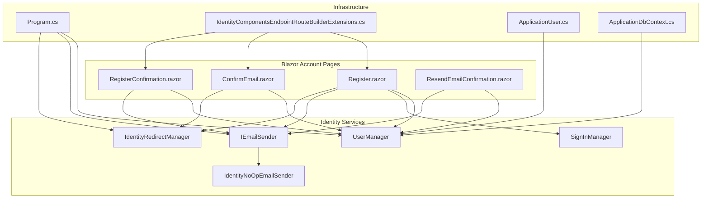
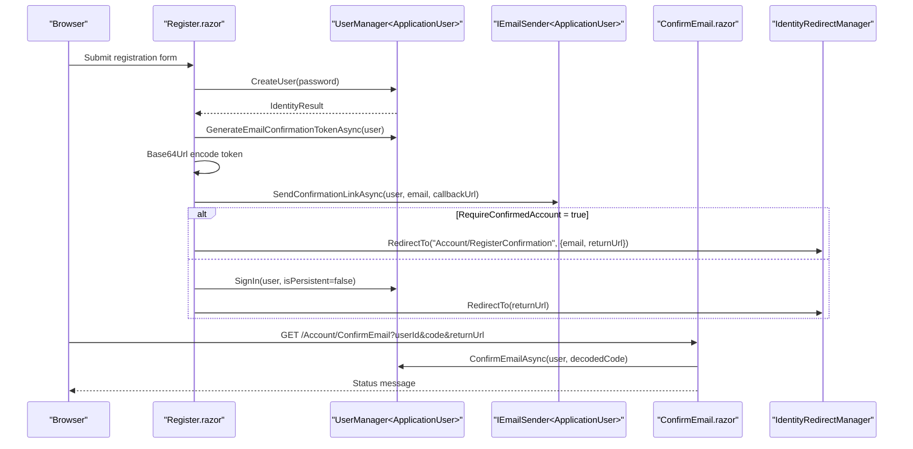
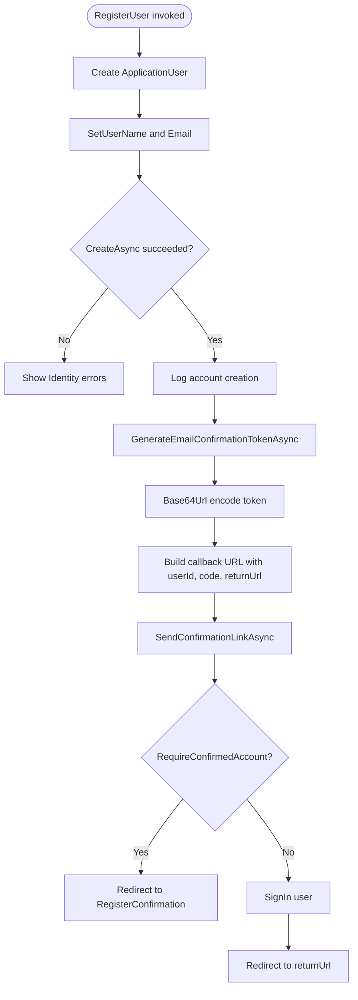
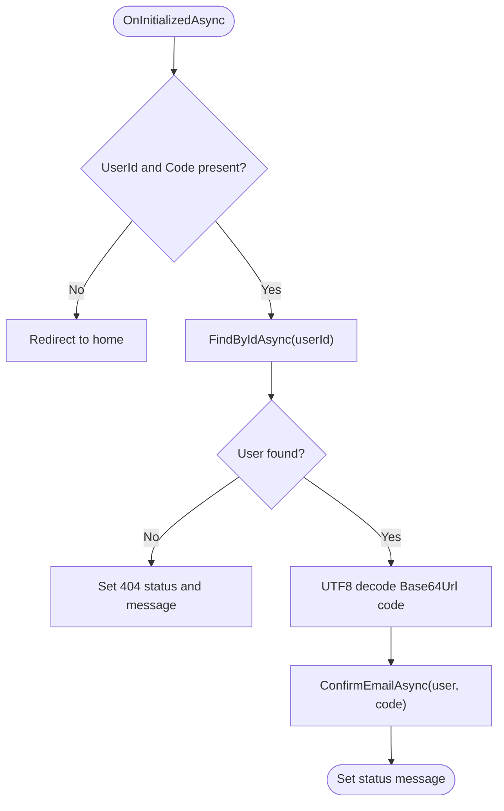
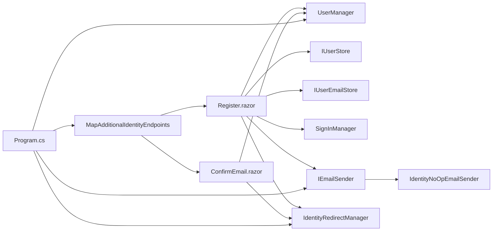

# User Registration

<cite>
**Referenced Files in This Document**
- [Register.razor](file://FitTrack/FitTrack/Components/Account/Pages/Register.razor)
- [ConfirmEmail.razor](file://FitTrack/FitTrack/Components/Account/Pages/ConfirmEmail.razor)
- [RegisterConfirmation.razor](file://FitTrack/FitTrack/Components/Account/Pages/RegisterConfirmation.razor)
- [ResendEmailConfirmation.razor](file://FitTrack/FitTrack/Components/Account/Pages/ResendEmailConfirmation.razor)
- [IdentityRedirectManager.cs](file://FitTrack/FitTrack/Components/Account/IdentityRedirectManager.cs)
- [IdentityNoOpEmailSender.cs](file://FitTrack/FitTrack/Components/Account/IdentityNoOpEmailSender.cs)
- [IdentityComponentsEndpointRouteBuilderExtensions.cs](file://FitTrack/FitTrack/Components/Account/IdentityComponentsEndpointRouteBuilderExtensions.cs)
- [Program.cs](file://FitTrack/FitTrack/Program.cs)
- [ApplicationUser.cs](file://FitTrack/FitTrack/Data/ApplicationUser.cs)
- [ApplicationDbContext.cs](file://FitTrack/FitTrack/Data/ApplicationDbContext.cs)
</cite>

## Table of Contents
1. [Introduction](#introduction)
2. [Project Structure](#project-structure)
3. [Core Components](#core-components)
4. [Architecture Overview](#architecture-overview)
5. [Detailed Component Analysis](#detailed-component-analysis)
6. [Dependency Analysis](#dependency-analysis)
7. [Performance Considerations](#performance-considerations)
8. [Troubleshooting Guide](#troubleshooting-guide)
9. [Security Considerations](#security-considerations)
10. [Customization Guide](#customization-guide)
11. [Conclusion](#conclusion)

## Introduction
This document explains the user registration process in FitTrack, focusing on the Blazor components and ASP.NET Core Identity integration. It covers how the Register.razor form captures user input, validates it, and creates accounts via Identity’s UserManager. It documents the email confirmation flow, including token generation, Base64Url encoding, link construction, and handling of confirmation callbacks in ConfirmEmail.razor. It also provides guidance on customizing registration fields by extending ApplicationUser, configuring email sender services, and managing confirmation state via IdentityRedirectManager. Finally, it includes troubleshooting tips and security considerations.

## Project Structure
The registration workflow spans several Blazor pages and Identity-related services:
- Registration form and confirmation pages
- Identity services and redirect manager
- Endpoint routing for Identity actions
- Application user model and database context

**Diagram sources**
- [Register.razor](file://FitTrack/FitTrack/Components/Account/Pages/Register.razor#L1-L147)
- [ConfirmEmail.razor](file://FitTrack/FitTrack/Components/Account/Pages/ConfirmEmail.razor#L1-L49)
- [RegisterConfirmation.razor](file://FitTrack/FitTrack/Components/Account/Pages/RegisterConfirmation.razor#L1-L69)
- [ResendEmailConfirmation.razor](file://FitTrack/FitTrack/Components/Account/Pages/ResendEmailConfirmation.razor#L1-L69)
- [IdentityRedirectManager.cs](file://FitTrack/FitTrack/Components/Account/IdentityRedirectManager.cs#L1-L59)
- [IdentityNoOpEmailSender.cs](file://FitTrack/FitTrack/Components/Account/IdentityNoOpEmailSender.cs#L1-L23)
- [IdentityComponentsEndpointRouteBuilderExtensions.cs](file://FitTrack/FitTrack/Components/Account/IdentityComponentsEndpointRouteBuilderExtensions.cs#L1-L115)
- [Program.cs](file://FitTrack/FitTrack/Program.cs#L1-L76)
- [ApplicationUser.cs](file://FitTrack/FitTrack/Data/ApplicationUser.cs#L1-L10)
- [ApplicationDbContext.cs](file://FitTrack/FitTrack/Data/ApplicationDbContext.cs#L1-L17)

**Section sources**
- [Program.cs](file://FitTrack/FitTrack/Program.cs#L1-L76)
- [IdentityComponentsEndpointRouteBuilderExtensions.cs](file://FitTrack/FitTrack/Components/Account/IdentityComponentsEndpointRouteBuilderExtensions.cs#L1-L115)

## Core Components
- Register.razor: Renders the registration form, binds input, validates with Data Annotations, and orchestrates account creation and email confirmation.
- ConfirmEmail.razor: Handles the confirmation callback, decodes the token, and confirms the user’s email.
- RegisterConfirmation.razor: Instructs users to check email and provides a development-mode link generator when using IdentityNoOpEmailSender.
- ResendEmailConfirmation.razor: Allows users to re-send the confirmation email.
- IdentityRedirectManager: Provides safe redirection helpers and status messaging via cookies.
- IdentityNoOpEmailSender: Placeholder email sender used in development; sends messages via a no-op sender.
- Program.cs: Configures Identity, sets RequireConfirmedAccount, registers services, and maps Identity endpoints.
- ApplicationUser and ApplicationDbContext: Identity user and EF Core context used by Identity.

**Section sources**
- [Register.razor](file://FitTrack/FitTrack/Components/Account/Pages/Register.razor#L1-L147)
- [ConfirmEmail.razor](file://FitTrack/FitTrack/Components/Account/Pages/ConfirmEmail.razor#L1-L49)
- [RegisterConfirmation.razor](file://FitTrack/FitTrack/Components/Account/Pages/RegisterConfirmation.razor#L1-L69)
- [ResendEmailConfirmation.razor](file://FitTrack/FitTrack/Components/Account/Pages/ResendEmailConfirmation.razor#L1-L69)
- [IdentityRedirectManager.cs](file://FitTrack/FitTrack/Components/Account/IdentityRedirectManager.cs#L1-L59)
- [IdentityNoOpEmailSender.cs](file://FitTrack/FitTrack/Components/Account/IdentityNoOpEmailSender.cs#L1-L23)
- [Program.cs](file://FitTrack/FitTrack/Program.cs#L1-L76)
- [ApplicationUser.cs](file://FitTrack/FitTrack/Data/ApplicationUser.cs#L1-L10)
- [ApplicationDbContext.cs](file://FitTrack/FitTrack/Data/ApplicationDbContext.cs#L1-L17)

## Architecture Overview
The registration flow integrates Blazor UI with ASP.NET Core Identity. The sequence below maps to actual code paths.

**Diagram sources**
- [Register.razor](file://FitTrack/FitTrack/Components/Account/Pages/Register.razor#L68-L103)
- [ConfirmEmail.razor](file://FitTrack/FitTrack/Components/Account/Pages/ConfirmEmail.razor#L28-L47)
- [IdentityRedirectManager.cs](file://FitTrack/FitTrack/Components/Account/IdentityRedirectManager.cs#L18-L59)
- [IdentityNoOpEmailSender.cs](file://FitTrack/FitTrack/Components/Account/IdentityNoOpEmailSender.cs#L1-L23)

## Detailed Component Analysis

### Registration Form: Register.razor
- Captures email, password, and confirm password.
- Uses Data Annotations for validation:
  - EmailAddress for email field
  - Required for email, password, and confirm password
  - StringLength with minimum length 6 and maximum 100 for password
  - Compare to ensure password and confirm password match
- On submit:
  - Creates an ApplicationUser instance
  - Sets UserName and Email via IUserStore/IUserEmailStore
  - Calls UserManager.CreateAsync(user, password)
  - Logs creation and retrieves user Id
  - Generates Base64Url-encoded email confirmation token
  - Builds callback URL with userId, code, and returnUrl
  - Sends confirmation link via IEmailSender
  - If RequireConfirmedAccount is true, redirects to RegisterConfirmation; otherwise signs in and redirects to returnUrl

**Diagram sources**
- [Register.razor](file://FitTrack/FitTrack/Components/Account/Pages/Register.razor#L68-L103)

**Section sources**
- [Register.razor](file://FitTrack/FitTrack/Components/Account/Pages/Register.razor#L1-L147)

### Email Confirmation: ConfirmEmail.razor
- Reads query parameters: userId, code, returnUrl
- Validates presence of userId and code
- Loads user by Id; responds 404 if not found
- Decodes the Base64Url-encoded code
- Calls UserManager.ConfirmEmailAsync(user, code)
- Displays success or error message

**Diagram sources**
- [ConfirmEmail.razor](file://FitTrack/FitTrack/Components/Account/Pages/ConfirmEmail.razor#L28-L47)

**Section sources**
- [ConfirmEmail.razor](file://FitTrack/FitTrack/Components/Account/Pages/ConfirmEmail.razor#L1-L49)

### Registration Confirmation Page: RegisterConfirmation.razor
- Displays instructions to check email
- When using IdentityNoOpEmailSender, generates a development-mode confirmation link with encoded token and userId
- Uses NavigationManager to build the callback URL and passes returnUrl

**Section sources**
- [RegisterConfirmation.razor](file://FitTrack/FitTrack/Components/Account/Pages/RegisterConfirmation.razor#L1-L69)

### Resend Confirmation: ResendEmailConfirmation.razor
- Accepts user email, finds the user
- Generates a new confirmation token and builds a callback URL
- Sends confirmation link via IEmailSender
- Shows a status message regardless of whether the user exists

**Section sources**
- [ResendEmailConfirmation.razor](file://FitTrack/FitTrack/Components/Account/Pages/ResendEmailConfirmation.razor#L1-L69)

### Identity Services and Routing
- Program.cs configures Identity with:
  - AddIdentityCore<ApplicationUser> with RequireConfirmedAccount = true
  - EntityFramework stores and default token providers
  - Registers IdentityNoOpEmailSender as IEmailSender<ApplicationUser>
  - Adds Identity endpoints via MapAdditionalIdentityEndpoints
- IdentityComponentsEndpointRouteBuilderExtensions defines endpoint groups for /Account and /Account/Manage, including external login and logout flows.

**Section sources**
- [Program.cs](file://FitTrack/FitTrack/Program.cs#L1-L76)
- [IdentityComponentsEndpointRouteBuilderExtensions.cs](file://FitTrack/FitTrack/Components/Account/IdentityComponentsEndpointRouteBuilderExtensions.cs#L1-L115)

## Dependency Analysis
- Register.razor depends on:
  - UserManager<ApplicationUser> for account creation and token generation
  - IUserStore<ApplicationUser> and IUserEmailStore<ApplicationUser> for setting username and email
  - SignInManager<ApplicationUser> for signing in after registration
  - IEmailSender<ApplicationUser> for sending confirmation emails
  - IdentityRedirectManager for safe redirects
- ConfirmEmail.razor depends on:
  - UserManager<ApplicationUser> for loading user and confirming email
  - IdentityRedirectManager for redirects
- IdentityNoOpEmailSender depends on:
  - NoOpEmailSender to deliver messages in development
- Program.cs wires:
  - Identity services and RequireConfirmedAccount
  - Identity endpoints mapping

**Diagram sources**
- [Register.razor](file://FitTrack/FitTrack/Components/Account/Pages/Register.razor#L1-L147)
- [ConfirmEmail.razor](file://FitTrack/FitTrack/Components/Account/Pages/ConfirmEmail.razor#L1-L49)
- [IdentityNoOpEmailSender.cs](file://FitTrack/FitTrack/Components/Account/IdentityNoOpEmailSender.cs#L1-L23)
- [Program.cs](file://FitTrack/FitTrack/Program.cs#L1-L76)
- [IdentityComponentsEndpointRouteBuilderExtensions.cs](file://FitTrack/FitTrack/Components/Account/IdentityComponentsEndpointRouteBuilderExtensions.cs#L1-L115)

**Section sources**
- [Register.razor](file://FitTrack/FitTrack/Components/Account/Pages/Register.razor#L1-L147)
- [ConfirmEmail.razor](file://FitTrack/FitTrack/Components/Account/Pages/ConfirmEmail.razor#L1-L49)
- [IdentityNoOpEmailSender.cs](file://FitTrack/FitTrack/Components/Account/IdentityNoOpEmailSender.cs#L1-L23)
- [Program.cs](file://FitTrack/FitTrack/Program.cs#L1-L76)
- [IdentityComponentsEndpointRouteBuilderExtensions.cs](file://FitTrack/FitTrack/Components/Account/IdentityComponentsEndpointRouteBuilderExtensions.cs#L1-L115)

## Performance Considerations
- Token generation and email sending occur synchronously during registration. In production, ensure email delivery is asynchronous to avoid blocking UI.
- Base64Url encoding adds minimal overhead; keep URLs short and avoid excessive query parameters.
- Redirects are immediate navigations; ensure returnUrl is validated to prevent open redirects.

[No sources needed since this section provides general guidance]

## Troubleshooting Guide
Common issues and resolutions:
- Failed confirmation:
  - Verify that the confirmation link includes both userId and code query parameters.
  - Ensure the code is Base64Url-encoded and not truncated.
  - Confirm the user exists and the token is still valid.
- Expired tokens:
  - Tokens are generated by Identity’s default token providers. If using a custom provider, ensure appropriate expiration is configured.
  - Ask users to resend confirmation via ResendEmailConfirmation.razor.
- Spam folder delivery:
  - IdentityNoOpEmailSender logs messages; in development, check the console output.
  - In production, configure a real IEmailSender implementation and verify sender reputation.
- Open redirects:
  - IdentityRedirectManager enforces relative URI safety; ensure returnUrl is controlled and validated.
- No email sent:
  - Confirm IEmailSender is registered. In development, IdentityNoOpEmailSender is used; switch to a real provider.

**Section sources**
- [ConfirmEmail.razor](file://FitTrack/FitTrack/Components/Account/Pages/ConfirmEmail.razor#L28-L47)
- [ResendEmailConfirmation.razor](file://FitTrack/FitTrack/Components/Account/Pages/ResendEmailConfirmation.razor#L42-L60)
- [IdentityRedirectManager.cs](file://FitTrack/FitTrack/Components/Account/IdentityRedirectManager.cs#L18-L59)
- [IdentityNoOpEmailSender.cs](file://FitTrack/FitTrack/Components/Account/IdentityNoOpEmailSender.cs#L1-L23)

## Security Considerations
- Preventing enumeration attacks:
  - Do not reveal whether a user exists during password reset or resend confirmation. The reset flow intentionally avoids exposing non-existent users.
- Secure token storage:
  - Tokens are Base64Url-encoded and passed as query parameters. Treat them as secrets; avoid logging or storing them.
- Redirect safety:
  - IdentityRedirectManager prevents open redirects by converting absolute URIs to relative ones and throwing on invalid targets.
- Email sender:
  - IdentityNoOpEmailSender is a placeholder. Replace with a production-ready IEmailSender to ensure secure and reliable delivery.

**Section sources**
- [Program.cs](file://FitTrack/FitTrack/Program.cs#L32-L39)
- [IdentityRedirectManager.cs](file://FitTrack/FitTrack/Components/Account/IdentityRedirectManager.cs#L18-L59)
- [IdentityNoOpEmailSender.cs](file://FitTrack/FitTrack/Components/Account/IdentityNoOpEmailSender.cs#L1-L23)

## Customization Guide
- Extending registration fields:
  - Add properties to ApplicationUser to capture additional profile data. Identity persists these via Entity Framework.
  - Update Register.razor to bind new fields and add validation attributes as needed.
- Configuring email sender services:
  - Replace IdentityNoOpEmailSender with a real IEmailSender implementation in Program.cs.
  - Ensure the chosen provider supports sending HTML links and templates.
- Managing confirmation state:
  - IdentityRedirectManager centralizes redirects and status messages. Use it consistently across pages to maintain UX and security.
- Database context:
  - ApplicationDbContext inherits from IdentityDbContext<ApplicationUser>. Add custom DB sets and model configurations as needed.

**Section sources**
- [ApplicationUser.cs](file://FitTrack/FitTrack/Data/ApplicationUser.cs#L1-L10)
- [ApplicationDbContext.cs](file://FitTrack/FitTrack/Data/ApplicationDbContext.cs#L1-L17)
- [Program.cs](file://FitTrack/FitTrack/Program.cs#L32-L39)
- [IdentityRedirectManager.cs](file://FitTrack/FitTrack/Components/Account/IdentityRedirectManager.cs#L18-L59)

## Conclusion
The FitTrack registration flow combines Blazor UI with ASP.NET Core Identity to securely create accounts and enforce email confirmation. Register.razor captures input, validates it, and triggers account creation and confirmation email delivery. ConfirmEmail.razor handles the callback, decoding the token and confirming the user. IdentityRedirectManager ensures safe navigation, while IdentityNoOpEmailSender serves as a development placeholder. By extending ApplicationUser and replacing the email sender, teams can tailor the registration experience to their needs while maintaining strong security practices.