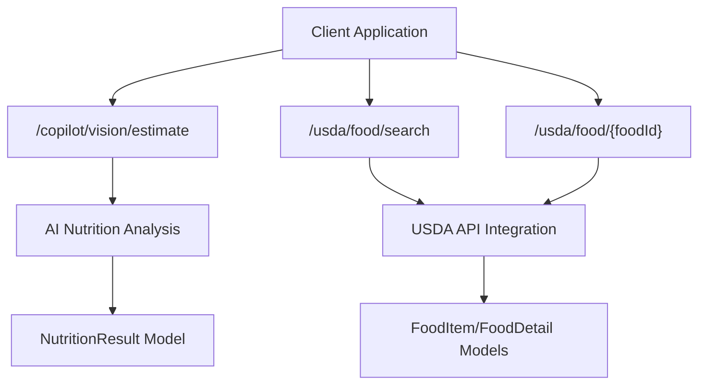
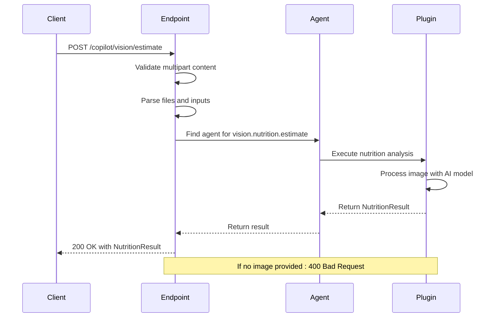
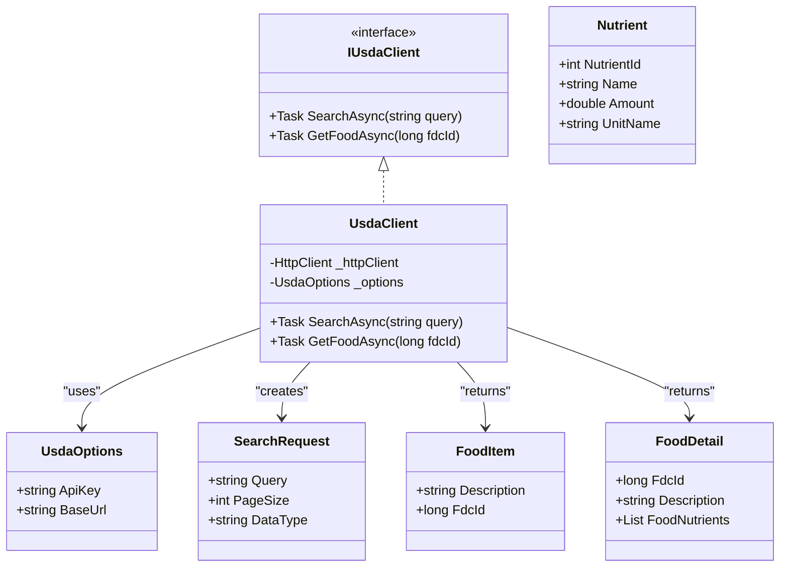
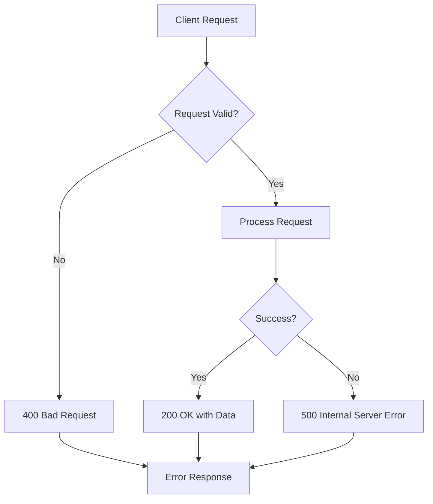
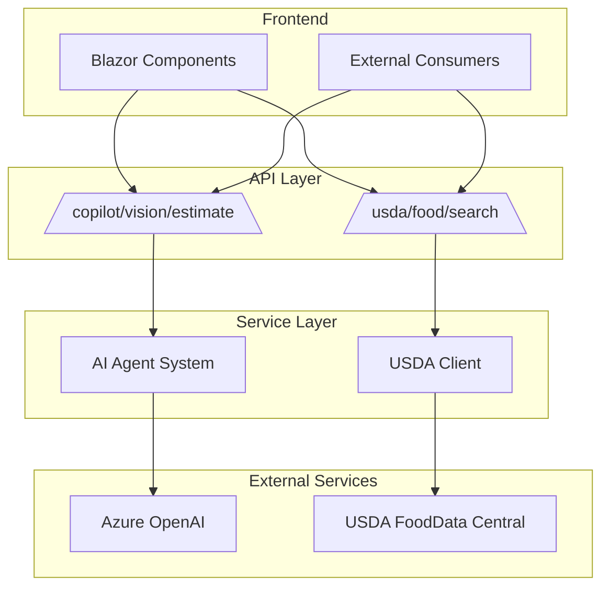

# API Endpoints

<cite>
**Referenced Files in This Document**   
- [CopilotVisionEndpoints.cs](file://FitTrack.Copilot/Endpoints/CopilotVisionEndpoints.cs)
- [FoodEndpoints.cs](file://FitTrack.Copilot/Endpoints/FoodEndpoints.cs)
- [UsdaClient.cs](file://FitTrack.Copilot/Api/Usda/UsdaClient.cs)
- [HttpMultipartHelper.cs](file://FitTrack.Copilot/Api/HttpMultipartHelper.cs)
- [NutritionResult.cs](file://FitTrack.Copilot/Abstractions/Models/NutritionResult.cs)
- [SearchRequest.cs](file://FitTrack.Copilot/Api/Usda/Models/SearchRequest.cs)
- [UsdaOptions.cs](file://FitTrack.Copilot/Api/Usda/UsdaOptions.cs)
- [Program.cs](file://FitTrack.Copilot/Program.cs)
- [appsettings.json](file://FitTrack.Copilot/appsettings.json)
- [CopilotServiceCollectionExtensions.cs](file://FitTrack.Copilot/Extension/CopilotServiceCollectionExtensions.cs)
</cite>

## Table of Contents
1. [Introduction](#introduction)
2. [Core Endpoints](#core-endpoints)
3. [/copilot/vision/estimate Endpoint](#copilotvisionestimate-endpoint)
4. [/usda/food/search Endpoint](#usdafoodsearch-endpoint)
5. [Authentication and Security](#authentication-and-security)
6. [OpenAPI/Swagger Integration](#openapiswagger-integration)
7. [Request and Response Examples](#request-and-response-examples)
8. [Error Handling](#error-handling)
9. [Rate Limiting and Performance](#rate-limiting-and-performance)
10. [Integration with Frontend and External Consumers](#integration-with-frontend-and-external-consumers)
11. [Configuration](#configuration)

## Introduction
This document provides comprehensive API documentation for the backend endpoints in the FitTrack application, with a focus on AI-powered nutrition analysis capabilities. The system exposes two primary endpoint groups: the Copilot Vision API for image-based food analysis and the USDA Food API for nutritional data lookup. These endpoints serve both the Blazor frontend interface and external API consumers, enabling seamless integration of AI-driven nutrition tracking functionality.

**Section sources**
- [Program.cs](file://FitTrack.Copilot/Program.cs#L99-L100)

## Core Endpoints
The FitTrack backend exposes two main endpoint groups for nutrition analysis:

1. **Copilot Vision API**: Located at `/copilot/vision`, this endpoint accepts images of food and returns AI-generated nutrition analysis.
2. **USDA Food API**: Located at `/usda/food`, this endpoint interfaces with the USDA FoodData Central API to retrieve detailed nutritional information for specific food items.

Both endpoint groups are tagged with "Copilot-Vision" in the OpenAPI specification, indicating their role in the nutrition analysis feature set. The endpoints are registered in the application startup process through extension methods on `IEndpointRouteBuilder`.



**Diagram sources**
- [CopilotVisionEndpoints.cs](file://FitTrack.Copilot/Endpoints/CopilotVisionEndpoints.cs#L7-L47)
- [FoodEndpoints.cs](file://FitTrack.Copilot/Endpoints/FoodEndpoints.cs#L7-L25)

**Section sources**
- [CopilotVisionEndpoints.cs](file://FitTrack.Copilot/Endpoints/CopilotVisionEndpoints.cs#L7-L47)
- [FoodEndpoints.cs](file://FitTrack.Copilot/Endpoints/FoodEndpoints.cs#L7-L25)

## /copilot/vision/estimate Endpoint
The `/copilot/vision/estimate` endpoint provides AI-powered nutrition analysis from food images. It accepts multipart form data containing images and optional metadata, processes them through an AI agent, and returns structured nutrition information.

### Request Structure
The endpoint accepts POST requests with `multipart/form-data` content type. The request must include at least one image file and can optionally include text inputs.

**Request Parameters**
- **Method**: POST
- **Path**: `/copilot/vision/estimate`
- **Content-Type**: `multipart/form-data`
- **Authentication**: Not currently implemented (future integration planned)

**Form Fields**
- **files**: One or more image files (required)
- **inputs**: Optional text fields for additional context (e.g., portion size hints)

### Processing Flow
1. The request is validated to ensure it contains multipart form data
2. All files are extracted and stored in memory
3. Text inputs are collected into a dictionary
4. An AI agent supporting the "vision.nutrition.estimate" intent is located
5. The agent processes the image and metadata to generate nutrition analysis
6. Results are returned in structured JSON format



**Diagram sources**
- [CopilotVisionEndpoints.cs](file://FitTrack.Copilot/Endpoints/CopilotVisionEndpoints.cs#L14-L43)
- [HttpMultipartHelper.cs](file://FitTrack.Copilot/Api/HttpMultipartHelper.cs#L12-L38)

**Section sources**
- [CopilotVisionEndpoints.cs](file://FitTrack.Copilot/Endpoints/CopilotVisionEndpoints.cs#L14-L43)
- [HttpMultipartHelper.cs](file://FitTrack.Copilot/Api/HttpMultipartHelper.cs#L12-L38)

## /usda/food/search Endpoint
The `/usda/food/search` endpoint provides integration with the USDA FoodData Central API, allowing clients to search for foods and retrieve their nutritional information.

### Request Structure
The endpoint accepts GET requests with a query parameter to search for food items.

**Request Parameters**
- **Method**: GET
- **Path**: `/usda/food/search`
- **Query Parameter**: `name` (string, required)
- **Authentication**: API key (configured server-side)

### Response Schema
The endpoint returns a `FoodItem` object containing:
- **Description**: Human-readable food name
- **FdcId**: USDA Food Data Central identifier

For detailed nutritional information, clients can use the `/usda/food/{foodId}` endpoint with the returned FdcId.

### USDA API Integration
The endpoint uses the `UsdaClient` class to communicate with the USDA FoodData Central API. The client is configured with an API key and base URL from the application settings. It performs HTTP GET requests to the USDA API and maps the response to the application's data models.



**Diagram sources**
- [UsdaClient.cs](file://FitTrack.Copilot/Api/Usda/UsdaClient.cs#L6-L44)
- [IUsdaClient.cs](file://FitTrack.Copilot/Api/Usda/IUsdaClient.cs#L5-L9)
- [SearchRequest.cs](file://FitTrack.Copilot/Api/Usda/Models/SearchRequest.cs#L3-L34)
- [UsdaOptions.cs](file://FitTrack.Copilot/Api/Usda/UsdaOptions.cs#L3-L10)

**Section sources**
- [FoodEndpoints.cs](file://FitTrack.Copilot/Endpoints/FoodEndpoints.cs#L13-L16)
- [UsdaClient.cs](file://FitTrack.Copilot/Api/Usda/UsdaClient.cs#L17-L35)

## Authentication and Security
Currently, the API endpoints do not implement user authentication. The `/copilot/vision/estimate` endpoint uses a placeholder user ID ("me") in the agent request, indicating that user identity integration is planned for future implementation.

### Security Considerations
- **CSRF Protection**: Disabled for the vision endpoint to accommodate single-page application usage
- **Input Validation**: Basic validation ensures multipart requests contain at least one image file
- **API Keys**: The USDA API integration uses a server-side configured API key, not exposed to clients
- **Rate Limiting**: Not currently implemented (see Performance section)

The system is designed to integrate with ASP.NET Core Identity for user authentication, as evidenced by the presence of identity-related services in the `Program.cs` file. Future versions will likely connect the nutrition analysis features to user accounts for personalized tracking.

**Section sources**
- [CopilotVisionEndpoints.cs](file://FitTrack.Copilot/Endpoints/CopilotVisionEndpoints.cs#L26)
- [Program.cs](file://FitTrack.Copilot/Program.cs#L58-L83)

## OpenAPI/Swagger Integration
The FitTrack.Copilot application integrates OpenAPI/Swagger documentation using the `Microsoft.AspNetCore.OpenApi` package. This provides interactive API documentation and testing capabilities.

### Configuration
OpenAPI is enabled in the service configuration and mapped to the appropriate endpoints:

```csharp
builder.Services.AddOpenApi();
// ...
app.MapOpenApi();
app.UseSwaggerUI(options =>
{
    options.SwaggerEndpoint("/openapi/v1.json", "v1");
});
```

### Tagging Strategy
Both endpoint groups are tagged with "Copilot-Vision" to group related functionality in the API documentation:

```csharp
var group = app.MapGroup("/copilot/vision").WithTags("Copilot-Vision");
var group = app.MapGroup("/usda/food").WithTags("Copilot-Vision");
```

This tagging strategy helps consumers understand that these endpoints are part of the same feature set (nutrition analysis) despite serving different purposes (AI analysis vs. database lookup).

The OpenAPI integration is configured through the `AddOpenApi()` method call in `Program.cs` and is enabled in development environments through the `MapOpenApi()` and `UseSwaggerUI()` calls.

**Section sources**
- [Program.cs](file://FitTrack.Copilot/Program.cs#L25-L26)
- [Program.cs](file://FitTrack.Copilot/Program.cs#L101-L105)
- [CopilotVisionEndpoints.cs](file://FitTrack.Copilot/Endpoints/CopilotVisionEndpoints.cs#L11)
- [FoodEndpoints.cs](file://FitTrack.Copilot/Endpoints/FoodEndpoints.cs#L11)

## Request and Response Examples
This section provides practical examples of API usage with cURL commands and expected responses.

### /copilot/vision/estimate Example
**Request**
```bash
curl -X POST "http://localhost:5097/copilot/vision/estimate" \
  -H "Content-Type: multipart/form-data" \
  -F "files=@/path/to/meal.jpg" \
  -F "portion=half" \
  -F "notes=with extra cheese"
```

**Successful Response (200 OK)**
```json
{
  "items": [
    {
      "name": "cheeseburger",
      "calories": 295.5,
      "proteinGrams": 18.2,
      "carbsGrams": 34.1,
      "fatGrams": 12.8,
      "confidence": 0.92,
      "servingHint": "single patty",
      "source": "ai"
    },
    {
      "name": "french fries",
      "calories": 150.0,
      "proteinGrams": 3.0,
      "carbsGrams": 20.0,
      "fatGrams": 7.0,
      "confidence": 0.85,
      "servingHint": "small portion",
      "source": "ai"
    }
  ],
  "summary": "Cheeseburger with small fries",
  "totalCalories": 445.5
}
```

### /usda/food/search Example
**Request**
```bash
curl -X GET "http://localhost:5097/usda/food/search?name=banana" \
  -H "Content-Type: application/json"
```

**Successful Response (200 OK)**
```json
{
  "description": "Bananas, raw",
  "fdcId": 170397
}
```

**Detailed Food Information Request**
```bash
curl -X GET "http://localhost:5097/usda/food/170397" \
  -H "Content-Type: application/json"
```

**Detailed Response**
```json
{
  "fdcId": 170397,
  "description": "Bananas, raw",
  "foodNutrients": [
    {
      "nutrientId": 1008,
      "name": "Energy",
      "amount": 89.0,
      "unitName": "kcal"
    },
    {
      "nutrientId": 1005,
      "name": "Carbohydrate, by difference",
      "amount": 22.84,
      "unitName": "g"
    },
    {
      "nutrientId": 1003,
      "name": "Protein",
      "amount": 1.09,
      "unitName": "g"
    },
    {
      "nutrientId": 1004,
      "name": "Total lipid (fat)",
      "amount": 0.33,
      "unitName": "g"
    }
  ]
}
```

**Section sources**
- [NutritionResult.cs](file://FitTrack.Copilot/Abstractions/Models/NutritionResult.cs#L6-L54)
- [SearchRequest.cs](file://FitTrack.Copilot/Api/Usda/Models/SearchRequest.cs#L15-L34)
- [food.http](file://FitTrack.Copilot/Api/food.http#L2-L7)

## Error Handling
The API implements structured error handling for various failure scenarios.

### /copilot/vision/estimate Errors
- **400 Bad Request**: Returned when no image file is provided in the multipart request
- **400 Bad Request**: Returned when the AI agent fails to process the request
- **500 Internal Server Error**: Possible if the AI service is unavailable (not explicitly handled in current code)

### /usda/food/search Errors
- **400 Bad Request**: Returned when the query parameter is missing or invalid
- **500 Internal Server Error**: Possible if the USDA API is unreachable or returns an error
- The `UsdaClient` uses `EnsureSuccessStatusCode()` which will throw an exception for non-success HTTP status codes from the USDA API

### Error Response Format
Both endpoints follow ASP.NET Core's default error response format for the respective status codes. The vision endpoint may return custom error messages in the response body when appropriate.



**Diagram sources**
- [CopilotVisionEndpoints.cs](file://FitTrack.Copilot/Endpoints/CopilotVisionEndpoints.cs#L22)
- [UsdaClient.cs](file://FitTrack.Copilot/Api/Usda/UsdaClient.cs#L31)
- [CopilotVisionEndpoints.cs](file://FitTrack.Copilot/Endpoints/CopilotVisionEndpoints.cs#L36-L38)

**Section sources**
- [CopilotVisionEndpoints.cs](file://FitTrack.Copilot/Endpoints/CopilotVisionEndpoints.cs#L22)
- [UsdaClient.cs](file://FitTrack.Copilot/Api/Usda/UsdaClient.cs#L31-L32)

## Rate Limiting and Performance
The current implementation does not include explicit rate limiting, but several performance-related features are in place.

### Current Performance Features
- **Caching**: The AI chat client supports distributed caching to reduce redundant API calls to the AI service
- **HTTP Client Configuration**: The USDA API client has a 10-second timeout to prevent hanging requests
- **Form Size Limit**: Multipart form data is limited to 20MB to prevent excessive memory usage
- **Performance Monitoring**: Middleware is available for performance monitoring, logging, and sensitive word filtering (configurable via appsettings)

### Configuration Options
Performance-related features can be configured in `appsettings.json`:

```json
"Performance": {
  "EnableMonitoring": true,
  "EnableLogging": true,
  "EnableSensitiveWordFilter": true
},
"AI": {
  "EnableCaching": true,
  "CacheDurationMinutes": 30
}
```

### Future Considerations
For production deployment, additional rate limiting should be implemented to:
- Prevent abuse of the AI service (which may have usage costs)
- Protect the USDA API from excessive requests
- Ensure fair usage among multiple clients

The system architecture supports async streaming of AI responses, though this capability is not currently exposed through the endpoints.

**Section sources**
- [Program.cs](file://FitTrack.Copilot/Program.cs#L91-L94)
- [CopilotServiceCollectionExtensions.cs](file://FitTrack.Copilot/Extension/CopilotServiceCollectionExtensions.cs#L41-L46)
- [appsettings.json](file://FitTrack.Copilot/appsettings.json#L36-L40)
- [appsettings.json](file://FitTrack.Copilot/appsettings.json#L18-L19)

## Integration with Frontend and External Consumers
The API endpoints are designed to serve both the Blazor frontend and external API consumers.

### Blazor Frontend Integration
The Blazor components in the `FitTrack.Copilot` project consume these endpoints through HTTP requests. The `FoodVision.razor` component likely uses the `/copilot/vision/estimate` endpoint, while food search functionality uses the USDA endpoints.

### External API Consumers
The OpenAPI/Swagger integration makes the API easily consumable by external clients. The well-defined request/response formats allow for straightforward integration with mobile apps, third-party services, or other web applications.

### Service Abstraction
The API uses a clean separation between endpoints and underlying services:
- Endpoints handle HTTP concerns (parsing, validation, response formatting)
- Services handle business logic and external API integration
- Data models provide structured data transfer objects

This architecture allows for easy maintenance and extension of the API functionality without affecting consumers.



**Diagram sources**
- [Program.cs](file://FitTrack.Copilot/Program.cs#L99-L100)
- [CopilotVisionEndpoints.cs](file://FitTrack.Copilot/Endpoints/CopilotVisionEndpoints.cs#L7-L47)
- [FoodEndpoints.cs](file://FitTrack.Copilot/Endpoints/FoodEndpoints.cs#L7-L25)

**Section sources**
- [Program.cs](file://FitTrack.Copilot/Program.cs#L99-L100)
- [Components](file://FitTrack.Copilot/Components/)

## Configuration
The API endpoints rely on several configuration settings defined in `appsettings.json`.

### USDA API Configuration
The USDA API integration requires an API key and base URL:

```json
"USDA": {
  "ApiKey": "",
  "BaseUrl": "https://api.nal.usda.gov/fdc/v1/"
}
```

The API key should be set in a secure manner, such as through environment variables or user secrets.

### AI Service Configuration
The AI-powered vision analysis requires configuration for the Azure OpenAI service:

```json
"AI": {
  "Endpoint": "https://my-openapi.openai.azure.com/",
  "ModelId": "gpt-4o",
  "ApiKey": "",
  "MaxTokens": 4000,
  "Temperature": 0.7,
  "EnableCaching": true,
  "CacheDurationMinutes": 30
}
```

### Performance Configuration
Various performance and monitoring features can be enabled or disabled:

```json
"Performance": {
  "EnableMonitoring": true,
  "EnableLogging": true,
  "EnableSensitiveWordFilter": true
}
```

These configuration values are injected into the services through dependency injection and strongly-typed configuration options.

**Section sources**
- [appsettings.json](file://FitTrack.Copilot/appsettings.json#L50-L53)
- [appsettings.json](file://FitTrack.Copilot/appsettings.json#L12-L20)
- [appsettings.json](file://FitTrack.Copilot/appsettings.json#L36-L40)
- [UsdaOptions.cs](file://FitTrack.Copilot/Api/Usda/UsdaOptions.cs#L3-L10)
- [Program.cs](file://FitTrack.Copilot/Program.cs#L97)