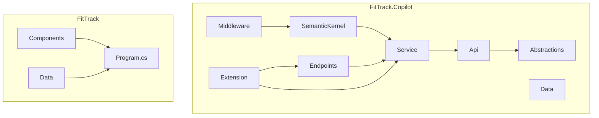
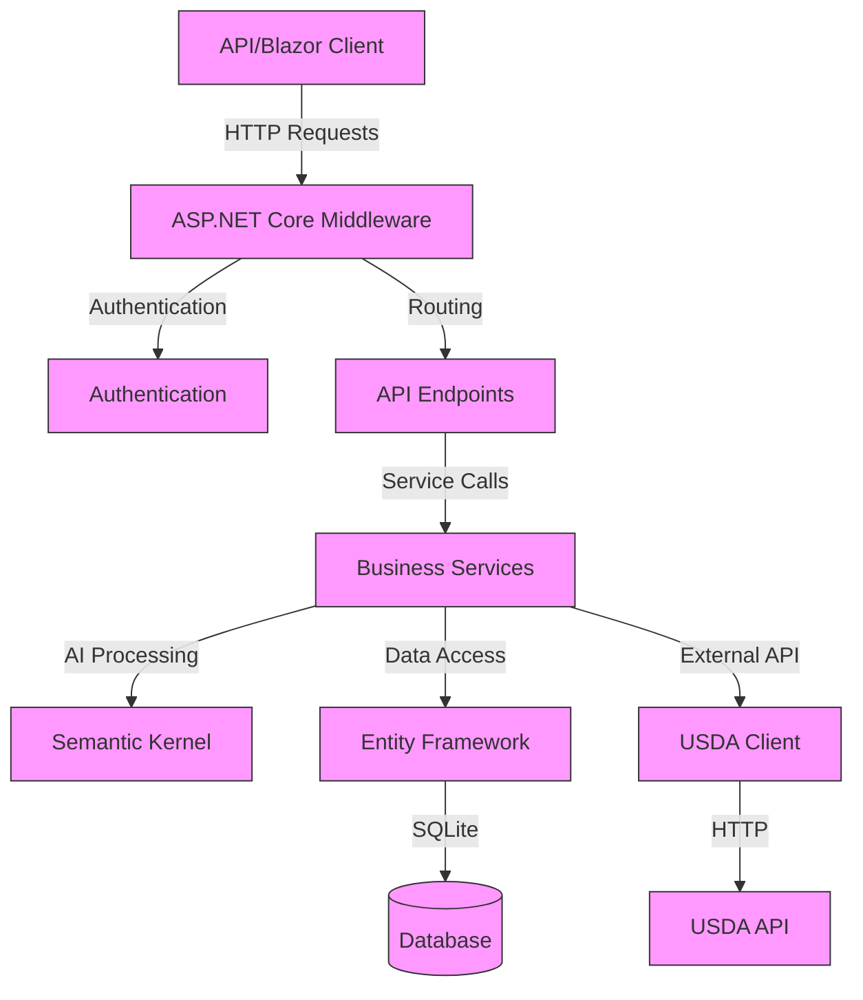
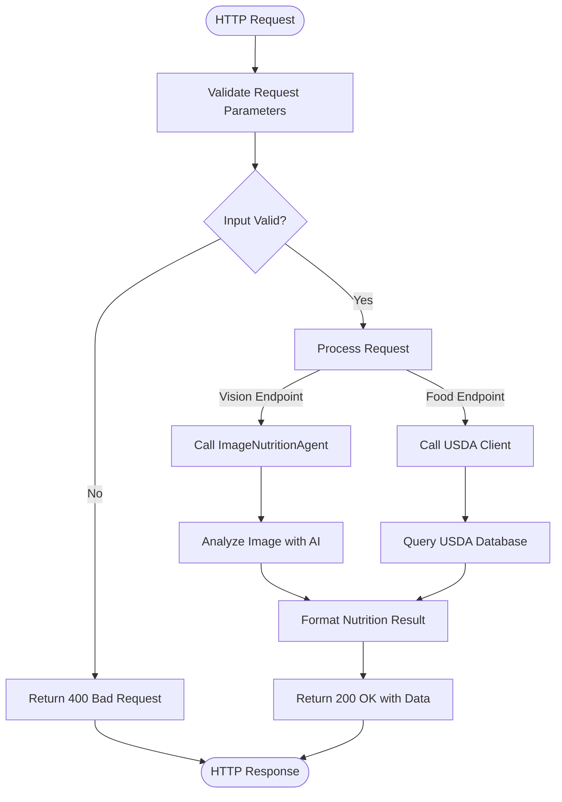
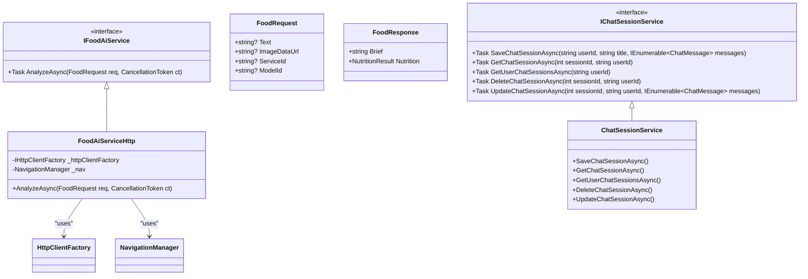
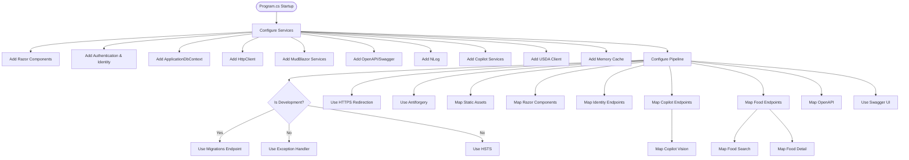
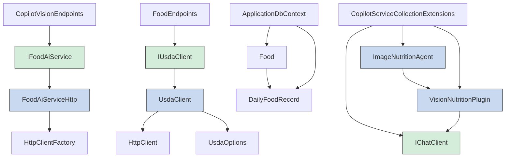

```mermaid
flowchart LR
User[User Request] --> Logging[Logging Middleware]
Logging --> SensitiveFilter[Sensitive Word Filter]
SensitiveFilter --> Performance[Performance Monitor]
Performance --> FunctionCalling[Function Calling]
FunctionCalling --> Caching[Caching Layer]
Caching --> BaseClient[Base Azure OpenAI Client]
BaseClient --> AI[Azure OpenAI Service]
AI --> Caching
Caching --> FunctionCalling
FunctionCalling --> Performance
Performance --> SensitiveFilter
SensitiveFilter --> Logging
Logging --> User
classDef middleware fill:#e6f3ff,stroke:#333;
class Logging,SensitiveFilter,Performance,FunctionCalling,Caching middleware;
```

# Backend Architecture

<cite>
**Referenced Files in This Document**   
- [Program.cs](file://FitTrack/FitTrack/Program.cs)
- [Program.cs](file://FitTrack/FitTrack.Copilot/Program.cs)
- [CopilotVisionEndpoints.cs](file://FitTrack/FitTrack.Copilot/Endpoints/CopilotVisionEndpoints.cs)
- [FoodEndpoints.cs](file://FitTrack/FitTrack.Copilot/Endpoints/FoodEndpoints.cs)
- [IFoodAiService.cs](file://FitTrack/FitTrack.Copilot/Service/IFoodAiService.cs)
- [ChatSessionService.cs](file://FitTrack/FitTrack.Copilot/Service/ChatSessionService.cs)
- [CopilotServiceCollectionExtensions.cs](file://FitTrack/FitTrack.Copilot/Extension/CopilotServiceCollectionExtensions.cs)
- [UsdaServiceCollectionExtensions.cs](file://FitTrack/FitTrack.Copilot/Api/Usda/UsdaServiceCollectionExtensions.cs)
- [LoggingChatClient.cs](file://FitTrack/FitTrack.Copilot/Middleware/LoggingChatClient.cs)
- [SensitiveWordFilterChatClient.cs](file://FitTrack/FitTrack.Copilot/Middleware/SensitiveWordFilterChatClient.cs)
- [PerformanceMonitorChatClient.cs](file://FitTrack/FitTrack.Copilot/Middleware/PerformanceMonitorChatClient.cs)
- [UsdaClient.cs](file://FitTrack/FitTrack.Copilot/Api/Usda/UsdaClient.cs)
- [IUsdaClient.cs](file://FitTrack/FitTrack.Copilot/Api/Usda/IUsdaClient.cs)
- [NutritionResult.cs](file://FitTrack/FitTrack.Copilot/Abstractions/Models/NutritionResult.cs)
- [ApplicationDbContext.cs](file://FitTrack/FitTrack/Data/ApplicationDbContext.cs)
- [Food.cs](file://FitTrack/FitTrack/Data/Food.cs)
- [DailyFoodRecord.cs](file://FitTrack/FitTrack/Data/DailyFoodRecord.cs)
</cite>

## Table of Contents
1. [Introduction](#introduction)
2. [Project Structure](#project-structure)
3. [Core Components](#core-components)
4. [Architecture Overview](#architecture-overview)
5. [Detailed Component Analysis](#detailed-component-analysis)
6. [Dependency Analysis](#dependency-analysis)
7. [Performance Considerations](#performance-considerations)
8. [Troubleshooting Guide](#troubleshooting-guide)
9. [Conclusion](#conclusion)

## Introduction
This document provides comprehensive architectural documentation for the backend services and API endpoints in FitTrack, a fitness tracking application with AI-powered food analysis capabilities. The system is built on ASP.NET Core with a layered architecture that separates concerns between endpoints, services, and data access. The backend supports both a Blazor UI and external API consumers through well-defined endpoints. Key features include image-based food analysis via the /vision endpoint and food data lookup via the /food endpoint, both leveraging AI and USDA data integration. The architecture emphasizes clean separation of concerns, dependency injection, and extensible middleware design.

## Project Structure
The FitTrack solution consists of two main projects: the primary web application (FitTrack) and the copilot service layer (FitTrack.Copilot). The copilot project contains the core AI and USDA integration logic, while the main project focuses on user management and basic food tracking. The backend services are organized into logical layers: Endpoints for API routing, Service for business logic, Abstractions for shared models, Api for external service clients, and Data for persistence. The middleware pipeline is configured in Program.cs with extensive use of extension methods for service registration and endpoint mapping.

**Diagram sources**
- [Program.cs](file://FitTrack/FitTrack.Copilot/Program.cs)
- [CopilotVisionEndpoints.cs](file://FitTrack/FitTrack.Copilot/Endpoints/CopilotVisionEndpoints.cs)
- [FoodEndpoints.cs](file://FitTrack/FitTrack.Copilot/Endpoints/FoodEndpoints.cs)

**Section sources**
- [Program.cs](file://FitTrack/FitTrack.Copilot/Program.cs)
- [Program.cs](file://FitTrack/FitTrack/Program.cs)

## Core Components
The backend architecture centers around several core components that enable AI-powered food analysis and nutritional tracking. The system implements a layered architecture with clear separation between API endpoints, service logic, and data access. Key components include the Semantic Kernel integration for AI processing, USDA client for nutritional data lookup, and custom middleware for enhancing AI client functionality. The architecture supports both the Blazor UI and external API consumers through RESTful endpoints with proper authentication and error handling. Dependency injection is used extensively to wire components together, promoting testability and maintainability.

**Section sources**
- [Program.cs](file://FitTrack/FitTrack.Copilot/Program.cs)
- [IFoodAiService.cs](file://FitTrack/FitTrack.Copilot/Service/IFoodAiService.cs)
- [ChatSessionService.cs](file://FitTrack/FitTrack.Copilot/Service/ChatSessionService.cs)

## Architecture Overview
The backend architecture follows a clean layered pattern with well-defined boundaries between components. At the foundation is the ASP.NET Core middleware pipeline configured in Program.cs, which sets up services, authentication, and request processing. Above this layer, the application implements a service-oriented architecture where API endpoints delegate to service classes that contain business logic. The architecture leverages dependency injection to manage component lifetimes and promote loose coupling. AI functionality is integrated through Semantic Kernel with custom plugins and middleware, while USDA data is accessed through a dedicated client service. The system supports both interactive web UI (Blazor) and programmatic API access.

**Diagram sources**
- [Program.cs](file://FitTrack/FitTrack.Copilot/Program.cs)
- [CopilotVisionEndpoints.cs](file://FitTrack/FitTrack.Copilot/Endpoints/CopilotVisionEndpoints.cs)
- [FoodEndpoints.cs](file://FitTrack/FitTrack.Copilot/Endpoints/FoodEndpoints.cs)
- [IFoodAiService.cs](file://FitTrack/FitTrack.Copilot/Service/IFoodAiService.cs)

## Detailed Component Analysis

### API Endpoints Analysis
The backend exposes two primary API endpoints for food analysis: /vision for image-based analysis and /food for USDA food data lookup. These endpoints are implemented as extension methods on IEndpointRouteBuilder in the Endpoints directory, following ASP.NET Core minimal API patterns. The endpoints are grouped under appropriate routes and tagged for OpenAPI documentation. Request processing includes input validation, file handling for image uploads, and proper error handling with appropriate HTTP status codes.

#### For API/Service Components:

**Diagram sources**
- [CopilotVisionEndpoints.cs](file://FitTrack/FitTrack.Copilot/Endpoints/CopilotVisionEndpoints.cs)
- [FoodEndpoints.cs](file://FitTrack/FitTrack.Copilot/Endpoints/FoodEndpoints.cs)

**Section sources**
- [CopilotVisionEndpoints.cs](file://FitTrack/FitTrack.Copilot/Endpoints/CopilotVisionEndpoints.cs)
- [FoodEndpoints.cs](file://FitTrack/FitTrack.Copilot/Endpoints/FoodEndpoints.cs)

### Service Layer Analysis
The service layer contains the core business logic for food analysis and session management. It implements a clean separation between interface definitions and concrete implementations, enabling dependency injection and testability. The IFoodAiService interface defines the contract for food analysis operations, with a concrete implementation that handles communication with the AI backend. The ChatSessionService manages user chat sessions and history, providing CRUD operations for session data. Services are registered with appropriate lifetimes (scoped, transient, singleton) based on their usage patterns and state requirements.

#### For Object-Oriented Components:

**Diagram sources**
- [IFoodAiService.cs](file://FitTrack/FitTrack.Copilot/Service/IFoodAiService.cs)
- [ChatSessionService.cs](file://FitTrack/FitTrack.Copilot/Service/ChatSessionService.cs)

**Section sources**
- [IFoodAiService.cs](file://FitTrack/FitTrack.Copilot/Service/IFoodAiService.cs)
- [ChatSessionService.cs](file://FitTrack/FitTrack.Copilot/Service/ChatSessionService.cs)

### Middleware Pipeline Analysis
The ASP.NET Core middleware pipeline is configured in Program.cs with a comprehensive set of services and middleware components. The configuration follows the builder pattern, with services registered in a logical order. Key aspects include authentication setup with Identity, database configuration with Entity Framework, and specialized service registration for AI and USDA clients. The middleware pipeline includes standard components like HTTPS redirection, antiforgery, and static file serving, along with custom middleware for AI client enhancement.

#### For Complex Logic Components:

**Diagram sources**
- [Program.cs](file://FitTrack/FitTrack.Copilot/Program.cs)
- [CopilotServiceCollectionExtensions.cs](file://FitTrack/FitTrack.Copilot/Extension/CopilotServiceCollectionExtensions.cs)
- [UsdaServiceCollectionExtensions.cs](file://FitTrack/FitTrack.Copilot/Api/Usda/UsdaServiceCollectionExtensions.cs)

**Section sources**
- [Program.cs](file://FitTrack/FitTrack.Copilot/Program.cs)
- [CopilotServiceCollectionExtensions.cs](file://FitTrack/FitTrack.Copilot/Extension/CopilotServiceCollectionExtensions.cs)
- [UsdaServiceCollectionExtensions.cs](file://FitTrack/FitTrack.Copilot/Api/Usda/UsdaServiceCollectionExtensions.cs)

### Semantic Kernel and AI Middleware Analysis
The AI functionality is implemented using Semantic Kernel with a layered middleware approach that enhances the base chat client with additional capabilities. The architecture uses a chain of responsibility pattern where each middleware component adds specific functionality before or after the core AI processing. This design allows for modular extension of AI client behavior without modifying the core implementation. The middleware pipeline includes caching, function calling, sensitive word filtering, performance monitoring, and logging capabilities.

#### For Complex Logic Components:

**Diagram sources**
- [CopilotServiceCollectionExtensions.cs](file://FitTrack/FitTrack.Copilot/Extension/CopilotServiceCollectionExtensions.cs)
- [LoggingChatClient.cs](file://FitTrack/FitTrack.Copilot/Middleware/LoggingChatClient.cs)
- [SensitiveWordFilterChatClient.cs](file://FitTrack/FitTrack.Copilot/Middleware/SensitiveWordFilterChatClient.cs)
- [PerformanceMonitorChatClient.cs](file://FitTrack/FitTrack.Copilot/Middleware/PerformanceMonitorChatClient.cs)

**Section sources**
- [CopilotServiceCollectionExtensions.cs](file://FitTrack/FitTrack.Copilot/Extension/CopilotServiceCollectionExtensions.cs)
- [LoggingChatClient.cs](file://FitTrack/FitTrack.Copilot/Middleware/LoggingChatClient.cs)
- [SensitiveWordFilterChatClient.cs](file://FitTrack/FitTrack.Copilot/Middleware/SensitiveWordFilterChatClient.cs)
- [PerformanceMonitorChatClient.cs](file://FitTrack/FitTrack.Copilot/Middleware/PerformanceMonitorChatClient.cs)

## Dependency Analysis
The backend services have a well-defined dependency structure that follows dependency inversion principles. High-level modules depend on abstractions rather than concrete implementations, enabling loose coupling and testability. The dependency graph shows a clear flow from API endpoints down to data access and external services. Key dependencies include the Semantic Kernel for AI processing, Entity Framework for data persistence, and HttpClient for external API communication. The architecture uses dependency injection to manage these relationships, with services registered with appropriate lifetimes.

**Diagram sources**
- [CopilotVisionEndpoints.cs](file://FitTrack/FitTrack.Copilot/Endpoints/CopilotVisionEndpoints.cs)
- [FoodEndpoints.cs](file://FitTrack/FitTrack.Copilot/Endpoints/FoodEndpoints.cs)
- [IFoodAiService.cs](file://FitTrack/FitTrack.Copilot/Service/IFoodAiService.cs)
- [IUsdaClient.cs](file://FitTrack/FitTrack.Copilot/Api/Usda/IUsdaClient.cs)
- [UsdaClient.cs](file://FitTrack/FitTrack.Copilot/Api/Usda/UsdaClient.cs)
- [CopilotServiceCollectionExtensions.cs](file://FitTrack/FitTrack.Copilot/Extension/CopilotServiceCollectionExtensions.cs)

**Section sources**
- [CopilotVisionEndpoints.cs](file://FitTrack/FitTrack.Copilot/Endpoints/CopilotVisionEndpoints.cs)
- [FoodEndpoints.cs](file://FitTrack/FitTrack.Copilot/Endpoints/FoodEndpoints.cs)
- [IFoodAiService.cs](file://FitTrack/FitTrack.Copilot/Service/IFoodAiService.cs)
- [IUsdaClient.cs](file://FitTrack/FitTrack.Copilot/Api/Usda/IUsdaClient.cs)

## Performance Considerations
The backend architecture incorporates several performance considerations to ensure responsive and scalable operation. For AI calls, all operations are implemented asynchronously to prevent blocking threads during potentially long-running external API calls. Request validation is performed early in the pipeline to reject invalid requests quickly. The system implements caching at multiple levels: HTTP client caching for USDA data and distributed caching for AI responses when enabled in configuration. File uploads are limited to 20MB to prevent excessive memory usage. The architecture also includes performance monitoring middleware that tracks response times, token usage, and other metrics for optimization.

The /vision endpoint processes image uploads asynchronously and streams responses when possible, minimizing memory footprint. The USDA client uses HttpClient with appropriate timeouts to prevent hanging requests. The database operations use Entity Framework with efficient query patterns and proper indexing. The system also includes rate limiting potential through the use of circuit breakers and timeout policies, though explicit rate limiting middleware is not currently implemented.

**Section sources**
- [Program.cs](file://FitTrack/FitTrack.Copilot/Program.cs)
- [CopilotVisionEndpoints.cs](file://FitTrack/FitTrack.Copilot/Endpoints/CopilotVisionEndpoints.cs)
- [FoodEndpoints.cs](file://FitTrack/FitTrack.Copilot/Endpoints/FoodEndpoints.cs)
- [PerformanceMonitorChatClient.cs](file://FitTrack/FitTrack.Copilot/Middleware/PerformanceMonitorChatClient.cs)

## Troubleshooting Guide
When troubleshooting issues with the FitTrack backend, consider the following common scenarios and their solutions:

1. **AI Analysis Failing**: Check the AI service configuration in appsettings.json, verify the API key and endpoint are correct. Examine the logs for specific error messages from the AI provider.

2. **USDA Data Not Found**: Verify the USDA API key is configured correctly. Check that the search query is appropriate and that the USDA service is reachable.

3. **Image Upload Issues**: Ensure the image is within the 20MB limit and in a supported format (JPEG, PNG, WebP, GIF, BMP). Verify the multipart form data is correctly formatted.

4. **Authentication Problems**: Confirm that the Identity configuration is correct and that user accounts are properly set up. Check the authentication state provider configuration.

5. **Database Connection Issues**: Verify the connection string in appsettings.json points to a valid SQLite database file. Ensure the database has been migrated using EF Core.

6. **Performance Degradation**: Check the performance monitoring logs for slow AI responses. Consider enabling caching or optimizing the prompt templates.

7. **Middleware Errors**: Review the order of middleware registration in Program.cs. Ensure custom middleware is properly configured and doesn't block the request pipeline.

**Section sources**
- [Program.cs](file://FitTrack/FitTrack.Copilot/Program.cs)
- [LoggingChatClient.cs](file://FitTrack/FitTrack.Copilot/Middleware/LoggingChatClient.cs)
- [PerformanceMonitorChatClient.cs](file://FitTrack/FitTrack.Copilot/Middleware/PerformanceMonitorChatClient.cs)
- [UsdaClient.cs](file://FitTrack/FitTrack.Copilot/Api/Usda/UsdaClient.cs)

## Conclusion
The FitTrack backend architecture demonstrates a well-structured, maintainable design that effectively separates concerns while providing powerful AI-powered food analysis capabilities. The layered architecture with clear boundaries between endpoints, services, and data access promotes code organization and testability. The use of ASP.NET Core minimal APIs provides a clean, modern approach to endpoint definition. The integration of Semantic Kernel with custom middleware enables extensible AI functionality with features like caching, logging, and performance monitoring. The system successfully serves both the Blazor UI and external API consumers through well-defined endpoints. The architecture balances functionality with performance considerations, including asynchronous processing, request validation, and configurable caching. Overall, the design provides a solid foundation for a nutrition tracking application with advanced AI capabilities.