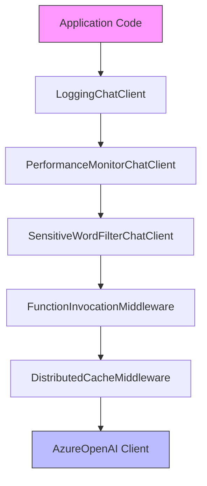
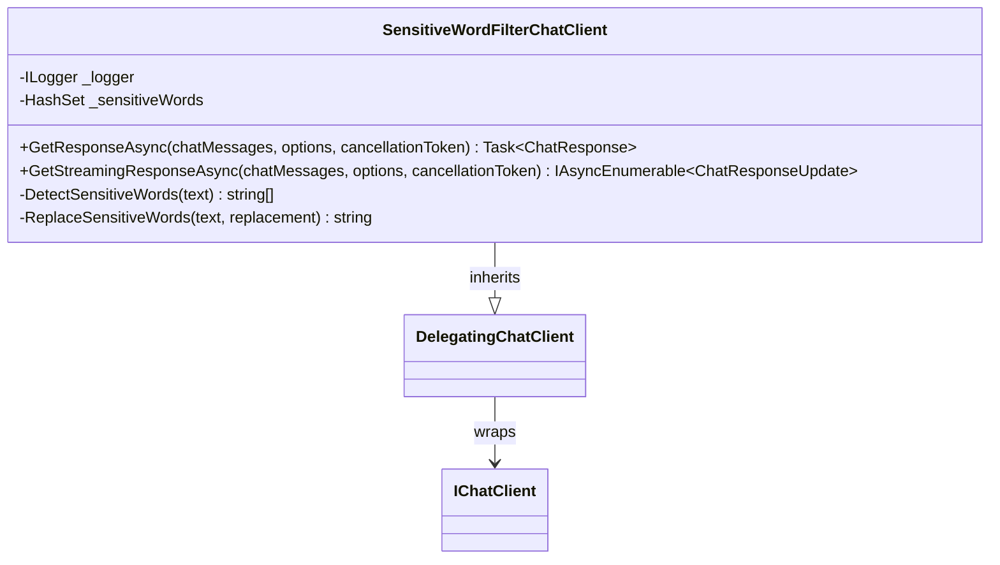
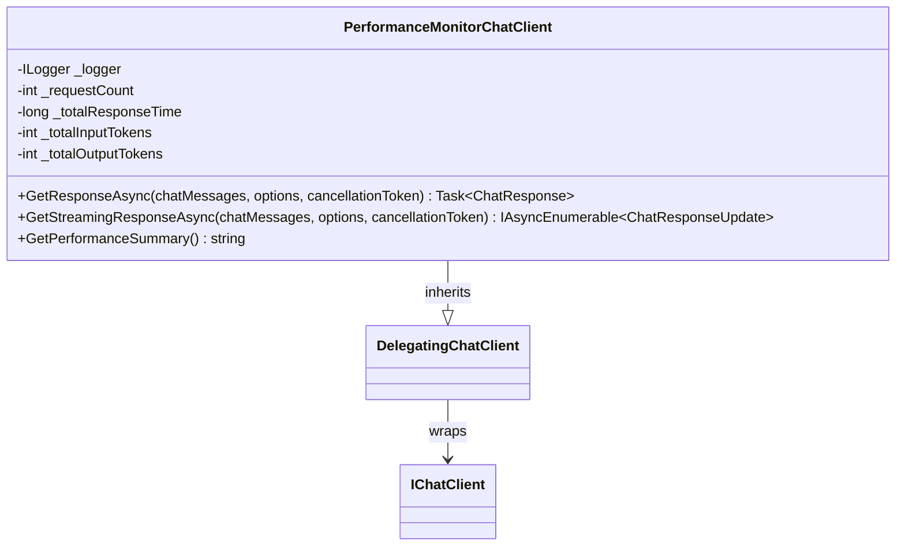
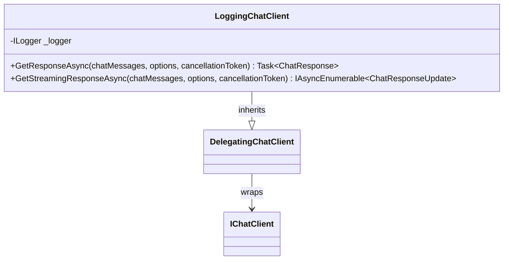
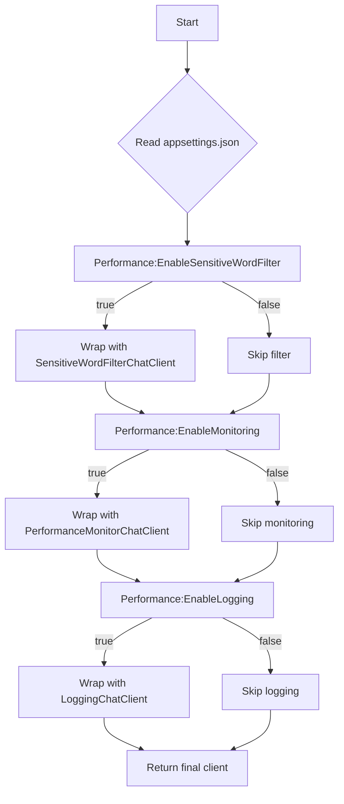
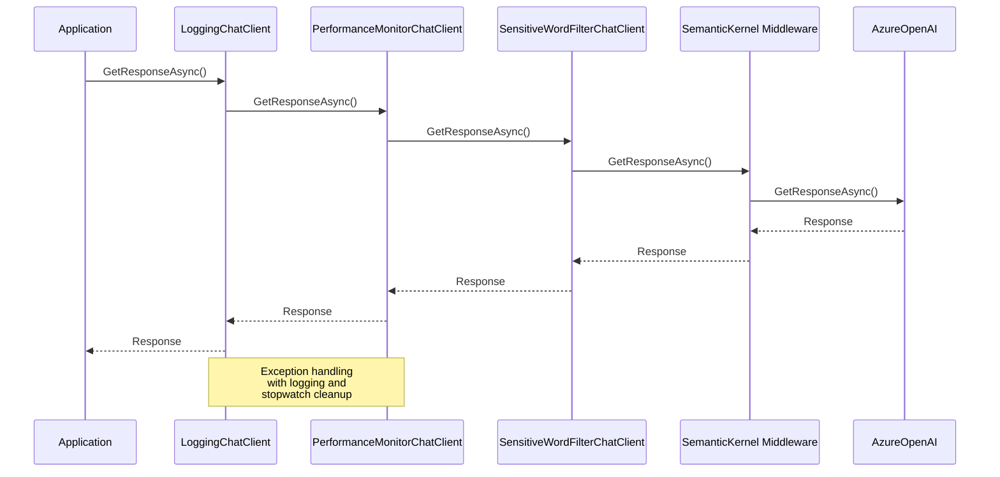

# Middleware Pipeline & AI Client Wrappers

<cite>
**Referenced Files in This Document**   
- [SensitiveWordFilterChatClient.cs](file://FitTrack.Copilot/Middleware/SensitiveWordFilterChatClient.cs)
- [PerformanceMonitorChatClient.cs](file://FitTrack.Copilot/Middleware/PerformanceMonitorChatClient.cs)
- [LoggingChatClient.cs](file://FitTrack.Copilot/Middleware/LoggingChatClient.cs)
- [CopilotServiceCollectionExtensions.cs](file://FitTrack.Copilot/Extension/CopilotServiceCollectionExtensions.cs)
- [appsettings.json](file://FitTrack.Copilot/appsettings.json)
- [FoodAiServiceHttp.cs](file://FitTrack.Copilot/Service/FoodAiServiceHttp.cs)
</cite>

## Table of Contents
1. [Introduction](#introduction)
2. [Middleware Pipeline Architecture](#middleware-pipeline-architecture)
3. [Core Middleware Components](#core-middleware-components)
4. [Configuration-Driven Middleware Activation](#configuration-driven-middleware-activation)
5. [ChatClientBuilder and Function Invocation](#chatclientbuilder-and-function-invocation)
6. [Distributed Caching Integration](#distributed-caching-integration)
7. [Execution Order and Exception Propagation](#execution-order-and-exception-propagation)
8. [Extending the Middleware Pipeline](#extending-the-middleware-pipeline)
9. [Performance Implications](#performance-implications)
10. [Usage in Application Components](#usage-in-application-components)

## Introduction
The FitTrack application implements a sophisticated middleware pipeline for AI client operations, leveraging the Semantic Kernel framework to enhance the core IChatClient functionality. This documentation details the architecture and implementation of a decorator pattern-based middleware chain that wraps the base chat client with additional capabilities including content moderation, performance monitoring, and comprehensive logging. The pipeline is conditionally enabled through configuration settings, allowing for flexible deployment scenarios. The system utilizes ChatClientBuilder from Semantic Kernel to construct the middleware chain and integrate distributed caching for improved performance.

**Section sources**
- [SensitiveWordFilterChatClient.cs](file://FitTrack.Copilot/Middleware/SensitiveWordFilterChatClient.cs#L1-L148)
- [PerformanceMonitorChatClient.cs](file://FitTrack.Copilot/Middleware/PerformanceMonitorChatClient.cs#L1-L139)
- [LoggingChatClient.cs](file://FitTrack.Copilot/Middleware/LoggingChatClient.cs#L1-L135)

## Middleware Pipeline Architecture

**Diagram sources**
- [CopilotServiceCollectionExtensions.cs](file://FitTrack.Copilot/Extension/CopilotServiceCollectionExtensions.cs#L40-L51)
- [SensitiveWordFilterChatClient.cs](file://FitTrack.Copilot/Middleware/SensitiveWordFilterChatClient.cs#L10-L17)
- [PerformanceMonitorChatClient.cs](file://FitTrack.Copilot/Middleware/PerformanceMonitorChatClient.cs#L10-L19)
- [LoggingChatClient.cs](file://FitTrack.Copilot/Middleware/LoggingChatClient.cs#L10-L15)

**Section sources**
- [CopilotServiceCollectionExtensions.cs](file://FitTrack.Copilot/Extension/CopilotServiceCollectionExtensions.cs#L39-L83)

## Core Middleware Components

### SensitiveWordFilterChatClient
The SensitiveWordFilterChatClient implements content moderation by scanning both user input and AI responses for potentially inappropriate language. It inherits from DelegatingChatClient and overrides the GetResponseAsync and GetStreamingResponseAsync methods to intercept messages before and after the core AI processing. The filter maintains a configurable set of sensitive words and logs warnings when matches are detected. Currently, the implementation only logs detected words without blocking or modifying the content, but provides the foundation for more aggressive content control policies.

**Diagram sources**
- [SensitiveWordFilterChatClient.cs](file://FitTrack.Copilot/Middleware/SensitiveWordFilterChatClient.cs#L10-L147)

**Section sources**
- [SensitiveWordFilterChatClient.cs](file://FitTrack.Copilot/Middleware/SensitiveWordFilterChatClient.cs#L1-L148)

### PerformanceMonitorChatClient
The PerformanceMonitorChatClient provides comprehensive performance tracking for AI interactions. It measures response times, tracks token usage, and maintains cumulative statistics across requests. The middleware uses a Stopwatch to measure execution duration and updates atomic counters for request count, response time, and token consumption. It logs detailed performance metrics including average response time and total token usage. For streaming responses, it additionally tracks the time to first chunk (TTFC) and the number of data chunks received.

**Diagram sources**
- [PerformanceMonitorChatClient.cs](file://FitTrack.Copilot/Middleware/PerformanceMonitorChatClient.cs#L10-L138)

**Section sources**
- [PerformanceMonitorChatClient.cs](file://FitTrack.Copilot/Middleware/PerformanceMonitorChatClient.cs#L1-L139)

### LoggingChatClient
The LoggingChatClient provides comprehensive request/response auditing by logging detailed information about each AI interaction. It captures the complete chat message history, user input, tool configurations, AI responses, function calls, and token usage. The middleware implements structured logging with descriptive messages and contextual data. For streaming responses, it can optionally log each received chunk at the Debug level. The logging follows a clear pattern with start and end markers for each request, making it easy to trace complete interaction cycles in the log output.

**Diagram sources**
- [LoggingChatClient.cs](file://FitTrack.Copilot/Middleware/LoggingChatClient.cs#L10-L134)

**Section sources**
- [LoggingChatClient.cs](file://FitTrack.Copilot/Middleware/LoggingChatClient.cs#L1-L135)

## Configuration-Driven Middleware Activation

**Diagram sources**
- [appsettings.json](file://FitTrack.Copilot/appsettings.json#L36-L39)
- [CopilotServiceCollectionExtensions.cs](file://FitTrack.Copilot/Extension/CopilotServiceCollectionExtensions.cs#L54-L80)

**Section sources**
- [appsettings.json](file://FitTrack.Copilot/appsettings.json#L36-L40)
- [CopilotServiceCollectionExtensions.cs](file://FitTrack.Copilot/Extension/CopilotServiceCollectionExtensions.cs#L53-L83)

## ChatClientBuilder and Function Invocation
The middleware pipeline construction begins with the ChatClientBuilder from Semantic Kernel, which creates a foundation for function invocation capabilities. The builder wraps the base AzureOpenAI client and adds the FunctionInvocation middleware, enabling the AI system to call registered functions as part of its response generation. This is essential for the application's ability to use tools and plugins in the AI workflow. The built client with function invocation capabilities becomes the innermost layer of the subsequent decorator chain.

**Section sources**
- [CopilotServiceCollectionExtensions.cs](file://FitTrack.Copilot/Extension/CopilotServiceCollectionExtensions.cs#L48-L51)

## Distributed Caching Integration
The system implements distributed caching to improve performance and reduce AI service costs by storing responses to previous queries. The caching is conditionally enabled based on the AI:EnableCaching configuration setting. A custom MemoryCacheAdapter bridges the IMemoryCache service with the IDistributedCache interface required by the ChatClientBuilder. Cache entries are configured with expiration policies derived from the AI:CacheDurationMinutes setting, ensuring that cached responses remain fresh while still providing performance benefits.

**Section sources**
- [CopilotServiceCollectionExtensions.cs](file://FitTrack.Copilot/Extension/CopilotServiceCollectionExtensions.cs#L41-L46)
- [appsettings.json](file://FitTrack.Copilot/appsettings.json#L18-L19)

## Execution Order and Exception Propagation
The middleware components are applied in a specific order that follows the decorator pattern, with each layer wrapping the previous one. When a request is made, it passes through the layers from outer to inner: Logging → Performance Monitoring → Sensitive Word Filtering → Function Invocation → Caching → Azure OpenAI. Responses travel back in the reverse order. Exceptions are propagated up the chain, with each middleware having the opportunity to handle or log exceptions before they reach the application layer. The PerformanceMonitorChatClient demonstrates proper exception handling by stopping its stopwatch and logging the error before re-throwing the exception.

**Diagram sources**
- [PerformanceMonitorChatClient.cs](file://FitTrack.Copilot/Middleware/PerformanceMonitorChatClient.cs#L73-L79)
- [LoggingChatClient.cs](file://FitTrack.Copilot/Middleware/LoggingChatClient.cs#L91-L97)

**Section sources**
- [PerformanceMonitorChatClient.cs](file://FitTrack.Copilot/Middleware/PerformanceMonitorChatClient.cs#L73-L79)
- [LoggingChatClient.cs](file://FitTrack.Copilot/Middleware/LoggingChatClient.cs#L91-L97)

## Extending the Middleware Pipeline
To extend the middleware pipeline with custom functionality, developers should create a new class that inherits from DelegatingChatClient and implements the desired interception logic. The new middleware should be added to the chain in the AddChatClient extension method, with consideration given to its position in the execution order. Middleware that needs to process the final response should be placed toward the outer layers, while middleware that needs to modify requests before they reach the AI should be placed closer to the inner layers. All custom middleware should accept the inner client and ILogger in its constructor and pass them to the base constructor.

**Section sources**
- [CopilotServiceCollectionExtensions.cs](file://FitTrack.Copilot/Extension/CopilotServiceCollectionExtensions.cs#L59-L80)

## Performance Implications
Each middleware layer adds a small performance overhead due to the additional processing and logging operations. The SensitiveWordFilterChatClient performs string scanning operations that scale with message length and sensitive word list size. The PerformanceMonitorChatClient adds minimal overhead with its atomic operations and logging. The LoggingChatClient can generate significant log volume, especially at Debug level for streaming responses, which may impact disk I/O and log processing systems. The distributed caching layer provides substantial performance benefits for repeated queries, offsetting the overhead of the middleware layers. The configuration system allows for disabling non-essential middleware in production environments to optimize performance.

**Section sources**
- [PerformanceMonitorChatClient.cs](file://FitTrack.Copilot/Middleware/PerformanceMonitorChatClient.cs#L46-L62)
- [LoggingChatClient.cs](file://FitTrack.Copilot/Middleware/LoggingChatClient.cs#L54-L55)
- [SensitiveWordFilterChatClient.cs](file://FitTrack.Copilot/Middleware/SensitiveWordFilterChatClient.cs#L112-L124)

## Usage in Application Components
The configured IChatClient service is consumed through dependency injection in various application components, particularly in AI service implementations like FoodAiServiceHttp. The service abstraction means that components interact with what appears to be a standard IChatClient, while actually benefiting from the complete middleware pipeline. This design provides a clean separation between AI functionality and cross-cutting concerns like logging, monitoring, and security.

**Section sources**
- [FoodAiServiceHttp.cs](file://FitTrack.Copilot/Service/FoodAiServiceHttp.cs#L28-L80)
- [Chat.razor.cs](file://FitTrack.Copilot/Components/Pages/Chat.razor.cs#L69-L74)