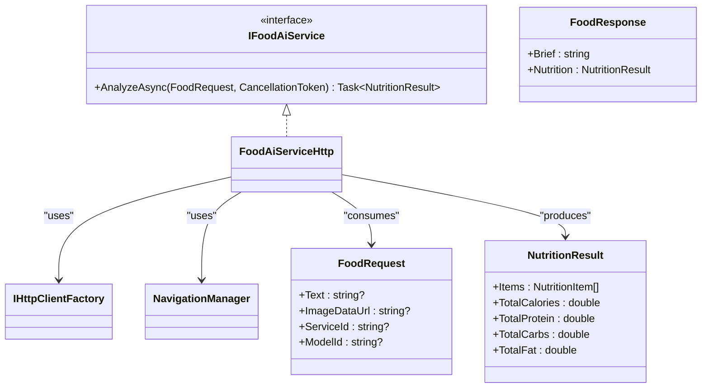
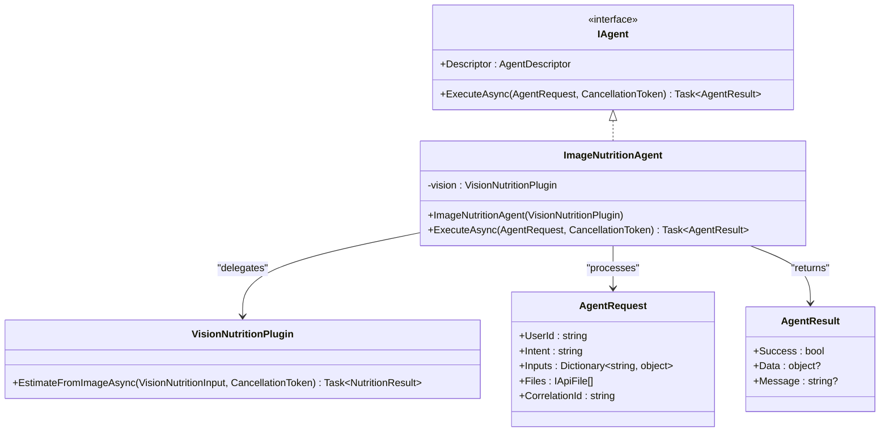
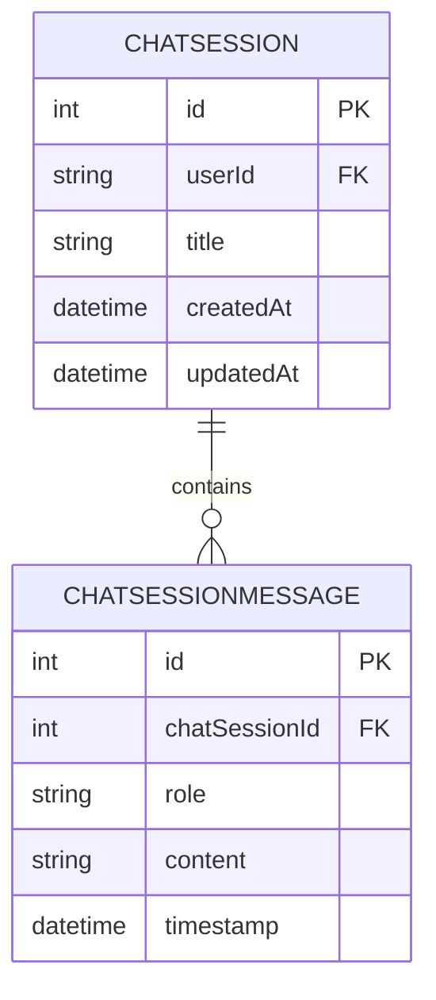
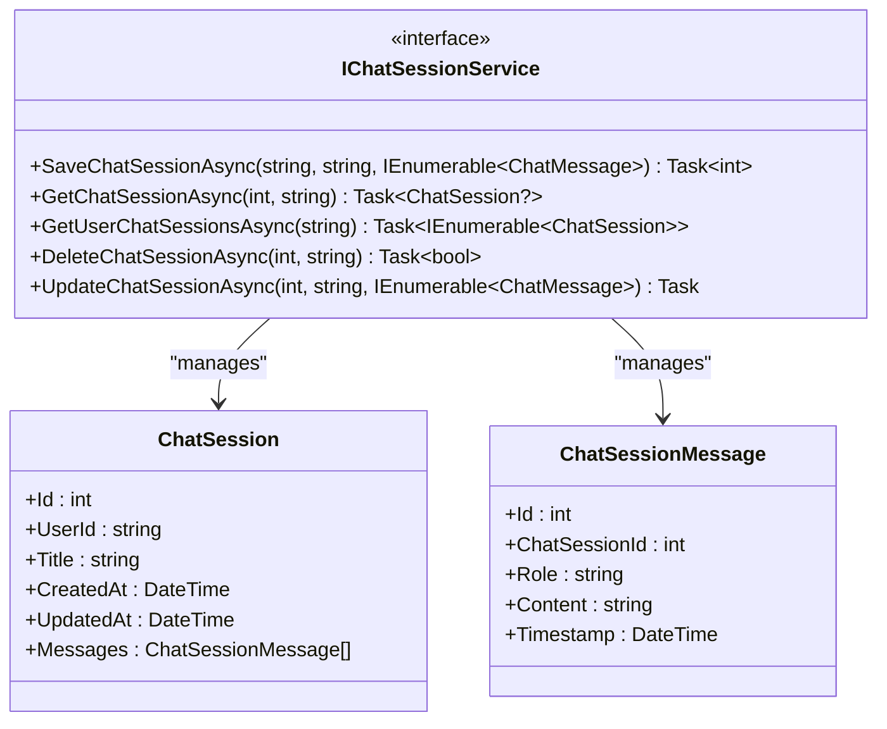
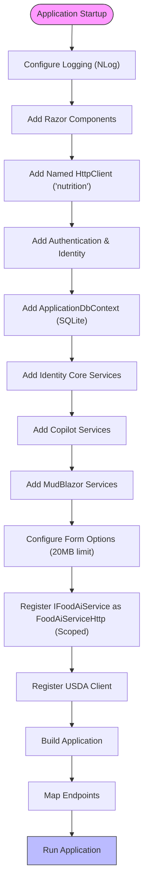
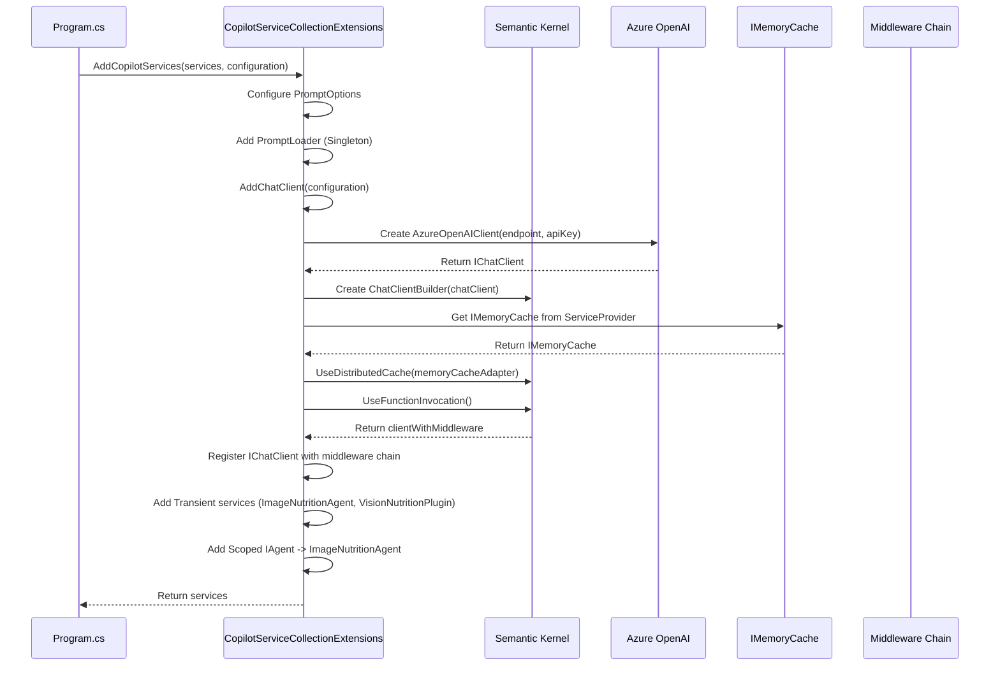
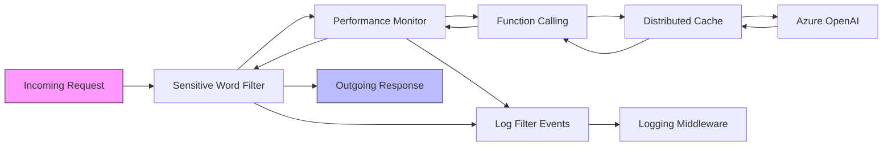

# Service Layer & Dependency Injection

<cite>
**Referenced Files in This Document**   
- [Program.cs](file://FitTrack.Copilot/Program.cs)
- [IFoodAiService.cs](file://FitTrack.Copilot/Service/IFoodAiService.cs)
- [ChatSessionService.cs](file://FitTrack.Copilot/Service/ChatSessionService.cs)
- [CopilotServiceCollectionExtensions.cs](file://FitTrack.Copilot/Extension/CopilotServiceCollectionExtensions.cs)
- [ImageNutritionAgent.cs](file://FitTrack.Copilot/Agent/ImageNutritionAgent.cs)
- [ApplicationDbContext.cs](file://FitTrack.Copilot/Data/ApplicationDbContext.cs)
- [ChatSession.cs](file://FitTrack.Copilot/Data/ChatSession.cs)
</cite>

## Table of Contents
1. [Introduction](#introduction)
2. [Core Service Abstractions](#core-service-abstractions)
3. [AI Nutrition Analysis Service](#ai-nutrition-analysis-service)
4. [Chat Session Management](#chat-session-management)
5. [Dependency Injection Configuration](#dependency-injection-configuration)
6. [Service Registration Pipeline](#service-registration-pipeline)
7. [Service Lifecycles and Scopes](#service-lifecycles-and-scopes)
8. [Performance and Thread Safety](#performance-and-thread-safety)
9. [Conclusion](#conclusion)

## Introduction
The FitTrack backend service layer implements a robust dependency injection system to manage AI-driven nutrition analysis and conversational state for the AI copilot. This documentation details the architecture of key services, their dependencies, and the configuration pipeline that bootstraps the application. The system leverages Microsoft.Extensions.AI, Semantic Kernel, and Entity Framework Core to provide scalable, maintainable services for food image analysis and chat session persistence.

## Core Service Abstractions
The service layer is built around well-defined interfaces that abstract core functionality. The primary abstraction `IFoodAiService` provides a contract for AI-driven nutrition analysis, while `IChatSessionService` manages conversational state and history. These interfaces enable loose coupling, testability, and flexibility in implementation.

**Section sources**
- [IFoodAiService.cs](file://FitTrack.Copilot/Service/IFoodAiService.cs#L8-L11)
- [ChatSessionService.cs](file://FitTrack.Copilot/Service/ChatSessionService.cs#L11-L18)

## AI Nutrition Analysis Service

### IFoodAiService Interface
The `IFoodAiService` interface defines the contract for nutrition analysis operations, accepting a `FoodRequest` object containing text hints and image data URLs, and returning a `NutritionResult` asynchronously. This abstraction allows for multiple implementations while providing a consistent API for clients.

**Diagram sources**
- [IFoodAiService.cs](file://FitTrack.Copilot/Service/IFoodAiService.cs#L8-L11)

### ImageNutritionAgent Implementation
The `ImageNutritionAgent` class implements AI-driven nutrition analysis by leveraging the Semantic Kernel framework. It acts as an adapter between the application layer and the underlying AI capabilities, specifically handling vision-based nutrition estimation. The agent uses dependency injection to receive a `VisionNutritionPlugin` instance, which provides the actual AI processing capabilities.

**Diagram sources**
- [ImageNutritionAgent.cs](file://FitTrack.Copilot/Agent/ImageNutritionAgent.cs#L11-L56)
- [CopilotServiceCollectionExtensions.cs](file://FitTrack.Copilot/Extension/CopilotServiceCollectionExtensions.cs#L22-L24)

## Chat Session Management

### Entity Framework Core Data Model
The chat session persistence system uses Entity Framework Core to store conversational state in a relational database. The `ChatSession` entity represents a conversation with a user, containing metadata like title, creation date, and a collection of messages. Each `ChatSessionMessage` is linked to its parent session through a foreign key relationship, with cascade delete behavior to maintain data integrity.

**Diagram sources**
- [ChatSession.cs](file://FitTrack.Copilot/Data/ChatSession.cs#L5-L37)
- [ApplicationDbContext.cs](file://FitTrack.Copilot/Data/ApplicationDbContext.cs#L10-L34)

### IChatSessionService Interface
The `IChatSessionService` interface defines operations for managing chat sessions, including saving, retrieving, listing, updating, and deleting sessions. These methods operate on strongly-typed entities and use user IDs for access control, ensuring that users can only access their own chat history.

**Diagram sources**
- [ChatSessionService.cs](file://FitTrack.Copilot/Service/ChatSessionService.cs#L11-L18)
- [ChatSession.cs](file://FitTrack.Copilot/Data/ChatSession.cs#L5-L37)

## Dependency Injection Configuration

### Program.cs Service Registration
The `Program.cs` file contains the primary service registration configuration for the FitTrack.Copilot application. It sets up various services including authentication, database context, HTTP clients, and custom application services. The configuration follows ASP.NET Core best practices for modular service registration.

**Diagram sources**
- [Program.cs](file://FitTrack.Copilot/Program.cs#L19-L98)

## Service Registration Pipeline

### CopilotServiceCollectionExtensions
The `CopilotServiceCollectionExtensions` class contains the extension method `AddCopilotServices` that bootstraps the Semantic Kernel chat client with function calling, caching, and middleware layers. This method configures the AI client with Azure OpenAI, applies distributed caching, and layers middleware for logging, performance monitoring, and sensitive word filtering.

**Diagram sources**
- [CopilotServiceCollectionExtensions.cs](file://FitTrack.Copilot/Extension/CopilotServiceCollectionExtensions.cs#L16-L84)

## Service Lifecycles and Scopes

### Service Lifetime Management
The FitTrack service layer employs different service lifetimes based on the requirements of each component. Scoped services like `IFoodAiService` are created once per request, transient services like `ImageNutritionAgent` are created each time they're requested, and singleton services like the configured `IChatClient` are created once for the application lifetime.

| Service | Lifetime | Implementation | Purpose |
|--------|---------|---------------|---------|
| `IFoodAiService` | Scoped | `FoodAiServiceHttp` | Provides nutrition analysis per request |
| `IChatClient` | Singleton | Configured Semantic Kernel client | Shared AI client with caching and middleware |
| `ImageNutritionAgent` | Transient | `ImageNutritionAgent` | On-demand AI agent for vision analysis |
| `VisionNutritionPlugin` | Transient | `VisionNutritionPlugin` | Plugin for Semantic Kernel function calling |
| `IAgent` | Scoped | `ImageNutritionAgent` | Scoped agent interface for request context |
| `PromptLoader` | Singleton | `PromptLoader` | Shared prompt loading service |
| `IMemoryCache` | Singleton | Built-in ASP.NET Core cache | Shared caching infrastructure |

**Section sources**
- [Program.cs](file://FitTrack.Copilot/Program.cs#L96)
- [CopilotServiceCollectionExtensions.cs](file://FitTrack.Copilot/Extension/CopilotServiceCollectionExtensions.cs#L22-L24)

## Performance and Thread Safety

### Middleware Performance Optimization
The service layer implements a layered middleware approach to enhance performance and reliability. The caching middleware reduces redundant AI calls, while the performance monitoring middleware tracks execution times. The sensitive word filter provides content safety, and logging middleware captures diagnostic information.

**Diagram sources**
- [CopilotServiceCollectionExtensions.cs](file://FitTrack.Copilot/Extension/CopilotServiceCollectionExtensions.cs#L52-L83)
- [Middleware/LoggingChatClient.cs](file://FitTrack.Copilot/Middleware/LoggingChatClient.cs)
- [Middleware/PerformanceMonitorChatClient.cs](file://FitTrack.Copilot/Middleware/PerformanceMonitorChatClient.cs)
- [Middleware/SensitiveWordFilterChatClient.cs](file://FitTrack.Copilot/Middleware/SensitiveWordFilterChatClient.cs)

## Conclusion
The FitTrack backend service layer demonstrates a well-architected approach to dependency injection and service management. By leveraging ASP.NET Core's built-in DI container, the system effectively manages the lifecycles of various services, from scoped AI analysis components to singleton chat clients. The extension method pattern in `CopilotServiceCollectionExtensions` provides a clean, modular way to configure complex service dependencies, while the use of interfaces promotes testability and flexibility. The integration of Semantic Kernel with middleware layers enables sophisticated AI capabilities with performance optimization and safety features, creating a robust foundation for the AI copilot functionality.