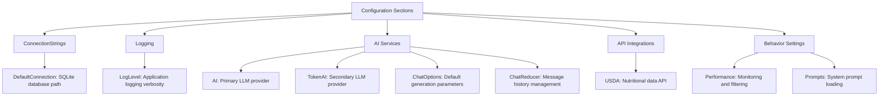
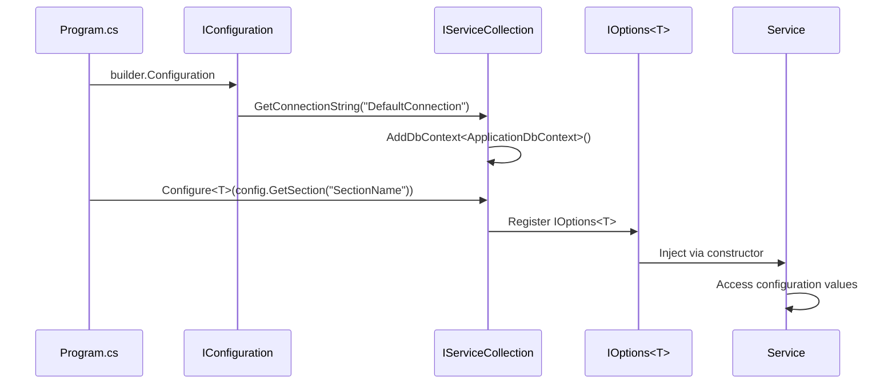

# Application Settings Configuration

<cite>
**Referenced Files in This Document**   
- [appsettings.json](file://FitTrack/FitTrack/appsettings.json)
- [appsettings.json](file://FitTrack/FitTrack.Copilot/appsettings.json)
- [Program.cs](file://FitTrack/FitTrack/Program.cs)
- [Program.cs](file://FitTrack/FitTrack.Copilot/Program.cs)
- [CopilotServiceCollectionExtensions.cs](file://FitTrack/FitTrack.Copilot/Extension/CopilotServiceCollectionExtensions.cs)
- [UsdaOptions.cs](file://FitTrack/FitTrack.Copilot/Api/Usda/UsdaOptions.cs)
- [UsdaServiceCollectionExtensions.cs](file://FitTrack/FitTrack.Copilot/Api/Usda/UsdaServiceCollectionExtensions.cs)
- [PromptLoader.cs](file://FitTrack/FitTrack.Copilot/SemanticKernel/Tooling/PromptLoader.cs)
</cite>

## Table of Contents
1. [Introduction](#introduction)
2. [Core Project Configuration](#core-project-configuration)
3. [Copilot Project Configuration](#copilot-project-configuration)
4. [Configuration Structure Analysis](#configuration-structure-analysis)
5. [Configuration Consumption in Code](#configuration-consumption-in-code)
6. [Best Practices for Configuration Management](#best-practices-for-configuration-management)
7. [Conclusion](#conclusion)

## Introduction
The FitTrack application utilizes JSON-based configuration files to manage application settings across different environments. This document provides a comprehensive analysis of the `appsettings.json` configuration structure in both the core FitTrack project and the AI-enhanced FitTrack.Copilot project. The configuration system follows ASP.NET Core's standard configuration pattern, allowing for hierarchical settings management, environment-specific overrides, and secure handling of sensitive data. The core project maintains a minimal configuration focused on database connectivity and logging, while the Copilot project extends this with extensive AI service configurations, USDA API integration, and advanced chat behavior settings.

**Section sources**
- [appsettings.json](file://FitTrack/FitTrack/appsettings.json)
- [appsettings.json](file://FitTrack/FitTrack.Copilot/appsettings.json)

## Core Project Configuration
The core FitTrack project features a streamlined configuration focused on essential application services. The primary configuration sections include ConnectionStrings for SQLite database connectivity and Logging for application diagnostics. The ConnectionStrings section defines a DefaultConnection using SQLite with a relative path to the application database file. The Logging section configures LogLevel settings with "Information" as the default level and "Warning" for Microsoft.AspNetCore components, providing appropriate verbosity for production environments. The AllowedHosts setting is configured to accept requests from any host, which is suitable for development but should be restricted in production deployments. This minimal configuration reflects the core application's focus on user authentication, food tracking, and basic web functionality without AI capabilities.

**Section sources**
- [appsettings.json](file://FitTrack/FitTrack/appsettings.json#L1-L13)
- [Program.cs](file://FitTrack/FitTrack/Program.cs#L27-L30)

## Copilot Project Configuration
The FitTrack.Copilot project significantly expands the configuration surface to support advanced AI capabilities and nutritional analysis features. In addition to the core ConnectionStrings and Logging sections, the Copilot configuration introduces multiple AI-related sections including AI, TokenAI, ChatOptions, Performance, ChatReducer, Prompts, and USDA. The AI section configures an Azure OpenAI service with endpoint, model ID, API key, and generation parameters. A secondary TokenAI section provides configuration for an alternative LLM backend, enabling multi-provider support. The USDA section contains API credentials for accessing nutritional data from the United States Department of Agriculture database. Additional sections like ChatOptions and ChatReducer control conversational behavior and message history management, while Performance flags enable monitoring and content filtering middleware.

**Section sources**
- [appsettings.json](file://FitTrack/FitTrack.Copilot/appsettings.json#L1-L55)
- [Program.cs](file://FitTrack/FitTrack.Copilot/Program.cs#L85-L86)

## Configuration Structure Analysis
The configuration structure in FitTrack.Copilot demonstrates a well-organized approach to managing complex application settings. Each configuration section serves a specific purpose:

**Diagram sources**
- [appsettings.json](file://FitTrack/FitTrack.Copilot/appsettings.json#L1-L55)

**Section sources**
- [appsettings.json](file://FitTrack/FitTrack.Copilot/appsettings.json#L1-L55)

### AI Service Configuration
The AI configuration section provides comprehensive settings for LLM integration:
- **Endpoint**: The URL for the AI service (Azure OpenAI in this case)
- **ModelId**: The specific model to use (gpt-4o)
- **ApiKey**: Authentication credential (left empty for security)
- **MaxTokens**: Maximum response length (4000 tokens)
- **Temperature**: Creativity parameter (0.7)
- **EnableCaching**: Flag to enable response caching
- **CacheDurationMinutes**: Cache expiration time (30 minutes)

The presence of both AI and TokenAI sections enables the application to support multiple LLM providers, providing redundancy and flexibility in AI backend selection.

### USDA API Integration
The USDA configuration enables nutritional data lookup:
- **ApiKey**: Authentication token for USDA FDC API
- **BaseUrl**: Base URL for USDA API endpoints

This integration allows the Copilot feature to retrieve detailed nutritional information for food items, enhancing the application's dietary tracking capabilities.

### Chat Behavior Configuration
Several sections control conversational behavior:
- **ChatOptions**: Default parameters for chat completions
- **ChatReducer**: Limits on message history (20 messages, 4000 tokens)
- **Performance**: Flags to enable monitoring, logging, and sensitive word filtering
- **Prompts**: Configuration for loading system prompts from embedded resources

These settings allow fine-tuning of the AI conversation experience, balancing performance, safety, and contextual awareness.

## Configuration Consumption in Code
The application consumes configuration values through ASP.NET Core's IOptions<T> pattern and dependency injection system. The Program.cs files in both projects demonstrate this pattern, with configuration values being injected into services during application startup.

**Diagram sources**
- [Program.cs](file://FitTrack/FitTrack/Program.cs#L27-L30)
- [Program.cs](file://FitTrack/FitTrack.Copilot/Program.cs#L71-L74)
- [UsdaServiceCollectionExtensions.cs](file://FitTrack/FitTrack.Copilot/Api/Usda/UsdaServiceCollectionExtensions.cs#L7-L14)

**Section sources**
- [Program.cs](file://FitTrack/FitTrack/Program.cs#L27-L30)
- [Program.cs](file://FitTrack/FitTrack.Copilot/Program.cs#L71-L74)
- [CopilotServiceCollectionExtensions.cs](file://FitTrack/FitTrack.Copilot/Extension/CopilotServiceCollectionExtensions.cs#L19-L20)
- [UsdaServiceCollectionExtensions.cs](file://FitTrack/FitTrack.Copilot/Api/Usda/UsdaServiceCollectionExtensions.cs#L7-L14)
- [PromptLoader.cs](file://FitTrack/FitTrack.Copilot/SemanticKernel/Tooling/PromptLoader.cs#L17-L20)

The Copilot project demonstrates advanced configuration consumption patterns:
1. **IOptions<T> Pattern**: Strongly-typed configuration classes like UsdaOptions and PromptOptions are bound to configuration sections
2. **Direct Configuration Access**: Some services access configuration values directly using configuration["Section:Key"] syntax
3. **Extension Methods**: Custom service collection extensions (AddCopilotServices, AddUsdaClient) encapsulate configuration logic
4. **User Secrets**: Development-time API keys are managed through dotnet user-secrets for security

The PromptLoader class exemplifies sophisticated configuration usage, combining file system and embedded resource loading with in-memory caching based on configuration-defined paths and prefixes.

## Best Practices for Configuration Management
The FitTrack projects demonstrate several best practices for configuration management:

### Secure Handling of Sensitive Data
- API keys are left empty in the committed appsettings.json files
- Development secrets are managed through dotnet user-secrets
- Configuration values are accessed through typed options rather than direct string lookups
- Environment-specific settings are separated into appsettings.Development.json

### Configuration Validation
- Null checks with meaningful error messages (e.g., "Connection string 'DefaultConnection' not found")
- Required configuration values are validated during application startup
- Default values are provided for optional settings

### Environment Management
- Shared base configuration in appsettings.json
- Environment-specific overrides in appsettings.Environment.json
- Different logging configurations for development and production
- Conditional middleware registration based on environment

### Extensibility and Maintainability
- Modular configuration sections for different concerns
- Strongly-typed options classes for complex configurations
- Extension methods to encapsulate configuration logic
- Clear separation between core and Copilot configurations

To implement these best practices:
1. Use environment variables or Azure Key Vault in production instead of user secrets
2. Implement configuration validation using IValidateOptions<T>
3. Consider using configuration providers for dynamic settings
4. Document all configuration options and their purposes
5. Use configuration builders to compose settings from multiple sources

## Conclusion
The FitTrack application demonstrates a robust configuration system that scales appropriately from a simple core application to an AI-enhanced Copilot version. The core project maintains a minimal, focused configuration for essential services, while the Copilot project extends this with comprehensive AI and integration settings. The configuration is consumed through standard ASP.NET Core patterns, ensuring type safety and maintainability. By following best practices for security, validation, and environment management, the application provides a solid foundation for both development and production deployments. The modular structure allows for easy extension of configuration capabilities as new features are added, while maintaining clear separation of concerns between different configuration domains.