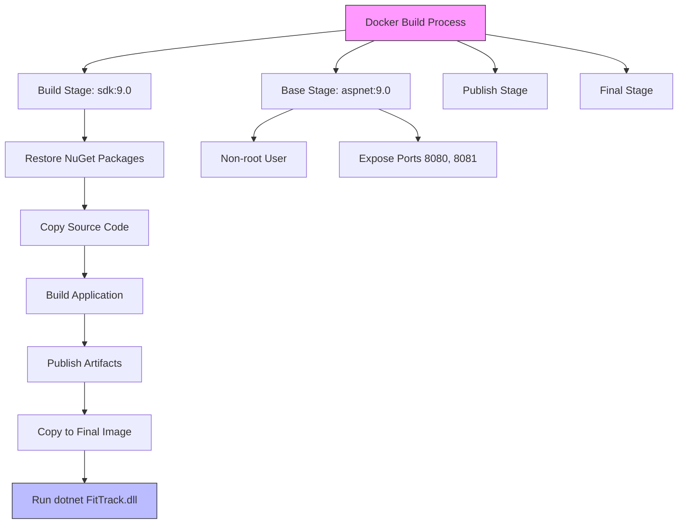
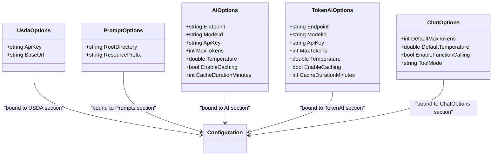

# Configuration & Environment Setup

<cite>
**Referenced Files in This Document**   
- [appsettings.json](file://FitTrack/FitTrack/appsettings.json)
- [appsettings.json](file://FitTrack/FitTrack.Copilot/appsettings.json)
- [appsettings.Development.json](file://FitTrack/FitTrack/appsettings.Development.json)
- [appsettings.Development.json](file://FitTrack/FitTrack.Copilot/appsettings.Development.json)
- [launchSettings.json](file://FitTrack/FitTrack/Properties/launchSettings.json)
- [launchSettings.json](file://FitTrack/FitTrack.Copilot/Properties/launchSettings.json)
- [Dockerfile](file://FitTrack/FitTrack/Dockerfile)
- [Dockerfile](file://FitTrack/FitTrack.Copilot/Dockerfile)
- [Program.cs](file://FitTrack/FitTrack/Program.cs)
- [Program.cs](file://FitTrack/FitTrack.Copilot/Program.cs)
- [UsdaOptions.cs](file://FitTrack/FitTrack.Copilot/Ap/Usda/UsdaOptions.cs)
- [UsdaServiceCollectionExtensions.cs](file://FitTrack/FitTrack.Copilot/Ap/Usda/UsdaServiceCollectionExtensions.cs)
- [CopilotServiceCollectionExtensions.cs](file://FitTrack/FitTrack.Copilot/Extension/CopilotServiceCollectionExtensions.cs)
</cite>

## Table of Contents
1. [Application Configuration Structure](#application-configuration-structure)
2. [Environment-Specific Configuration](#environment-specific-configuration)
3. [Docker Configuration for Production](#docker-configuration-for-production)
4. [Development Launch Settings](#development-launch-settings)
5. [API Key Management](#api-key-management)
6. [Configuration Best Practices](#configuration-best-practices)
7. [Custom Configuration Sections and Strongly-Typed Options](#custom-configuration-sections-and-strongly-typed-options)

## Application Configuration Structure

The FitTrack application utilizes a hierarchical JSON-based configuration system with multiple configuration files that are merged at runtime. The primary configuration file `appsettings.json` contains essential configuration sections including ConnectionStrings, Logging, AI services, USDA integration, and custom application settings.

The `ConnectionStrings` section defines the database connection for the application, using SQLite with a relative path to a local database file. This configuration is consistent across both the main FitTrack application and the Copilot module.

The `Logging` section configures the logging level for different components of the application, setting the default log level to "Information" while reducing Microsoft.AspNetCore components to "Warning" to minimize noise in the logs.

For AI integration, the application includes dedicated configuration sections for multiple AI providers. The `AI` section configures Azure OpenAI services with endpoint, model ID, API key, and generation parameters such as maximum tokens and temperature. Similarly, the `TokenAI` section provides configuration for an alternative AI service with comparable settings.

The `USDA` section contains configuration for accessing the USDA FoodData Central API, including the API key and base URL for API requests. This enables the application to retrieve nutritional information for food items.

Additional configuration sections include `ChatOptions` for chat behavior, `Performance` for monitoring features, `ChatReducer` for message history management, and `Prompts` for locating system prompt files used in AI interactions.

**Section sources**
- [appsettings.json](file://FitTrack/FitTrack/appsettings.json#L1-L13)
- [appsettings.json](file://FitTrack/FitTrack.Copilot/appsettings.json#L1-L55)

## Environment-Specific Configuration

The FitTrack application implements environment-specific configuration through the ASP.NET Core configuration system, which allows different settings for various deployment environments. The application supports multiple environment configurations through specialized configuration files that override settings from the base `appsettings.json`.

The `appsettings.Development.json` file provides environment-specific overrides for development scenarios. In the current implementation, this file only contains logging configuration that matches the base settings, indicating a minimal override strategy for development environments. This approach ensures consistent logging behavior while allowing other settings to remain at their default values.

The application leverages the ASP.NET Core environment model, where the active environment is determined by the `ASPNETCORE_ENVIRONMENT` environment variable. When this variable is set to "Development", the framework automatically loads both `appsettings.json` and `appsettings.Development.json`, with values in the latter file taking precedence.

For sensitive configuration data such as API keys, the application supports user secrets through the `AddUserSecrets<Program>()` method in the `Program.cs` file. This allows developers to store sensitive information outside of the source code repository, enhancing security during development. User secrets provide a secure way to manage API keys for services like OpenAI, TokenAI, and USDA without exposing them in configuration files.

This layered configuration approach enables the application to maintain a clean separation between shared settings and environment-specific values, facilitating smooth transitions between development, staging, and production environments.

**Section sources**
- [appsettings.Development.json](file://FitTrack/FitTrack/appsettings.Development.json#L1-L9)
- [appsettings.Development.json](file://FitTrack/FitTrack.Copilot/appsettings.Development.json#L1-L9)
- [Program.cs](file://FitTrack/FitTrack.Copilot/Program.cs#L20-L22)

## Docker Configuration for Production

The FitTrack application includes comprehensive Docker configuration for production deployment, with Dockerfiles provided for both the main application and the Copilot module. The Docker configuration follows a multi-stage build pattern to optimize image size and security.

The base stage uses the official Microsoft ASP.NET Core runtime image `mcr.microsoft.com/dotnet/aspnet:9.0`, ensuring compatibility with .NET 9.0 applications. The image runs as a non-root user by setting the `USER $APP_UID` directive, following security best practices for containerized applications.

The build stage utilizes the .NET SDK image `mcr.microsoft.com/dotnet/sdk:9.0` to compile the application. It follows a layered approach to Docker image building, first copying only the project file to restore NuGet packages, then copying the entire source code for compilation. This strategy optimizes build caching, as package restoration only occurs when the project file changes.

The publish stage compiles the application in Release configuration and publishes it to a designated output directory. The final stage copies the published artifacts from the publish stage to the runtime image, resulting in a lean production image that contains only the necessary runtime components and application files.

Port configuration exposes both HTTP (8080) and HTTPS (8081) ports, allowing the application to serve requests over both protocols. The entry point is configured to run the compiled DLL using the dotnet runtime.

This Docker configuration enables consistent deployment across different environments and facilitates scaling in container orchestration platforms like Kubernetes.

**Diagram sources**
- [Dockerfile](file://FitTrack/FitTrack/Dockerfile#L1-L24)
- [Dockerfile](file://FitTrack/FitTrack.Copilot/Dockerfile#L1-L24)

## Development Launch Settings

The FitTrack application includes detailed launch settings for development environments, configured through the `launchSettings.json` file in the Properties directory. These settings define how the application starts during development and provide configuration for debugging and testing.

The launch settings define two profiles: "http" and "https". The HTTP profile configures the application to run on `http://localhost:5265`, while the HTTPS profile configures it to run on `https://localhost:7146` with HTTP fallback on port 5265. This dual configuration allows developers to test both secure and non-secure connections.

Both profiles include settings to display .NET runtime messages (`dotnetRunMessages: true`) and automatically launch the default browser when the application starts (`launchBrowser: true`). These conveniences streamline the development workflow by providing immediate feedback and reducing manual steps.

A critical configuration in the launch settings is the environment variable `ASPNETCORE_ENVIRONMENT` set to "Development". This setting activates the development environment, enabling features like detailed error pages and development-time exception filters while disabling certain production optimizations.

The Copilot module has a similar launch configuration with different port numbers (`http://localhost:5097` and `https://localhost:7291`), allowing both applications to run simultaneously during development without port conflicts.

These launch settings integrate with Visual Studio and other development tools, providing a consistent development experience across different IDEs and editors.

**Section sources**
- [launchSettings.json](file://FitTrack/FitTrack/Properties/launchSettings.json#L1-L24)
- [launchSettings.json](file://FitTrack/FitTrack.Copilot/Properties/launchSettings.json#L1-L24)

## API Key Management

The FitTrack application implements a comprehensive system for managing API keys for external services, including OpenAI, TokenAI, and USDA FoodData Central. The configuration approach follows security best practices to protect sensitive credentials while maintaining flexibility across different environments.

API keys are stored in the configuration system under dedicated sections for each service (`AI:ApiKey`, `TokenAI:ApiKey`, and `USDA:ApiKey`). In the base configuration files, these values are left empty, serving as placeholders that must be populated in environment-specific configurations or through secure storage mechanisms.

For development environments, the application supports user secrets, allowing developers to store API keys securely on their local machines without including them in version control. The `dotnet user-secrets set` command can be used to configure these values, such as `dotnet user-secrets set "AI:ApiKey" "your-local-api-key"`.

In production environments, API keys should be provided through environment variables, which take precedence over configuration file values. This approach allows deployment automation systems to inject secrets at deployment time without modifying application files.

The application code accesses these API keys through the configuration system, using null-forgiving operators and validation to ensure keys are present before use. For example, the `AddChatClient` method in `CopilotServiceCollectionExtensions.cs` throws an `InvalidOperationException` if the AI endpoint configuration is missing, providing clear error messages for misconfiguration.

This layered approach to API key management enables secure handling of credentials while supporting different deployment scenarios from local development to production environments.

**Section sources**
- [appsettings.json](file://FitTrack/FitTrack.Copilot/appsettings.json#L15-L24)
- [appsettings.json](file://FitTrack/FitTrack.Copilot/appsettings.json#L51-L52)
- [CopilotServiceCollectionExtensions.cs](file://FitTrack/FitTrack.Copilot/Extension/CopilotServiceCollectionExtensions.cs#L30-L33)
- [Program.cs](file://FitTrack/FitTrack.Copilot/Program.cs#L20-L22)

## Configuration Best Practices

The FitTrack application demonstrates several configuration best practices that enhance security, maintainability, and flexibility across different deployment environments.

The application avoids hardcoded secrets by using empty values in the base configuration files and relying on environment-specific mechanisms for providing sensitive data. This prevents accidental exposure of credentials in source code repositories.

Environment variables are used as the primary mechanism for overriding configuration in different environments, following the 12-factor app methodology. The `ASPNETCORE_ENVIRONMENT` variable controls which configuration files are loaded, while specific service credentials can be provided through additional environment variables.

The configuration system supports multiple environments (development, staging, production) through a hierarchical approach where more specific configuration files override settings from general ones. This allows teams to maintain consistent base settings while customizing values for specific deployment contexts.

For complex configuration scenarios, the application uses strongly-typed options classes that are bound to configuration sections. This provides compile-time safety and IntelliSense support when accessing configuration values in code.

The application also implements configuration validation, with code that checks for required settings and throws descriptive exceptions when configuration is missing or invalid. This proactive approach helps identify configuration issues early in the deployment process.

These best practices ensure that the application can be securely deployed across different environments while maintaining clear separation between code and configuration.

**Section sources**
- [appsettings.json](file://FitTrack/FitTrack.Copilot/appsettings.json#L15-L24)
- [appsettings.Development.json](file://FitTrack/FitTrack.Copilot/appsettings.Development.json#L1-L9)
- [launchSettings.json](file://FitTrack/FitTrack.Copilot/Properties/launchSettings.json#L10-L11)
- [Program.cs](file://FitTrack/FitTrack.Copilot/Program.cs#L20-L22)

## Custom Configuration Sections and Strongly-Typed Options

The FitTrack application implements a robust system for custom configuration sections and strongly-typed options, enhancing type safety and developer experience when working with configuration data.

The USDA integration demonstrates this pattern through the `UsdaOptions` class, which defines strongly-typed properties for the USDA API configuration. This class is bound to the "USDA" configuration section using the `services.Configure<UsdaOptions>(config.GetSection("USDA"))` method in the `UsdaServiceCollectionExtensions.cs` file.

This approach provides several benefits:
- Compile-time type checking for configuration access
- IntelliSense support in development environments
- Clear documentation of expected configuration structure
- Easy validation of configuration values
- Simplified dependency injection of configuration data

The application also implements custom configuration for AI services through the `PromptOptions` class, which is bound to the "Prompts" configuration section. This allows components to receive configuration data through constructor injection rather than accessing the raw configuration object directly.

The use of strongly-typed options follows the Options pattern recommended for ASP.NET Core applications, where configuration classes are plain C# objects with properties that match the JSON structure of the configuration file. These classes can include validation attributes and custom logic to ensure configuration integrity.

This design pattern decouples configuration structure from implementation details, making it easier to modify configuration formats without affecting the core application logic. It also facilitates unit testing by allowing test code to easily create and manipulate configuration objects.

**Diagram sources**
- [UsdaOptions.cs](file://FitTrack/FitTrack.Copilot/Ap/Usda/UsdaOptions.cs#L3-L10)
- [CopilotServiceCollectionExtensions.cs](file://FitTrack/FitTrack.Copilot/Extension/CopilotServiceCollectionExtensions.cs#L19)
- [UsdaServiceCollectionExtensions.cs](file://FitTrack/FitTrack.Copilot/Ap/Usda/UsdaServiceCollectionExtensions.cs#L7)

**Section sources**
- [UsdaOptions.cs](file://FitTrack/FitTrack.Copilot/Ap/Usda/UsdaOptions.cs#L1-L10)
- [UsdaServiceCollectionExtensions.cs](file://FitTrack/FitTrack.Copilot/Ap/Usda/UsdaServiceCollectionExtensions.cs#L1-L18)
- [CopilotServiceCollectionExtensions.cs](file://FitTrack/FitTrack.Copilot/Extension/CopilotServiceCollectionExtensions.cs#L1-L149)