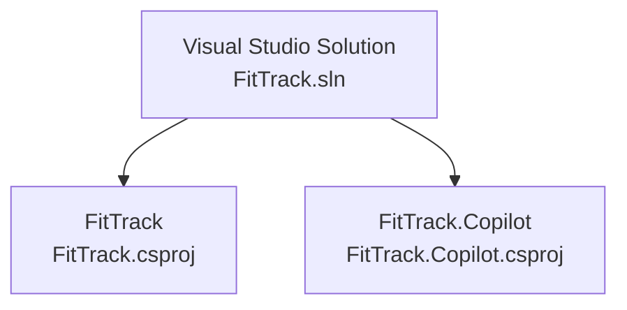
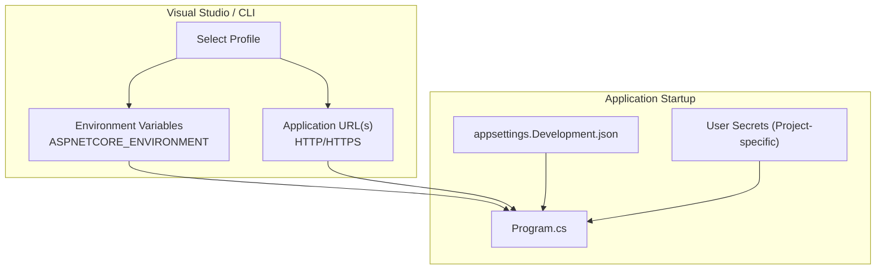
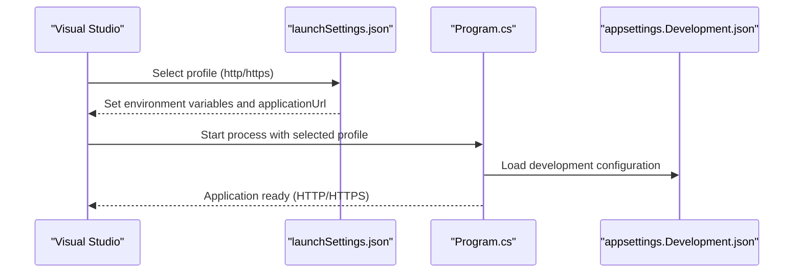
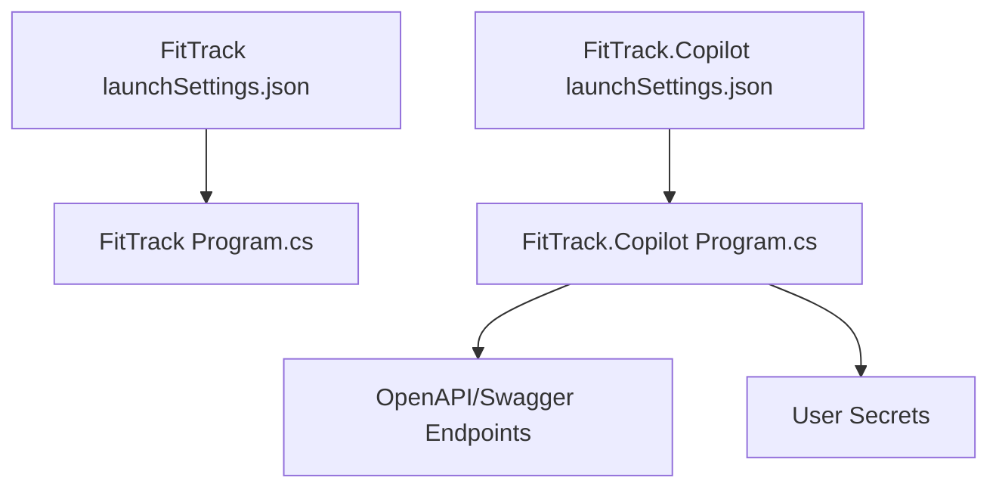

# Development Launch Configuration

<cite>
**Referenced Files in This Document**
- [FitTrack launchSettings.json](file://FitTrack/FitTrack/Properties/launchSettings.json)
- [FitTrack.Copilot launchSettings.json](file://FitTrack/FitTrack.Copilot/Properties/launchSettings.json)
- [FitTrack.sln](file://FitTrack/FitTrack.sln)
- [FitTrack.csproj](file://FitTrack/FitTrack/FitTrack.csproj)
- [FitTrack.Copilot.csproj](file://FitTrack/FitTrack.Copilot/FitTrack.Copilot.csproj)
- [FitTrack Program.cs](file://FitTrack/FitTrack/Program.cs)
- [FitTrack.Copilot Program.cs](file://FitTrack/FitTrack.Copilot/Program.cs)
- [FitTrack appsettings.Development.json](file://FitTrack/FitTrack/appsettings.Development.json)
- [FitTrack.Copilot appsettings.Development.json](file://FitTrack/FitTrack.Copilot/appsettings.Development.json)
- [FitTrack.Copilot food.http](file://FitTrack/FitTrack.Copilot/Api/food.http)
</cite>

## Table of Contents
1. [Introduction](#introduction)
2. [Project Structure](#project-structure)
3. [Core Components](#core-components)
4. [Architecture Overview](#architecture-overview)
5. [Detailed Component Analysis](#detailed-component-analysis)
6. [Dependency Analysis](#dependency-analysis)
7. [Performance Considerations](#performance-considerations)
8. [Troubleshooting Guide](#troubleshooting-guide)
9. [Conclusion](#conclusion)
10. [Appendices](#appendices)

## Introduction
This document explains how launchSettings.json configures application profiles for debugging in Visual Studio and command-line environments for the FitTrack solution. It focuses on:
- How profiles define commandName, launchUrl behavior, applicationUrl (HTTP/HTTPS), and environment variables
- How separate profiles enable independent testing of FitTrack and FitTrack.Copilot
- Practical customization examples for API testing, enabling SSL, and attaching debuggers
- Common issues such as missing profiles, port conflicts, and environment variable precedence
- Guidance for sharing launch settings across teams while protecting sensitive configuration

## Project Structure
The solution consists of two primary projects:
- FitTrack: Interactive server Blazor application with identity and local SQLite
- FitTrack.Copilot: AI-enabled Blazor application with OpenAPI/Swagger, identity, and local SQLite

Both projects include their own launchSettings.json under Properties, and the solution file defines both projects.

**Diagram sources**
- [FitTrack.sln](file://FitTrack/FitTrack.sln#L1-L23)

**Section sources**
- [FitTrack.sln](file://FitTrack/FitTrack.sln#L1-L23)
- [FitTrack.csproj](file://FitTrack/FitTrack/FitTrack.csproj#L1-L37)
- [FitTrack.Copilot.csproj](file://FitTrack/FitTrack.Copilot/FitTrack.Copilot.csproj#L1-L71)

## Core Components
- FitTrack launchSettings.json: Defines HTTP and HTTPS profiles for the main application
- FitTrack.Copilot launchSettings.json: Defines HTTP and HTTPS profiles for the Copilot application
- Environment variables: ASPNETCORE_ENVIRONMENT is set to Development in both profiles
- Application URLs: Each profile sets distinct host and port combinations for HTTP and HTTPS

Key behaviors:
- Profiles use commandName "Project" to run the project directly via dotnet run
- launchBrowser is enabled in both profiles to open the default browser automatically
- applicationUrl specifies the base URLs for the app (HTTP and/or HTTPS)
- Environment variables are scoped to the selected profile

**Section sources**
- [FitTrack launchSettings.json](file://FitTrack/FitTrack/Properties/launchSettings.json#L1-L24)
- [FitTrack.Copilot launchSettings.json](file://FitTrack/FitTrack.Copilot/Properties/launchSettings.json#L1-L24)

## Architecture Overview
The launch profiles integrate with the .NET runtime and ASP.NET Core hosting model. Visual Studio and CLI select a profile, which sets environment variables and applicationUrl, then starts the process. The application reads configuration from appsettings files and user secrets.

**Diagram sources**
- [FitTrack launchSettings.json](file://FitTrack/FitTrack/Properties/launchSettings.json#L1-L24)
- [FitTrack.Copilot launchSettings.json](file://FitTrack/FitTrack.Copilot/Properties/launchSettings.json#L1-L24)
- [FitTrack Program.cs](file://FitTrack/FitTrack/Program.cs#L1-L76)
- [FitTrack.Copilot Program.cs](file://FitTrack/FitTrack.Copilot/Program.cs#L1-L131)
- [FitTrack appsettings.Development.json](file://FitTrack/FitTrack/appsettings.Development.json#L1-L9)
- [FitTrack.Copilot appsettings.Development.json](file://FitTrack/FitTrack.Copilot/appsettings.Development.json#L1-L9)

## Detailed Component Analysis

### FitTrack launchSettings.json
- Profiles: http and https
- commandName: Project
- launchBrowser: true
- applicationUrl:
  - http: binds to a specific HTTP port
  - https: binds to both HTTPS and HTTP ports
- environmentVariables:
  - ASPNETCORE_ENVIRONMENT: Development

These settings enable:
- Quick debugging of the main FitTrack application
- Automatic browser launch
- Independent HTTP/HTTPS testing

**Section sources**
- [FitTrack launchSettings.json](file://FitTrack/FitTrack/Properties/launchSettings.json#L1-L24)

### FitTrack.Copilot launchSettings.json
- Profiles: http and https
- commandName: Project
- launchBrowser: true
- applicationUrl:
  - http: binds to a specific HTTP port
  - https: binds to both HTTPS and HTTP ports
- environmentVariables:
  - ASPNETCORE_ENVIRONMENT: Development

These settings enable:
- Independent debugging of the Copilot application
- Automatic browser launch
- OpenAPI/Swagger availability via mapped endpoints

**Section sources**
- [FitTrack.Copilot launchSettings.json](file://FitTrack/FitTrack.Copilot/Properties/launchSettings.json#L1-L24)

### Relationship Between Profiles and Projects
- FitTrack.sln defines both projects, so Visual Studio can switch between them and apply the respective launch profile
- Each project’s Program.cs initializes services, database migrations, HTTPS redirection, and endpoint mapping
- appsettings.Development.json controls logging levels for development mode

**Diagram sources**
- [FitTrack.sln](file://FitTrack/FitTrack.sln#L1-L23)
- [FitTrack launchSettings.json](file://FitTrack/FitTrack/Properties/launchSettings.json#L1-L24)
- [FitTrack.Copilot launchSettings.json](file://FitTrack/FitTrack.Copilot/Properties/launchSettings.json#L1-L24)
- [FitTrack Program.cs](file://FitTrack/FitTrack/Program.cs#L1-L76)
- [FitTrack.Copilot Program.cs](file://FitTrack/FitTrack.Copilot/Program.cs#L1-L131)
- [FitTrack appsettings.Development.json](file://FitTrack/FitTrack/appsettings.Development.json#L1-L9)
- [FitTrack.Copilot appsettings.Development.json](file://FitTrack/FitTrack.Copilot/appsettings.Development.json#L1-L9)

## Dependency Analysis
- Both applications rely on ASP.NET Core configuration and environment variables
- FitTrack.Copilot adds OpenAPI/Swagger and maps endpoints for API testing
- User secrets are loaded in the Copilot application for local configuration

**Diagram sources**
- [FitTrack launchSettings.json](file://FitTrack/FitTrack/Properties/launchSettings.json#L1-L24)
- [FitTrack.Copilot launchSettings.json](file://FitTrack/FitTrack.Copilot/Properties/launchSettings.json#L1-L24)
- [FitTrack Program.cs](file://FitTrack/FitTrack/Program.cs#L1-L76)
- [FitTrack.Copilot Program.cs](file://FitTrack/FitTrack.Copilot/Program.cs#L1-L131)

**Section sources**
- [FitTrack Program.cs](file://FitTrack/FitTrack/Program.cs#L1-L76)
- [FitTrack.Copilot Program.cs](file://FitTrack/FitTrack.Copilot/Program.cs#L1-L131)

## Performance Considerations
- Using HTTPS locally introduces overhead; prefer HTTP for rapid iteration when SSL is not required
- Enabling launchBrowser can speed up development cycles by reducing manual navigation steps
- Keeping applicationUrl minimal (only required ports) avoids unnecessary resource consumption

[No sources needed since this section provides general guidance]

## Troubleshooting Guide

### Profiles Not Detected
- Symptom: Visual Studio does not show expected profiles
- Causes:
  - Missing or malformed launchSettings.json
  - Incorrect project type or SDK
- Resolution:
  - Verify the Properties folder exists and contains launchSettings.json
  - Ensure the project targets the correct SDK and framework
  - Rebuild the solution after editing launchSettings.json

**Section sources**
- [FitTrack.launchSettings.json](file://FitTrack/FitTrack/Properties/launchSettings.json#L1-L24)
- [FitTrack.Copilot.launchSettings.json](file://FitTrack/FitTrack.Copilot/Properties/launchSettings.json#L1-L24)
- [FitTrack.csproj](file://FitTrack/FitTrack/FitTrack.csproj#L1-L37)
- [FitTrack.Copilot.csproj](file://FitTrack/FitTrack.Copilot/FitTrack.Copilot.csproj#L1-L71)

### Incorrect Port Bindings
- Symptom: Port already in use or binding fails
- Causes:
  - Another process occupies the configured port
  - Conflicting applicationUrl entries
- Resolution:
  - Change applicationUrl to an unused port in the desired profile
  - Use either HTTP or HTTPS in a given profile to avoid conflicts
  - Restart the application after changing ports

**Section sources**
- [FitTrack launchSettings.json](file://FitTrack/FitTrack/Properties/launchSettings.json#L1-L24)
- [FitTrack.Copilot launchSettings.json](file://FitTrack/FitTrack.Copilot/Properties/launchSettings.json#L1-L24)

### Environment Variable Precedence During Launch
- Symptom: Unexpected environment behavior
- Causes:
  - launchSettings.json environment variables override defaults
  - User secrets or machine-wide environment variables may conflict
- Resolution:
  - Confirm ASPNETCORE_ENVIRONMENT is set to Development in the selected profile
  - For sensitive values, prefer user secrets or environment variables set outside the repo
  - Use the correct profile to ensure intended environment variables are applied

**Section sources**
- [FitTrack launchSettings.json](file://FitTrack/FitTrack/Properties/launchSettings.json#L1-L24)
- [FitTrack.Copilot launchSettings.json](file://FitTrack/FitTrack.Copilot/Properties/launchSettings.json#L1-L24)
- [FitTrack Program.cs](file://FitTrack/FitTrack/Program.cs#L1-L76)
- [FitTrack.Copilot Program.cs](file://FitTrack/FitTrack.Copilot/Program.cs#L1-L131)

### Sharing Launch Settings Across Teams
- Best practices:
  - Commit launchSettings.json to source control for baseline configuration
  - Use user secrets for sensitive values (API keys, connection strings)
  - Document port choices and environment expectations
  - Avoid committing secrets; rely on user secrets or CI/CD secret stores
- Protection tips:
  - Keep applicationUrl ports within a known range
  - Prefer HTTPS for API testing when applicable
  - Use separate profiles for different environments (Dev, Test, Prod) if needed

**Section sources**
- [FitTrack launchSettings.json](file://FitTrack/FitTrack/Properties/launchSettings.json#L1-L24)
- [FitTrack.Copilot launchSettings.json](file://FitTrack/FitTrack.Copilot/Properties/launchSettings.json#L1-L24)
- [FitTrack Program.cs](file://FitTrack/FitTrack/Program.cs#L1-L76)
- [FitTrack.Copilot Program.cs](file://FitTrack/FitTrack.Copilot/Program.cs#L1-L131)

## Conclusion
The launchSettings.json files provide straightforward, repeatable debugging experiences for both FitTrack and FitTrack.Copilot. By leveraging profiles with distinct applicationUrl values and environment variables, developers can quickly switch between HTTP and HTTPS modes, enable automatic browser launches, and isolate configuration per project. Following the troubleshooting and sharing guidance ensures smooth collaboration and secure handling of sensitive configuration.

[No sources needed since this section summarizes without analyzing specific files]

## Appendices

### Appendix A: Example Customizations
- API Testing:
  - Use the Copilot application’s HTTPS profile to exercise OpenAPI/Swagger endpoints
  - Reference the Copilot HTTP sample request file for endpoint examples
- Enabling SSL:
  - Choose the https profile in each project to bind HTTPS and HTTP ports
- Attaching Debuggers:
  - Visual Studio will attach automatically when launching via the selected profile
  - Ensure the correct project is set as startup project in the solution

**Section sources**
- [FitTrack.Copilot launchSettings.json](file://FitTrack/FitTrack.Copilot/Properties/launchSettings.json#L1-L24)
- [FitTrack.Copilot food.http](file://FitTrack/FitTrack.Copilot/Api/food.http#L1-L16)
- [FitTrack Program.cs](file://FitTrack/FitTrack/Program.cs#L1-L76)
- [FitTrack.Copilot Program.cs](file://FitTrack/FitTrack.Copilot/Program.cs#L1-L131)