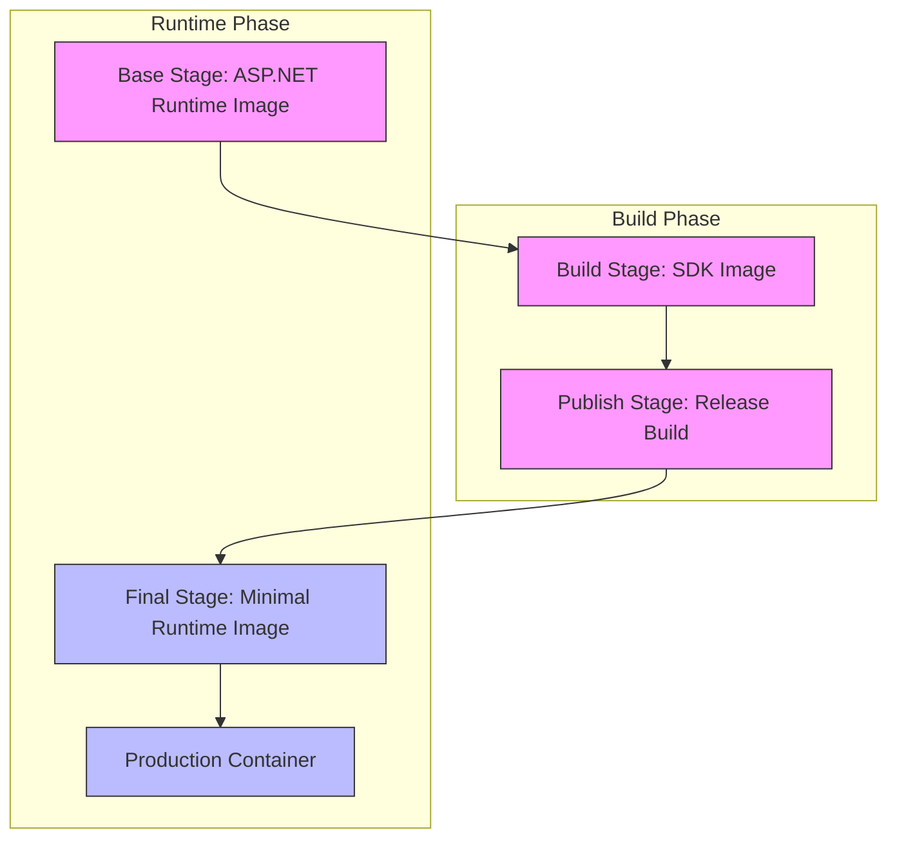
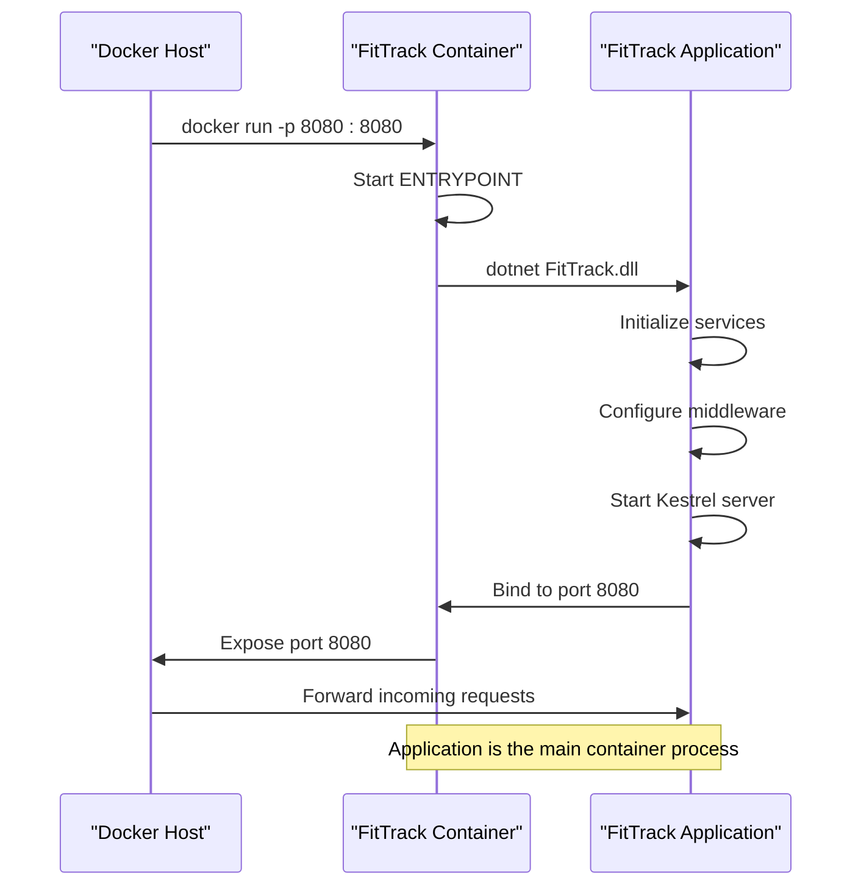
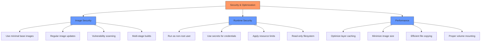

# Docker Configuration

<cite>
**Referenced Files in This Document**   
- [Dockerfile](file://FitTrack/FitTrack/Dockerfile)
- [Dockerfile](file://FitTrack/FitTrack.Copilot/Dockerfile)
- [appsettings.json](file://FitTrack/FitTrack/appsettings.json)
- [appsettings.json](file://FitTrack/FitTrack.Copilot/appsettings.json)
- [FitTrack.csproj](file://FitTrack/FitTrack/FitTrack.csproj)
- [FitTrack.Copilot.csproj](file://FitTrack/FitTrack.Copilot/FitTrack.Copilot.csproj)
- [Program.cs](file://FitTrack/FitTrack.Copilot/Program.cs)
- [.dockerignore](file://FitTrack/.dockerignore)
</cite>

## Table of Contents
1. [Introduction](#introduction)
2. [Dockerfile Analysis](#dockerfile-analysis)
3. [Multi-Stage Build Process](#multi-stage-build-process)
4. [Base Image Selection](#base-image-selection)
5. [Working Directory and File Copying Strategy](#working-directory-and-file-copying-strategy)
6. [Port Exposure and Entry Point Configuration](#port-exposure-and-entry-point-configuration)
7. [SQLite Database Persistence and Volume Mounting](#sqlite-database-persistence-and-volume-mounting)
8. [Environment Variable Injection for API Keys](#environment-variable-injection-for-api-keys)
9. [Docker Build and Run Commands](#docker-build-and-run-commands)
10. [Best Practices for Container Security and Optimization](#best-practices-for-container-security-and-optimization)
11. [Health Check Configuration](#health-check-configuration)
12. [Common Deployment Issues and Solutions](#common-deployment-issues-and-solutions)

## Introduction
This document provides a comprehensive analysis of the Docker configuration for the FitTrack application, a .NET-based web application with AI-powered nutrition tracking capabilities. The documentation covers the Docker setup for both the main FitTrack application and the FitTrack.Copilot service, focusing on containerization best practices, multi-stage builds, database persistence, environment configuration, and deployment considerations. The goal is to provide developers and DevOps engineers with a complete understanding of how to build, run, and maintain the FitTrack application in containerized environments.

## Dockerfile Analysis
The FitTrack application utilizes Docker for containerization, with separate Dockerfiles for the main application and the Copilot service. Both Dockerfiles follow identical patterns and configurations, reflecting a consistent containerization strategy across the application components. The Dockerfiles implement a multi-stage build process to optimize image size and security, using official Microsoft .NET images as base layers. The configuration exposes ports 8080 and 8081 for application access and sets up appropriate working directories for build and runtime operations.

**Section sources**
- [Dockerfile](file://FitTrack/FitTrack/Dockerfile#L1-L24)
- [Dockerfile](file://FitTrack/FitTrack.Copilot/Dockerfile#L1-L24)

## Multi-Stage Build Process
The Docker configuration implements a four-stage build process designed to optimize both build efficiency and final image size:

1. **Base Stage**: Establishes the runtime environment using the ASP.NET Runtime image
2. **Build Stage**: Sets up the SDK environment for compiling the application
3. **Publish Stage**: Compiles and publishes the application in release configuration
4. **Final Stage**: Creates the minimal runtime image by copying only published artifacts

This approach separates the build dependencies from the runtime environment, resulting in smaller, more secure production images. The build process first restores NuGet packages using a targeted copy of the project file, then copies all source code and performs the full build. The final image contains only the published application binaries, eliminating build tools and intermediate files.



**Diagram sources**
- [Dockerfile](file://FitTrack/FitTrack/Dockerfile#L1-L24)
- [Dockerfile](file://FitTrack/FitTrack.Copilot/Dockerfile#L1-L24)

**Section sources**
- [Dockerfile](file://FitTrack/FitTrack/Dockerfile#L7-L18)
- [Dockerfile](file://FitTrack/FitTrack.Copilot/Dockerfile#L7-L18)

## Base Image Selection
The Docker configuration uses Microsoft's official .NET container images from the Microsoft Container Registry (mcr.microsoft.com). The base image for the runtime environment is `mcr.microsoft.com/dotnet/aspnet:9.0`, which provides the minimal runtime components required to run .NET applications. For the build stage, the configuration uses `mcr.microsoft.com/dotnet/sdk:9.0`, which includes the full .NET SDK necessary for compiling and publishing the application.

This image selection strategy ensures compatibility with .NET 9.0, the target framework specified in both the FitTrack and FitTrack.Copilot project files. Using official Microsoft images provides security updates, performance optimizations, and compatibility guarantees. The images are based on Linux distributions, as indicated by the `DockerDefaultTargetOS` property set to "Linux" in both project files.

```mermaid
classDiagram
class AspNetRuntimeImage {
+string Tag : 9.0
+string Registry : mcr.microsoft.com
+string Purpose : Runtime environment
+string Size : Smaller
+Contains : ASP.NET Core runtime
+Contains : .NET runtime
+Contains : ICU libraries
}
class SdkImage {
+string Tag : 9.0
+string Registry : mcr.microsoft.com
+string Purpose : Build environment
+string Size : Larger
+Contains : .NET SDK
+Contains : NuGet CLI
+Contains : MSBuild
+Contains : Development tools
}
AspNetRuntimeImage <|-- SdkImage : "extends"
note right of AspNetRuntimeImage
Used in base and final stages
Minimal footprint for production
end note
note right of SdkImage
Used in build and publish stages
Full development toolchain
end note
```

**Diagram sources**
- [Dockerfile](file://FitTrack/FitTrack/Dockerfile#L1-L7)
- [Dockerfile](file://FitTrack/FitTrack.Copilot/Dockerfile#L1-L7)
- [FitTrack.csproj](file://FitTrack/FitTrack/FitTrack.csproj#L4)
- [FitTrack.Copilot.csproj](file://FitTrack/FitTrack.Copilot/FitTrack.Copilot.csproj#L4)

**Section sources**
- [Dockerfile](file://FitTrack/FitTrack/Dockerfile#L1)
- [Dockerfile](file://FitTrack/FitTrack.Copilot/Dockerfile#L1)
- [FitTrack.csproj](file://FitTrack/FitTrack/FitTrack.csproj#L4)
- [FitTrack.Copilot.csproj](file://FitTrack/FitTrack.Copilot/FitTrack.Copilot.csproj#L4)

## Working Directory and File Copying Strategy
The Docker configuration implements a strategic approach to working directories and file copying to optimize build performance and layer caching. The build stage uses `/src` as the working directory, while the runtime stages use `/app`. This separation prevents conflicts between build artifacts and runtime files.

The file copying strategy follows best practices for Docker layer optimization:
1. First, only the project file is copied to restore NuGet packages
2. Then, all source code is copied for the build process
3. Finally, published artifacts are copied from the publish stage to the final image

This approach leverages Docker's layer caching mechanism, ensuring that package restoration only occurs when project dependencies change, rather than on every code change. The .dockerignore file (referenced in both project files) ensures that unnecessary files like local configuration and build artifacts are excluded from the image.

**Section sources**
- [Dockerfile](file://FitTrack/FitTrack/Dockerfile#L3-L12)
- [Dockerfile](file://FitTrack/FitTrack.Copilot/Dockerfile#L3-L12)
- [FitTrack.csproj](file://FitTrack/FitTrack/FitTrack.csproj#L28-L30)
- [FitTrack.Copilot.csproj](file://FitTrack/FitTrack.Copilot/FitTrack.Copilot.csproj#L52-L54)

## Port Exposure and Entry Point Configuration
The Docker configuration exposes two ports: 8080 and 8081, which are configured in the base stage of both Dockerfiles. These ports are likely used for the main application interface and potentially for health checks or management endpoints. The entry point is configured to run the .NET application using the `dotnet` command with the appropriate DLL file.

For the main FitTrack application, the entry point is `dotnet FitTrack.dll`, while for the FitTrack.Copilot service, it's `dotnet FitTrack.Copilot.dll`. This configuration allows the containers to start the application automatically when launched. The use of the `ENTRYPOINT` instruction ensures that the application is the primary process in the container, which is important for proper signal handling and container lifecycle management.



**Diagram sources**
- [Dockerfile](file://FitTrack/FitTrack/Dockerfile#L4-L5)
- [Dockerfile](file://FitTrack/FitTrack/Dockerfile#L23)
- [Dockerfile](file://FitTrack/FitTrack.Copilot/Dockerfile#L4-L5)
- [Dockerfile](file://FitTrack/FitTrack.Copilot/Dockerfile#L23)

**Section sources**
- [Dockerfile](file://FitTrack/FitTrack/Dockerfile#L4-L5)
- [Dockerfile](file://FitTrack/FitTrack/Dockerfile#L23)
- [Dockerfile](file://FitTrack/FitTrack.Copilot/Dockerfile#L4-L5)
- [Dockerfile](file://FitTrack/FitTrack.Copilot/Dockerfile#L23)

## SQLite Database Persistence and Volume Mounting
The FitTrack application uses SQLite for data persistence, with the database file located at `Data/app.db` as specified in the connection strings in both `appsettings.json` files. The project files explicitly configure this file to be copied to the output directory and excluded from single-file publishing, ensuring it's accessible in the container environment.

For production deployments, the database file should be volume-mounted to preserve data across container restarts and updates. Without volume mounting, the database would be ephemeral, with all data lost when the container is recreated. The recommended approach is to mount a host directory or Docker volume to `/app/Data` within the container, ensuring that the `app.db` file persists independently of the container lifecycle.

```mermaid
graph TD
A["Host System"] --> B["Docker Engine"]
B --> C["FitTrack Container"]
D["Persistent Storage"] --> |Volume Mount| C
C --> E["Application Process"]
C --> F["Data Directory: /app/Data"]
F --> G["app.db"]
H["Host Directory /data/fittrack"] --> |Mounted to| F
style D fill:#f96,stroke:#333
style F fill:#6f9,stroke:#333
style H fill:#f96,stroke:#333
note right of D
Data persists beyond
container lifecycle
end note
note left of F
Container's view of
the database location
end note
```

**Diagram sources**
- [appsettings.json](file://FitTrack/FitTrack/appsettings.json#L3)
- [appsettings.json](file://FitTrack/FitTrack.Copilot/appsettings.json#L3)
- [FitTrack.csproj](file://FitTrack/FitTrack/FitTrack.csproj#L11-L13)
- [FitTrack.Copilot.csproj](file://FitTrack/FitTrack.Copilot/FitTrack.Copilot.csproj#L11-L13)

**Section sources**
- [appsettings.json](file://FitTrack/FitTrack/appsettings.json#L3)
- [appsettings.json](file://FitTrack/FitTrack.Copilot/appsettings.json#L3)
- [FitTrack.csproj](file://FitTrack/FitTrack/FitTrack.csproj#L11-L13)

## Environment Variable Injection for API Keys
The FitTrack.Copilot service requires API keys for AI services and the USDA food database, which are configured as empty strings in the `appsettings.json` file. These sensitive credentials should be injected at runtime using environment variables or container orchestration secrets rather than being hardcoded in configuration files.

The application is designed to accept these values through configuration, allowing them to be overridden by environment variables. For example, the AI API key can be set using the environment variable `AI__ApiKey`, leveraging .NET's configuration system hierarchy. In container orchestration platforms like Kubernetes or Docker Compose, these values should be provided as secrets to ensure they are not exposed in plain text.

```mermaid
flowchart LR
A["Secrets Management"] --> B["Container Orchestration"]
B --> C["FitTrack.Copilot Container"]
D["Environment Variables"] --> C
E["Configuration Files"] --> C
C --> F["Application Configuration"]
F --> G["AI Service Client"]
F --> H["USDA API Client"]
style A fill:#f96,stroke:#333
style D fill:#69f,stroke:#333
style E fill:#69f,stroke:#333
style C fill:#bbf,stroke:#333
subgraph "Secure Configuration"
A
D
end
subgraph "Less Secure"
E
end
note above of A
Recommended approach
using orchestration secrets
end note
note above of E
Not recommended for
production environments
end note
```

**Diagram sources**
- [appsettings.json](file://FitTrack/FitTrack.Copilot/appsettings.json#L15)
- [appsettings.json](file://FitTrack/FitTrack.Copilot/appsettings.json#L51)
- [CopilotServiceCollectionExtensions.cs](file://FitTrack/FitTrack.Copilot/Extension/CopilotServiceCollectionExtensions.cs#L31-L33)

**Section sources**
- [appsettings.json](file://FitTrack/FitTrack.Copilot/appsettings.json#L12-L15)
- [appsettings.json](file://FitTrack/FitTrack.Copilot/appsettings.json#L50-L52)
- [CopilotServiceCollectionExtensions.cs](file://FitTrack/FitTrack.Copilot/Extension/CopilotServiceCollectionExtensions.cs#L31-L33)

## Docker Build and Run Commands
The following commands are tailored for building and running the FitTrack application in containerized environments:

**Building the FitTrack application:**
```bash
docker build -f FitTrack/FitTrack/Dockerfile -t fittrack-app .
```

**Building the FitTrack.Copilot service:**
```bash
docker build -f FitTrack/FitTrack.Copilot/Dockerfile -t fittrack-copilot .
```

**Running the FitTrack application with database persistence:**
```bash
docker run -d \
  -p 8080:8080 \
  -v ./fittrack-data:/app/Data \
  --name fittrack \
  fittrack-app
```

**Running the FitTrack.Copilot service with API keys:**
```bash
docker run -d \
  -p 8080:8080 \
  -p 8081:8081 \
  -v ./fittrack-data:/app/Data \
  -e "AI__ApiKey=your-azure-openai-key" \
  -e "USDA__ApiKey=your-usda-api-key" \
  --name fittrack-copilot \
  fittrack-copilot
```

**Using Docker Compose for both services:**
```yaml
version: '3.8'
services:
  fittrack:
    build:
      context: .
      dockerfile: FitTrack/FitTrack/Dockerfile
    ports:
      - "8080:8080"
    volumes:
      - fittrack_data:/app/Data
    depends_on:
      - copilot

  copilot:
    build:
      context: .
      dockerfile: FitTrack/FitTrack.Copilot/Dockerfile
    ports:
      - "8081:8081"
    volumes:
      - fittrack_data:/app/Data
    environment:
      - AI__ApiKey=${AI_API_KEY}
      - USDA__ApiKey=${USDA_API_KEY}

volumes:
  fittrack_data:
```

**Section sources**
- [Dockerfile](file://FitTrack/FitTrack/Dockerfile)
- [Dockerfile](file://FitTrack/FitTrack.Copilot/Dockerfile)
- [appsettings.json](file://FitTrack/FitTrack.Copilot/appsettings.json)

## Best Practices for Container Security and Optimization
The FitTrack Docker configuration can be further optimized by implementing several container security and optimization best practices:

1. **Minimal Base Images**: Consider using Alpine-based images for even smaller footprint, though compatibility with .NET applications must be verified.

2. **Non-Root User**: The Dockerfile uses `USER $APP_UID`, which is a good practice for running containers as non-root users, reducing potential security risks.

3. **Image Size Reduction**: The multi-stage build already optimizes image size, but additional layers can be consolidated to reduce the final image footprint.

4. **Regular Updates**: Ensure base images are regularly updated to incorporate security patches.

5. **Secrets Management**: Never store API keys in configuration files; always use environment variables or orchestration platform secrets.

6. **Resource Limits**: Apply CPU and memory limits in production to prevent resource exhaustion.

7. **Security Scanning**: Integrate container image scanning into the CI/CD pipeline to detect vulnerabilities.

8. **Read-Only Filesystem**: Where possible, run containers with read-only filesystems, mounting only necessary directories as writable.



**Diagram sources**
- [Dockerfile](file://FitTrack/FitTrack/Dockerfile#L2)
- [Dockerfile](file://FitTrack/FitTrack.Copilot/Dockerfile#L2)
- [appsettings.json](file://FitTrack/FitTrack.Copilot/appsettings.json#L15)
- [appsettings.json](file://FitTrack/FitTrack.Copilot/appsettings.json#L51)

**Section sources**
- [Dockerfile](file://FitTrack/FitTrack/Dockerfile#L2)
- [Dockerfile](file://FitTrack/FitTrack.Copilot/Dockerfile#L2)
- [appsettings.json](file://FitTrack/FitTrack.Copilot/appsettings.json#L12-L15)

## Health Check Configuration
While the current Docker configuration does not explicitly define health checks, implementing proper health checks is crucial for production deployments. Health checks allow container orchestration platforms to monitor application status and perform automatic recovery when issues are detected.

Recommended health check configuration for FitTrack:

```dockerfile
HEALTHCHECK --interval=30s --timeout=3s --start-period=5s --retries=3 \
  CMD curl -f http://localhost:8080/health || exit 1
```

Alternatively, using a script-based approach:

```dockerfile
COPY healthcheck.sh /healthcheck.sh
RUN chmod +x /healthcheck.sh
HEALTHCHECK --interval=30s --timeout=3s --start-period=5s --retries=3 \
  CMD /healthcheck.sh
```

With healthcheck.sh:
```bash
#!/bin/sh
curl -f http://localhost:8080/health && \
curl -f http://localhost:8080/ready
```

The application should implement health endpoints that check database connectivity and other critical dependencies. This ensures that the container is only considered healthy when it can actually serve requests.

**Section sources**
- [Dockerfile](file://FitTrack/FitTrack/Dockerfile)
- [Dockerfile](file://FitTrack/FitTrack.Copilot/Dockerfile)

## Common Deployment Issues and Solutions
When deploying FitTrack in containerized environments, several common issues may arise:

**1. File Permission Errors:**
- **Issue**: The application cannot write to the database file when volume-mounted.
- **Solution**: Ensure the container user (specified by $APP_UID) has write permissions to the mounted volume. Set appropriate ownership on the host directory:
```bash
chown -R 1000:1000 ./fittrack-data
```

**2. Port Conflicts:**
- **Issue**: Port 8080 or 8081 is already in use on the host.
- **Solution**: Either stop the conflicting service or map to different host ports:
```bash
docker run -p 8082:8080 fittrack-app
```

**3. Configuration Binding Issues:**
- **Issue**: Environment variables are not properly bound to configuration.
- **Solution**: Ensure variable names use double underscores for nested configuration:
```bash
-e "AI__ApiKey=your-key"  # Correct
-e "AI:ApiKey=your-key"   # May not work in all environments
```

**4. Database Migration Issues:**
- **Issue**: Database schema is not updated when the application starts.
- **Solution**: Implement automatic migration execution in the application startup or run migrations as a separate step before starting the application.

**5. Volume Mounting Problems:**
- **Issue**: Data is not persisting despite volume mounting.
- **Solution**: Verify the mount path matches the application's expected data directory (`/app/Data`) and check file permissions.

**6. Memory and Performance Issues:**
- **Issue**: The container consumes excessive memory.
- **Solution**: Set memory limits and monitor application performance, adjusting .NET runtime settings as needed.

**Section sources**
- [Dockerfile](file://FitTrack/FitTrack/Dockerfile#L2)
- [appsettings.json](file://FitTrack/FitTrack/appsettings.json#L3)
- [Dockerfile](file://FitTrack/FitTrack.Copilot/Dockerfile#L4-L5)