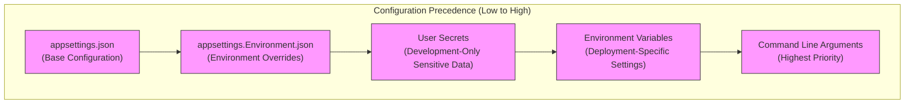
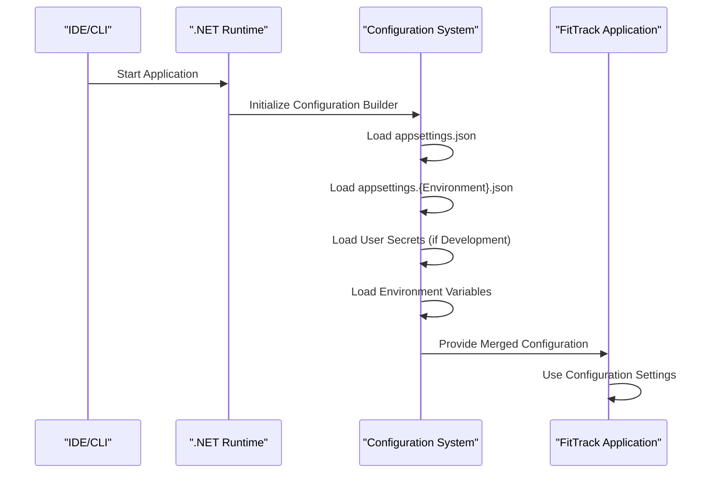
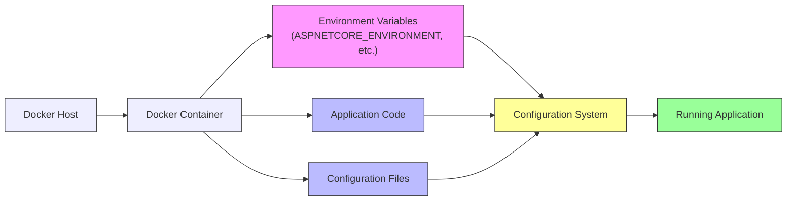

# Environment-Specific Configuration

<cite>
**Referenced Files in This Document**   
- [appsettings.json](file://FitTrack/FitTrack/appsettings.json)
- [appsettings.Development.json](file://FitTrack/FitTrack/appsettings.Development.json)
- [launchSettings.json](file://FitTrack/FitTrack/Properties/launchSettings.json)
- [Program.cs](file://FitTrack/FitTrack/Program.cs)
- [appsettings.json](file://FitTrack/FitTrack.Copilot/appsettings.json)
- [appsettings.Development.json](file://FitTrack/FitTrack.Copilot/appsettings.Development.json)
- [launchSettings.json](file://FitTrack/FitTrack.Copilot/Properties/launchSettings.json)
- [Program.cs](file://FitTrack/FitTrack.Copilot/Program.cs)
- [Dockerfile](file://FitTrack/FitTrack/Dockerfile)
- [Dockerfile](file://FitTrack/FitTrack.Copilot/Dockerfile)
</cite>

## Table of Contents
1. [Introduction](#introduction)
2. [Configuration Hierarchy Overview](#configuration-hierarchy-overview)
3. [Base Configuration (appsettings.json)](#base-configuration-appsettingsjson)
4. [Development Overrides (appsettings.Development.json)](#development-overrides-appsettingsdevelopmentjson)
5. [Environment Detection and launchSettings.json](#environment-detection-and-launchsettingsjson)
6. [User Secrets for Sensitive Data](#user-secrets-for-sensitive-data)
7. [Environment Variables and Docker Configuration](#environment-variables-and-docker-configuration)
8. [Creating Custom Environments](#creating-custom-environments)
9. [Configuration Loading Process](#configuration-loading-process)
10. [Common Configuration Issues](#common-configuration-issues)

## Introduction
This document provides comprehensive guidance on environment-specific configuration in the FitTrack application. It explains how the .NET configuration system works within the FitTrack ecosystem, covering the hierarchy of configuration sources, environment-specific overrides, and best practices for managing settings across different deployment scenarios. The documentation focuses on the configuration mechanisms used in both the main FitTrack application and the FitTrack.Copilot service, highlighting how settings are layered and merged to provide appropriate behavior for development, staging, and production environments.

## Configuration Hierarchy Overview
The FitTrack applications follow the standard .NET configuration hierarchy, where settings are loaded from multiple sources with a specific precedence order. Settings from sources lower in the hierarchy override those from higher sources, allowing for environment-specific customization without modifying base configuration files.



**Diagram sources**
- [Program.cs](file://FitTrack/FitTrack/Program.cs#L19-L42)
- [Program.cs](file://FitTrack/FitTrack.Copilot/Program.cs#L19-L47)

**Section sources**
- [Program.cs](file://FitTrack/FitTrack/Program.cs#L19-L42)
- [Program.cs](file://FitTrack/FitTrack.Copilot/Program.cs#L19-L47)

## Base Configuration (appsettings.json)
The base configuration file (appsettings.json) contains default settings that apply across all environments. This file is committed to source control and provides the foundational configuration for the application. In FitTrack, this includes database connection strings, logging levels, AI service endpoints, and other application-wide settings.

For the main FitTrack application, the base configuration includes:
- SQLite database connection using a relative path
- Default logging levels for application and ASP.NET Core components
- Allowed hosts configuration

For the FitTrack.Copilot service, the base configuration additionally includes:
- AI service endpoints and model identifiers
- USDA API integration settings
- Chat and performance monitoring options
- Semantic Kernel plugin configurations

The base configuration serves as the starting point, with environment-specific files providing overrides for particular deployment scenarios.

**Section sources**
- [appsettings.json](file://FitTrack/FitTrack/appsettings.json#L1-L13)
- [appsettings.json](file://FitTrack/FitTrack.Copilot/appsettings.json#L1-L55)

## Development Overrides (appsettings.Development.json)
The appsettings.Development.json file provides environment-specific overrides for the Development environment. This file is used to customize behavior during development without affecting other environments. In the FitTrack applications, the development configuration files are minimal, primarily maintaining the same logging configuration as the base settings.

The primary role of appsettings.Development.json is to:
- Override logging levels for more detailed debugging output
- Specify alternative database paths for local development
- Configure mocked or local AI endpoints instead of production services
- Enable enhanced debugging features and developer tools

In the current implementation, both FitTrack and FitTrack.Copilot have appsettings.Development.json files that only specify logging configurations, inheriting other settings from the base appsettings.json file. This follows the principle of minimal necessary overrides, keeping development configuration focused on debugging and diagnostics.

```mermaid
classDiagram
class appsettings.json {
+ConnectionStrings
+Logging
+AllowedHosts
+AI Settings
+USDA Settings
}
class appsettings.Development.json {
+Logging (Overrides)
+Developer Tools
+Local Database Path
}
class appsettings.Staging.json {
+Performance Monitoring
+Staging API Endpoints
+Limited Logging
}
class appsettings.Production.json {
+Secure Connection Strings
+Minimal Logging
+Production Endpoints
}
appsettings.json <|-- appsettings.Development.json
appsettings.json <|-- appsettings.Staging.json
appsettings.json <|-- appsettings.Production.json
note right of appsettings.Development.json
Used for local development
Overrides base settings for debugging
Not deployed to production
end note
```

**Diagram sources**
- [appsettings.Development.json](file://FitTrack/FitTrack/appsettings.Development.json#L1-L8)
- [appsettings.Development.json](file://FitTrack/FitTrack.Copilot/appsettings.Development.json#L1-L8)

**Section sources**
- [appsettings.Development.json](file://FitTrack/FitTrack/appsettings.Development.json#L1-L8)
- [appsettings.Development.json](file://FitTrack/FitTrack.Copilot/appsettings.Development.json#L1-L8)

## Environment Detection and launchSettings.json
The launchSettings.json file in the Properties directory configures how the application is launched from Visual Studio or the .NET CLI. This file sets the ASPNETCORE_ENVIRONMENT variable, which determines which environment-specific configuration file is loaded.

In both FitTrack and FitTrack.Copilot, the launchSettings.json file:
- Defines multiple launch profiles (http and https)
- Sets the ASPNETCORE_ENVIRONMENT variable to "Development"
- Configures application URLs for local development
- Enables browser launching and .NET runtime messages

The environment variable setting in launchSettings.json takes precedence over any other environment variable settings when running from Visual Studio or with dotnet run, ensuring consistent development environment detection. This mechanism allows developers to work in the Development environment by default, automatically loading the appropriate configuration overrides.



**Diagram sources**
- [launchSettings.json](file://FitTrack/FitTrack/Properties/launchSettings.json#L1-L23)
- [launchSettings.json](file://FitTrack/FitTrack.Copilot/Properties/launchSettings.json#L1-L23)

**Section sources**
- [launchSettings.json](file://FitTrack/FitTrack/Properties/launchSettings.json#L1-L23)
- [launchSettings.json](file://FitTrack/FitTrack.Copilot/Properties/launchSettings.json#L1-L23)

## User Secrets for Sensitive Data
User Secrets provide a secure way to store sensitive configuration data during development without committing it to source control. In FitTrack.Copilot, the Program.cs file explicitly adds user secrets to the configuration pipeline using AddUserSecrets<Program>(), demonstrating this security practice.

User Secrets should be used for:
- API keys and authentication tokens
- Database connection strings with credentials
- Third-party service credentials
- Any other sensitive information that should not be version-controlled

To manage user secrets in FitTrack:
1. Initialize the user secrets store: `dotnet user-secrets init`
2. Set a secret: `dotnet user-secrets set "AI:ApiKey" "your-api-key"`
3. Access the secret in code: `builder.Configuration["AI:ApiKey"]`

The user secrets JSON file is stored outside the project directory in the user profile, preventing accidental inclusion in source control. This approach follows security best practices by separating sensitive credentials from code and configuration files.

**Section sources**
- [Program.cs](file://FitTrack/FitTrack.Copilot/Program.cs#L21-L22)

## Environment Variables and Docker Configuration
Environment variables provide another layer of configuration that can override settings from JSON files. They are particularly important in containerized deployments using Docker.

The Dockerfiles for both FitTrack and FitTrack.Copilot:
- Use the standard .NET 9.0 ASP.NET runtime image
- Expose ports 8080 and 8081 for HTTP and HTTPS
- Copy published application files to the container
- Set the entry point to run the application DLL

When deploying to Docker or other container orchestration systems, environment variables can be used to:
- Override database connection strings
- Set the ASPNETCORE_ENVIRONMENT variable
- Configure AI service endpoints and keys
- Adjust logging levels for production monitoring

For Docker deployments, environment variables can be set in docker-compose.yml files or through orchestration platforms like Kubernetes, allowing for environment-specific configuration without rebuilding container images.



**Diagram sources**
- [Dockerfile](file://FitTrack/FitTrack/Dockerfile#L1-L24)
- [Dockerfile](file://FitTrack/FitTrack.Copilot/Dockerfile#L1-L24)

**Section sources**
- [Dockerfile](file://FitTrack/FitTrack/Dockerfile#L1-L24)
- [Dockerfile](file://FitTrack/FitTrack.Copilot/Dockerfile#L1-L24)

## Creating Custom Environments
The .NET configuration system supports custom environments beyond the standard Development, Staging, and Production. To create a custom environment like "Staging" for FitTrack:

1. Create a new configuration file: appsettings.Staging.json
2. Add environment-specific settings (e.g., staging database, limited logging)
3. Configure the environment variable in deployment settings

Custom environments follow the same naming convention: appsettings.{EnvironmentName}.json. The environment name is case-insensitive and can be set through:
- launchSettings.json for development
- Docker environment variables
- Azure App Service configuration
- Kubernetes deployment manifests

For example, a staging environment might have:
- Connection strings pointing to a staging database
- AI endpoints configured for a staging AI service
- Performance monitoring enabled but detailed logging reduced
- Security settings closer to production than development

## Configuration Loading Process
The configuration loading process in FitTrack follows the standard .NET pattern, with configuration providers added in a specific order to establish the precedence hierarchy. The process begins in Program.cs, where the WebApplicationBuilder is created and configuration sources are added.

The loading sequence is:
1. appsettings.json - Base configuration
2. appsettings.{Environment}.json - Environment-specific overrides
3. User Secrets - Development-only sensitive data
4. Environment variables - Deployment-specific settings
5. Command line arguments - Highest priority overrides

Each subsequent source can override settings from previous sources, with the last value winning. This layered approach allows for flexible configuration management across different environments while maintaining a clean separation of concerns.

**Section sources**
- [Program.cs](file://FitTrack/FitTrack/Program.cs#L9-L42)
- [Program.cs](file://FitTrack/FitTrack.Copilot/Program.cs#L19-L47)

## Common Configuration Issues
Several common issues can occur with configuration in FitTrack applications:

**Configuration Not Being Applied**
- Verify the ASPNETCORE_ENVIRONMENT variable is set correctly
- Check file naming: appsettings.Development.json (not appsettings.development.json)
- Ensure the environment-specific file is included in the project
- Validate JSON syntax in configuration files

**Incorrect Environment Detection**
- Check launchSettings.json for correct environment variable setting
- Verify environment variables in Docker or hosting environment
- Use `Console.WriteLine(builder.Environment.EnvironmentName)` for debugging
- Ensure no conflicting environment variables are set at the system level

**Debugging Configuration Loading Order**
- Examine the configuration sources in Program.cs
- Use logging to output configuration values during startup
- Check that User Secrets are properly initialized
- Verify environment variable names follow the correct format (colon notation for nested properties)

The configuration system's layered approach provides flexibility but requires careful attention to precedence rules and environment detection to ensure the correct settings are applied in each deployment scenario.

**Section sources**
- [Program.cs](file://FitTrack/FitTrack/Program.cs#L53-L62)
- [Program.cs](file://FitTrack/FitTrack.Copilot/Program.cs#L108-L117)
- [launchSettings.json](file://FitTrack/FitTrack/Properties/launchSettings.json#L1-L23)
- [launchSettings.json](file://FitTrack/FitTrack.Copilot/Properties/launchSettings.json#L1-L23)