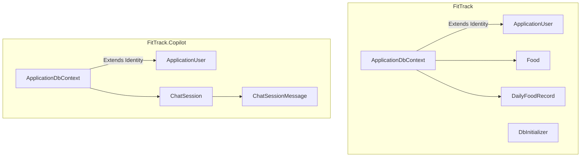
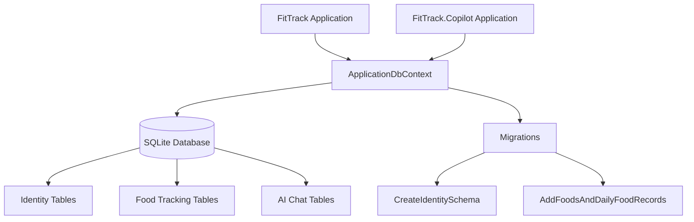
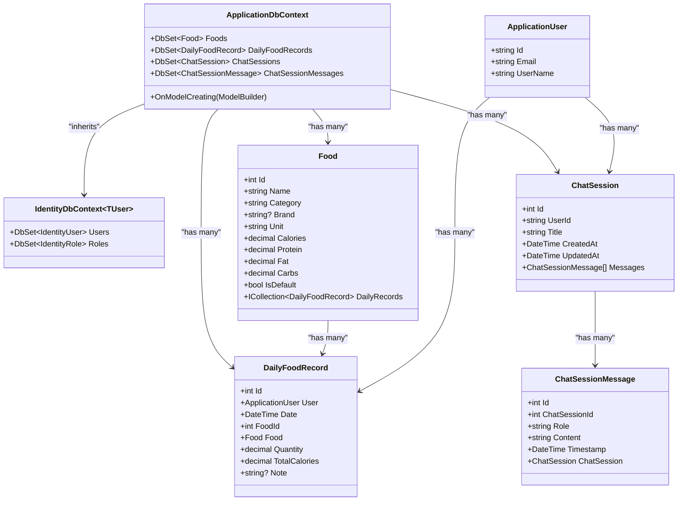
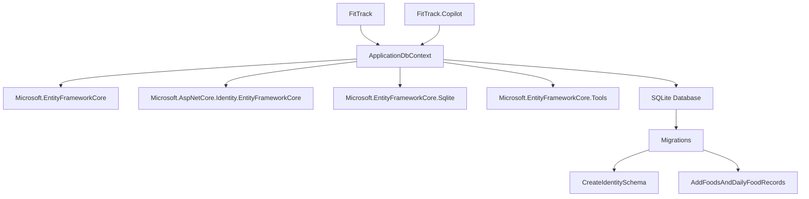

# ApplicationDbContext

<cite>
**Referenced Files in This Document**   
- [ApplicationDbContext.cs](file://FitTrack/FitTrack/Data/ApplicationDbContext.cs)
- [ApplicationDbContext.cs](file://FitTrack/FitTrack.Copilot/Data/ApplicationDbContext.cs)
- [Food.cs](file://FitTrack/FitTrack/Data/Food.cs)
- [DailyFoodRecord.cs](file://FitTrack/FitTrack/Data/DailyFoodRecord.cs)
- [ChatSession.cs](file://FitTrack/FitTrack.Copilot/Data/ChatSession.cs)
- [DbInitializer.cs](file://FitTrack/FitTrack/Data/DbInitializer.cs)
- [AddFoodsAndDailyFoodRecords.cs](file://FitTrack/FitTrack/Data/Migrations/20250826084318_AddFoodsAndDailyFoodRecords.cs)
- [ApplicationDbContextModelSnapshot.cs](file://FitTrack/FitTrack/Data/Migrations/ApplicationDbContextModelSnapshot.cs)
- [CreateIdentitySchema.cs](file://FitTrack/FitTrack/Data/Migrations/00000000000000_CreateIdentitySchema.cs)
- [ApplicationUser.cs](file://FitTrack/FitTrack/Data/ApplicationUser.cs)
- [ApplicationUser.cs](file://FitTrack/FitTrack.Copilot/Data/ApplicationUser.cs)
</cite>

## Table of Contents
1. [Introduction](#introduction)
2. [Project Structure](#project-structure)
3. [Core Components](#core-components)
4. [Architecture Overview](#architecture-overview)
5. [Detailed Component Analysis](#detailed-component-analysis)
6. [Dependency Analysis](#dependency-analysis)
7. [Performance Considerations](#performance-considerations)
8. [Troubleshooting Guide](#troubleshooting-guide)
9. [Conclusion](#conclusion)

## Introduction
The `ApplicationDbContext` class serves as the central data access point for both the FitTrack and FitTrack.Copilot applications, implementing Entity Framework Core's `DbContext` to manage entity data, relationships, and database interactions. This document provides comprehensive architectural documentation for the context, detailing its role in managing food tracking, user records, and AI-powered chat sessions across two interconnected projects. The shared context pattern enables consistent identity management while allowing project-specific data models to coexist within a unified database schema.

## Project Structure
The repository contains two main projects: FitTrack (core fitness tracking) and FitTrack.Copilot (AI assistant functionality). Both projects share the same database context pattern but extend it for their specific domains. The data layer is organized under the `Data` directory in each project, containing the `ApplicationDbContext`, entity models, migrations, and initialization logic.



**Diagram sources**
- [ApplicationDbContext.cs](file://FitTrack/FitTrack/Data/ApplicationDbContext.cs)
- [ApplicationDbContext.cs](file://FitTrack/FitTrack.Copilot/Data/ApplicationDbContext.cs)
- [Food.cs](file://FitTrack/FitTrack/Data/Food.cs)
- [DailyFoodRecord.cs](file://FitTrack/FitTrack/Data/DailyFoodRecord.cs)
- [ChatSession.cs](file://FitTrack/FitTrack.Copilot/Data/ChatSession.cs)

**Section sources**
- [ApplicationDbContext.cs](file://FitTrack/FitTrack/Data/ApplicationDbContext.cs)
- [ApplicationDbContext.cs](file://FitTrack/FitTrack.Copilot/Data/ApplicationDbContext.cs)

## Core Components
The `ApplicationDbContext` class in both projects inherits from `IdentityDbContext<ApplicationUser>` and provides `DbSet` properties for domain-specific entities. The FitTrack context manages food and daily consumption records, while the Copilot context handles AI chat sessions and messages. Both contexts share the same `ApplicationUser` identity model, enabling unified authentication and user management across applications.

**Section sources**
- [ApplicationDbContext.cs](file://FitTrack/FitTrack/Data/ApplicationDbContext.cs#L6-L16)
- [ApplicationDbContext.cs](file://FitTrack/FitTrack.Copilot/Data/ApplicationDbContext.cs#L6-L33)

## Architecture Overview
The architecture follows a shared database context pattern where two applications access the same database with specialized data models. This approach enables feature separation while maintaining data consistency and reducing duplication. The EF Core context serves as the single source of truth for data access, with migrations managed through EF Core tools.



**Diagram sources**
- [ApplicationDbContext.cs](file://FitTrack/FitTrack/Data/ApplicationDbContext.cs)
- [ApplicationDbContext.cs](file://FitTrack/FitTrack.Copilot/Data/ApplicationDbContext.cs)
- [CreateIdentitySchema.cs](file://FitTrack/FitTrack/Data/Migrations/00000000000000_CreateIdentitySchema.cs)
- [AddFoodsAndDailyFoodRecords.cs](file://FitTrack/FitTrack/Data/Migrations/20250826084318_AddFoodsAndDailyFoodRecords.cs)

## Detailed Component Analysis

### ApplicationDbContext Analysis
The `ApplicationDbContext` class implements EF Core's `DbContext` pattern to provide a strongly-typed interface for database operations. In FitTrack, it manages food and consumption data, while in FitTrack.Copilot, it handles AI chat sessions. Both contexts inherit from `IdentityDbContext<ApplicationUser>`, leveraging ASP.NET Core Identity for authentication.

#### For Object-Oriented Components:


**Diagram sources**
- [ApplicationDbContext.cs](file://FitTrack/FitTrack/Data/ApplicationDbContext.cs)
- [Food.cs](file://FitTrack/FitTrack/Data/Food.cs)
- [DailyFoodRecord.cs](file://FitTrack/FitTrack/Data/DailyFoodRecord.cs)
- [ChatSession.cs](file://FitTrack/FitTrack.Copilot/Data/ChatSession.cs)
- [ApplicationUser.cs](file://FitTrack/FitTrack/Data/ApplicationUser.cs)

**Section sources**
- [ApplicationDbContext.cs](file://FitTrack/FitTrack/Data/ApplicationDbContext.cs#L6-L16)
- [ApplicationDbContext.cs](file://FitTrack/FitTrack.Copilot/Data/ApplicationDbContext.cs#L6-L33)

### Entity Configuration and Relationships
The entity relationships are configured through data annotations and the `OnModelCreating` method. The FitTrack context uses data annotations for basic configuration, while the Copilot context uses fluent API for more complex relationships. The shared `ApplicationUser` entity enables unified identity management across both applications.

```mermaid
erDiagram
ApplicationUser ||--o{ DailyFoodRecord : "consumes"
ApplicationUser ||--o{ ChatSession : "owns"
Food ||--o{ DailyFoodRecord : "has"
ChatSession ||--o{ ChatSessionMessage : "contains"
ApplicationUser {
string Id PK
string Email
string UserName
}
Food {
int Id PK
string Name
string Category
string? Brand
decimal Calories
decimal Protein
decimal Fat
decimal Carbs
bool IsDefault
}
DailyFoodRecord {
int Id PK
string UserId FK
int FoodId FK
DateTime Date
decimal Quantity
decimal TotalCalories
string? Note
}
ChatSession {
int Id PK
string UserId FK
string Title
DateTime CreatedAt
DateTime UpdatedAt
}
ChatSessionMessage {
int Id PK
int ChatSessionId FK
string Role
string Content
DateTime Timestamp
}
```

**Diagram sources**
- [Food.cs](file://FitTrack/FitTrack/Data/Food.cs)
- [DailyFoodRecord.cs](file://FitTrack/FitTrack/Data/DailyFoodRecord.cs)
- [ChatSession.cs](file://FitTrack/FitTrack.Copilot/Data/ChatSession.cs)
- [ApplicationUser.cs](file://FitTrack/FitTrack/Data/ApplicationUser.cs)

**Section sources**
- [Food.cs](file://FitTrack/FitTrack/Data/Food.cs#L6-L41)
- [DailyFoodRecord.cs](file://FitTrack/FitTrack/Data/DailyFoodRecord.cs#L6-L28)
- [ChatSession.cs](file://FitTrack/FitTrack.Copilot/Data/ChatSession.cs#L5-L37)

## Dependency Analysis
The `ApplicationDbContext` has dependencies on EF Core packages and shares the database with both applications. The migration strategy ensures schema consistency across deployments. The context is registered in the dependency injection container and used throughout the application for data access.



**Diagram sources**
- [FitTrack.csproj](file://FitTrack/FitTrack/FitTrack.csproj)
- [FitTrack.Copilot.csproj](file://FitTrack/FitTrack.Copilot/FitTrack.Copilot.csproj)
- [ApplicationDbContext.cs](file://FitTrack/FitTrack/Data/ApplicationDbContext.cs)
- [ApplicationDbContext.cs](file://FitTrack/FitTrack.Copilot/Data/ApplicationDbContext.cs)

**Section sources**
- [FitTrack.csproj](file://FitTrack/FitTrack/FitTrack.csproj)
- [FitTrack.Copilot.csproj](file://FitTrack/FitTrack.Copilot/FitTrack.Copilot.csproj)

## Performance Considerations
The application uses SQLite with connection pooling and async database operations to optimize performance. The `DbInitializer` class implements efficient bulk operations for seeding default food data. The context is designed to support async queries throughout the application stack, minimizing blocking operations. The shared context pattern reduces database connections and improves resource utilization.

## Troubleshooting Guide
Common issues include migration conflicts when both applications modify the shared database, and initialization errors when `foods.json` is missing. Ensure migrations are applied in the correct order and that the `wwwroot/foods.json` file exists for data seeding. Use EF Core tools to manage migrations and validate the database schema.

**Section sources**
- [DbInitializer.cs](file://FitTrack/FitTrack/Data/DbInitializer.cs#L7-L40)
- [AddFoodsAndDailyFoodRecords.cs](file://FitTrack/FitTrack/Data/Migrations/20250826084318_AddFoodsAndDailyFoodRecords.cs)
- [ApplicationDbContextModelSnapshot.cs](file://FitTrack/FitTrack/Data/Migrations/ApplicationDbContextModelSnapshot.cs)

## Conclusion
The `ApplicationDbContext` serves as the central data access layer for both FitTrack and FitTrack.Copilot applications, providing a unified interface for managing user identity, food tracking, and AI chat sessions. The shared context pattern enables code reuse and data consistency while allowing project-specific extensions. The migration strategy and initialization process ensure reliable database setup and maintenance. This architecture supports extensibility, performance optimization, and maintainability across the application ecosystem.