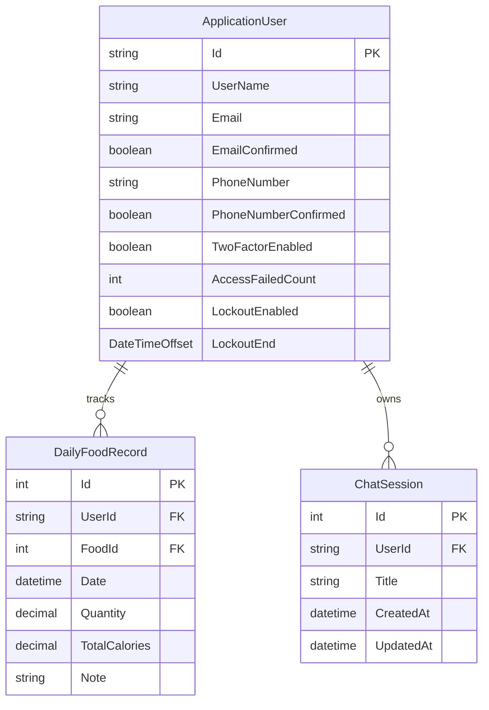
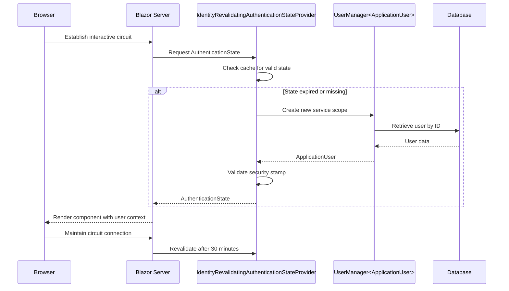
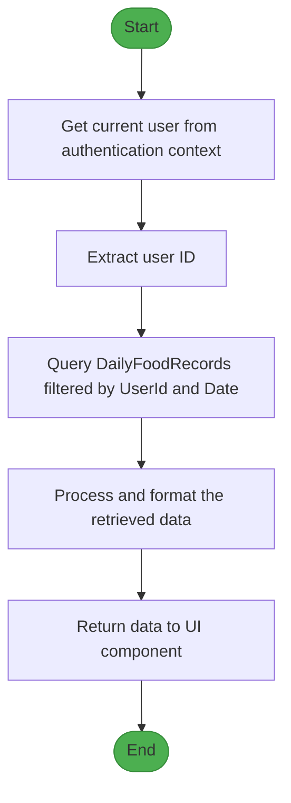
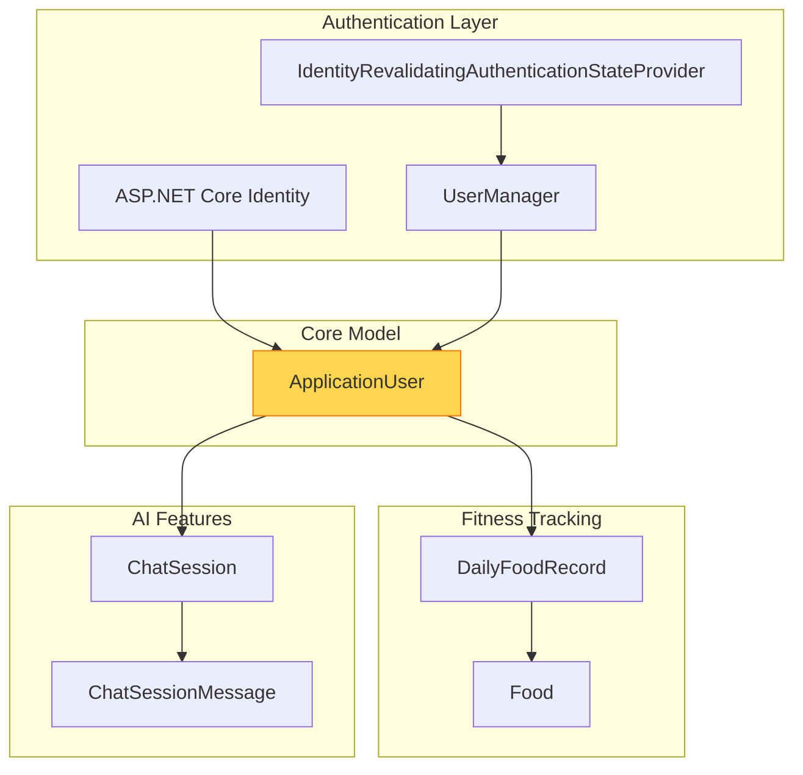

# ApplicationUser Model

<cite>
**Referenced Files in This Document**   
- [ApplicationUser.cs](file://FitTrack/FitTrack/Data/ApplicationUser.cs)
- [ApplicationDbContext.cs](file://FitTrack/FitTrack/Data/ApplicationDbContext.cs)
- [DailyFoodRecord.cs](file://FitTrack/FitTrack/Data/DailyFoodRecord.cs)
- [ChatSession.cs](file://FitTrack/FitTrack.Copilot/Data/ChatSession.cs)
- [IdentityRevalidatingAuthenticationStateProvider.cs](file://FitTrack/FitTrack/Components/Account/IdentityRevalidatingAuthenticationStateProvider.cs)
- [Program.cs](file://FitTrack/FitTrack/Program.cs)
- [20250826084318_AddFoodsAndDailyFoodRecords.cs](file://FitTrack/FitTrack/Data/Migrations/20250826084318_AddFoodsAndDailyFoodRecords.cs)
</cite>

## Table of Contents
1. [Introduction](#introduction)
2. [Core Properties of ApplicationUser](#core-properties-of-applicationuser)
3. [Relationships with Other Entities](#relationships-with-other-entities)
4. [Integration with ASP.NET Core Identity](#integration-with-aspnet-core-identity)
5. [Security and Privacy Considerations](#security-and-privacy-considerations)
6. [Data Querying and Access Patterns](#data-querying-and-access-patterns)
7. [Architecture Overview](#architecture-overview)
8. [Conclusion](#conclusion)

## Introduction

The `ApplicationUser` entity serves as the core identity model in the FitTrack application, extending the base `IdentityUser` class from ASP.NET Core Identity to support personalized fitness tracking functionality. This model acts as the central user representation across both the main application and the Copilot module, enabling secure authentication and personalized data management. While the current implementation does not include custom profile fields directly within the class definition, the architecture is designed to allow for future extension with personalized fitness attributes. The user entity establishes relationships with key domain models such as food consumption records and chat sessions, forming the foundation of the application's personalized experience.

**Section sources**
- [ApplicationUser.cs](file://FitTrack/FitTrack/Data/ApplicationUser.cs#L7)
- [ApplicationUser.cs](file://FitTrack/FitTrack.Copilot/Data/ApplicationUser.cs#L6)

## Core Properties of ApplicationUser

The `ApplicationUser` class inherits all essential properties from the `IdentityUser<string>` base class, providing a comprehensive set of authentication and user management capabilities. Key properties include:

- **Id**: Unique identifier for the user (inherited from IdentityUser)
- **UserName**: User's display name and login identifier
- **Email**: Primary email address used for authentication and communication
- **EmailConfirmed**: Boolean flag indicating whether the user's email has been verified
- **PhoneNumber**: Optional contact number for two-factor authentication
- **PhoneNumberConfirmed**: Boolean flag indicating phone number verification status
- **TwoFactorEnabled**: Controls whether the user has two-factor authentication enabled
- **LockoutEnd**: Timestamp indicating when a locked account will be automatically unlocked
- **LockoutEnabled**: Boolean flag determining if lockout functionality is active for the user
- **AccessFailedCount**: Counter tracking consecutive failed login attempts

These inherited properties provide a robust foundation for user authentication and security management. Although the current implementation does not define additional custom properties within the `ApplicationUser` class, the design pattern follows Microsoft's recommended approach by leaving the class open for extension with personalized fitness tracking attributes such as age, gender, weight, height, and activity level when needed.

**Section sources**
- [ApplicationUser.cs](file://FitTrack/FitTrack/Data/ApplicationUser.cs#L7)
- [20250826084318_AddFoodsAndDailyFoodRecords.cs](file://FitTrack/FitTrack/Data/Migrations/20250826084318_AddFoodsAndDailyFoodRecords.Designer.cs#L23-L74)

## Relationships with Other Entities

The `ApplicationUser` entity establishes critical relationships with other domain models in the fitness tracking system, enabling personalized data management and user-specific functionality.

### DailyFoodRecord Relationship

The `ApplicationUser` maintains a one-to-many relationship with the `DailyFoodRecord` entity, allowing users to track their daily food consumption. This relationship is established through the `UserId` foreign key in the `DailyFoodRecords` table, which references the `Id` property of the `ApplicationUser`. Each `DailyFoodRecord` entry captures specific food items consumed by a user on a particular date, along with quantity and nutritional information. This relationship enables comprehensive dietary tracking and analysis features within the application.

### ChatSession Relationship

In the Copilot module, the `ApplicationUser` connects to the `ChatSession` entity through the `UserId` property. This relationship allows users to maintain personalized AI-assisted conversations for nutrition guidance and fitness advice. Each chat session is associated with a specific user, ensuring data privacy and enabling context-aware interactions across multiple sessions. The relationship supports features like conversation history, personalized recommendations, and continuity in user-AI interactions.

**Diagram sources**
- [ApplicationUser.cs](file://FitTrack/FitTrack/Data/ApplicationUser.cs#L7)
- [DailyFoodRecord.cs](file://FitTrack/FitTrack/Data/DailyFoodRecord.cs#L12)
- [ChatSession.cs](file://FitTrack/FitTrack.Copilot/Data/ChatSession.cs#L10)

**Section sources**
- [DailyFoodRecord.cs](file://FitTrack/FitTrack/Data/DailyFoodRecord.cs#L12)
- [ChatSession.cs](file://FitTrack/FitTrack.Copilot/Data/ChatSession.cs#L10)
- [20250826084318_AddFoodsAndDailyFoodRecords.cs](file://FitTrack/FitTrack/Data/Migrations/20250826084318_AddFoodsAndDailyFoodRecords.cs#L41-L43)

## Integration with ASP.NET Core Identity

The `ApplicationUser` model is fully integrated with ASP.NET Core Identity, leveraging the framework's robust authentication and authorization capabilities while extending them for the fitness tracking domain.

### Identity Configuration

In the `Program.cs` file, the application configures ASP.NET Core Identity with the `ApplicationUser` as the user model. The configuration includes adding identity cookies, setting up the database context, and registering the custom authentication state provider. The `AddIdentityCore<ApplicationUser>` method initializes the identity system with the custom user class, while `AddEntityFrameworkStores<ApplicationDbContext>` connects it to the application's data persistence layer.

### Authentication State Management

The application implements a custom `IdentityRevalidatingAuthenticationStateProvider` that extends `RevalidatingServerAuthenticationStateProvider`. This provider enhances security by revalidating the user's security stamp every 30 minutes when an interactive circuit is connected. This periodic revalidation helps protect against account compromise by detecting changes to the user's account (such as password changes or role modifications) and ensuring the authentication state remains current.

**Diagram sources**
- [Program.cs](file://FitTrack/FitTrack/Program.cs#L18)
- [IdentityRevalidatingAuthenticationStateProvider.cs](file://FitTrack/FitTrack/Components/Account/IdentityRevalidatingAuthenticationStateProvider.cs#L12)
- [ApplicationDbContext.cs](file://FitTrack/FitTrack/Data/ApplicationDbContext.cs#L7)

**Section sources**
- [Program.cs](file://FitTrack/FitTrack/Program.cs#L15-L36)
- [IdentityRevalidatingAuthenticationStateProvider.cs](file://FitTrack/FitTrack/Components/Account/IdentityRevalidatingAuthenticationStateProvider.cs#L12)
- [ApplicationDbContext.cs](file://FitTrack/FitTrack/Data/ApplicationDbContext.cs#L7)

## Security and Privacy Considerations

The `ApplicationUser` implementation addresses critical security and privacy requirements, particularly important for a fitness application handling personal health information.

### Data Protection

The application follows ASP.NET Core Identity's built-in security practices, including secure password hashing using PBKDF2 by default, protection against account enumeration attacks, and secure token generation for password reset and email confirmation workflows. The `SecurityStamp` property is used to detect changes to the user's account and trigger revalidation of the authentication state, helping to mitigate risks associated with account compromise.

### Privacy Compliance

For GDPR and other privacy regulations, the application provides standard identity management features through the Account/Manage pages, including the ability to download personal data and delete personal information. The architecture supports data minimization principles by storing only essential user information in the identity system, with more detailed fitness data stored in separate entities that can be managed according to privacy requirements.

### Personal Health Information Handling

While the current `ApplicationUser` model does not store explicit health metrics, the architecture is designed to support such data when needed. Any future addition of health-related properties (such as age, weight, or medical conditions) should be implemented with appropriate security measures, including encryption at rest, strict access controls, and audit logging. The separation of identity data from fitness tracking data in different but related entities supports a defense-in-depth approach to data protection.

**Section sources**
- [ApplicationUser.cs](file://FitTrack/FitTrack/Data/ApplicationUser.cs#L7)
- [IdentityRevalidatingAuthenticationStateProvider.cs](file://FitTrack/FitTrack/Components/Account/IdentityRevalidatingAuthenticationStateProvider.cs#L18)
- [Program.cs](file://FitTrack/FitTrack/Program.cs#L33-L36)

## Data Querying and Access Patterns

The application implements standard patterns for accessing user-specific data, leveraging Entity Framework Core's capabilities for efficient data retrieval.

### User Data Access

The `UserManager<ApplicationUser>` service provides the primary interface for user management operations, including user retrieval, creation, and modification. For Blazor components, the `IdentityUserAccessor` class provides a convenient method to retrieve the current user from the HTTP context, handling cases where the user cannot be loaded by redirecting to an error page.

### Querying User-Specific Data

To retrieve user-specific fitness data, the application typically follows a pattern of first obtaining the current user's ID and then querying related entities with appropriate filtering. For example, to retrieve a user's daily food records for a specific date:

This access pattern ensures that users can only retrieve their own data, enforcing data isolation at the application level. The use of the user ID as a filter in all data queries prevents unauthorized access to other users' information.

**Diagram sources**
- [IdentityUserAccessor.cs](file://FitTrack/FitTrack/Components/Account/IdentityUserAccessor.cs#L10)
- [DailyFoodRecord.cs](file://FitTrack/FitTrack/Data/DailyFoodRecord.cs#L12)

**Section sources**
- [IdentityUserAccessor.cs](file://FitTrack/FitTrack/Components/Account/IdentityUserAccessor.cs#L10)
- [ApplicationDbContext.cs](file://FitTrack/FitTrack/Data/ApplicationDbContext.cs#L11)

## Architecture Overview

The `ApplicationUser` entity sits at the center of the FitTrack application architecture, connecting authentication, fitness tracking, and AI-assisted features.

This architecture demonstrates a clean separation of concerns, with the `ApplicationUser` serving as the anchor point that connects the authentication system with the application's domain-specific features. The model leverages ASP.NET Core Identity for robust user management while extending its capabilities to support the fitness tracking use case through relationships with domain entities.

**Diagram sources**
- [ApplicationUser.cs](file://FitTrack/FitTrack/Data/ApplicationUser.cs#L7)
- [ApplicationDbContext.cs](file://FitTrack/FitTrack/Data/ApplicationDbContext.cs#L7)
- [DailyFoodRecord.cs](file://FitTrack/FitTrack/Data/DailyFoodRecord.cs#L12)
- [ChatSession.cs](file://FitTrack/FitTrack.Copilot/Data/ChatSession.cs#L5)

## Conclusion

The `ApplicationUser` model in the FitTrack application provides a solid foundation for user identity management in a fitness tracking context. By extending ASP.NET Core Identity's `IdentityUser` class, it inherits a robust set of authentication and security features while remaining extensible for future personalized fitness attributes. The model's relationships with `DailyFoodRecord` and `ChatSession` entities enable comprehensive user-specific data tracking across both nutritional and AI-assisted features. The integration with `IdentityRevalidatingAuthenticationStateProvider` enhances security through periodic authentication state validation, and the overall architecture supports privacy compliance and secure handling of personal information. This design allows the application to scale with additional user profile features while maintaining security and performance.