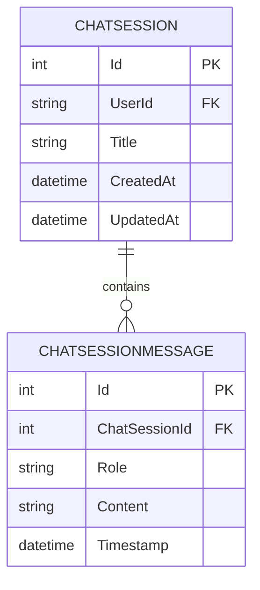
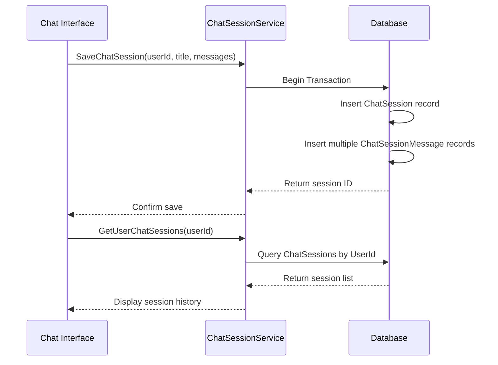

# ChatSession Model

<cite>
**Referenced Files in This Document**   
- [ChatSession.cs](file://FitTrack.Copilot/Data/ChatSession.cs)
- [ApplicationDbContext.cs](file://FitTrack.Copilot/Data/ApplicationDbContext.cs)
- [Chat.razor](file://FitTrack.Copilot/Components/Pages/Chat.razor)
- [Chat.razor.cs](file://FitTrack.Copilot/Components/Pages/Chat.razor.cs)
- [ChatSessionService.cs](file://FitTrack.Copilot/Service/ChatSessionService.cs)
</cite>

## Table of Contents
1. [Introduction](#introduction)
2. [Core Properties](#core-properties)
3. [Entity Relationships](#entity-relationships)
4. [Usage in Chat Interface](#usage-in-chat-interface)
5. [Session Management API](#session-management-api)
6. [Performance Considerations](#performance-considerations)
7. [Data Privacy and Compliance](#data-privacy-and-compliance)
8. [Conclusion](#conclusion)

## Introduction
The ChatSession entity in FitTrack.Copilot serves as the persistent storage mechanism for AI conversation history within the Calorie Chat feature. It maintains contextual continuity across user interactions by storing complete conversation threads associated with individual users. This documentation details the model structure, relationships, usage patterns, and operational considerations for the ChatSession entity.

**Section sources**
- [ChatSession.cs](file://FitTrack.Copilot/Data/ChatSession.cs#L5-L20)

## Core Properties
The ChatSession model contains essential properties for tracking conversation metadata and history:

- **Id**: Integer primary key that uniquely identifies each chat session
- **UserId**: String identifier that links the session to a specific user (required, indexed)
- **Title**: User-visible title for the conversation (required, max 200 characters)
- **CreatedAt**: Timestamp of session creation, defaults to UTC time
- **UpdatedAt**: Timestamp of last modification, defaults to UTC time and updated on changes
- **Messages**: Navigation collection containing all messages in the conversation

These properties enable efficient retrieval and organization of user conversations while maintaining essential metadata for display and sorting purposes.

**Section sources**
- [ChatSession.cs](file://FitTrack.Copilot/Data/ChatSession.cs#L7-L19)

## Entity Relationships
The ChatSession entity participates in a one-to-many relationship with ChatSessionMessage entities, forming the complete conversation history. The relationship is configured with referential integrity and cascade delete behavior.

**Diagram sources**
- [ChatSession.cs](file://FitTrack.Copilot/Data/ChatSession.cs#L5-L37)
- [ApplicationDbContext.cs](file://FitTrack.Copilot/Data/ApplicationDbContext.cs#L15-L32)

## Usage in Chat Interface
The ChatSession model integrates with the Chat.razor component to maintain conversation state during user interactions. While the UI uses a transient ChatMessage model for rendering, this is ultimately persisted to ChatSession and ChatSessionMessage entities through the session service.

The Chat component manages conversation flow by:
- Displaying message history from the current session
- Capturing user input and AI responses
- Updating the session title and metadata
- Providing controls for session management (clear, delete)

The in-memory message collection is synchronized with persistent storage through the ChatSessionService, ensuring conversation continuity across sessions.

**Section sources**
- [Chat.razor](file://FitTrack.Copilot/Components/Pages/Chat.razor#L1-L124)
- [Chat.razor.cs](file://FitTrack.Copilot/Components/Pages/Chat.razor.cs#L1-L174)

## Session Management API
The IChatSessionService interface defines the contract for managing chat sessions, providing methods for CRUD operations:

- **SaveChatSessionAsync**: Creates a new session with user ID, title, and message history
- **GetChatSessionAsync**: Retrieves a specific session by ID for a given user
- **GetUserChatSessionsAsync**: Lists all sessions for a user, typically ordered by CreatedAt
- **DeleteChatSessionAsync**: Removes a session and all associated messages (cascade delete)
- **UpdateChatSessionAsync**: Updates session content and metadata

These operations ensure proper user isolation by requiring userId parameters on all operations, preventing unauthorized access to other users' conversations.

**Diagram sources**
- [ChatSessionService.cs](file://FitTrack.Copilot/Service/ChatSessionService.cs#L11-L18)
- [ApplicationDbContext.cs](file://FitTrack.Copilot/Data/ApplicationDbContext.cs#L10-L12)

## Performance Considerations
The ChatSession implementation includes several performance optimizations:

- **Indexing**: A database index on UserId enables efficient retrieval of user-specific sessions
- **Cascade Delete**: Configured deletion behavior ensures related messages are automatically removed when a session is deleted
- **Data Size Management**: Message content is stored as required fields without size limits, but application logic should enforce reasonable conversation lengths
- **Retrieval Patterns**: Recent sessions are typically retrieved with ordering by CreatedAt or UpdatedAt for chronological display

The model design balances performance needs with functional requirements, using integer primary keys for efficient indexing and foreign key relationships. The navigation property allows eager loading of complete conversations when needed.

**Section sources**
- [ApplicationDbContext.cs](file://FitTrack.Copilot/Data/ApplicationDbContext.cs#L20-L21)
- [ChatSession.cs](file://FitTrack.Copilot/Data/ChatSession.cs#L19-L20)

## Data Privacy and Compliance
The ChatSession model handles sensitive conversational data and requires appropriate privacy considerations:

- **User Isolation**: All operations require userId verification to prevent cross-user data access
- **Personal Data**: Conversation content may contain personal dietary information and should be treated as personal data
- **Retention Policies**: While not explicitly defined in the model, business requirements may necessitate data retention limits for AI-generated content
- **Deletion**: Complete removal of sessions and messages supports user data deletion requests

The implementation follows security best practices by enforcing user context on all data access operations through the service layer, ensuring that users can only access their own conversation history.

**Section sources**
- [ChatSessionService.cs](file://FitTrack.Copilot/Service/ChatSessionService.cs#L13-L17)
- [ChatSession.cs](file://FitTrack.Copilot/Data/ChatSession.cs#L10-L13)

## Conclusion
The ChatSession entity provides a robust foundation for maintaining AI conversation history in FitTrack.Copilot. Its design supports the core requirements of the Calorie Chat feature by preserving context across interactions while ensuring data integrity and user isolation. The model's relationship with ChatSessionMessage entities enables complete conversation storage, and the supporting service layer provides a clean API for session management. With appropriate indexing and cascade operations, the implementation balances performance with functionality, while the security model protects user privacy through strict access controls.