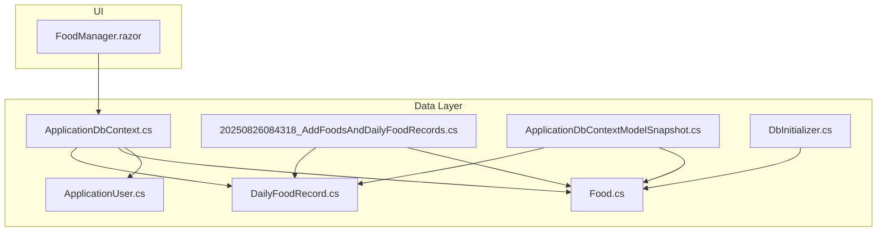
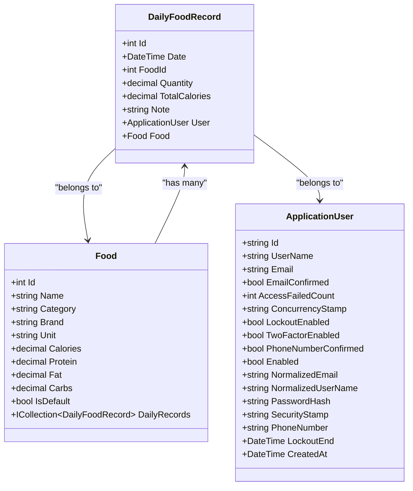
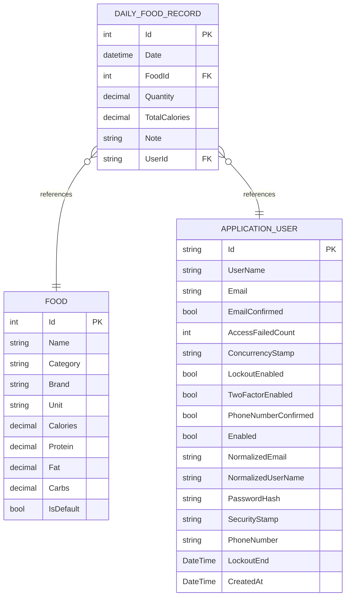
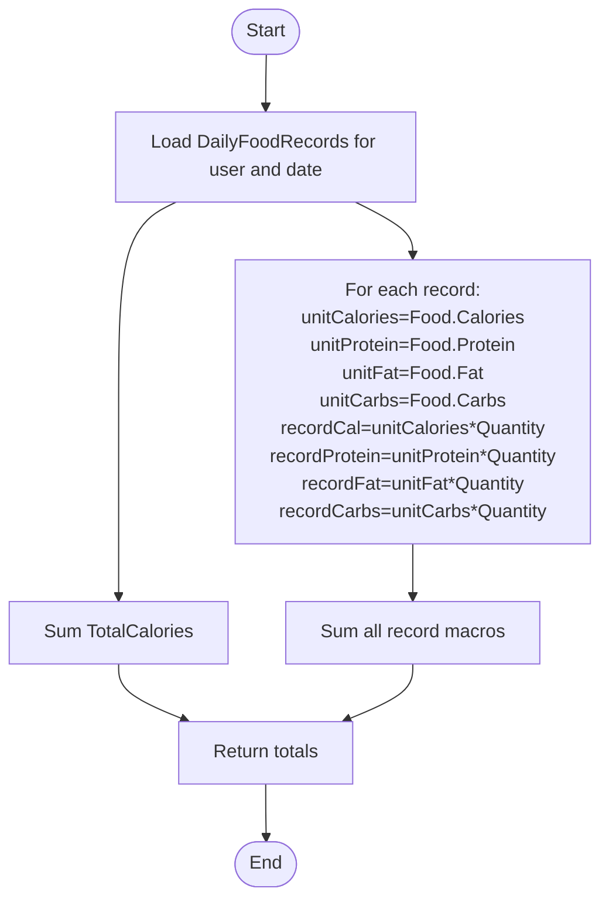
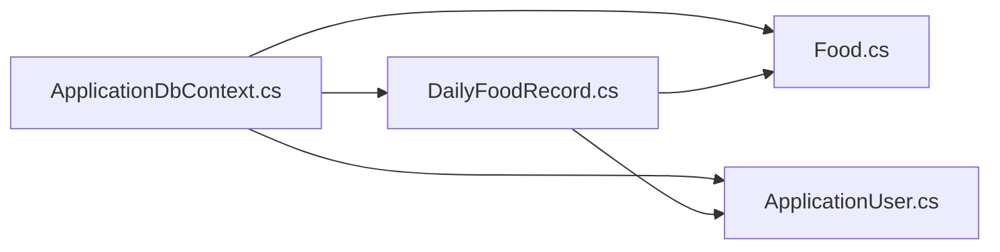

# DailyFoodRecord Model

<cite>
**Referenced Files in This Document**
- [DailyFoodRecord.cs](file://FitTrack/FitTrack/Data/DailyFoodRecord.cs)
- [Food.cs](file://FitTrack/FitTrack/Data/Food.cs)
- [ApplicationUser.cs](file://FitTrack/FitTrack/Data/ApplicationUser.cs)
- [ApplicationDbContext.cs](file://FitTrack/FitTrack/Data/ApplicationDbContext.cs)
- [20250826084318_AddFoodsAndDailyFoodRecords.cs](file://FitTrack/FitTrack/Data/Migrations/20250826084318_AddFoodsAndDailyFoodRecords.cs)
- [ApplicationDbContextModelSnapshot.cs](file://FitTrack/FitTrack/Data/Migrations/ApplicationDbContextModelSnapshot.cs)
- [DbInitializer.cs](file://FitTrack/FitTrack/Data/DbInitializer.cs)
- [FoodManager.razor](file://FitTrack/FitTrack/Components/Pages/FoodManager.razor)
</cite>

## Table of Contents
1. [Introduction](#introduction)
2. [Project Structure](#project-structure)
3. [Core Components](#core-components)
4. [Architecture Overview](#architecture-overview)
5. [Detailed Component Analysis](#detailed-component-analysis)
6. [Dependency Analysis](#dependency-analysis)
7. [Performance Considerations](#performance-considerations)
8. [Troubleshooting Guide](#troubleshooting-guide)
9. [Privacy and Retention Policies](#privacy-and-retention-policies)
10. [Conclusion](#conclusion)

## Introduction
This document provides comprehensive data model documentation for the DailyFoodRecord entity that captures user food intake. It explains the entity’s properties, its role in daily calorie and macronutrient tracking, and its relationships with ApplicationUser and Food. It also covers practical usage patterns such as calculating daily totals, filtering by date, and grouping by date, along with recommendations for data validation, indexing, and privacy/retention considerations.

## Project Structure
The DailyFoodRecord model is part of the FitTrack project’s data layer. It is defined alongside related entities and managed by Entity Framework Core within the ApplicationDbContext. Migrations define the database schema and indexes.

**Diagram sources**
- [DailyFoodRecord.cs](file://FitTrack/FitTrack/Data/DailyFoodRecord.cs#L1-L29)
- [Food.cs](file://FitTrack/FitTrack/Data/Food.cs#L1-L42)
- [ApplicationUser.cs](file://FitTrack/FitTrack/Data/ApplicationUser.cs#L1-L10)
- [ApplicationDbContext.cs](file://FitTrack/FitTrack/Data/ApplicationDbContext.cs#L1-L17)
- [20250826084318_AddFoodsAndDailyFoodRecords.cs](file://FitTrack/FitTrack/Data/Migrations/20250826084318_AddFoodsAndDailyFoodRecords.cs#L1-L86)
- [ApplicationDbContextModelSnapshot.cs](file://FitTrack/FitTrack/Data/Migrations/ApplicationDbContextModelSnapshot.cs#L108-L149)
- [DbInitializer.cs](file://FitTrack/FitTrack/Data/DbInitializer.cs#L1-L40)
- [FoodManager.razor](file://FitTrack/FitTrack/Components/Pages/FoodManager.razor#L1-L44)

**Section sources**
- [DailyFoodRecord.cs](file://FitTrack/FitTrack/Data/DailyFoodRecord.cs#L1-L29)
- [Food.cs](file://FitTrack/FitTrack/Data/Food.cs#L1-L42)
- [ApplicationUser.cs](file://FitTrack/FitTrack/Data/ApplicationUser.cs#L1-L10)
- [ApplicationDbContext.cs](file://FitTrack/FitTrack/Data/ApplicationDbContext.cs#L1-L17)
- [20250826084318_AddFoodsAndDailyFoodRecords.cs](file://FitTrack/FitTrack/Data/Migrations/20250826084318_AddFoodsAndDailyFoodRecords.cs#L1-L86)
- [ApplicationDbContextModelSnapshot.cs](file://FitTrack/FitTrack/Data/Migrations/ApplicationDbContextModelSnapshot.cs#L108-L149)
- [DbInitializer.cs](file://FitTrack/FitTrack/Data/DbInitializer.cs#L1-L40)
- [FoodManager.razor](file://FitTrack/FitTrack/Components/Pages/FoodManager.razor#L1-L44)

## Core Components
- DailyFoodRecord: Represents a single recorded food entry for a user on a specific date, including the associated food item, quantity, and computed total calories.
- Food: Represents a food item with nutritional values (calories, protein, fat, carbs) and metadata (name, category, brand, unit).
- ApplicationUser: Extends ASP.NET Identity’s user model; DailyFoodRecord relates to users via a foreign key.
- ApplicationDbContext: EF Core context exposing DbSet for DailyFoodRecord and Food.

Key properties of DailyFoodRecord:
- Id: Primary key, auto-generated.
- User: Navigation to ApplicationUser.
- Date: Date of the record (defaults to today).
- FoodId: Foreign key to Food.
- Food: Navigation to Food.
- Quantity: Decimal quantity consumed (default 1).
- TotalCalories: Decimal total calories for this record.
- Note: Optional note text.

Relationships:
- One-to-many with ApplicationUser: Each DailyFoodRecord belongs to one user.
- One-to-many with Food: Each DailyFoodRecord references one Food; Food exposes a collection of DailyFoodRecord entries.

**Section sources**
- [DailyFoodRecord.cs](file://FitTrack/FitTrack/Data/DailyFoodRecord.cs#L1-L29)
- [Food.cs](file://FitTrack/FitTrack/Data/Food.cs#L1-L42)
- [ApplicationUser.cs](file://FitTrack/FitTrack/Data/ApplicationUser.cs#L1-L10)
- [ApplicationDbContext.cs](file://FitTrack/FitTrack/Data/ApplicationDbContext.cs#L1-L17)

## Architecture Overview
The DailyFoodRecord model participates in a straightforward relational architecture:
- Entities are mapped by EF Core.
- Migrations define the schema, foreign keys, and indexes.
- The UI lists foods for selection and consumption.

**Diagram sources**
- [DailyFoodRecord.cs](file://FitTrack/FitTrack/Data/DailyFoodRecord.cs#L1-L29)
- [Food.cs](file://FitTrack/FitTrack/Data/Food.cs#L1-L42)
- [ApplicationUser.cs](file://FitTrack/FitTrack/Data/ApplicationUser.cs#L1-L10)

## Detailed Component Analysis

### DailyFoodRecord Entity
- Purpose: Stores a single food consumption event for a user on a given date, including quantity and computed total calories.
- Relationships:
  - ForeignKey to Food (FoodId).
  - Navigation to Food.
  - Navigation to ApplicationUser (via foreign key and index).
- Data types and precision:
  - Quantity stored as decimal with precision suitable for fractional portions.
  - TotalCalories stored as decimal with sufficient precision for aggregated totals.
  - Date defaults to today, enabling day-level aggregation.

**Diagram sources**
- [DailyFoodRecord.cs](file://FitTrack/FitTrack/Data/DailyFoodRecord.cs#L1-L29)
- [Food.cs](file://FitTrack/FitTrack/Data/Food.cs#L1-L42)
- [ApplicationUser.cs](file://FitTrack/FitTrack/Data/ApplicationUser.cs#L1-L10)
- [20250826084318_AddFoodsAndDailyFoodRecords.cs](file://FitTrack/FitTrack/Data/Migrations/20250826084318_AddFoodsAndDailyFoodRecords.cs#L35-L62)
- [ApplicationDbContextModelSnapshot.cs](file://FitTrack/FitTrack/Data/Migrations/ApplicationDbContextModelSnapshot.cs#L108-L149)

**Section sources**
- [DailyFoodRecord.cs](file://FitTrack/FitTrack/Data/DailyFoodRecord.cs#L1-L29)
- [20250826084318_AddFoodsAndDailyFoodRecords.cs](file://FitTrack/FitTrack/Data/Migrations/20250826084318_AddFoodsAndDailyFoodRecords.cs#L35-L62)
- [ApplicationDbContextModelSnapshot.cs](file://FitTrack/FitTrack/Data/Migrations/ApplicationDbContextModelSnapshot.cs#L108-L149)

### Calculating Daily Totals and Macronutrients
DailyFoodRecord stores TotalCalories and Quantity. To compute totals:
- Sum TotalCalories across records for a user and date.
- Aggregate macronutrients (protein, fat, carbs) by multiplying per-unit values from Food by the consumed Quantity and summing.

[No sources needed since this diagram shows conceptual workflow, not actual code structure]

### Filtering by Meal Type and Grouping by Date
- Current model does not include a MealType property. If meal categorization is desired, add a MealType field to DailyFoodRecord and populate it during creation.
- Grouping by Date:
  - Group records by Date to compute daily totals.
  - Aggregate by user and date for reporting dashboards.

[No sources needed since this section doesn't analyze specific files]

### Data Validation
- Positive Quantity: Enforce a validation rule to ensure Quantity > 0. This can be implemented via data annotations or validation logic in the application layer.
- Non-negative TotalCalories: Ensure TotalCalories is non-negative; derived from validated inputs.
- Required Fields: Date and FoodId should be required; ensure the application enforces these constraints.

[No sources needed since this section provides general guidance]

### Indexing for Query Performance
- Foreign Keys Indexed:
  - FoodId: Present in migrations and model snapshot.
  - UserId: Present in migrations and model snapshot.
- Timestamp/Index Considerations:
  - Date is persisted as a DateTime in the database. Consider adding an index on Date for frequent date-range queries.
  - Composite index on (UserId, Date) can optimize per-user daily aggregations.

**Section sources**
- [20250826084318_AddFoodsAndDailyFoodRecords.cs](file://FitTrack/FitTrack/Data/Migrations/20250826084318_AddFoodsAndDailyFoodRecords.cs#L64-L73)
- [ApplicationDbContextModelSnapshot.cs](file://FitTrack/FitTrack/Data/Migrations/ApplicationDbContextModelSnapshot.cs#L108-L149)

### Soft-Delete Pattern
- No soft-delete flag is present in the model. If soft-deletion is required:
  - Add a DeletedAt or IsActive flag to DailyFoodRecord.
  - Configure EF Core filters to exclude deleted records by default.
  - Ensure cascading deletes align with retention policies.

[No sources needed since this section provides general guidance]

### Practical Usage Patterns
- Daily Totals:
  - Query DailyFoodRecords by user and date, sum TotalCalories and aggregated macronutrients.
- Filtering by Date Range:
  - Filter by Date >= start and Date <= end.
- Grouping by Date:
  - Group by Date to produce daily summaries.

[No sources needed since this section provides general guidance]

## Dependency Analysis
- DailyFoodRecord depends on:
  - Food (via FoodId and navigation).
  - ApplicationUser (via foreign key and navigation).
- ApplicationDbContext exposes DbSet for both entities, enabling LINQ queries and change tracking.
- Migrations define:
  - Primary keys.
  - Foreign keys with cascade behavior for Food deletion.
  - Indexes on FoodId and UserId.

**Diagram sources**
- [ApplicationDbContext.cs](file://FitTrack/FitTrack/Data/ApplicationDbContext.cs#L1-L17)
- [DailyFoodRecord.cs](file://FitTrack/FitTrack/Data/DailyFoodRecord.cs#L1-L29)
- [Food.cs](file://FitTrack/FitTrack/Data/Food.cs#L1-L42)
- [ApplicationUser.cs](file://FitTrack/FitTrack/Data/ApplicationUser.cs#L1-L10)

**Section sources**
- [ApplicationDbContext.cs](file://FitTrack/FitTrack/Data/ApplicationDbContext.cs#L1-L17)
- [20250826084318_AddFoodsAndDailyFoodRecords.cs](file://FitTrack/FitTrack/Data/Migrations/20250826084318_AddFoodsAndDailyFoodRecords.cs#L35-L62)
- [ApplicationDbContextModelSnapshot.cs](file://FitTrack/FitTrack/Data/Migrations/ApplicationDbContextModelSnapshot.cs#L108-L149)

## Performance Considerations
- Indexes:
  - FoodId and UserId are indexed. Consider adding Date index and composite (UserId, Date) for efficient daily aggregations.
- Data Types:
  - Decimal precision chosen appropriately for quantities and totals.
- Cascading:
  - Deleting a Food cascades to DailyFoodRecord rows, preventing orphaned records.

[No sources needed since this section provides general guidance]

## Troubleshooting Guide
- Missing Food Reference:
  - Ensure FoodId references an existing Food.Id; otherwise, foreign key constraint violations occur.
- Incorrect Totals:
  - Verify TotalCalories reflects validated Quantity and per-unit nutritional values from Food.
- Query Performance Issues:
  - Add Date index and composite (UserId, Date) index if not present.
- Data Integrity:
  - Use transactions when inserting/updating DailyFoodRecord entries to maintain consistency.

[No sources needed since this section provides general guidance]

## Privacy and Retention Policies
- Health Data Sensitivity:
  - DailyFoodRecord and related nutritional data are sensitive personal information.
- Consent and Transparency:
  - Clearly communicate data usage in privacy policy.
- Data Minimization:
  - Collect only necessary fields; avoid storing excessive personal details.
- Retention Period:
  - Define a retention period (e.g., 1 year) after which user data is anonymized or deleted.
- Deletion Requests:
  - Implement mechanisms for users to request deletion of their data.
- Compliance:
  - Align with applicable regulations (e.g., GDPR, CCPA) for health data handling.

[No sources needed since this section provides general guidance]

## Conclusion
DailyFoodRecord is central to capturing user food intake and enabling daily calorie and macronutrient tracking. Its relationships with Food and ApplicationUser, combined with appropriate indexing and validation, support efficient querying and reliable analytics. Implementing robust privacy and retention policies ensures responsible stewardship of sensitive health data.