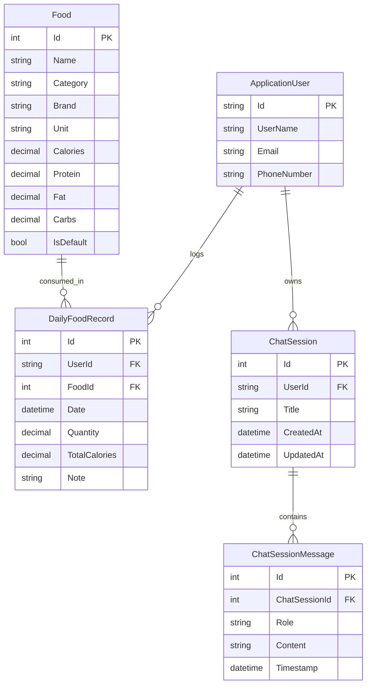
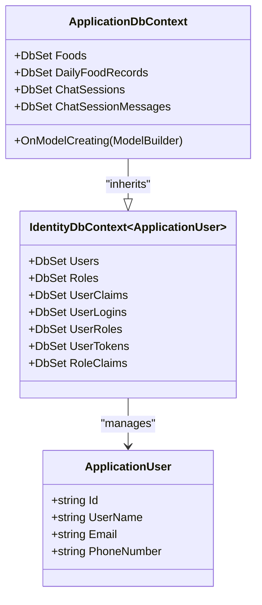

# Data Models & ORM

<cite>
**Referenced Files in This Document**   
- [ApplicationDbContext.cs](file://FitTrack/FitTrack/Data/ApplicationDbContext.cs)
- [ApplicationUser.cs](file://FitTrack/FitTrack/Data/ApplicationUser.cs)
- [Food.cs](file://FitTrack/FitTrack/Data/Food.cs)
- [DailyFoodRecord.cs](file://FitTrack/FitTrack/Data/DailyFoodRecord.cs)
- [ChatSession.cs](file://FitTrack/FitTrack.Copilot/Data/ChatSession.cs)
- [ApplicationDbContext.cs](file://FitTrack/FitTrack.Copilot/Data/ApplicationDbContext.cs)
- [DbInitializer.cs](file://FitTrack/FitTrack/Data/DbInitializer.cs)
- [20250826084318_AddFoodsAndDailyFoodRecords.cs](file://FitTrack/FitTrack/Data/Migrations/20250826084318_AddFoodsAndDailyFoodRecords.cs)
- [00000000000000_CreateIdentitySchema.cs](file://FitTrack/FitTrack/Data/Migrations/00000000000000_CreateIdentitySchema.cs)
- [foods.json](file://FitTrack/FitTrack/wwwroot/foods.json)
</cite>

## Table of Contents
1. [Introduction](#introduction)
2. [Core Data Models](#core-data-models)
3. [Entity Relationships](#entity-relationships)
4. [Database Schema and Migrations](#database-schema-and-migrations)
5. [ApplicationDbContext Implementation](#applicationdbcontext-implementation)
6. [Data Initialization Strategy](#data-initialization-strategy)
7. [Data Validation and Constraints](#data-validation-and-constraints)
8. [Indexing and Performance](#indexing-and-performance)
9. [Sample Queries](#sample-queries)
10. [Data Privacy and Retention](#data-privacy-and-retention)
11. [Conclusion](#conclusion)

## Introduction
This document provides comprehensive documentation for the Entity Framework Core entities in the FitTrack application. The system consists of two interconnected projects sharing identity models: the main FitTrack application for nutrition tracking and FitTrack.Copilot for AI conversation history. The documentation covers the four primary entities: ApplicationUser (identity), Food (nutrition database), DailyFoodRecord (user food logging), and ChatSession (AI conversation history). It details field definitions, relationships, constraints, and implementation strategies across both projects.

## Core Data Models

### ApplicationUser
The ApplicationUser entity extends ASP.NET Core Identity's IdentityUser to provide user authentication and authorization capabilities. It serves as the foundation for both applications and establishes relationships with food logging and chat session data.

**Section sources**
- [ApplicationUser.cs](file://FitTrack/FitTrack/Data/ApplicationUser.cs#L7-L10)
- [ApplicationUser.cs](file://FitTrack/FitTrack.Copilot/Data/ApplicationUser.cs#L6-L8)

### Food
The Food entity represents a comprehensive nutrition database containing standardized food items with detailed nutritional information. Each food entry includes macronutrient values and metadata for categorization and search.

**Field Definitions**
- **Id**: Primary key, auto-generated integer
- **Name**: Required, maximum 100 characters
- **Category**: Maximum 50 characters for food categorization
- **Brand**: Optional, maximum 100 characters (e.g., McDonald's, KFC)
- **Unit**: Measurement unit, defaults to "100g"
- **Calories**: Decimal value with precision of 5 digits and 1 decimal place
- **Protein**: Decimal value with precision of 5 digits and 1 decimal place
- **Fat**: Decimal value with precision of 5 digits and 1 decimal place
- **Carbs**: Decimal value with precision of 5 digits and 1 decimal place
- **IsDefault**: Boolean flag indicating if food is part of the default dataset

**Section sources**
- [Food.cs](file://FitTrack/FitTrack/Data/Food.cs#L6-L41)

### DailyFoodRecord
The DailyFoodRecord entity captures user-specific food consumption entries, linking users to specific foods with quantities consumed. This model enables daily nutritional tracking and calculation of total intake.

**Field Definitions**
- **Id**: Primary key, auto-generated integer
- **User**: Navigation property to ApplicationUser
- **Date**: Date of consumption, defaults to current date
- **FoodId**: Foreign key to Food entity
- **Food**: Navigation property to Food
- **Quantity**: Decimal value with precision of 5 digits and 2 decimal places
- **TotalCalories**: Calculated total calories, decimal with precision of 6 digits and 1 decimal place
- **Note**: Optional text field, maximum 200 characters

**Section sources**
- [DailyFoodRecord.cs](file://FitTrack/FitTrack/Data/DailyFoodRecord.cs#L6-L29)

### ChatSession
The ChatSession entity in FitTrack.Copilot stores AI conversation history, maintaining context for ongoing interactions between users and the nutrition assistant. Each session contains multiple messages and preserves the conversation flow.

**Field Definitions**
- **Id**: Primary key, auto-generated integer
- **UserId**: Required string identifier linking to ApplicationUser
- **Title**: Required session title, maximum 200 characters
- **CreatedAt**: Timestamp of session creation, defaults to UTC time
- **UpdatedAt**: Timestamp of last update, defaults to UTC time
- **Messages**: Collection of ChatSessionMessage entities

**ChatSessionMessage Fields**
- **Id**: Primary key
- **ChatSessionId**: Foreign key to ChatSession
- **Role**: Required role (e.g., "user", "assistant"), maximum 50 characters
- **Content**: Required message content
- **Timestamp**: Message timestamp, defaults to UTC time
- **ChatSession**: Navigation property to parent session

**Section sources**
- [ChatSession.cs](file://FitTrack/FitTrack.Copilot/Data/ChatSession.cs#L5-L37)

## Entity Relationships



**Diagram sources**
- [ApplicationDbContext.cs](file://FitTrack/FitTrack/Data/ApplicationDbContext.cs#L6-L16)
- [DailyFoodRecord.cs](file://FitTrack/FitTrack/Data/DailyFoodRecord.cs#L12-L19)
- [ChatSession.cs](file://FitTrack/FitTrack.Copilot/Data/ChatSession.cs#L5-L37)

## Database Schema and Migrations

The database schema is managed through Entity Framework Core migrations, with separate migration histories for each project while sharing the same database for identity-related tables.

### Migration Strategy
The system implements a dual migration approach:
- **CreateIdentitySchema**: Initial migration establishing ASP.NET Core Identity tables (AspNetUsers, AspNetRoles, etc.)
- **AddFoodsAndDailyFoodRecords**: Subsequent migration adding Food and DailyFoodRecord tables to the main FitTrack application

The migrations configure SQLite-specific settings including:
- TEXT type for string columns
- INTEGER type for boolean and integer columns
- DECIMAL type with specified precision for nutritional values
- Proper foreign key constraints with cascade delete behavior

**Section sources**
- [00000000000000_CreateIdentitySchema.cs](file://FitTrack/FitTrack/Data/Migrations/00000000000000_CreateIdentitySchema.cs)
- [20250826084318_AddFoodsAndDailyFoodRecords.cs](file://FitTrack/FitTrack/Data/Migrations/20250826084318_AddFoodsAndDailyFoodRecords.cs)

## ApplicationDbContext Implementation

### Shared Identity Implementation
Both FitTrack and FitTrack.Copilot projects implement their own ApplicationDbContext that inherits from IdentityDbContext<ApplicationUser>, enabling shared user management across applications while maintaining separate data contexts for domain-specific entities.

### Main Application Context
The FitTrack ApplicationDbContext manages food and nutrition data with DbSet properties for Food and DailyFoodRecord entities. The context configuration ensures proper relationship mapping between users, foods, and consumption records.

### Copilot Application Context
The FitTrack.Copilot ApplicationDbContext focuses on AI conversation data with DbSet properties for ChatSession and ChatSessionMessage entities. It maintains user-specific chat history while leveraging the shared identity system.



**Diagram sources**
- [ApplicationDbContext.cs](file://FitTrack/FitTrack/Data/ApplicationDbContext.cs#L6-L17)
- [ApplicationDbContext.cs](file://FitTrack/FitTrack.Copilot/Data/ApplicationDbContext.cs#L6-L34)

**Section sources**
- [ApplicationDbContext.cs](file://FitTrack/FitTrack/Data/ApplicationDbContext.cs#L6-L17)
- [ApplicationDbContext.cs](file://FitTrack/FitTrack.Copilot/Data/ApplicationDbContext.cs#L6-L34)

## Data Initialization Strategy

### DbInitializer Implementation
The DbInitializer class implements a data seeding strategy for the nutrition database, ensuring the application has a comprehensive food dataset upon first run.

### Initialization Process
1. **Database Creation**: Ensures the database exists using EnsureCreated()
2. **Data Existence Check**: Verifies if Foods table already contains data
3. **JSON Data Loading**: Reads food data from foods.json in wwwroot
4. **Deserialization**: Converts JSON to List<Food> objects
5. **Default Flag Setting**: Marks all imported foods as IsDefault = true
6. **Bulk Insertion**: Adds all food records to the context and saves changes

### Food Data Source
The foods.json file contains over 1,000 food items with standardized nutritional information, including common Chinese foods and international items. The dataset includes:
- Basic staples (rice, noodles, bread)
- Prepared dishes (noodles, dumplings)
- Snacks and desserts
- Beverages
- Brand-specific items

**Section sources**
- [DbInitializer.cs](file://FitTrack/FitTrack/Data/DbInitializer.cs#L5-L40)
- [foods.json](file://FitTrack/FitTrack/wwwroot/foods.json)

## Data Validation and Constraints

### Field-Level Validation
The data models implement comprehensive validation rules through data annotations:

**Food Entity Constraints**
- Name: Required, maximum 100 characters
- Category: Maximum 50 characters
- Brand: Maximum 100 characters, nullable
- Unit: Required, maximum 20 characters
- Nutritional values: Decimal precision constraints
- IsDefault: Boolean flag with default true

**DailyFoodRecord Constraints**
- Quantity: Decimal with precision of 5 digits and 2 decimal places
- TotalCalories: Decimal with precision of 6 digits and 1 decimal place
- Note: Maximum 200 characters, nullable
- Date: Required, defaults to current date

**ChatSession Constraints**
- UserId: Required string
- Title: Required, maximum 200 characters
- CreatedAt/UpdatedAt: Required timestamps

### Relationship Constraints
- DailyFoodRecord requires a valid FoodId foreign key
- DailyFoodRecord optionally links to ApplicationUser (UserId can be null)
- ChatSession requires a valid UserId
- ChatSessionMessage requires a valid ChatSessionId with cascade delete

**Section sources**
- [Food.cs](file://FitTrack/FitTrack/Data/Food.cs#L8-L41)
- [DailyFoodRecord.cs](file://FitTrack/FitTrack/Data/DailyFoodRecord.cs#L8-L29)
- [ChatSession.cs](file://FitTrack/FitTrack.Copilot/Data/ChatSession.cs#L9-L13)

## Indexing and Performance

### Database Indexes
The migration scripts define strategic indexes to optimize query performance:

**DailyFoodRecord Indexes**
- IX_DailyFoodRecords_UserId: Index on UserId for user-specific queries
- IX_DailyFoodRecords_FoodId: Index on FoodId for food usage statistics

**Identity Indexes**
- UserNameIndex: Unique index on NormalizedUserName
- EmailIndex: Index on NormalizedEmail
- RoleNameIndex: Unique index on NormalizedRoleName

**ChatSession Indexes**
- Index on UserId for retrieving user-specific chat sessions

### Performance Considerations
The indexing strategy supports common access patterns:
- User food history retrieval by UserId
- Food consumption analysis by FoodId
- User authentication by UserName/Email
- Chat session retrieval by UserId
- Role-based authorization

The decimal precision settings balance storage efficiency with nutritional accuracy requirements, using appropriate scales for different nutritional values.

**Section sources**
- [20250826084318_AddFoodsAndDailyFoodRecords.cs](file://FitTrack/FitTrack/Data/Migrations/20250826084318_AddFoodsAndDailyFoodRecords.cs#L64-L72)
- [00000000000000_CreateIdentitySchema.cs](file://FitTrack/FitTrack/Data/Migrations/00000000000000_CreateIdentitySchema.cs#L153-L187)

## Sample Queries

### Daily Nutrition Totals
Retrieve daily food records with nutritional totals for a specific user and date:

```csharp
var dailyTotals = context.DailyFoodRecords
    .Where(r => r.User.Id == userId && r.Date == targetDate)
    .Select(r => new {
        FoodName = r.Food.Name,
        Quantity = r.Quantity,
        Unit = r.Food.Unit,
        Calories = r.TotalCalories,
        Protein = r.Food.Protein * r.Quantity,
        Fat = r.Food.Fat * r.Quantity,
        Carbs = r.Food.Carbs * r.Quantity,
        Note = r.Note
    })
    .ToList();
```

### Food Search
Search for foods by name, category, or brand with pagination:

```csharp
var searchResults = context.Foods
    .Where(f => f.Name.Contains(searchTerm) ||
                f.Category.Contains(searchTerm) ||
                (f.Brand != null && f.Brand.Contains(searchTerm)))
    .OrderBy(f => f.Name)
    .Skip((page - 1) * pageSize)
    .Take(pageSize)
    .ToList();
```

### Monthly Consumption Statistics
Calculate monthly nutritional intake statistics:

```csharp
var monthlyStats = context.DailyFoodRecords
    .Where(r => r.User.Id == userId && 
                r.Date.Month == targetMonth && 
                r.Date.Year == targetYear)
    .GroupBy(r => r.Date.Date)
    .Select(g => new {
        Date = g.Key,
        TotalCalories = g.Sum(r => r.TotalCalories),
        TotalProtein = g.Sum(r => r.Food.Protein * r.Quantity),
        TotalFat = g.Sum(r => r.Food.Fat * r.Quantity),
        TotalCarbs = g.Sum(r => r.Food.Carbs * r.Quantity),
        FoodCount = g.Count()
    })
    .OrderBy(x => x.Date)
    .ToList();
```

### Chat Session Retrieval
Retrieve recent chat sessions for a user:

```csharp
var recentSessions = context.ChatSessions
    .Where(s => s.UserId == userId)
    .OrderByDescending(s => s.UpdatedAt)
    .Take(10)
    .Select(s => new {
        s.Id,
        s.Title,
        s.CreatedAt,
        s.UpdatedAt,
        MessageCount = s.Messages.Count,
        LastMessage = s.Messages.OrderByDescending(m => m.Timestamp).FirstOrDefault().Content
    })
    .ToList();
```

**Section sources**
- [ApplicationDbContext.cs](file://FitTrack/FitTrack/Data/ApplicationDbContext.cs)
- [DailyFoodRecord.cs](file://FitTrack/FitTrack/Data/DailyFoodRecord.cs)
- [Food.cs](file://FitTrack/FitTrack/Data/Food.cs)
- [ChatSession.cs](file://FitTrack/FitTrack.Copilot/Data/ChatSession.cs)

## Data Privacy and Retention

### Personal Health Information
The system handles personal health information through DailyFoodRecord entities, which contain user-specific dietary data. This information is considered sensitive and protected under data privacy regulations.

### Data Retention Policies
- **Food Data**: Default food database entries (IsDefault = true) are preserved indefinitely
- **User Food Records**: Retained as long as the user account exists
- **Chat Sessions**: Retained as long as the user account exists
- **User Accounts**: Can be deleted with all associated data through the personal data deletion feature

### Privacy Features
- **Personal Data Export**: Users can download their personal data including identity information and associated metadata
- **Data Deletion**: Users can delete their personal data, which removes their account and all associated records
- **External Login Tracking**: Records external login provider keys for account management
- **Authentication Security**: Stores authenticator keys for two-factor authentication

The IdentityComponentsEndpointRouteBuilderExtensions class implements the personal data export functionality, collecting only properties marked with the PersonalDataAttribute.

**Section sources**
- [IdentityComponentsEndpointRouteBuilderExtensions.cs](file://FitTrack/FitTrack/Components/Account/IdentityComponentsEndpointRouteBuilderExtensions.cs#L90-L110)
- [ApplicationUser.cs](file://FitTrack/FitTrack/Data/ApplicationUser.cs)

## Conclusion
The FitTrack application implements a robust Entity Framework Core data model that effectively supports both nutrition tracking and AI-powered conversation features. The architecture leverages shared identity models across two applications while maintaining domain-specific data contexts for specialized functionality. Key strengths include a comprehensive nutrition database initialized from external JSON data, efficient indexing strategies for common query patterns, and proper handling of personal health information with appropriate privacy controls. The migration strategy ensures consistent database schema evolution, and the relationship mapping between entities supports complex nutritional analysis and user-specific data retrieval. This well-structured data model provides a solid foundation for the application's core functionality while maintaining data integrity and performance.