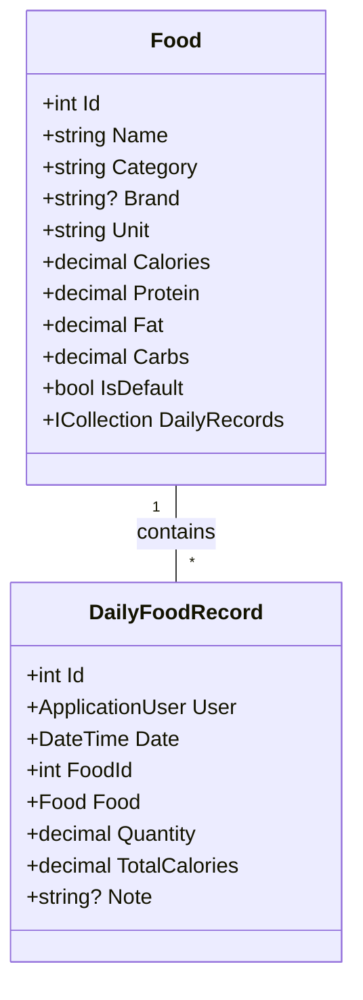
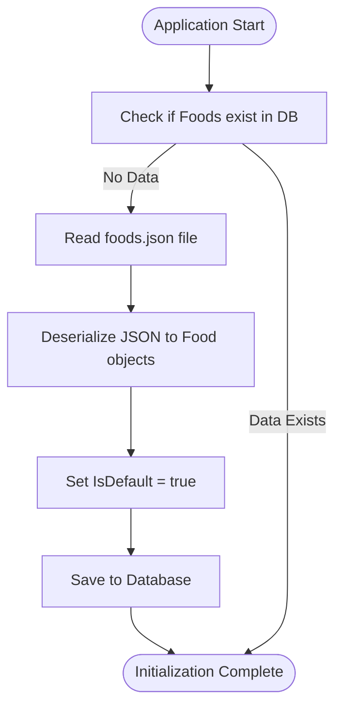
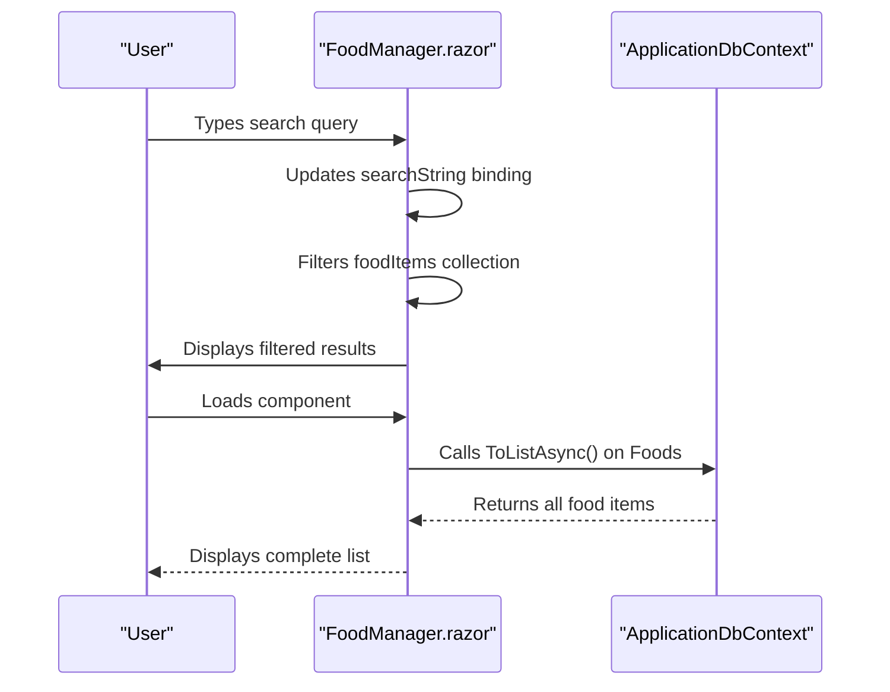
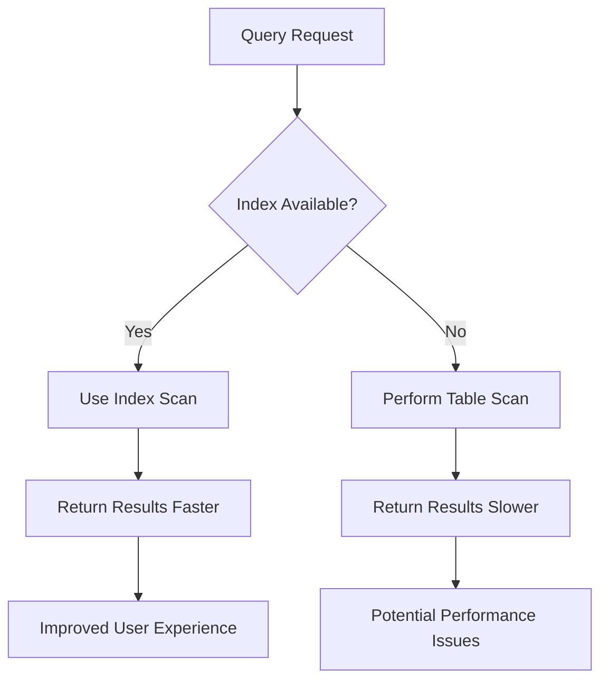
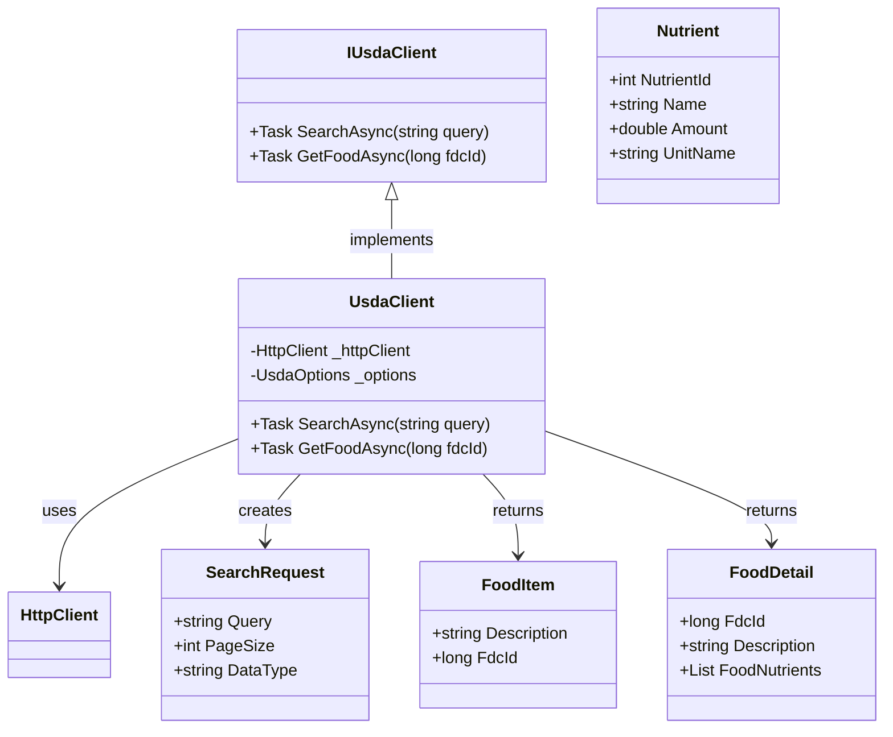
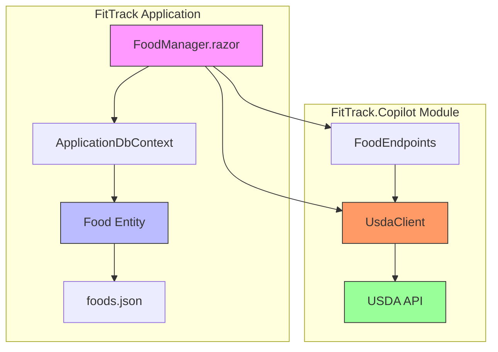

# Food Model

<cite>
**Referenced Files in This Document**   
- [Food.cs](file://FitTrack/FitTrack/Data/Food.cs)
- [foods.json](file://FitTrack/FitTrack/wwwroot/foods.json)
- [FoodManager.razor](file://FitTrack/FitTrack/Components/Pages/FoodManager.razor)
- [DbInitializer.cs](file://FitTrack/FitTrack/Data/DbInitializer.cs)
- [ApplicationDbContext.cs](file://FitTrack/FitTrack/Data/ApplicationDbContext.cs)
- [UsdaClient.cs](file://FitTrack/FitTrack.Copilot/Api/Usda/UsdaClient.cs)
- [IUsdaClient.cs](file://FitTrack/FitTrack.Copilot/Api/Usda/IUsdaClient.cs)
- [SearchRequest.cs](file://FitTrack/FitTrack.Copilot/Api/Usda/Models/SearchRequest.cs)
- [Program.cs](file://FitTrack/FitTrack/Program.cs)
</cite>

## Table of Contents
1. [Introduction](#introduction)
2. [Core Properties](#core-properties)
3. [Data Seeding and Initialization](#data-seeding-and-initialization)
4. [Food Search and Auto-Completion](#food-search-and-auto-completion)
5. [LINQ Query Examples](#linq-query-examples)
6. [Indexing and Performance](#indexing-and-performance)
7. [Data Validation Rules](#data-validation-rules)
8. [Immutability Considerations](#immutability-considerations)
9. [USDA API Integration](#usda-api-integration)
10. [Architecture Overview](#architecture-overview)

## Introduction
The Food model serves as a central reference database for nutritional information within the FitTrack application. It provides standardized data for food items that users can select when logging their daily intake. The model supports both generic food entries and brand-specific items, enabling accurate tracking across a wide range of dietary choices. This documentation details the structure, usage patterns, and integration points of the Food entity.

**Section sources**
- [Food.cs](file://FitTrack/FitTrack/Data/Food.cs#L6-L42)

## Core Properties
The Food entity contains comprehensive nutritional data with the following key properties:

- **Name**: Required string (max 100 characters) representing the food item's name
- **Category**: Optional string (max 50 characters) for food classification (e.g., "主食", "肉类")
- **Brand**: Optional string (max 100 characters) for brand-specific items
- **Unit**: String (max 20 characters) indicating serving size (default: "100g")
- **Calories**: Decimal value with precision (5,1) representing energy content
- **Protein**: Decimal value with precision (5,1) for protein content in grams
- **Carbs**: Decimal value with precision (5,1) for carbohydrate content in grams
- **Fat**: Decimal value with precision (5,1) for fat content in grams
- **IsDefault**: Boolean flag indicating if the food was seeded from default data

The model also includes a navigation property `DailyRecords` that establishes a one-to-many relationship with the DailyFoodRecord entity, allowing tracking of which foods have been consumed by users.



**Diagram sources**
- [Food.cs](file://FitTrack/FitTrack/Data/Food.cs#L6-L42)
- [DailyFoodRecord.cs](file://FitTrack/FitTrack/Data/DailyFoodRecord.cs#L6-L29)

**Section sources**
- [Food.cs](file://FitTrack/FitTrack/Data/Food.cs#L6-L42)

## Data Seeding and Initialization
The Food database is initialized with a comprehensive set of nutritional data from the `foods.json` file located in the wwwroot directory. During application startup, the `DbInitializer.Initialize` method checks if food data already exists in the database. If not, it reads the JSON file, deserializes the content into Food objects, sets the `IsDefault` flag to true, and persists the data to the database.

The seeding process ensures the application launches with a rich dataset of common foods, including both generic items and brand-specific entries like McDonald's and KFC products. This approach provides immediate value to users without requiring manual data entry.



**Diagram sources**
- [DbInitializer.cs](file://FitTrack/FitTrack/Data/DbInitializer.cs#L7-L40)
- [Program.cs](file://FitTrack/FitTrack/Program.cs#L44-L50)

**Section sources**
- [DbInitializer.cs](file://FitTrack/FitTrack/Data/DbInitializer.cs#L7-L40)
- [foods.json](file://FitTrack/FitTrack/wwwroot/foods.json#L1-L1161)

## Food Search and Auto-Completion
The FoodManager.razor component provides a user interface for browsing and searching the food database. It uses MudBlazor's table component with built-in search functionality to enable real-time filtering of food items. The search operates on the Name property, allowing users to quickly find specific foods as they type.

The component injects the ApplicationDbContext to access the Foods DbSet and loads all food items during initialization. The search functionality is implemented through a bound searchString variable that filters the displayed items in the UI layer, providing a responsive experience for users managing their food database.



**Diagram sources**
- [FoodManager.razor](file://FitTrack/FitTrack/Components/Pages/FoodManager.razor#L27-L43)
- [ApplicationDbContext.cs](file://FitTrack/FitTrack/Data/ApplicationDbContext.cs#L9-L11)

**Section sources**
- [FoodManager.razor](file://FitTrack/FitTrack/Components/Pages/FoodManager.razor#L1-L44)

## LINQ Query Examples
The Food model supports various LINQ queries for filtering and retrieving nutritional data:

**Filtering by name (case-insensitive partial match):**
```csharp
var results = context.Foods.Where(f => f.Name.Contains(searchTerm, StringComparison.OrdinalIgnoreCase));
```

**Filtering by nutritional content:**
```csharp
var lowCarbFoods = context.Foods.Where(f => f.Carbs < 10);
var highProteinFoods = context.Foods.Where(f => f.Protein > 20);
var calorieRangeFoods = context.Foods.Where(f => f.Calories >= 100 && f.Calories <= 300);
```

**Filtering by category and brand:**
```csharp
var fastFoods = context.Foods.Where(f => f.Brand != null);
var specificBrandFoods = context.Foods.Where(f => f.Brand == "麦当劳");
var categoryFoods = context.Foods.Where(f => f.Category == "主食");
```

These queries can be combined for more sophisticated filtering:
```csharp
var healthyFastFood = context.Foods
    .Where(f => f.Brand != null && f.Calories < 400 && f.Protein > 15);
```

**Section sources**
- [FoodManager.razor](file://FitTrack/FitTrack/Components/Pages/FoodManager.razor#L38-L39)
- [Food.cs](file://FitTrack/FitTrack/Data/Food.cs#L27-L37)

## Indexing and Performance
The Food model is optimized for search and retrieval operations through strategic indexing. The database schema includes indexes on key properties to accelerate query performance:

- **Name field indexing**: Although not explicitly defined in code, the frequent searching on the Name property suggests it should be indexed for optimal performance
- **Category indexing**: The Category field benefits from indexing due to filtering operations
- **Brand indexing**: The Brand field is a candidate for indexing when querying brand-specific foods

The current implementation loads all food items into memory when initializing the FoodManager component. For larger datasets, this could be optimized by implementing server-side pagination and filtering to reduce memory usage and improve response times.



**Section sources**
- [ApplicationDbContext.cs](file://FitTrack/FitTrack/Data/ApplicationDbContext.cs#L9-L11)
- [FoodManager.razor](file://FitTrack/FitTrack/Components/Pages/FoodManager.razor#L38-L39)

## Data Validation Rules
The Food model implements several data validation rules through data annotations:

- **Name**: Required field with maximum length of 100 characters
- **Category**: Maximum length of 50 characters
- **Brand**: Maximum length of 100 characters (nullable)
- **Unit**: Maximum length of 20 characters
- **Nutritional values**: All constrained to decimal(5,1) precision, allowing values from 0 to 9999.9
- **IsDefault**: Boolean flag with default value of true for seeded data

These validation rules are enforced at both the model level and database level, ensuring data integrity across the application. The EF Core migrations reflect these constraints in the database schema, with appropriate column types and constraints applied.

**Section sources**
- [Food.cs](file://FitTrack/FitTrack/Data/Food.cs#L12-L39)
- [ApplicationDbContextModelSnapshot.cs](file://FitTrack/FitTrack/Data/Migrations/ApplicationDbContextModelSnapshot.cs#L118-L149)

## Immutability Considerations
The Food model follows a semi-immutable pattern where seeded data is intended to remain stable while allowing for application evolution:

- **Default foods**: Items seeded from foods.json are marked with `IsDefault = true` and should be treated as reference data
- **Custom foods**: Users can potentially add custom foods (not shown in current code) that would have `IsDefault = false`
- **Data updates**: The current implementation does not support updating food data through the UI, suggesting an intentional immutability for nutritional values

This approach ensures consistency in nutritional tracking while allowing the system to evolve with new food items. The separation between default and custom foods enables safe updates to the reference dataset without affecting user-generated content.

**Section sources**
- [Food.cs](file://FitTrack/FitTrack/Data/Food.cs#L39-L40)
- [DbInitializer.cs](file://FitTrack/FitTrack/Data/DbInitializer.cs#L33-L34)

## USDA API Integration
The application integrates with the USDA FoodData Central API through the UsdaClient service to enrich food records with authoritative nutritional data. This integration is implemented in the FitTrack.Copilot module with the following components:

- **IUsdaClient**: Interface defining methods for searching foods and retrieving detailed nutritional information
- **UsdaClient**: Concrete implementation that makes HTTP requests to the USDA API
- **UsdaOptions**: Configuration class containing API key and base URL
- **SearchRequest/Response models**: DTOs for API communication

The integration allows the application to query the USDA database for food items, retrieve detailed nutritional profiles, and potentially create new Food records based on authoritative data. This capability supports both manual food entry and AI-powered food recognition features.



**Diagram sources**
- [IUsdaClient.cs](file://FitTrack/FitTrack.Copilot/Api/Usda/IUsdaClient.cs#L5-L9)
- [UsdaClient.cs](file://FitTrack/FitTrack.Copilot/Api/Usda/UsdaClient.cs#L6-L44)
- [SearchRequest.cs](file://FitTrack/FitTrack.Copilot/Api/Usda/Models/SearchRequest.cs#L3-L34)

**Section sources**
- [UsdaClient.cs](file://FitTrack/FitTrack.Copilot/Api/Usda/UsdaClient.cs#L1-L44)
- [IUsdaClient.cs](file://FitTrack/FitTrack.Copilot/Api/Usda/IUsdaClient.cs#L1-L9)
- [SearchRequest.cs](file://FitTrack/FitTrack.Copilot/Api/Usda/Models/SearchRequest.cs#L1-L34)

## Architecture Overview
The Food model is integrated into the application architecture as a core reference entity that supports nutritional tracking functionality. It is part of the main FitTrack application but interacts with the Copilot module for advanced food data enrichment through the USDA API.



The architecture demonstrates a clean separation between the core application data model and the external API integration, with the Food entity serving as the central point for nutritional information regardless of the data source.

**Diagram sources**
- [Food.cs](file://FitTrack/FitTrack/Data/Food.cs#L6-L42)
- [UsdaClient.cs](file://FitTrack/FitTrack.Copilot/Api/Usda/UsdaClient.cs#L6-L44)
- [FoodManager.razor](file://FitTrack/FitTrack/Components/Pages/FoodManager.razor#L1-L44)

**Section sources**
- [Food.cs](file://FitTrack/FitTrack/Data/Food.cs#L6-L42)
- [UsdaClient.cs](file://FitTrack/FitTrack.Copilot/Api/Usda/UsdaClient.cs#L1-L44)
- [FoodManager.razor](file://FitTrack/FitTrack/Components/Pages/FoodManager.razor#L1-L44)