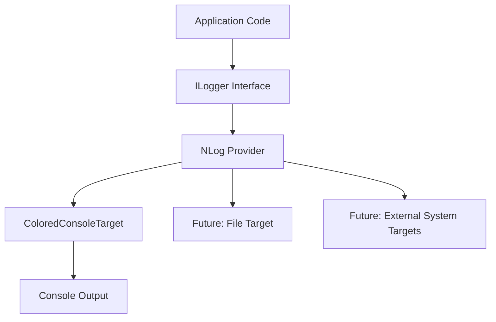
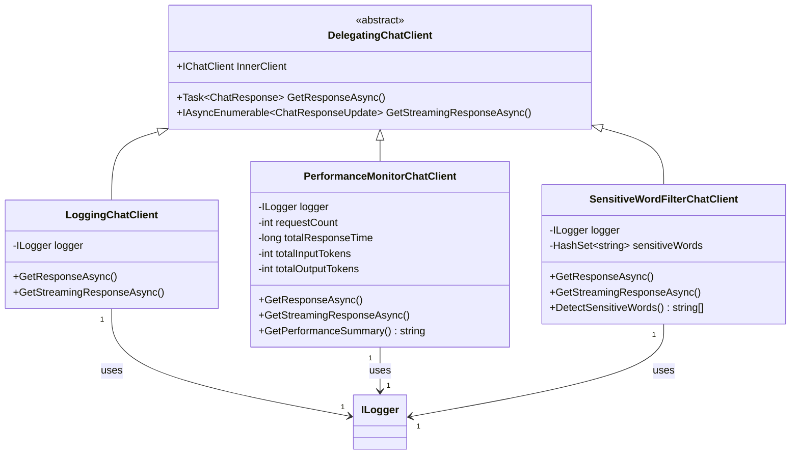
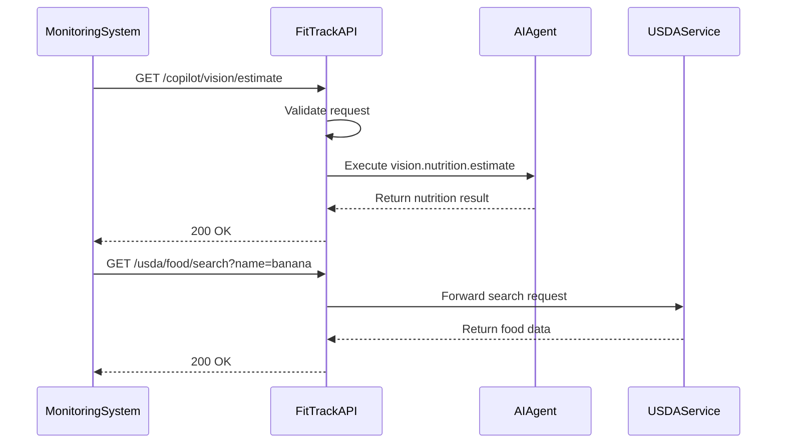
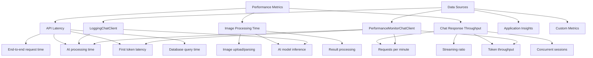

# Monitoring, Logging & Health Checks

<cite>
**Referenced Files in This Document**   
- [LoggingChatClient.cs](file://FitTrack.Copilot/Middleware/LoggingChatClient.cs)
- [PerformanceMonitorChatClient.cs](file://FitTrack.Copilot/Middleware/PerformanceMonitorChatClient.cs)
- [Program.cs](file://FitTrack.Copilot/Program.cs)
- [appsettings.json](file://FitTrack.Copilot/appsettings.json)
- [CopilotVisionEndpoints.cs](file://FitTrack.Copilot/Endpoints/CopilotVisionEndpoints.cs)
- [FoodEndpoints.cs](file://FitTrack.Copilot/Endpoints/FoodEndpoints.cs)
- [UsdaClient.cs](file://FitTrack.Copilot/Api/Usda/UsdaClient.cs)
- [UsdaServiceCollectionExtensions.cs](file://FitTrack.Copilot/Api/Usda/UsdaServiceCollectionExtensions.cs)
- [CopilotServiceCollectionExtensions.cs](file://FitTrack.Copilot/Extension/CopilotServiceCollectionExtensions.cs)
</cite>

## Table of Contents
1. [Introduction](#introduction)
2. [NLog-Based Logging Pipeline](#nlog-based-logging-pipeline)
3. [AI Interaction Logging with Middleware](#ai-interaction-logging-with-middleware)
4. [Health Check Endpoints](#health-check-endpoints)
5. [Integration with Centralized Logging Platforms](#integration-with-centralized-logging-platforms)
6. [Performance Metrics to Monitor](#performance-metrics-to-monitor)
7. [Log Retention and GDPR Compliance](#log-retention-and-gdpr-compliance)
8. [Conclusion](#conclusion)

## Introduction
This document provides comprehensive guidance on monitoring, logging, and health checks for the FitTrack application in production. It details the NLog-based logging infrastructure, middleware components that enrich AI interaction logs, health check endpoints for critical services, and strategies for centralized logging integration and alerting. The documentation also covers key performance metrics and compliance considerations for AI conversation logging.

## NLog-Based Logging Pipeline

The FitTrack application implements a structured logging pipeline using NLog as the primary logging framework. The logging configuration is initialized in the `Program.cs` file, where NLog is explicitly configured to handle all application logging needs.

The logging pipeline is configured to capture all log levels from Trace to Fatal, with a custom layout that includes timestamp, log level, logger name, message, and exception details. Log entries are output to the console with colored formatting for improved readability in development and production environments.

The logging configuration is set up programmatically rather than through an external NLog configuration file, providing greater control and flexibility. The configuration applies globally by setting `LogManager.Configuration`, ensuring consistent logging behavior across the entire application.

**Diagram sources**
- [Program.cs](file://FitTrack.Copilot/Program.cs#L28-L46)

**Section sources**
- [Program.cs](file://FitTrack.Copilot/Program.cs#L28-L46)

## AI Interaction Logging with Middleware

### LoggingChatClient Middleware

The `LoggingChatClient` middleware component is a critical part of the AI interaction logging system. It implements the `DelegatingChatClient` pattern to intercept and enrich chat requests and responses with comprehensive logging information.

This middleware captures detailed information about each AI interaction, including:
- Request initiation and completion markers
- Number of messages in the conversation
- User input content
- Available tools and function calls
- AI response content and completion reasons
- Token usage statistics (input, output, and total)
- Error information when requests fail

The middleware uses structured logging with named parameters, enabling efficient log parsing and analysis in centralized logging systems.

### PerformanceMonitorChatClient Middleware

The `PerformanceMonitorChatClient` middleware provides performance monitoring capabilities for AI interactions. It tracks key performance metrics and maintains running statistics across requests.

Key features include:
- Request timing with high-resolution stopwatch
- Cumulative tracking of response times, input tokens, and output tokens
- Calculation of average response time across all requests
- Performance alerting for requests exceeding 5 seconds
- First chunk timing for streaming responses
- Request counting and chunk counting for throughput analysis

The middleware also provides a `GetPerformanceSummary()` method that returns a formatted string with performance statistics, which could be exposed through a monitoring endpoint.

**Diagram sources**
- [LoggingChatClient.cs](file://FitTrack.Copilot/Middleware/LoggingChatClient.cs#L10-L135)
- [PerformanceMonitorChatClient.cs](file://FitTrack.Copilot/Middleware/PerformanceMonitorChatClient.cs#L10-L139)

**Section sources**
- [LoggingChatClient.cs](file://FitTrack.Copilot/Middleware/LoggingChatClient.cs#L1-L135)
- [PerformanceMonitorChatClient.cs](file://FitTrack.Copilot/Middleware/PerformanceMonitorChatClient.cs#L1-L139)

## Health Check Endpoints

The FitTrack application exposes several endpoints that can be used for health monitoring and service availability checks.

### AI Service Availability

The `/copilot/vision/estimate` endpoint serves as a functional health check for the AI service. This endpoint:
- Accepts image uploads and nutrition estimation requests
- Validates the presence of vision-capable agents
- Processes multipart form data
- Returns appropriate HTTP status codes (200 for success, 400 for bad requests)
- Includes correlation IDs for request tracing

The endpoint's successful operation confirms that the AI agent system is properly initialized and capable of processing requests.

### USDA API Reachability

The USDA API integration provides two endpoints that can be used to verify external service connectivity:
- `GET /usda/food/search` - Searches for foods by name
- `GET /usda/food/{foodId}` - Retrieves detailed nutritional information for a specific food

These endpoints depend on the USDA API client, which is configured with timeout settings (60 seconds) and proper error handling. Successful responses from these endpoints confirm connectivity to the USDA API service.

### Database Connectivity

While not explicitly implemented as a dedicated health check endpoint, database connectivity is essential for application operation. The application uses SQLite with Entity Framework Core, and database operations are integral to user authentication and data persistence.

The presence of proper error handling in database operations and the use of connection strings in configuration indicate that database connectivity is a critical dependency that should be monitored.

**Diagram sources**
- [CopilotVisionEndpoints.cs](file://FitTrack.Copilot/Endpoints/CopilotVisionEndpoints.cs#L1-L47)
- [FoodEndpoints.cs](file://FitTrack.Copilot/Endpoints/FoodEndpoints.cs#L1-L25)
- [UsdaClient.cs](file://FitTrack.Copilot/Api/Usda/UsdaClient.cs#L1-L44)

**Section sources**
- [CopilotVisionEndpoints.cs](file://FitTrack.Copilot/Endpoints/CopilotVisionEndpoints.cs#L1-L47)
- [FoodEndpoints.cs](file://FitTrack.Copilot/Endpoints/FoodEndpoints.cs#L1-L25)
- [UsdaClient.cs](file://FitTrack.Copilot/Api/Usda/UsdaClient.cs#L1-L44)

## Integration with Centralized Logging Platforms

### Current Logging Configuration

The current NLog configuration outputs logs to the console with a structured format that includes timestamp, log level, logger name, and message content. This format is suitable for ingestion by centralized logging platforms such as ELK, Splunk, or Azure Monitor.

The structured logging approach using named parameters (e.g., `{Count}`, `{ElapsedMs}`) enables these platforms to automatically parse and index log properties, facilitating efficient searching and analysis.

### Recommended Integration Strategies

#### ELK Stack Integration
To integrate with the ELK (Elasticsearch, Logstash, Kibana) stack:
1. Add the NLog.Extensions.Logging package
2. Configure NLog to output JSON-formatted logs
3. Use File or Network targets to send logs to Logstash
4. Create Logstash filters to parse log fields
5. Visualize data in Kibana dashboards

#### Splunk Integration
For Splunk integration:
1. Use the NLog.Targets.Splunk package
2. Configure the SplunkHttpEventCollector target
3. Set up proper indexing and sourcetypes
4. Implement field extractions for structured log properties
5. Create Splunk alerts for critical failures

#### Azure Monitor Integration
To integrate with Azure Monitor:
1. Add the NLog.Extensions.AzureApplicationInsights package
2. Configure the Application Insights target
3. Set up proper instrumentation key or connection string
4. Enable correlation for distributed tracing
5. Create Azure Monitor alerts based on log queries

### Alerting Configuration

Critical failures should trigger alerts based on the following log patterns:
- Error logs from `LoggingChatClient` indicating AI request failures
- Warning logs from `PerformanceMonitorChatClient` indicating slow responses (>5s)
- Exception logs from USDA API client indicating connectivity issues
- Database-related exceptions indicating persistence failures

Alerts should include relevant context such as request ID, user ID (when available), and timing information to facilitate rapid troubleshooting.

**Section sources**
- [Program.cs](file://FitTrack.Copilot/Program.cs#L31-L46)
- [LoggingChatClient.cs](file://FitTrack.Copilot/Middleware/LoggingChatClient.cs#L1-L135)
- [PerformanceMonitorChatClient.cs](file://FitTrack.Copilot/Middleware/PerformanceMonitorChatClient.cs#L1-L139)

## Performance Metrics to Monitor

### API Latency

API latency should be monitored at multiple levels:
- **End-to-end request time**: From HTTP request receipt to response transmission
- **AI processing time**: From AI request initiation to response completion
- **First token latency**: For streaming responses, time to first data chunk
- **Database query time**: For data persistence operations

The `PerformanceMonitorChatClient` middleware already captures AI processing time and first token latency, which are critical metrics for user experience.

### Image Processing Time

Image processing time is a key performance indicator for the vision-based nutrition estimation feature. This includes:
- Image upload and parsing time
- AI model inference time
- Result processing and formatting time

These metrics can be derived from the existing logging in `LoggingChatClient` and `PerformanceMonitorChatClient`, particularly the elapsed time measurements around AI requests.

### Chat Response Throughput

Chat response throughput should be monitored to ensure system capacity meets demand. Key metrics include:
- **Requests per minute**: Overall volume of AI requests
- **Streaming vs. non-streaming ratio**: Proportion of streaming requests
- **Token throughput**: Input and output tokens processed per minute
- **Concurrent sessions**: Number of active chat sessions

The `PerformanceMonitorChatClient` maintains counters for total requests and token usage, which can be used to calculate throughput metrics.

**Diagram sources**
- [PerformanceMonitorChatClient.cs](file://FitTrack.Copilot/Middleware/PerformanceMonitorChatClient.cs#L10-L139)
- [LoggingChatClient.cs](file://FitTrack.Copilot/Middleware/LoggingChatClient.cs#L1-L135)

**Section sources**
- [PerformanceMonitorChatClient.cs](file://FitTrack.Copilot/Middleware/PerformanceMonitorChatClient.cs#L1-L139)
- [LoggingChatClient.cs](file://FitTrack.Copilot/Middleware/LoggingChatClient.cs#L1-L135)

## Log Retention and GDPR Compliance

### Log Retention Policies

The current implementation does not specify explicit log retention policies. For production deployment, the following retention strategy is recommended:

- **Development logs**: 7 days retention
- **Production operational logs**: 30 days retention
- **Security-related logs**: 365 days retention
- **Audit logs**: 7 years retention (compliance)

Log rotation should be implemented to prevent disk space exhaustion, with daily or size-based rotation (e.g., 100MB per file).

### GDPR Compliance for AI Conversation Logging

The application logs AI conversation content, which may contain personal data, requiring GDPR compliance measures:

#### Data Minimization
- Only log essential information needed for debugging and monitoring
- Avoid logging sensitive personal information unless absolutely necessary
- Implement log filtering to redact sensitive data patterns

#### Purpose Limitation
- Clearly define the purposes for logging AI conversations (e.g., service improvement, debugging)
- Do not use logs for purposes beyond those explicitly defined
- Implement access controls to ensure logs are only accessible to authorized personnel

#### User Rights
- Provide mechanisms for users to request access to their conversation logs
- Implement processes for users to request deletion of their conversation data
- Document data retention periods and make them available to users

#### Technical Measures
- Encrypt log files at rest
- Implement access logging for log file access
- Use pseudonymization where possible (e.g., using user IDs instead of identifiable information)
- Regularly review and audit log access and usage

The `SensitiveWordFilterChatClient` middleware demonstrates awareness of content safety, but additional measures are needed to ensure full GDPR compliance, particularly regarding user rights and data minimization.

**Section sources**
- [LoggingChatClient.cs](file://FitTrack.Copilot/Middleware/LoggingChatClient.cs#L1-L135)
- [SensitiveWordFilterChatClient.cs](file://FitTrack.Copilot/Middleware/SensitiveWordFilterChatClient.cs#L1-L148)
- [appsettings.json](file://FitTrack.Copilot/appsettings.json#L1-L55)

## Conclusion

The FitTrack application has a solid foundation for monitoring and observability with its NLog-based logging pipeline and specialized middleware components for AI interaction logging. The `LoggingChatClient` and `PerformanceMonitorChatClient` provide comprehensive insights into AI conversation patterns, performance characteristics, and error conditions.

To enhance production monitoring, the following recommendations should be implemented:
1. Add dedicated health check endpoints for database connectivity and service availability
2. Extend the NLog configuration to support file output and integration with centralized logging platforms
3. Implement proper log retention and rotation policies
4. Enhance GDPR compliance measures for AI conversation logging
5. Create dashboards and alerts based on the rich performance data already being collected

The existing architecture, with its layered middleware approach, provides an excellent foundation for extending monitoring capabilities without significant code changes. By leveraging the structured logging and performance tracking already in place, FitTrack can achieve comprehensive observability in production environments.