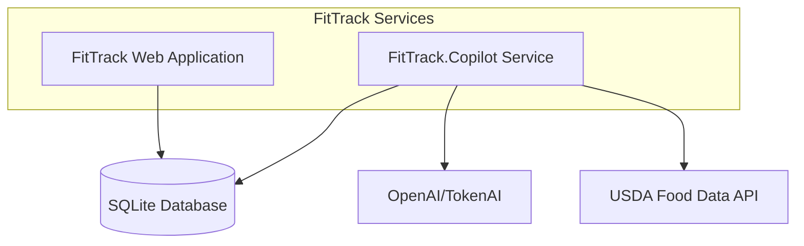
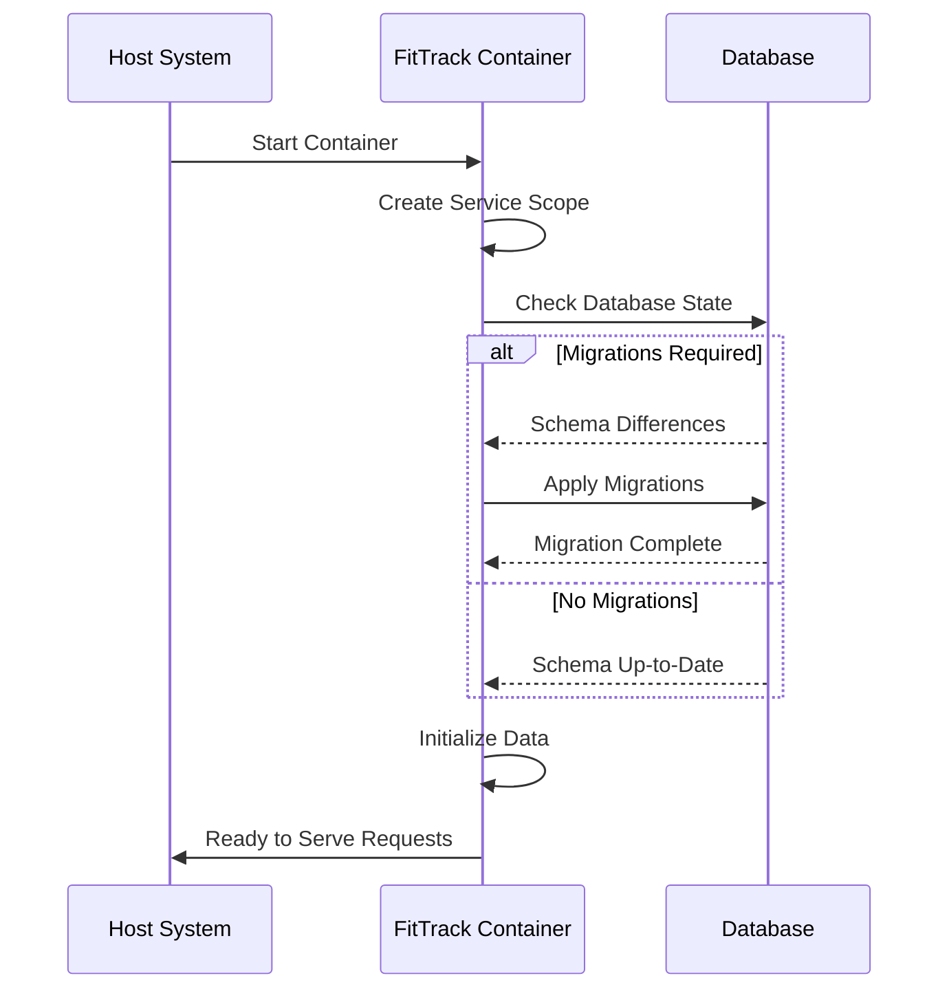

# Runtime Configuration & Execution

<cite>
**Referenced Files in This Document**   
- [Dockerfile](file://FitTrack/FitTrack/Dockerfile)
- [appsettings.json](file://FitTrack/FitTrack/appsettings.json)
- [appsettings.Development.json](file://FitTrack/FitTrack/appsettings.Development.json)
- [FitTrack.Copilot/appsettings.json](file://FitTrack/FitTrack.Copilot/appsettings.json)
- [FitTrack.Copilot/appsettings.Development.json](file://FitTrack/FitTrack.Copilot/appsettings.Development.json)
- [Program.cs](file://FitTrack/FitTrack/Program.cs)
- [FitTrack.Copilot/Program.cs](file://FitTrack/FitTrack.Copilot/Program.cs)
- [launchSettings.json](file://FitTrack/FitTrack/Properties/launchSettings.json)
- [FitTrack.Copilot/launchSettings.json](file://FitTrack/FitTrack.Copilot/Properties/launchSettings.json)
- [.dockerignore](file://FitTrack/.dockerignore)
- [FitTrack.csproj](file://FitTrack/FitTrack/FitTrack.csproj)
- [FitTrack.Copilot.csproj](file://FitTrack/FitTrack.Copilot/FitTrack.Copilot.csproj)
</cite>

## Table of Contents
1. [Introduction](#introduction)
2. [Container Configuration Overview](#container-configuration-overview)
3. [Environment Variables and Configuration](#environment-variables-and-configuration)
4. [ASP.NET Core Environment Modes](#aspnet-core-environment-modes)
5. [Secrets Management](#secrets-management)
6. [Volume Mounting and Configuration](#volume-mounting-and-configuration)
7. [Health Checks and Liveness Probes](#health-checks-and-liveness-probes)
8. [Docker Execution Examples](#docker-execution-examples)
9. [Network and Resource Configuration](#network-and-resource-configuration)
10. [Application Startup and Database Migration](#application-startup-and-database-migration)
11. [Runtime Diagnostics](#runtime-diagnostics)

## Introduction
This document provides comprehensive guidance for deploying and running the FitTrack container in production environments. It covers configuration management, environment-specific behavior, security practices, and operational considerations for both the main FitTrack application and the FitTrack.Copilot service.

## Container Configuration Overview

The FitTrack application consists of two primary services: the main web application (FitTrack) and the AI copilot service (FitTrack.Copilot). Both services are containerized using Docker and follow similar configuration patterns.



**Diagram sources**
- [Dockerfile](file://FitTrack/FitTrack/Dockerfile#L1-L24)
- [FitTrack.Copilot/Dockerfile](file://FitTrack/FitTrack.Copilot/Dockerfile#L1-L24)

**Section sources**
- [Dockerfile](file://FitTrack/FitTrack/Dockerfile#L1-L24)
- [FitTrack.Copilot/Dockerfile](file://FitTrack/FitTrack.Copilot/Dockerfile#L1-L24)

## Environment Variables and Configuration

The FitTrack application uses ASP.NET Core's configuration system to manage settings through environment variables, appsettings files, and user secrets. The configuration hierarchy follows the standard ASP.NET Core pattern where environment variables override settings in JSON files.

### Database Connection
The database connection string is configured through the `ConnectionStrings:DefaultConnection` setting. By default, the application uses SQLite with a local database file:

```json
"ConnectionStrings": {
  "DefaultConnection": "DataSource=Data\\app.db;Cache=Shared"
}
```

This can be overridden in production using the `ConnectionStrings__DefaultConnection` environment variable (note the double underscore as delimiter).

### AI Service Configuration
The FitTrack.Copilot service requires configuration for AI endpoints and USDA API access:

```json
"AI": {
  "Endpoint": "https://my-openapi.openai.azure.com/",
  "ModelId": "gpt-4o",
  "ApiKey": "",
  "MaxTokens": 4000,
  "Temperature": 0.7
},
"TokenAI": {
  "Endpoint": "https://api.token-ai.cn/v1/",
  "ModelId": "deepseek-v3.2-exp",
  "ApiKey": "",
  "MaxTokens": 4000,
  "Temperature": 0.7
},
"USDA": {
  "ApiKey": "",
  "BaseUrl": "https://api.nal.usda.gov/fdc/v1/"
}
```

These settings can be overridden using environment variables with the format `AI__ApiKey`, `TokenAI__ApiKey`, and `USDA__ApiKey`.

### Logging Configuration
Logging is configured through the `Logging` section in appsettings.json:

```json
"Logging": {
  "LogLevel": {
    "Default": "Information",
    "Microsoft.AspNetCore": "Warning"
  }
}
```

The FitTrack.Copilot service uses NLog for enhanced logging capabilities, configured programmatically in Program.cs.

**Section sources**
- [appsettings.json](file://FitTrack/FitTrack/appsettings.json#L1-L12)
- [FitTrack.Copilot/appsettings.json](file://FitTrack/FitTrack.Copilot/appsettings.json#L1-L54)
- [FitTrack.Copilot/Program.cs](file://FitTrack/FitTrack.Copilot/Program.cs#L28-L44)

## ASP.NET Core Environment Modes

The application behavior changes based on the `ASPNETCORE_ENVIRONMENT` environment variable, which can be set to "Development", "Staging", or "Production".

### Development Mode
When `ASPNETCORE_ENVIRONMENT=Development`, the application:
- Enables detailed error pages
- Disables HSTS (HTTP Strict Transport Security)
- Uses the Migrations endpoint for database management
- Sets default logging level to Information

### Production Mode
When `ASPNETCORE_ENVIRONMENT=Production` (default if not specified), the application:
- Uses a global exception handler
- Enables HSTS with a 30-day policy
- Enforces HTTPS redirection
- Uses more restrictive error handling

The environment mode is checked in Program.cs using `app.Environment.IsDevelopment()`:

```csharp
if (app.Environment.IsDevelopment())
{
    app.UseMigrationsEndPoint();
}
else
{
    app.UseExceptionHandler("/Error", createScopeForErrors: true);
    app.UseHsts();
}
```

**Section sources**
- [Program.cs](file://FitTrack/FitTrack/Program.cs#L52-L62)
- [FitTrack.Copilot/Program.cs](file://FitTrack/FitTrack.Copilot/Program.cs#L107-L117)
- [launchSettings.json](file://FitTrack/FitTrack/Properties/launchSettings.json#L1-L23)
- [FitTrack.Copilot/launchSettings.json](file://FitTrack/FitTrack.Copilot/Properties/launchSettings.json#L1-L23)

## Secrets Management

The application provides multiple mechanisms for managing sensitive information securely:

### User Secrets
During development, sensitive data can be stored using the .NET user secrets system:

```bash
dotnet user-secrets set "AI:ApiKey" "your-api-key"
```

This is enabled in Program.cs with `builder.Configuration.AddUserSecrets<Program>()`.

### Environment Variables
In production, secrets should be provided as environment variables, which automatically override configuration file values:

```bash
export AI__ApiKey="your-openai-key"
export TokenAI__ApiKey="your-tokenai-key"
export USDA__ApiKey="your-usda-key"
```

### Docker Secrets
For container orchestration platforms like Docker Swarm or Kubernetes, Docker secrets can be used to inject sensitive data securely.

**Section sources**
- [FitTrack.Copilot/Program.cs](file://FitTrack/FitTrack.Copilot/Program.cs#L21-L22)
- [FitTrack.Copilot/appsettings.json](file://FitTrack/FitTrack.Copilot/appsettings.json#L1-L54)

## Volume Mounting and Configuration

To ensure data persistence and configuration flexibility, specific volumes should be mounted when running the container.

### Data Persistence
The SQLite database file should be mounted to a persistent volume:

```bash
-v /path/to/data:/app/Data
```

This ensures that the `app.db` file persists across container restarts.

### Configuration Overrides
Custom configuration files can be mounted to override defaults:

```bash
-v /path/to/custom/appsettings.json:/app/appsettings.json
-v /path/to/custom/appsettings.Production.json:/app/appsettings.Production.json
```

### Application Settings
The following directories and files are important for configuration:
- `/app/Data` - Contains the SQLite database
- `/app` - Contains application settings files
- `/app/wwwroot` - Contains static assets

```mermaid
flowchart TD
Host[Host System] --> |Mount| Container[Container]
HostData[/host/data] --> |to| ContainerData[/app/Data]
HostConfig[/host/config] --> |to| ContainerConfig[/app]
HostLogs[/host/logs] --> |to| ContainerLogs[/app/logs]
Container --> App[FitTrack Application]
App --> DB[(Database: Data/app.db)]
App --> Settings[Configuration: appsettings.json]
```

**Diagram sources**
- [Dockerfile](file://FitTrack/FitTrack/Dockerfile#L3)
- [FitTrack.csproj](file://FitTrack/FitTrack/FitTrack.csproj#L12)
- [appsettings.json](file://FitTrack/FitTrack/appsettings.json#L3)

**Section sources**
- [Dockerfile](file://FitTrack/FitTrack/Dockerfile#L1-L24)
- [FitTrack.csproj](file://FitTrack/FitTrack/FitTrack.csproj#L12)
- [appsettings.json](file://FitTrack/FitTrack/appsettings.json#L1-L12)

## Health Checks and Liveness Probes

The application provides built-in endpoints for health monitoring and container orchestration.

### Readiness and Liveness
While explicit health checks are not configured in the code, the application's main endpoints can serve as liveness probes:

- HTTP GET `/` - Main application endpoint
- HTTP GET `/copilot/vision/estimate` - AI service endpoint

### Startup Probes
For containers with slow startup times, a startup probe can be configured to prevent premature restarts.

### Docker Health Check
A custom health check can be added to the Docker image:

```dockerfile
HEALTHCHECK --interval=30s --timeout=3s --start-period=5s --retries=3 \
  CMD curl -f http://localhost:8080/ || exit 1
```

Or when running the container:

```bash
docker run --health-cmd="curl -f http://localhost:8080/ || exit 1" \
           --health-interval=30s \
           --health-timeout=3s \
           --health-retries=3
```

**Section sources**
- [Dockerfile](file://FitTrack/FitTrack/Dockerfile#L4-L5)
- [Program.cs](file://FitTrack/FitTrack/Program.cs#L69-L71)

## Docker Execution Examples

### Basic Docker Run Commands

Run the main FitTrack application:
```bash
docker run -d \
  -p 8080:8080 \
  -e ASPNETCORE_ENVIRONMENT=Production \
  -e ConnectionStrings__DefaultConnection="DataSource=/app/Data/app.db;Cache=Shared" \
  -v /my/data:/app/Data \
  --name fittrack \
  fittrack:latest
```

Run the FitTrack.Copilot service with AI configuration:
```bash
docker run -d \
  -p 8081:8081 \
  -e ASPNETCORE_ENVIRONMENT=Production \
  -e ConnectionStrings__DefaultConnection="DataSource=/app/Data/app.db;Cache=Shared" \
  -e AI__ApiKey="your-openai-key" \
  -e TokenAI__ApiKey="your-tokenai-key" \
  -e USDA__ApiKey="your-usda-key" \
  -v /my/data:/app/Data \
  --name fittrack-copilot \
  fittrack.copilot:latest
```

### Docker Compose Configuration

```yaml
version: '3.8'
services:
  fittrack:
    build: 
      context: .
      dockerfile: FitTrack/Dockerfile
    ports:
      - "8080:8080"
    environment:
      - ASPNETCORE_ENVIRONMENT=Production
      - ConnectionStrings__DefaultConnection=DataSource=/app/Data/app.db;Cache=Shared
    volumes:
      - ./data:/app/Data
    depends_on:
      - database-migration
    restart: unless-stopped

  fittrack-copilot:
    build: 
      context: .
      dockerfile: FitTrack.Copilot/Dockerfile
    ports:
      - "8081:8081"
    environment:
      - ASPNETCORE_ENVIRONMENT=Production
      - ConnectionStrings__DefaultConnection=DataSource=/app/Data/app.db;Cache=Shared
      - AI__ApiKey=${AI_API_KEY}
      - TokenAI__ApiKey=${TOKENAI_API_KEY}
      - USDA__ApiKey=${USDA_API_KEY}
    volumes:
      - ./data:/app/Data
    depends_on:
      - database-migration
    restart: unless-stopped

  database-migration:
    build: 
      context: .
      dockerfile: FitTrack/Dockerfile
    command: ["dotnet", "FitTrack.dll", "--migrate-only"]
    environment:
      - ASPNETCORE_ENVIRONMENT=Production
    volumes:
      - ./data:/app/Data
    depends_on:
      - fittrack-db-ready
    restart: "no"

  fittrack-db-ready:
    image: busybox:latest
    command: sh -c 'while ! nc -z fittrack 8080; do sleep 1; done;'
    depends_on:
      - fittrack
```

**Section sources**
- [Dockerfile](file://FitTrack/FitTrack/Dockerfile#L1-L24)
- [FitTrack.Copilot/Dockerfile](file://FitTrack/FitTrack.Copilot/Dockerfile#L1-L24)
- [Program.cs](file://FitTrack/FitTrack/Program.cs#L44-L50)

## Network and Resource Configuration

### Port Mapping
The containers expose the following ports:
- 8080: Main FitTrack web application
- 8081: FitTrack.Copilot AI service

These can be mapped to different host ports as needed.

### Resource Limits
Resource constraints can be applied to prevent resource exhaustion:

```bash
docker run -d \
  --memory=512m \
  --memory-swap=1g \
  --cpus=1.0 \
  --name fittrack \
  fittrack:latest
```

### Network Setup
For multi-container deployments, a custom network can be created:

```bash
docker network create fittrack-network

docker run -d \
  --network=fittrack-network \
  --name fittrack \
  fittrack:latest
```

**Section sources**
- [Dockerfile](file://FitTrack/FitTrack/Dockerfile#L4-L5)
- [FitTrack.Copilot/Dockerfile](file://FitTrack/FitTrack.Copilot/Dockerfile#L4-L5)

## Application Startup and Database Migration

### Database Migration Execution
The application automatically applies database migrations on startup through the following code in Program.cs:

```csharp
using (var scope = app.Services.CreateScope())
{
    var context = scope.ServiceProvider.GetRequiredService<ApplicationDbContext>();
    var env = scope.ServiceProvider.GetRequiredService<IWebHostEnvironment>();
    context.Database.Migrate();
    DbInitializer.Initialize(context, env);
}
```

This ensures that the database schema is up-to-date before the application becomes available.

### Startup Order Management
To ensure proper startup order, especially in container orchestration environments, consider the following pattern:

1. Run database migration as a separate initialization step
2. Start the main application services only after migration completes
3. Use health checks to determine service readiness

The current implementation handles this automatically, but for complex deployments, a dedicated migration job may be preferred.



**Diagram sources**
- [Program.cs](file://FitTrack/FitTrack/Program.cs#L44-L50)
- [Data/ApplicationDbContext.cs](file://FitTrack/FitTrack/Data/ApplicationDbContext.cs#L1-L17)
- [Data/DbInitializer.cs](file://FitTrack/FitTrack/Data/DbInitializer.cs#L6)

**Section sources**
- [Program.cs](file://FitTrack/FitTrack/Program.cs#L44-L50)
- [Data/DbInitializer.cs](file://FitTrack/FitTrack/Data/DbInitializer.cs#L6)

## Runtime Diagnostics

### Logging Configuration
The FitTrack.Copilot service uses NLog for advanced logging with a custom configuration:

```csharp
var config = new LoggingConfiguration();
var consoleTarget = new ColoredConsoleTarget("console")
{
    Layout = "${longdate} | ${level:uppercase=true:padding=-5} | ${logger} | ${message} ${exception:format=tostring}"
};
config.AddRule(NLog.LogLevel.Trace, NLog.LogLevel.Fatal, consoleTarget);
LogManager.Configuration = config;
```

### Performance Monitoring
The application includes performance monitoring configuration:

```json
"Performance": {
  "EnableMonitoring": true,
  "EnableLogging": true,
  "EnableSensitiveWordFilter": true
}
```

### Debugging in Production
For production debugging, consider:
- Using structured logging with NLog
- Enabling request tracing
- Monitoring application metrics
- Using distributed tracing for microservices

The application can be configured to output detailed logs by adjusting the logging level through environment variables.

**Section sources**
- [FitTrack.Copilot/Program.cs](file://FitTrack/FitTrack.Copilot/Program.cs#L28-L44)
- [FitTrack.Copilot/appsettings.json](file://FitTrack/FitTrack.Copilot/appsettings.json#L36-L39)