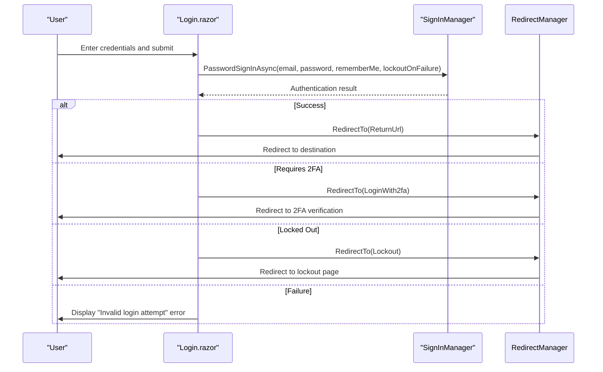
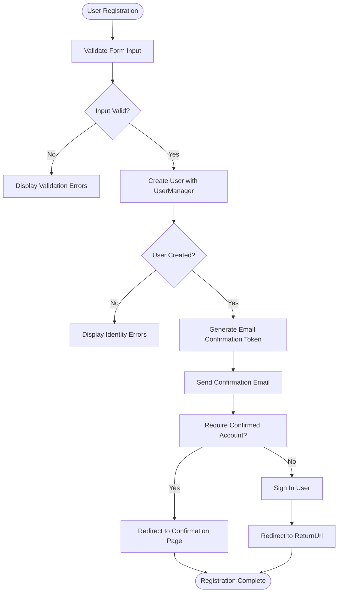
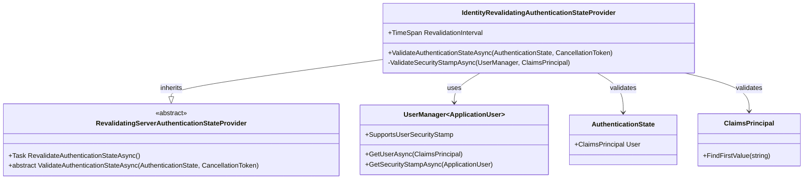
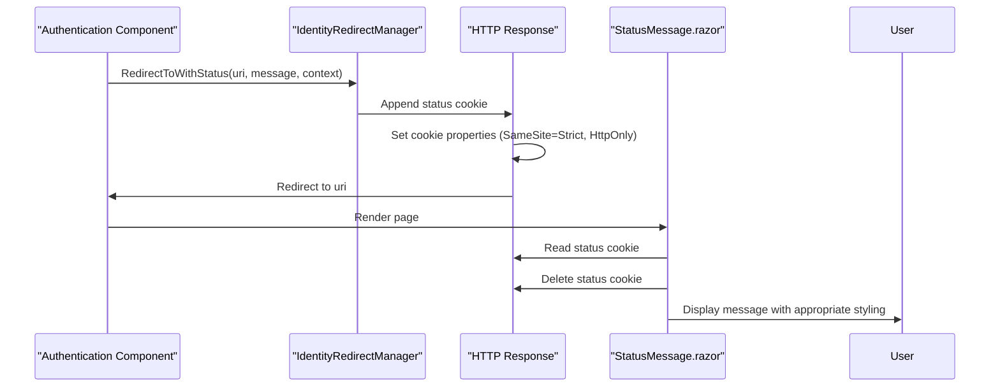
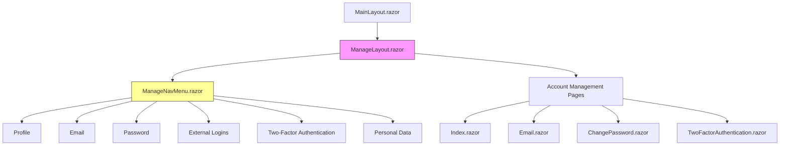
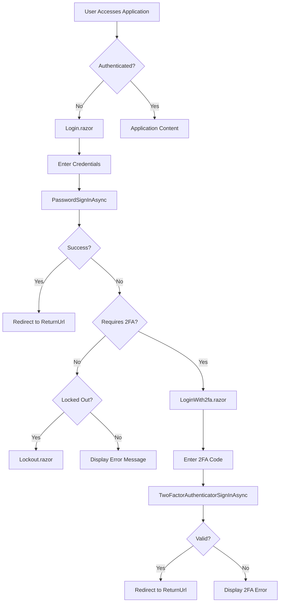

# Authentication Components

<cite>
**Referenced Files in This Document**   
- [Login.razor](file://FitTrack/Components/Account/Pages/Login.razor)
- [Register.razor](file://FitTrack/Components/Account/Pages/Register.razor)
- [Index.razor](file://FitTrack/Components/Account/Pages/Manage/Index.razor)
- [ManageLayout.razor](file://FitTrack/Components/Account/Shared/ManageLayout.razor)
- [StatusMessage.razor](file://FitTrack/Components/Account/Shared/StatusMessage.razor)
- [ManageNavMenu.razor](file://FitTrack/Components/Account/Shared/ManageNavMenu.razor)
- [IdentityRevalidatingAuthenticationStateProvider.cs](file://FitTrack/Components/Account/IdentityRevalidatingAuthenticationStateProvider.cs)
- [ExternalLoginPicker.razor](file://FitTrack/Components/Account/Shared/ExternalLoginPicker.razor)
- [Email.razor](file://FitTrack/Components/Account/Pages/Manage/Email.razor)
- [ChangePassword.razor](file://FitTrack/Components/Account/Pages/Manage/ChangePassword.razor)
- [TwoFactorAuthentication.razor](file://FitTrack/Components/Account/Pages/Manage/TwoFactorAuthentication.razor)
- [IdentityRedirectManager.cs](file://FitTrack/Components/Account/IdentityRedirectManager.cs)
- [IdentityUserAccessor.cs](file://FitTrack/Components/Account/IdentityUserAccessor.cs)
- [ApplicationUser.cs](file://FitTrack/Data/ApplicationUser.cs)
- [Program.cs](file://FitTrack/Program.cs)
- [LoginWith2fa.razor](file://FitTrack/Components/Account/Pages/LoginWith2fa.razor)
</cite>

## Table of Contents
1. [Introduction](#introduction)
2. [Authentication Entry Points](#authentication-entry-points)
3. [Account Management System](#account-management-system)
4. [Security and State Management](#security-and-state-management)
5. [Component Architecture](#component-architecture)
6. [Authentication Flow](#authentication-flow)
7. [Error Handling and User Feedback](#error-handling-and-user-feedback)
8. [Accessibility and Usability](#accessibility-and-usability)

## Introduction
The FitTrack application implements a comprehensive authentication system using ASP.NET Core Identity with Blazor components. This documentation details the UI components responsible for user authentication, account management, and security features. The system provides entry points for login and registration, a modular management interface for profile settings, and robust security mechanisms including two-factor authentication and anti-forgery protection. The authentication state is maintained through a custom revalidating provider that ensures security stamp validation at regular intervals.

## Authentication Entry Points

The authentication system in FitTrack provides two primary entry points: Login.razor and Register.razor, which serve as the main interfaces for user authentication and account creation.

### Login Component
The Login.razor component provides a secure interface for users to authenticate with the system using local credentials or external identity providers. The form structure includes fields for email and password input with proper accessibility attributes and validation. The component implements password masking through the type="password" attribute to protect sensitive information. The form uses EditForm with DataAnnotationsValidator to provide client-side validation based on the InputModel's data annotations.

The authentication process is handled by the SignInManager service, which processes the login attempt and determines the appropriate response based on the result. Successful authentication redirects the user to the requested ReturnUrl or default location. If two-factor authentication is enabled for the account, the user is redirected to the LoginWith2fa page. The component also handles account lockout scenarios and displays appropriate error messages for invalid login attempts.

**Diagram sources**
- [Login.razor](file://FitTrack/Components/Account/Pages/Login.razor#L88-L113)

**Section sources**
- [Login.razor](file://FitTrack/Components/Account/Pages/Login.razor#L1-L129)

### Registration Component
The Register.razor component enables new users to create accounts within the FitTrack system. The form collects email, password, and password confirmation with client-side validation to ensure password complexity requirements and matching confirmation. The component uses UserManager to create the user account and SignInManager to sign in the user after successful registration.

Upon registration, the system generates an email confirmation token and sends a verification link to the provided email address. If email confirmation is required by the application settings, users are redirected to a confirmation page; otherwise, they are automatically signed in and redirected to the requested URL. The component handles validation errors from the identity system and displays them through the StatusMessage component.

**Diagram sources**
- [Register.razor](file://FitTrack/Components/Account/Pages/Register.razor#L68-L102)

**Section sources**
- [Register.razor](file://FitTrack/Components/Account/Pages/Register.razor#L1-L147)

## Account Management System

The account management system in FitTrack provides users with a comprehensive interface to manage their profile settings, security options, and personal data through a modular and organized structure.

### Profile Management (Index.razor)
The Index.razor page serves as the main profile management interface, allowing users to update basic profile information such as phone number. The component retrieves the current user's information using IdentityUserAccessor and pre-populates the form with existing data. When changes are submitted, the component uses UserManager to update the user's information and refreshes the authentication state to ensure the updated claims are available.

The profile management interface is designed with a clean, responsive layout that adapts to different screen sizes. The form includes proper validation attributes and displays validation summaries for any errors that occur during submission. Successful updates are communicated to the user through status messages.

**Section sources**
- [Index.razor](file://FitTrack/Components/Account/Pages/Manage/Index.razor#L1-L78)

### Email Management
The Email.razor component provides functionality for managing email addresses, including changing the primary email and verifying email ownership. Users can request a change to their email address, which triggers a confirmation email to be sent to the new address. The component also allows users to resend verification emails for their current address if needed.

The email change process follows security best practices by generating a unique token for each change request and sending a confirmation link to the new email address. This ensures that only users with access to the new email can complete the change process. The interface clearly indicates whether the current email is verified and provides appropriate actions based on the verification status.

**Section sources**
- [Email.razor](file://FitTrack/Components/Account/Pages/Manage/Email.razor#L1-L124)

### Password Management
The ChangePassword.razor component enables users to update their account passwords securely. The form requires the current password, new password, and password confirmation to prevent unauthorized changes. The component checks whether the user has a password configured and redirects to SetPassword if no password exists.

Password validation follows the application's security policies, including minimum length requirements and complexity rules enforced by the Identity system. After a successful password change, the authentication state is refreshed to ensure the user remains signed in with the updated credentials. The component also handles validation errors from the identity system and displays them appropriately.

**Section sources**
- [ChangePassword.razor](file://FitTrack/Components/Account/Pages/Manage/ChangePassword.razor#L1-L97)

### Two-Factor Authentication Management
The TwoFactorAuthentication.razor component provides a comprehensive interface for managing two-factor authentication settings. The component displays the current 2FA status and provides options to enable or disable 2FA, manage authenticator apps, and handle recovery codes.

The interface includes contextual information about recovery code status, warning users when they have few or no recovery codes remaining. It also shows whether the current browser is remembered for 2FA and provides an option to forget the browser. The component checks for tracking consent before allowing 2FA configuration, ensuring compliance with privacy regulations.

**Section sources**
- [TwoFactorAuthentication.razor](file://FitTrack/Components/Account/Pages/Manage/TwoFactorAuthentication.razor#L1-L102)

## Security and State Management

FitTrack implements several security mechanisms to protect user authentication and maintain secure sessions throughout the application.

### Authentication State Provider
The IdentityRevalidatingAuthenticationStateProvider extends Blazor's RevalidatingServerAuthenticationStateProvider to periodically validate the user's security stamp. This custom provider checks the security stamp every 30 minutes when an interactive circuit is connected, ensuring that if a user's account is compromised or modified, the authentication state is revalidated.

The provider creates a new service scope to retrieve a fresh instance of UserManager, ensuring it works with up-to-date user data. It compares the security stamp in the user's claims with the current security stamp from the database, invalidating the authentication state if they don't match. This mechanism provides an additional layer of security beyond standard session management.

**Diagram sources**
- [IdentityRevalidatingAuthenticationStateProvider.cs](file://FitTrack/Components/Account/IdentityRevalidatingAuthenticationStateProvider.cs#L1-L48)

**Section sources**
- [IdentityRevalidatingAuthenticationStateProvider.cs](file://FitTrack/Components/Account/IdentityRevalidatingAuthenticationStateProvider.cs#L1-L48)
- [Program.cs](file://FitTrack/Program.cs#L15-L18)

### Redirect Management and Status Messaging
The IdentityRedirectManager class handles secure redirection within the authentication system, preventing open redirect vulnerabilities by validating all redirect URLs. It uses strict SameSite cookies for status messages, which are automatically deleted after being displayed to prevent replay attacks.

The StatusMessage.razor component displays status messages to users by reading from a temporary cookie set by IdentityRedirectManager. This pattern allows status messages to persist across redirects while maintaining security. The component differentiates between success and error messages by examining the message content and applying appropriate styling.

**Diagram sources**
- [IdentityRedirectManager.cs](file://FitTrack/Components/Account/IdentityRedirectManager.cs#L1-L59)
- [StatusMessage.razor](file://FitTrack/Components/Account/Shared/StatusMessage.razor#L1-L30)

**Section sources**
- [IdentityRedirectManager.cs](file://FitTrack/Components/Account/IdentityRedirectManager.cs#L1-L59)
- [StatusMessage.razor](file://FitTrack/Components/Account/Shared/StatusMessage.razor#L1-L30)

### Anti-Forgery and External Authentication
The application uses ASP.NET Core's anti-forgery protection to prevent cross-site request forgery attacks. The ExternalLoginPicker.razor component includes an AntiforgeryToken in its form for external authentication, ensuring that requests to perform external login are legitimate.

External authentication providers are dynamically discovered through SignInManager.GetExternalAuthenticationSchemesAsync, and buttons are rendered for each available provider. The component gracefully handles cases where no external providers are configured, displaying helpful guidance to developers.

**Section sources**
- [ExternalLoginPicker.razor](file://FitTrack/Components/Account/Shared/ExternalLoginPicker.razor#L1-L47)
- [Program.cs](file://FitTrack/Program.cs#L67)

## Component Architecture

The authentication components in FitTrack follow a modular architecture with clear separation of concerns and reusable elements.

### Layout and Navigation Structure
The ManageLayout.razor component provides a consistent container for all account management pages, inheriting from LayoutComponentBase and nesting within the main application layout. It establishes a two-column layout with navigation on the left and content on the right, creating a cohesive user experience across all management pages.

The ManageNavMenu.razor component generates navigation links for all account management features, dynamically showing or hiding the external logins option based on available authentication schemes. The navigation uses NavLink components with appropriate routing to ensure proper URL handling and active state indication.

**Diagram sources**
- [ManageLayout.razor](file://FitTrack/Components/Account/Shared/ManageLayout.razor#L1-L17)
- [ManageNavMenu.razor](file://FitTrack/Components/Account/Shared/ManageNavMenu.razor#L1-L38)

**Section sources**
- [ManageLayout.razor](file://FitTrack/Components/Account/Shared/ManageLayout.razor#L1-L17)
- [ManageNavMenu.razor](file://FitTrack/Components/Account/Shared/ManageNavMenu.razor#L1-L38)

### User Access and Dependency Injection
The IdentityUserAccessor service provides a centralized way to retrieve the current user with proper error handling. When a user cannot be loaded, it redirects to an error page with a descriptive message, ensuring consistent behavior across all components that require user access.

The authentication components use dependency injection to access required services such as UserManager, SignInManager, and various managers. This approach promotes testability and separation of concerns, allowing components to focus on UI logic while delegating business logic to dedicated services.

**Section sources**
- [IdentityUserAccessor.cs](file://FitTrack/Components/Account/IdentityUserAccessor.cs#L1-L22)
- [Program.cs](file://FitTrack/Program.cs#L16-L17)

## Authentication Flow

The authentication system in FitTrack follows a comprehensive flow from initial access to full authentication, with multiple pathways and security checks.

### Primary Authentication Flow
The primary authentication flow begins with the Login.razor page, where users enter their credentials. Upon submission, the system attempts to authenticate using SignInManager.PasswordSignInAsync. If successful, users are redirected to their intended destination. If two-factor authentication is enabled, users are redirected to the two-factor verification page.

For new users, the registration flow creates an account and optionally requires email confirmation before full access is granted. The system generates cryptographically secure tokens for email confirmation and password reset operations, encoded using Base64Url encoding for URL safety.

**Section sources**
- [Login.razor](file://FitTrack/Components/Account/Pages/Login.razor#L88-L113)
- [LoginWith2fa.razor](file://FitTrack/Components/Account/Pages/LoginWith2fa.razor#L67-L87)

### Two-Factor Authentication Flow
The two-factor authentication flow provides an additional security layer for user accounts. When enabled, users must provide a time-based one-time password (TOTP) from an authenticator app or a recovery code after entering their credentials.

The system tracks recovery code usage and alerts users when they have few or no recovery codes remaining, prompting them to generate new ones. It also supports "remembering" trusted devices for a specified period, reducing the frequency of 2FA prompts on frequently used devices.

**Section sources**
- [LoginWith2fa.razor](file://FitTrack/Components/Account/Pages/LoginWith2fa.razor#L1-L102)
- [TwoFactorAuthentication.razor](file://FitTrack/Components/Account/Pages/Manage/TwoFactorAuthentication.razor#L1-L102)

## Error Handling and User Feedback

The authentication system implements comprehensive error handling and user feedback mechanisms to guide users through the authentication process.

### Error Display and Validation
All authentication components use ValidationSummary and ValidationMessage components to display client-side validation errors. These messages are triggered by data annotations on the input models and provide immediate feedback on form validity.

For server-side errors, the system uses the StatusMessage component to display messages after redirects. This approach ensures that users receive feedback even when errors occur during operations that require redirection. The messages are stored in a short-lived, secure cookie to prevent tampering and replay attacks.

**Section sources**
- [StatusMessage.razor](file://FitTrack/Components/Account/Shared/StatusMessage.razor#L1-L30)
- [Login.razor](file://FitTrack/Components/Account/Pages/Login.razor#L19)
- [Register.razor](file://FitTrack/Components/Account/Pages/Register.razor#L24)

### Failed Authentication Handling
Failed authentication attempts are handled gracefully without revealing specific details about why the authentication failed. Generic error messages like "Invalid login attempt" are displayed to prevent enumeration attacks. The system does not distinguish between invalid usernames and incorrect passwords in error messages.

Account lockout policies are implemented to prevent brute force attacks. After a configurable number of failed attempts, accounts are temporarily locked, and users are redirected to a lockout page with appropriate messaging.

**Section sources**
- [Login.razor](file://FitTrack/Components/Account/Pages/Login.razor#L111-L112)
- [Program.cs](file://FitTrack/Program.cs#L33)

## Accessibility and Usability

The authentication components in FitTrack are designed with accessibility and mobile usability in mind.

### Responsive Design
All authentication components use Bootstrap's responsive grid system with classes like col-lg-6 and col-xl-6 to ensure proper layout on different screen sizes. The forms are designed to be usable on mobile devices with appropriately sized input fields and buttons.

The layout adapts to smaller screens by stacking columns vertically, ensuring that all content remains accessible and usable on mobile devices. Input fields have appropriate labels and placeholder text to guide users.

**Section sources**
- [Login.razor](file://FitTrack/Components/Account/Pages/Login.razor#L16-L58)
- [Register.razor](file://FitTrack/Components/Account/Pages/Register.razor#L22-L55)

### Accessibility Features
The components implement several accessibility features, including proper labeling of form fields with for attributes that match input IDs. ARIA attributes are used to enhance accessibility, such as aria-required="true" on required fields.

Form controls have appropriate type attributes (e.g., type="password" for password fields) to ensure proper handling by assistive technologies. The application also uses semantic HTML elements like h1, h2, and h3 to structure content hierarchically.

**Section sources**
- [Login.razor](file://FitTrack/Components/Account/Pages/Login.razor#L26-L33)
- [Register.razor](file://FitTrack/Components/Account/Pages/Register.razor#L31-L43)