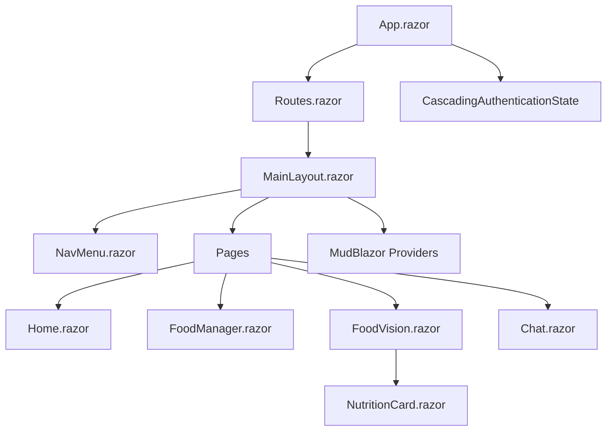
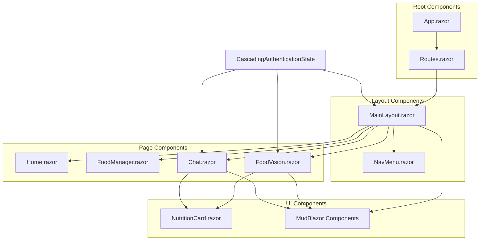
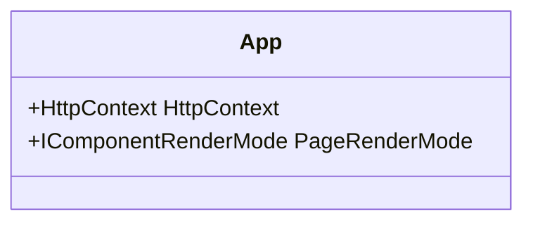
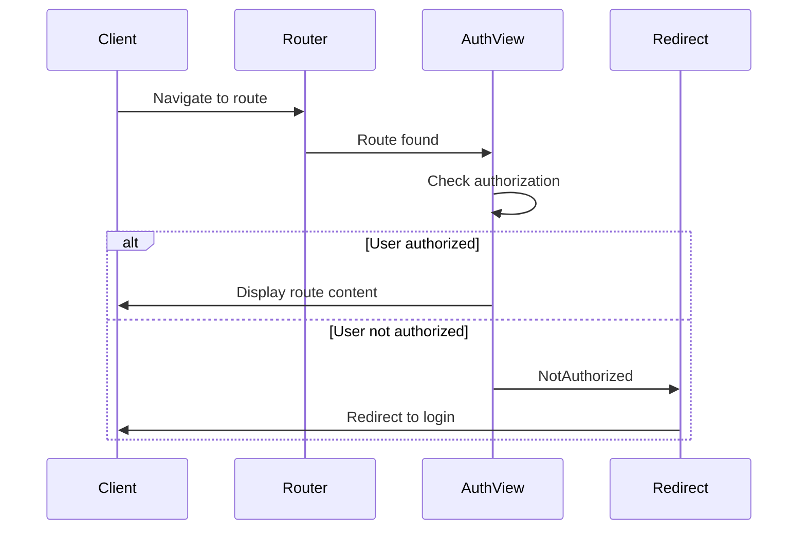
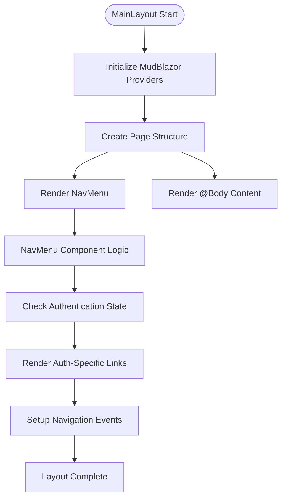
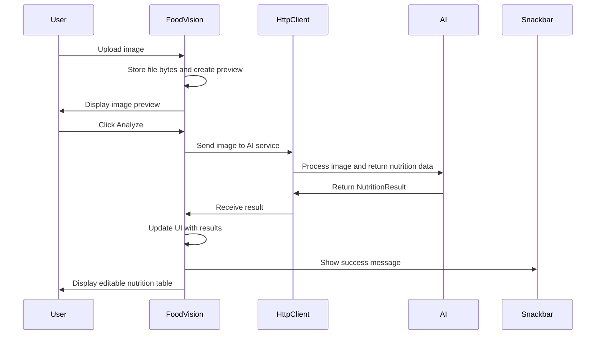
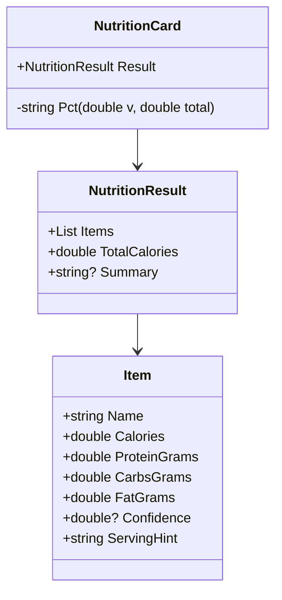
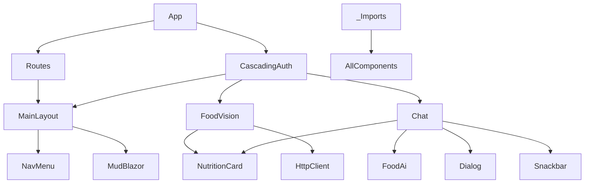

# Frontend Architecture

<cite>
**Referenced Files in This Document**   
- [App.razor](file://FitTrack/FitTrack/Components/App.razor)
- [Routes.razor](file://FitTrack/FitTrack/Components/Routes.razor)
- [MainLayout.razor](file://FitTrack/FitTrack/Components/Layout/MainLayout.razor)
- [NavMenu.razor](file://FitTrack/FitTrack/Components/Layout/NavMenu.razor)
- [Home.razor](file://FitTrack/FitTrack/Components/Pages/Home.razor)
- [FoodManager.razor](file://FitTrack/FitTrack/Components/Pages/FoodManager.razor)
- [FoodVision.razor](file://FitTrack/FitTrack.Copilot/Components/Pages/FoodVision.razor)
- [NutritionCard.razor](file://FitTrack/FitTrack.Copilot/Components/NutritionCard.razor)
- [Chat.razor](file://FitTrack/FitTrack.Copilot/Components/Pages/Chat.razor)
- [MainLayout.razor.css](file://FitTrack/FitTrack/Components/Layout/MainLayout.razor.css)
- [NavMenu.razor.css](file://FitTrack/FitTrack/Components/Layout/NavMenu.razor.css)
- [IdentityRevalidatingAuthenticationStateProvider.cs](file://FitTrack/FitTrack/Components/Account/IdentityRevalidatingAuthenticationStateProvider.cs)
- [_Imports.razor](file://FitTrack/FitTrack/Components/_Imports.razor)
</cite>

## Table of Contents
1. [Introduction](#introduction)
2. [Project Structure](#project-structure)
3. [Core Components](#core-components)
4. [Architecture Overview](#architecture-overview)
5. [Detailed Component Analysis](#detailed-component-analysis)
6. [Dependency Analysis](#dependency-analysis)
7. [Performance Considerations](#performance-considerations)
8. [Troubleshooting Guide](#troubleshooting-guide)
9. [Conclusion](#conclusion)

## Introduction
This document provides comprehensive architectural documentation for the Blazor frontend components in FitTrack, a fitness tracking application with AI-powered food recognition capabilities. The documentation covers the component-based UI architecture using Razor syntax and Blazor Server rendering, focusing on the key structural components, page implementations, state management, and UI consistency patterns.

## Project Structure

**Diagram sources**
- [App.razor](file://FitTrack/FitTrack/Components/App.razor#L1-L35)
- [Routes.razor](file://FitTrack/FitTrack/Components/Routes.razor#L1-L11)
- [MainLayout.razor](file://FitTrack/FitTrack/Components/Layout/MainLayout.razor#L1-L32)

**Section sources**
- [App.razor](file://FitTrack/FitTrack/Components/App.razor#L1-L35)
- [Routes.razor](file://FitTrack/FitTrack/Components/Routes.razor#L1-L11)
- [MainLayout.razor](file://FitTrack/FitTrack/Components/Layout/MainLayout.razor#L1-L32)
- [NavMenu.razor](file://FitTrack/FitTrack/Components/Layout/NavMenu.razor#L1-L92)

## Core Components

The FitTrack frontend architecture is built on a component-based model using Blazor Server rendering. The application follows a hierarchical structure with App.razor as the root component that orchestrates the entire application lifecycle. The architecture leverages Razor syntax for templating and integrates MudBlazor components for consistent UI design.

Key architectural elements include:
- **App.razor**: Root component that defines the HTML structure and rendering mode
- **Routes.razor**: Central routing component that manages navigation and authorization
- **MainLayout.razor**: Consistent page structure with navigation and content areas
- **NavMenu.razor**: Responsive navigation menu with authentication-aware links
- **CascadingAuthenticationState**: User context propagation throughout the component tree

The component hierarchy establishes a clear separation of concerns, with layout components providing structural consistency and page components implementing specific functionality.

**Section sources**
- [App.razor](file://FitTrack/FitTrack/Components/App.razor#L1-L35)
- [Routes.razor](file://FitTrack/FitTrack/Components/Routes.razor#L1-L11)
- [MainLayout.razor](file://FitTrack/FitTrack/Components/Layout/MainLayout.razor#L1-L32)
- [NavMenu.razor](file://FitTrack/FitTrack/Components/Layout/NavMenu.razor#L1-L92)

## Architecture Overview

**Diagram sources**
- [App.razor](file://FitTrack/FitTrack/Components/App.razor#L1-L35)
- [Routes.razor](file://FitTrack/FitTrack/Components/Routes.razor#L1-L11)
- [MainLayout.razor](file://FitTrack/FitTrack/Components/Layout/MainLayout.razor#L1-L32)
- [NavMenu.razor](file://FitTrack/FitTrack/Components/Layout/NavMenu.razor#L1-L92)
- [FoodVision.razor](file://FitTrack/FitTrack.Copilot/Components/Pages/FoodVision.razor#L1-L96)
- [NutritionCard.razor](file://FitTrack/FitTrack.Copilot/Components/NutritionCard.razor#L1-L64)
- [Chat.razor](file://FitTrack/FitTrack.Copilot/Components/Pages/Chat.razor#L1-L124)

## Detailed Component Analysis

### Root and Layout Components

#### App.razor Analysis
The App.razor component serves as the root of the Blazor application, defining the HTML document structure and rendering configuration. It includes essential meta tags, CSS references for Bootstrap and MudBlazor, and script references for Blazor and MudBlazor JavaScript functionality.

The component implements interactive server-side rendering through the PageRenderMode property, which determines the rendering mode based on whether the request accepts interactive routing. This enables a seamless transition between static and interactive rendering as needed.

**Diagram sources**
- [App.razor](file://FitTrack/FitTrack/Components/App.razor#L1-L35)

#### Routes.razor Analysis
The Routes.razor component implements the application's routing mechanism using Blazor's Router component. It integrates authorization through the AuthorizeRouteView, which automatically handles authentication requirements for routed components.

The component uses the RedirectToLogin component from the shared account components to redirect unauthenticated users to the login page when attempting to access protected routes. This centralized routing approach ensures consistent authorization behavior across all pages.

**Diagram sources**
- [Routes.razor](file://FitTrack/FitTrack/Components/Routes.razor#L1-L11)

#### MainLayout and NavMenu Analysis
The MainLayout.razor component provides a consistent structure for all pages in the application, implementing a responsive sidebar layout with a top navigation bar. It inherits from LayoutComponentBase and incorporates MudBlazor's theme and dialog providers to ensure consistent UI behavior.

The layout contains a sidebar with the NavMenu component and a main content area that renders the @Body content. The responsive design uses CSS media queries to adapt the layout for different screen sizes, with the sidebar collapsing into a hamburger menu on smaller screens.

The NavMenu.razor component implements the navigation interface with links to key application pages. It uses Blazor's NavLink component for active route highlighting and incorporates authentication-aware navigation through the AuthorizeView component, which shows different menu options based on the user's authentication state.

**Diagram sources**
- [MainLayout.razor](file://FitTrack/FitTrack/Components/Layout/MainLayout.razor#L1-L32)
- [NavMenu.razor](file://FitTrack/FitTrack/Components/Layout/NavMenu.razor#L1-L92)
- [MainLayout.razor.css](file://FitTrack/FitTrack/Components/Layout/MainLayout.razor.css#L1-L99)
- [NavMenu.razor.css](file://FitTrack/FitTrack/Components/Layout/NavMenu.razor.css#L1-L126)

**Section sources**
- [MainLayout.razor](file://FitTrack/FitTrack/Components/Layout/MainLayout.razor#L1-L32)
- [NavMenu.razor](file://FitTrack/FitTrack/Components/Layout/NavMenu.razor#L1-L92)
- [MainLayout.razor.css](file://FitTrack/FitTrack/Components/Layout/MainLayout.razor.css#L1-L99)
- [NavMenu.razor.css](file://FitTrack/FitTrack/Components/Layout/NavMenu.razor.css#L1-L126)

### Page Components

#### Home, FoodManager, and Chat Components
The Home.razor component serves as the application's landing page, providing a simple welcome message and entry point to the application's features. The FoodManager.razor component (located in the main FitTrack project) likely provides traditional food logging functionality, though its specific implementation details are not available in the current context.

The Chat.razor component implements a conversational interface for food recognition, allowing users to describe foods or upload images through a chat-like interface. This component uses MudBlazor's container and paper components for visual structure and incorporates a message list that displays both user inputs and AI responses with appropriate styling.

#### FoodVision Component Analysis
The FoodVision.razor component implements an AI-powered food recognition feature that allows users to upload food images and receive nutritional estimates. The component is located in the FitTrack.Copilot project, indicating it's part of an AI extension to the core application.

The component workflow follows a clear sequence:
1. Image upload through InputFile component
2. Preview display of the uploaded image
3. Analysis request to AI service when "Analyze" button is clicked
4. Display of nutritional estimates in an editable table
5. Option to save or reset the results

The UI uses MudBlazor components extensively, including MudPaper for card-like containers, MudText for typography, MudGrid for layout, MudButton for actions, and MudTable for displaying nutritional data. The table allows inline editing of nutritional values before saving, providing a user-friendly interface for correcting AI estimates.

**Diagram sources**
- [FoodVision.razor](file://FitTrack/FitTrack.Copilot/Components/Pages/FoodVision.razor#L1-L96)
- [NutritionCard.razor](file://FitTrack/FitTrack.Copilot/Components/NutritionCard.razor#L1-L64)

**Section sources**
- [FoodVision.razor](file://FitTrack/FitTrack.Copilot/Components/Pages/FoodVision.razor#L1-L96)
- [NutritionCard.razor](file://FitTrack/FitTrack.Copilot/Components/NutritionCard.razor#L1-L64)

#### NutritionCard Component Analysis
The NutritionCard.razor component displays nutritional information in a structured format, likely used by both FoodVision and Chat components to present AI-generated nutrition estimates. The component accepts a NutritionResult parameter and renders it in a MudBlazor card with consistent styling.

The component displays total calories prominently and lists individual food items with their nutritional breakdown (calories, protein, carbs, fat) and confidence scores. Confidence scores are visualized using MudProgressLinear components, providing a visual indication of the AI's certainty in its estimates. The component also supports displaying a summary message through MudAlert when available.

**Diagram sources**
- [NutritionCard.razor](file://FitTrack/FitTrack.Copilot/Components/NutritionCard.razor#L1-L64)

**Section sources**
- [NutritionCard.razor](file://FitTrack/FitTrack.Copilot/Components/NutritionCard.razor#L1-L64)

## Dependency Analysis

**Diagram sources**
- [App.razor](file://FitTrack/FitTrack/Components/App.razor#L1-L35)
- [Routes.razor](file://FitTrack/FitTrack/Components/Routes.razor#L1-L11)
- [MainLayout.razor](file://FitTrack/FitTrack/Components/Layout/MainLayout.razor#L1-L32)
- [NavMenu.razor](file://FitTrack/FitTrack/Components/Layout/NavMenu.razor#L1-L92)
- [FoodVision.razor](file://FitTrack/FitTrack.Copilot/Components/Pages/FoodVision.razor#L1-L96)
- [NutritionCard.razor](file://FitTrack/FitTrack.Copilot/Components/NutritionCard.razor#L1-L64)
- [Chat.razor](file://FitTrack/FitTrack.Copilot/Components/Pages/Chat.razor#L1-L124)
- [_Imports.razor](file://FitTrack/FitTrack/Components/_Imports.razor#L1-L14)

**Section sources**
- [App.razor](file://FitTrack/FitTrack/Components/App.razor#L1-L35)
- [Routes.razor](file://FitTrack/FitTrack/Components/Routes.razor#L1-L11)
- [MainLayout.razor](file://FitTrack/FitTrack/Components/Layout/MainLayout.razor#L1-L32)
- [NavMenu.razor](file://FitTrack/FitTrack/Components/Layout/NavMenu.razor#L1-L92)
- [FoodVision.razor](file://FitTrack/FitTrack.Copilot/Components/Pages/FoodVision.razor#L1-L96)
- [NutritionCard.razor](file://FitTrack/FitTrack.Copilot/Components/NutritionCard.razor#L1-L64)
- [Chat.razor](file://FitTrack/FitTrack.Copilot/Components/Pages/Chat.razor#L1-L124)
- [_Imports.razor](file://FitTrack/FitTrack/Components/_Imports.razor#L1-L14)

## Performance Considerations
The Blazor Server architecture used in FitTrack provides real-time interactivity with minimal client-side JavaScript, but requires careful consideration of performance implications. The application appears to follow best practices by:

1. Using MudBlazor components efficiently with appropriate density settings
2. Implementing responsive design to optimize rendering on different devices
3. Using CSS isolation for component-specific styles to minimize global style conflicts
4. Leveraging Blazor's built-in rendering optimizations

For the AI-powered features like FoodVision, the application should implement loading states and progress indicators to provide feedback during potentially long-running image analysis operations. The current implementation shows a progress circular indicator during analysis, which helps manage user expectations.

## Troubleshooting Guide
Common issues in the FitTrack frontend architecture may include:

1. **Authentication state not propagating**: Ensure CascadingAuthenticationState is properly configured in the root component
2. **MudBlazor styling issues**: Verify that MudBlazor CSS and JS files are correctly referenced in App.razor
3. **Responsive layout problems**: Check CSS media queries in MainLayout.razor.css and NavMenu.razor.css
4. **Component rendering issues**: Verify that all required services are registered in Program.cs
5. **Image upload failures**: Check file size limits and MIME type validation in FoodVision.razor

When debugging component issues, examine the browser's developer tools for JavaScript errors and network requests, particularly for Blazor's SignalR connection which is essential for Blazor Server applications.

**Section sources**
- [App.razor](file://FitTrack/FitTrack/Components/App.razor#L1-L35)
- [MainLayout.razor.css](file://FitTrack/FitTrack/Components/Layout/MainLayout.razor.css#L1-L99)
- [NavMenu.razor.css](file://FitTrack/FitTrack/Components/Layout/NavMenu.razor.css#L1-L126)
- [IdentityRevalidatingAuthenticationStateProvider.cs](file://FitTrack/FitTrack/Components/Account/IdentityRevalidatingAuthenticationStateProvider.cs#L1-L29)

## Conclusion
The FitTrack frontend architecture demonstrates a well-structured Blazor Server application with a clear component hierarchy and consistent UI patterns. The architecture effectively leverages Razor syntax for templating and MudBlazor for UI consistency, while implementing responsive design principles for optimal user experience across devices.

The application's modular structure separates concerns between layout, routing, and page components, making it maintainable and extensible. The integration of AI-powered features like FoodVision and Chat demonstrates how Blazor can effectively incorporate advanced functionality while maintaining a cohesive user interface.

Key strengths of the architecture include:
- Clear separation of concerns between components
- Consistent UI through MudBlazor integration
- Responsive design for multiple device sizes
- Effective state management through cascading parameters
- Modular structure that supports feature extension

The architecture provides a solid foundation for further development and enhancement of the FitTrack application's frontend capabilities.