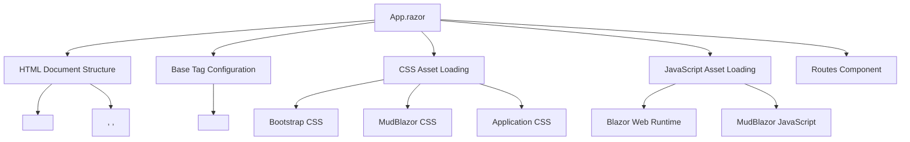
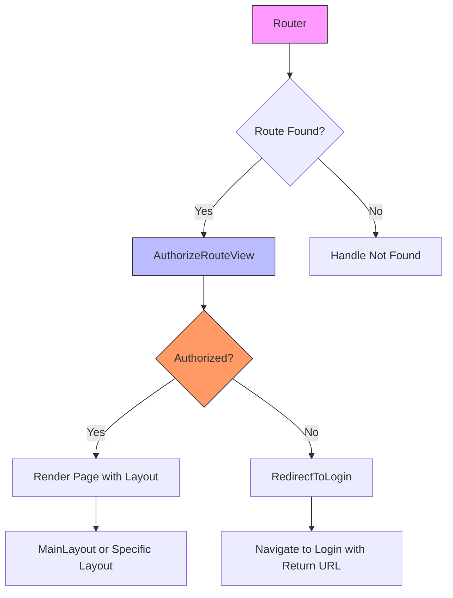
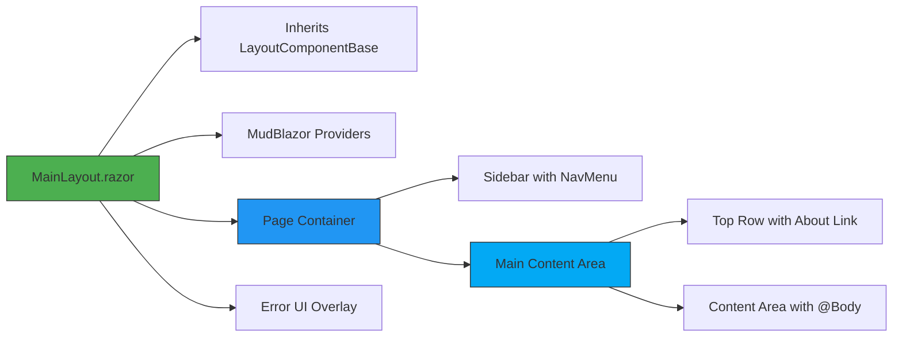
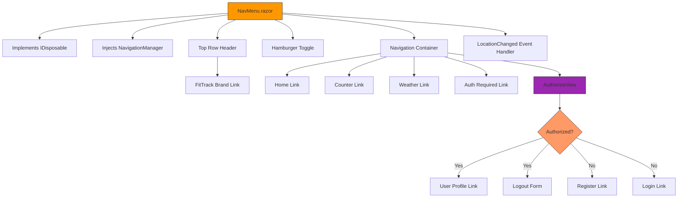
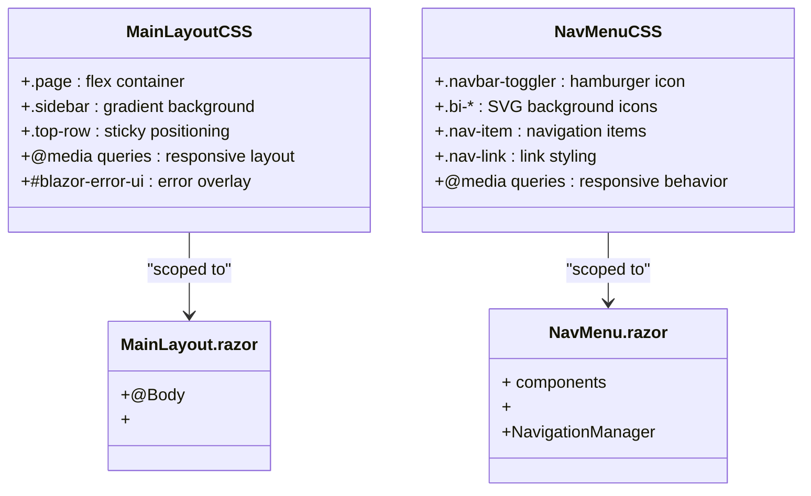
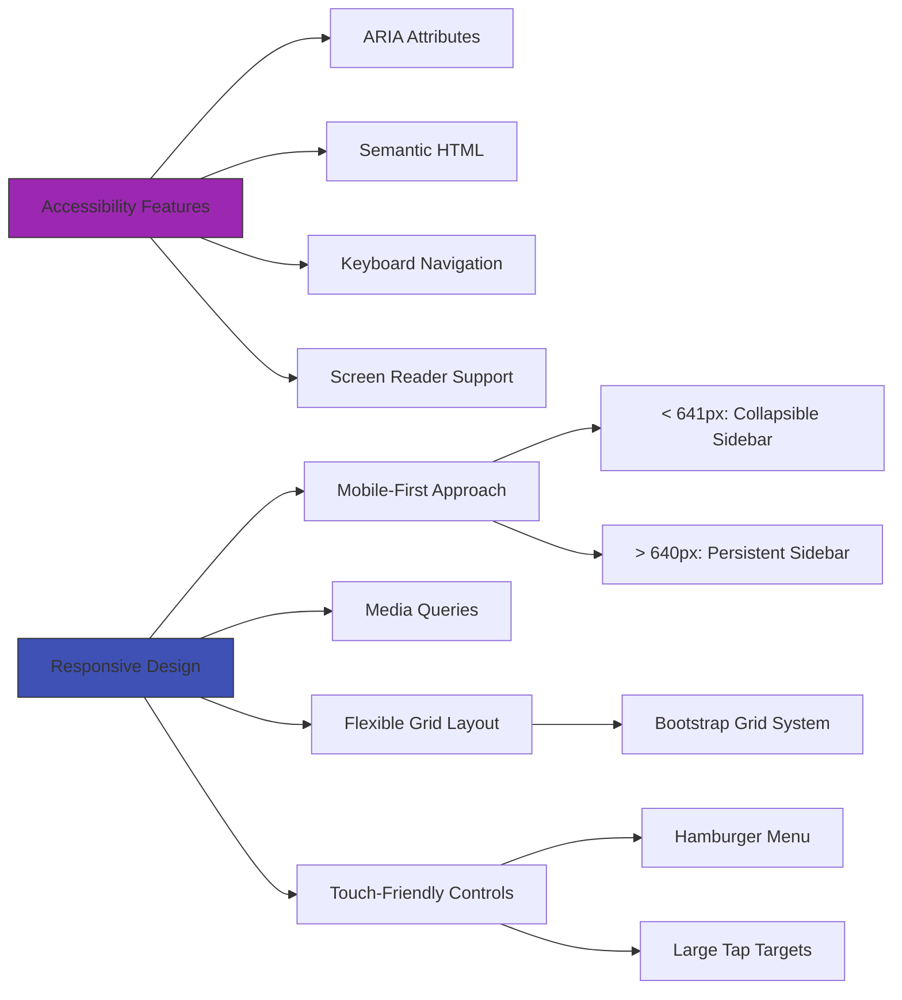

# Layout and Structure

<cite>
**Referenced Files in This Document**   
- [App.razor](file://FitTrack/Components/App.razor)
- [MainLayout.razor](file://FitTrack/Components/Layout/MainLayout.razor)
- [NavMenu.razor](file://FitTrack/Components/Layout/NavMenu.razor)
- [Routes.razor](file://FitTrack/Components/Routes.razor)
- [MainLayout.razor.css](file://FitTrack/Components/Layout/MainLayout.razor.css)
- [NavMenu.razor.css](file://FitTrack/Components/Layout/NavMenu.razor.css)
- [ManageLayout.razor](file://FitTrack/Components/Account/Shared/ManageLayout.razor)
- [RedirectToLogin.razor](file://FitTrack/Components/Account/Shared/RedirectToLogin.razor)
</cite>

## Table of Contents
1. [Introduction](#introduction)
2. [App.razor: Root Component and HTML Shell](#app-razor-root-component-and-html-shell)
3. [Routes.razor: Routing and Authentication Integration](#routes-razor-routing-and-authentication-integration)
4. [MainLayout.razor: Consistent UI Shell](#mainlayout-razor-consistent-ui-shell)
5. [NavMenu.razor: Responsive Navigation Component](#navmenu-razor-responsive-navigation-component)
6. [CSS Isolation and Styling Strategy](#css-isolation-and-styling-strategy)
7. [Layout Cascading and Conditional Rendering](#layout-cascading-and-conditional-rendering)
8. [Accessibility and Responsive Design](#accessibility-and-responsive-design)
9. [Conclusion](#conclusion)

## Introduction
The FitTrack application implements a modern Blazor layout system that provides a consistent user interface across pages while supporting responsive design, authentication-aware navigation, and modular component architecture. This document details the key components of the layout system, including the root App.razor, the routing mechanism, the main layout structure, and the navigation menu implementation. The system leverages Bootstrap and MudBlazor components to create a responsive, accessible interface with proper styling isolation.

## App.razor: Root Component and HTML Shell

The App.razor component serves as the root component of the Blazor application, defining the HTML document structure and initializing the application context. It provides the foundational HTML shell that hosts all other components and manages the integration with ASP.NET Core's routing system.



**Diagram sources**
- [App.razor](file://FitTrack/Components/App.razor#L1-L35)

**Section sources**
- [App.razor](file://FitTrack/Components/App.razor#L1-L35)

## Routes.razor: Routing and Authentication Integration

The Routes.razor component configures the Blazor routing system and integrates authentication checks for protected routes. It uses the Router component to map URLs to page components and applies authorization policies to control access.



**Diagram sources**
- [Routes.razor](file://FitTrack/Components/Routes.razor#L1-L11)
- [RedirectToLogin.razor](file://FitTrack/Components/Account/Shared/RedirectToLogin.razor#L1-L10)

**Section sources**
- [Routes.razor](file://FitTrack/Components/Routes.razor#L1-L11)
- [RedirectToLogin.razor](file://FitTrack/Components/Account/Shared/RedirectToLogin.razor#L1-L10)

## MainLayout.razor: Consistent UI Shell

The MainLayout.razor component provides a consistent UI shell across all pages in the application. It defines the overall page structure with a sidebar for navigation, a main content area, and a top row for secondary navigation and information.



**Diagram sources**
- [MainLayout.razor](file://FitTrack/Components/Layout/MainLayout.razor#L1-L32)

**Section sources**
- [MainLayout.razor](file://FitTrack/Components/Layout/MainLayout.razor#L1-L32)

## NavMenu.razor: Responsive Navigation Component

The NavMenu.razor component implements a responsive sidebar navigation menu that integrates with Bootstrap and MudBlazor. It provides route-based navigation with active link highlighting and conditional rendering based on authentication state.



**Diagram sources**
- [NavMenu.razor](file://FitTrack/Components/Layout/NavMenu.razor#L1-L92)

**Section sources**
- [NavMenu.razor](file://FitTrack/Components/Layout/NavMenu.razor#L1-L92)

## CSS Isolation and Styling Strategy

The layout system employs CSS isolation to ensure component-specific styling without global conflicts. Each layout component has its own CSS file that is scoped to that component, preventing style leakage and enabling modular design.



**Diagram sources**
- [MainLayout.razor.css](file://FitTrack/Components/Layout/MainLayout.razor.css#L1-L99)
- [NavMenu.razor.css](file://FitTrack/Components/Layout/NavMenu.razor.css#L1-L126)

**Section sources**
- [MainLayout.razor.css](file://FitTrack/Components/Layout/MainLayout.razor.css#L1-L99)
- [NavMenu.razor.css](file://FitTrack/Components/Layout/NavMenu.razor.css#L1-L126)

## Layout Cascading and Conditional Rendering

The layout system supports cascading layouts and conditional rendering based on authentication state. The ManageLayout.razor demonstrates layout nesting, while the NavMenu.razor shows conditional navigation items.

```mermaid
flowchart TD
A[Default Layout] --> B[MainLayout.razor]
B --> C[Pages without layout attribute]
A --> D[Specific Layout]
D --> E[ManageLayout.razor]
E --> F[@layout MainLayout]
E --> G[ManageNavMenu]
E --> H[Body Content]
I[Authentication State] --> J[Authorized]
J --> K[Profile Link]
J --> L[Logout Button]
I --> M[Not Authorized]
M --> N[Register Link]
M --> O[Login Link]
style B fill:#4CAF50,stroke:#333
style E fill:#8BC34A,stroke:#333
style J fill:#2196F3,stroke:#333
style M fill:#f96,stroke:#333
```

**Diagram sources**
- [ManageLayout.razor](file://FitTrack/Components/Account/Shared/ManageLayout.razor#L1-L17)
- [NavMenu.razor](file://FitTrack/Components/Layout/NavMenu.razor#L39-L68)

**Section sources**
- [ManageLayout.razor](file://FitTrack/Components/Account/Shared/ManageLayout.razor#L1-L17)
- [NavMenu.razor](file://FitTrack/Components/Layout/NavMenu.razor#L39-L68)

## Accessibility and Responsive Design

The layout system incorporates accessibility features and responsive design principles using Bootstrap grid and MudBlazor components. The interface adapts to different screen sizes and provides accessible navigation.



**Diagram sources**
- [MainLayout.razor](file://FitTrack/Components/Layout/MainLayout.razor#L12-L26)
- [NavMenu.razor](file://FitTrack/Components/Layout/NavMenu.razor#L5-L70)
- [MainLayout.razor.css](file://FitTrack/Components/Layout/MainLayout.razor.css#L39-L47)
- [NavMenu.razor.css](file://FitTrack/Components/Layout/NavMenu.razor.css#L112-L125)

**Section sources**
- [MainLayout.razor](file://FitTrack/Components/Layout/MainLayout.razor#L12-L26)
- [NavMenu.razor](file://FitTrack/Components/Layout/NavMenu.razor#L5-L70)
- [MainLayout.razor.css](file://FitTrack/Components/Layout/MainLayout.razor.css#L39-L47)
- [NavMenu.razor.css](file://FitTrack/Components/Layout/NavMenu.razor.css#L112-L125)

## Conclusion
The FitTrack Blazor layout system demonstrates a well-structured approach to UI organization, combining the power of Blazor's component model with Bootstrap and MudBlazor for responsive, accessible interfaces. The App.razor component serves as the root HTML shell, while Routes.razor manages navigation and authentication integration. MainLayout.razor provides a consistent UI structure with a sidebar and main content area, and NavMenu.razor delivers responsive navigation with authentication-aware menu items. CSS isolation ensures maintainable, scoped styling, and the system supports layout cascading for specialized page layouts. The implementation follows modern web development practices with a focus on accessibility and responsive design across device sizes.