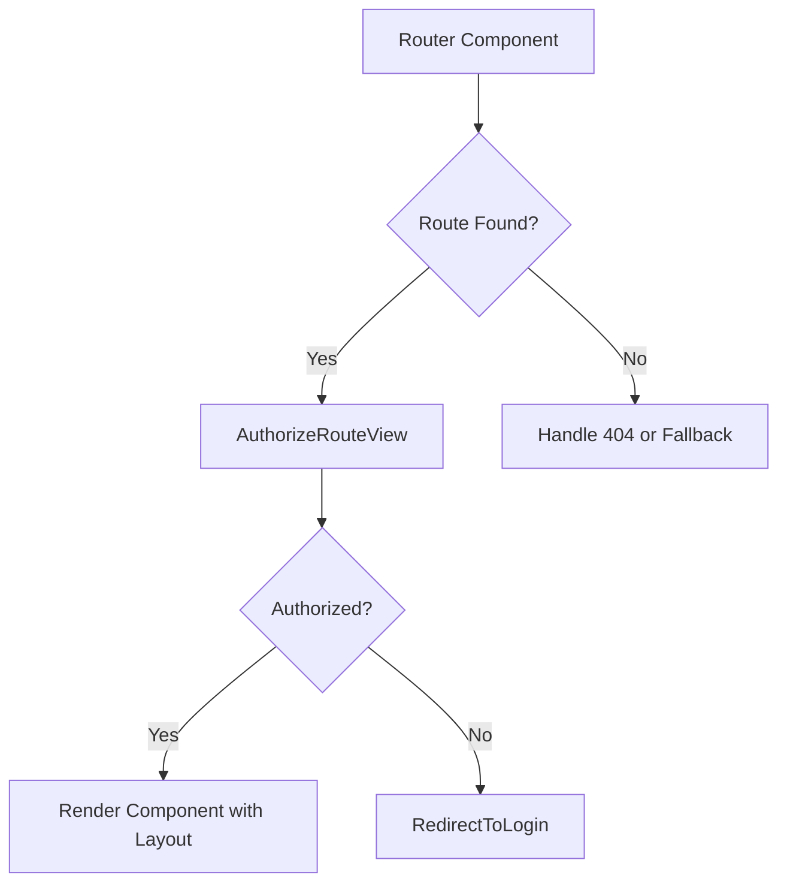
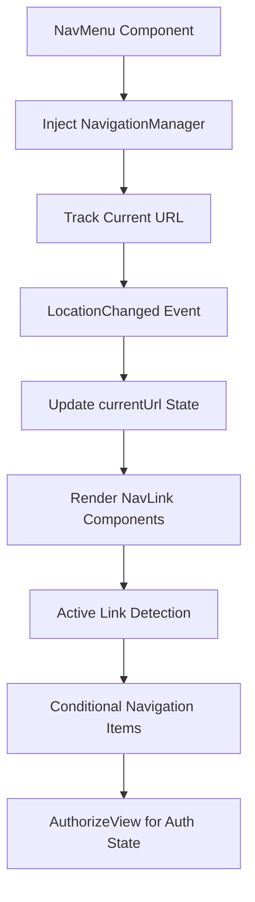
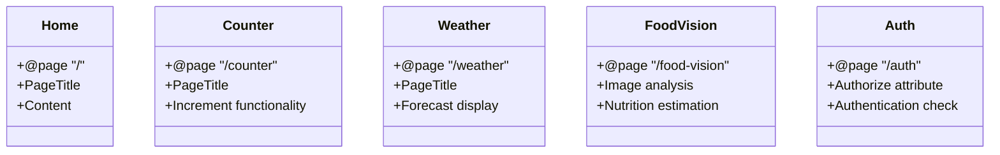
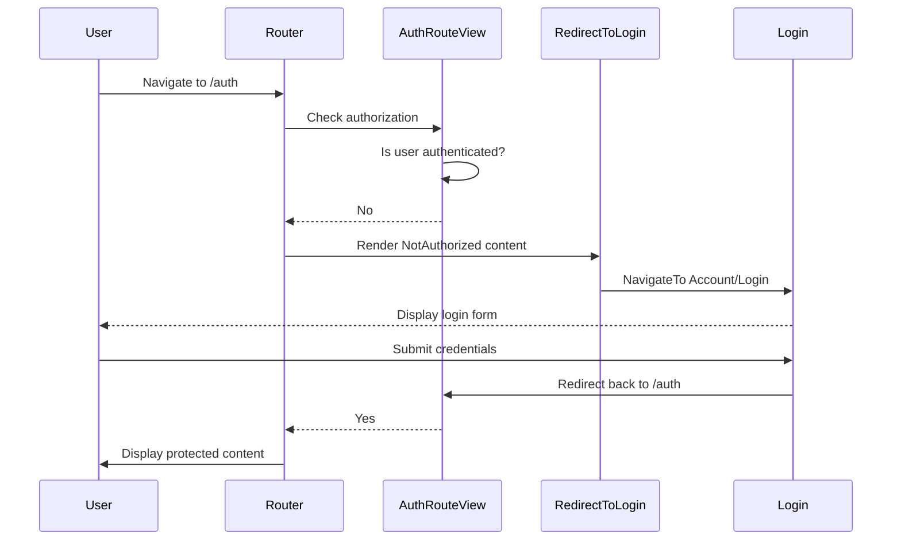
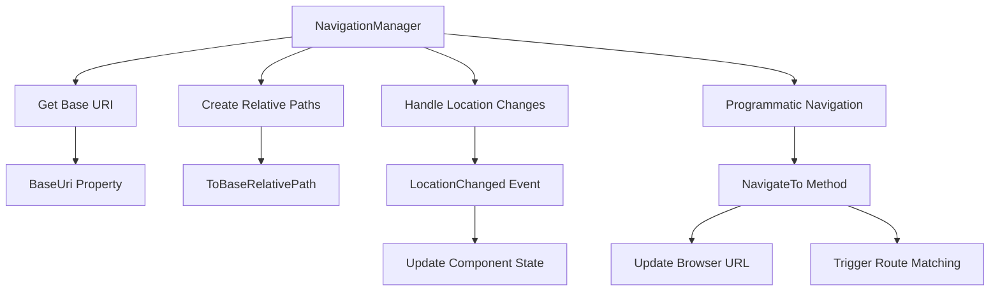
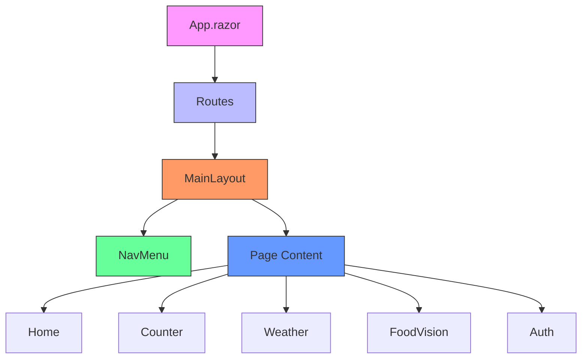
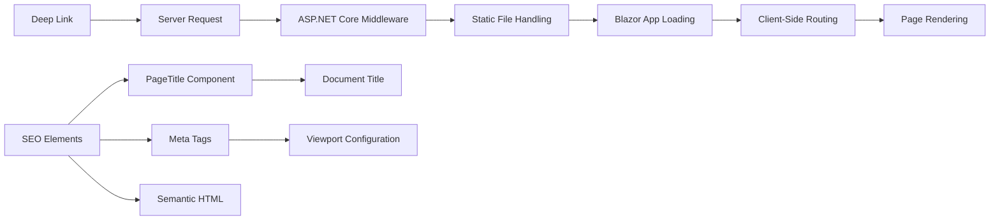

# Navigation and Routing

<cite>
**Referenced Files in This Document**   
- [Routes.razor](file://FitTrack/FitTrack/Components/Routes.razor)
- [NavMenu.razor](file://FitTrack/FitTrack/Components/Layout/NavMenu.razor)
- [MainLayout.razor](file://FitTrack/FitTrack/Components/Layout/MainLayout.razor)
- [Home.razor](file://FitTrack/FitTrack/Components/Pages/Home.razor)
- [FoodVision.razor](file://FitTrack/FitTrack.Copilot/Components/Pages/FoodVision.razor)
- [RedirectToLogin.razor](file://FitTrack/FitTrack/Components/Account/Shared/RedirectToLogin.razor)
- [App.razor](file://FitTrack/FitTrack/Components/App.razor)
- [Counter.razor](file://FitTrack/FitTrack/Components/Pages/Counter.razor)
- [Weather.razor](file://FitTrack/FitTrack/Components/Pages/Weather.razor)
- [Auth.razor](file://FitTrack/FitTrack/Components/Pages/Auth.razor)
- [ManageNavMenu.razor](file://FitTrack/FitTrack/Components/Account/Shared/ManageNavMenu.razor)
- [Program.cs](file://FitTrack/FitTrack/Program.cs)
</cite>

## Table of Contents
1. [Introduction](#introduction)
2. [Route Configuration with Routes.razor](#route-configuration-with-routesrazor)
3. [Primary Navigation with NavMenu.razor](#primary-navigation-with-navmenurazor)
4. [Page-Level Routing Implementation](#page-level-routing-implementation)
5. [Authentication-Based Navigation](#authentication-based-navigation)
6. [Navigation Manager and Programmatic Navigation](#navigation-manager-and-programmatic-navigation)
7. [Layout and Component Hierarchy](#layout-and-component-hierarchy)
8. [Deep Linking and SEO Considerations](#deep-linking-and-seo-considerations)
9. [Troubleshooting Common Routing Issues](#troubleshooting-common-routing-issues)
10. [Conclusion](#conclusion)

## Introduction
The FitTrack Blazor application implements a comprehensive navigation and routing system that enables seamless user experience across various features including fitness tracking, food analysis, and user authentication. The routing architecture leverages Blazor Server's built-in routing capabilities combined with ASP.NET Core endpoint routing to provide a robust navigation framework. This document details the implementation of navigation mechanisms in the FitTrack application, focusing on route configuration, primary navigation components, authentication-aware routing, and best practices for maintaining URL consistency and supporting deep linking.

## Route Configuration with Routes.razor

The central routing configuration in FitTrack is managed through the Routes.razor component, which serves as the routing engine for the Blazor application. This component defines the application's route table and integrates with ASP.NET Core's endpoint routing system to handle both Blazor component navigation and traditional MVC endpoints.

**Diagram sources**
- [Routes.razor](file://FitTrack/FitTrack/Components/Routes.razor#L1-L11)

**Section sources**
- [Routes.razor](file://FitTrack/FitTrack/Components/Routes.razor#L1-L11)
- [App.razor](file://FitTrack/FitTrack/Components/App.razor#L1-L35)

The Routes.razor component uses the Router component with the AppAssembly parameter set to the Program assembly, which enables the router to scan for @page directives in the application's components. The Found context specifies the behavior when a route match is found, wrapping the content in an AuthorizeRouteView component that provides authorization-aware routing. When a user is not authorized to access a particular route, the NotAuthorized template redirects them to the login page via the RedirectToLogin component. The FocusOnNavigate component enhances accessibility by setting focus to the first h1 element when navigating between pages.

## Primary Navigation with NavMenu.razor

The NavMenu.razor component implements the primary navigation interface for the FitTrack application, providing users with consistent access to key application features. This responsive navigation menu adapts to different screen sizes and includes active link detection to indicate the current page.

**Diagram sources**
- [NavMenu.razor](file://FitTrack/FitTrack/Components/Layout/NavMenu.razor#L1-L92)

**Section sources**
- [NavMenu.razor](file://FitTrack/FitTrack/Components/Layout/NavMenu.razor#L1-L92)
- [MainLayout.razor](file://FitTrack/FitTrack/Components/Layout/MainLayout.razor#L1-L32)

The navigation menu is implemented as a responsive sidebar that collapses on smaller screens using a checkbox-based toggle mechanism. It utilizes the NavLink component for navigation items, which automatically applies active CSS classes when the current route matches the link's href attribute. The Match property on the Home link is set to NavLinkMatch.All, ensuring it only appears active when the exact root path is matched, preventing it from being highlighted when other routes are active.

The component implements the IDisposable interface to properly manage event subscriptions, removing the LocationChanged event handler in the Dispose method to prevent memory leaks. The NavigationManager service is injected to track the current URL and respond to location changes, updating the component's state when navigation occurs programmatically or through browser actions.

Conditional rendering based on authentication status is achieved through the AuthorizeView component, which displays different navigation options for authenticated and unauthenticated users. Authenticated users see links to their account management pages and a logout form, while unauthenticated users see registration and login options.

## Page-Level Routing Implementation

Page-level routing in FitTrack is implemented using the @page directive in Razor components, which registers routes directly with the Blazor router. Each page component specifies its route pattern, enabling the router to match URLs to components.

**Diagram sources**
- [Home.razor](file://FitTrack/FitTrack/Components/Pages/Home.razor#L1-L7)
- [Counter.razor](file://FitTrack/FitTrack/Components/Pages/Counter.razor#L1-L23)
- [Weather.razor](file://FitTrack/FitTrack/Components/Pages/Weather.razor#L1-L66)
- [FoodVision.razor](file://FitTrack/FitTrack.Copilot/Components/Pages/FoodVision.razor#L1-L96)
- [Auth.razor](file://FitTrack/FitTrack/Components/Pages/Auth.razor#L1-L13)

**Section sources**
- [Home.razor](file://FitTrack/FitTrack/Components/Pages/Home.razor#L1-L7)
- [Counter.razor](file://FitTrack/FitTrack/Components/Pages/Counter.razor#L1-L23)
- [Weather.razor](file://FitTrack/FitTrack/Components/Pages/Weather.razor#L1-L66)
- [FoodVision.razor](file://FitTrack/FitTrack.Copilot/Components/Pages/FoodVision.razor#L1-L96)
- [Auth.razor](file://FitTrack/FitTrack/Components/Pages/Auth.razor#L1-L13)

The Home.razor component is mapped to the root route ("/") and serves as the application's landing page. The Counter.razor and Weather.razor components are mapped to "/counter" and "/weather" respectively, following a simple convention of using the page name as the route segment. The FoodVision.razor component in the Copilot module is mapped to "/food-vision", using a hyphenated route that reflects the feature name.

The Auth.razor component demonstrates the use of authorization attributes at the page level, with the [Authorize] attribute ensuring that only authenticated users can access this page. This attribute works in conjunction with the AuthorizeRouteView in Routes.razor to provide a layered security approach.

All page components use the PageTitle component to set the document title, which improves SEO and user experience by displaying meaningful titles in browser tabs and search results.

## Authentication-Based Navigation

FitTrack implements a comprehensive authentication-based navigation system that controls access to protected resources and redirects unauthorized users to the login page. This system integrates Blazor's authorization infrastructure with custom components to provide a seamless authentication experience.

**Diagram sources**
- [Routes.razor](file://FitTrack/FitTrack/Components/Routes.razor#L1-L11)
- [RedirectToLogin.razor](file://FitTrack/FitTrack/Components/Account/Shared/RedirectToLogin.razor#L1-L10)

**Section sources**
- [Routes.razor](file://FitTrack/FitTrack/Components/Routes.razor#L1-L11)
- [RedirectToLogin.razor](file://FitTrack/FitTrack/Components/Account/Shared/RedirectToLogin.razor#L1-L10)
- [Auth.razor](file://FitTrack/FitTrack/Components/Pages/Auth.razor#L1-L13)

The authentication flow begins with the AuthorizeRouteView component in Routes.razor, which evaluates the authorization state of the user when accessing protected routes. When a user attempts to access a page that requires authentication (such as /auth), and they are not authenticated, the NotAuthorized template is rendered, which contains the RedirectToLogin component.

The RedirectToLogin.razor component implements the redirection logic by injecting the NavigationManager service and using it to navigate to the login page with a returnUrl query parameter. This parameter preserves the original requested URL, allowing the application to redirect the user back to their intended destination after successful authentication. The returnUrl is properly encoded using Uri.EscapeDataString to ensure URL safety.

Conditional navigation in the main menu also leverages authentication state through the AuthorizeView component, which renders different navigation options based on whether the user is authenticated. This provides a personalized navigation experience, showing account management options and logout functionality for authenticated users, while offering registration and login options for unauthenticated users.

## Navigation Manager and Programmatic Navigation

The NavigationManager service is a core component of FitTrack's navigation system, providing capabilities for programmatic navigation, URL manipulation, and location tracking. This service is injected into components that require navigation functionality beyond simple link-based navigation.

**Diagram sources**
- [NavMenu.razor](file://FitTrack/FitTrack/Components/Layout/NavMenu.razor#L1-L92)
- [RedirectToLogin.razor](file://FitTrack/FitTrack/Components/Account/Shared/RedirectToLogin.razor#L1-L10)
- [Counter.razor](file://FitTrack/FitTrack/Components/Pages/Counter.razor#L1-L23)

**Section sources**
- [NavMenu.razor](file://FitTrack/FitTrack/Components/Layout/NavMenu.razor#L1-L92)
- [RedirectToLogin.razor](file://FitTrack/FitTrack/Components/Account/Shared/RedirectToLogin.razor#L1-L10)
- [Counter.razor](file://FitTrack/FitTrack/Components/Pages/Counter.razor#L1-L23)

The NavigationManager is utilized in multiple components throughout the application. In NavMenu.razor, it is used to track the current URL by subscribing to the LocationChanged event, which fires whenever navigation occurs. The component stores the current URL in the currentUrl field and updates it when location changes, triggering a UI update through StateHasChanged().

In RedirectToLogin.razor, the NavigationManager.NavigateTo method is used to programmatically redirect users to the login page with appropriate query parameters. The forceLoad parameter is set to true to ensure a full page reload, which is necessary when transitioning between Blazor and non-Blazor endpoints.

The Counter.razor component demonstrates another use case of NavigationManager by accessing the BaseUri property to construct URLs for HTTP requests. This ensures that relative URLs are properly resolved regardless of the application's deployment path.

## Layout and Component Hierarchy

The layout system in FitTrack provides a consistent user interface across pages while enabling flexible content rendering. The component hierarchy is designed to separate layout concerns from page content, following Blazor's layout component pattern.

**Diagram sources**
- [App.razor](file://FitTrack/FitTrack/Components/App.razor#L1-L35)
- [MainLayout.razor](file://FitTrack/FitTrack/Components/Layout/MainLayout.razor#L1-L32)
- [Routes.razor](file://FitTrack/FitTrack/Components/Routes.razor#L1-L11)

**Section sources**
- [App.razor](file://FitTrack/FitTrack/Components/App.razor#L1-L35)
- [MainLayout.razor](file://FitTrack/FitTrack/Components/Layout/MainLayout.razor#L1-L32)
- [Routes.razor](file://FitTrack/FitTrack/Components/Routes.razor#L1-L11)

The component hierarchy begins with App.razor, which serves as the root component and contains the Routes component. The Routes component determines which page to display based on the current URL. When a route is matched, the corresponding page component is rendered within the layout specified in the AuthorizeRouteView (typically MainLayout).

The MainLayout.razor component defines the overall application structure, including the sidebar navigation (NavMenu) and main content area. It inherits from LayoutComponentBase, which provides the Body property used to render the page content. This layout is applied to most pages in the application, ensuring a consistent look and feel.

Specialized layouts are used for specific scenarios, such as account management pages, which use the ManageLayout.razor component. This allows different sections of the application to have distinct visual treatments while maintaining overall consistency.

## Deep Linking and SEO Considerations

FitTrack's routing architecture supports deep linking and includes considerations for search engine optimization, despite being a Blazor Server application which presents unique challenges for SEO.

**Diagram sources**
- [App.razor](file://FitTrack/FitTrack/Components/App.razor#L1-L35)
- [Home.razor](file://FitTrack/FitTrack/Components/Pages/Home.razor#L1-L7)
- [Program.cs](file://FitTrack/FitTrack/Program.cs#L1-L76)

**Section sources**
- [App.razor](file://FitTrack/FitTrack/Components/App.razor#L1-L35)
- [Home.razor](file://FitTrack/FitTrack/Components/Pages/Home.razor#L1-L7)
- [Program.cs](file://FitTrack/FitTrack/Program.cs#L1-L76)

Deep linking is supported through the integration of Blazor routing with ASP.NET Core's endpoint routing system. When a user navigates directly to a specific URL, the request is first handled by the server, which serves the Blazor application. Once the application loads, the client-side router takes over and navigates to the requested route, creating the appearance of direct access to that page.

The application uses the PageTitle component in each page to set the document title, which is important for both user experience and SEO. The base tag in App.razor ensures that relative URLs are resolved correctly, which is essential for deep linking to work properly.

Meta tags in the head section of App.razor provide viewport configuration and other metadata that improve the application's appearance on mobile devices and provide basic information to search engines. While Blazor Server applications have inherent SEO limitations due to their dynamic nature, these measures help improve discoverability and user experience.

The use of semantic HTML elements (such as nav, main, article) and proper heading hierarchy (h1, h2, etc.) further enhances accessibility and SEO. The FocusOnNavigate component improves accessibility by managing focus when navigating between pages, which is particularly important for keyboard and screen reader users.

## Troubleshooting Common Routing Issues

When developing and maintaining the navigation system in FitTrack, several common issues may arise. Understanding these issues and their solutions is essential for ensuring a reliable user experience.

### 404 Not Found Errors
404 errors typically occur when a requested route does not match any defined @page directives or when there are issues with route parameter binding. To troubleshoot 404 errors:

1. Verify that the route path in the @page directive exactly matches the desired URL
2. Check for case sensitivity issues in route definitions
3. Ensure that route parameters are properly defined and bound
4. Confirm that the component is in the correct namespace and assembly

### Layout Mismatches
Layout mismatches occur when a page displays with an unexpected layout or without any layout. This can be caused by:

1. Incorrect or missing DefaultLayout specification in AuthorizeRouteView
2. Components that explicitly specify a different layout using @layout
3. Authentication state affecting layout selection
4. Conditional rendering that excludes the layout component

### Authentication Redirect Loops
Redirect loops can occur when the authentication and routing systems are not properly coordinated. Common causes include:

1. Missing or incorrect returnUrl parameters in login redirects
2. Authentication state not being properly updated after login
3. Overly restrictive authorization policies
4. Caching issues with authentication state

### Navigation Not Updating UI
When navigation occurs but the UI does not update as expected:

1. Check that StateHasChanged() is called when updating navigation state
2. Verify that event handlers are properly subscribed and unsubscribed
3. Ensure that route parameters are correctly handled in OnParametersSet or OnInitialized
4. Confirm that the NavigationManager.LocationChanged event is properly handled

### Deep Linking Failures
When deep links do not work correctly:

1. Verify that server-side routing is properly configured to serve the Blazor app for all relevant routes
2. Check that the base href is correctly set in App.razor
3. Ensure that static file middleware is configured before the Blazor app mapping
4. Confirm that URL rewriting rules are not interfering with route handling

**Section sources**
- [Routes.razor](file://FitTrack/FitTrack/Components/Routes.razor#L1-L11)
- [NavMenu.razor](file://FitTrack/FitTrack/Components/Layout/NavMenu.razor#L1-L92)
- [RedirectToLogin.razor](file://FitTrack/FitTrack/Components/Account/Shared/RedirectToLogin.razor#L1-L10)
- [App.razor](file://FitTrack/FitTrack/Components/App.razor#L1-L35)

## Conclusion
The navigation and routing system in FitTrack demonstrates a well-architected approach to client-side routing in a Blazor Server application. By leveraging the built-in Router and NavigationManager components, the application provides a seamless single-page application experience while maintaining compatibility with traditional web navigation patterns.

Key strengths of the implementation include the clear separation of concerns between route configuration, navigation UI, and page components; the integration of authentication state with navigation decisions; and the responsive design of the primary navigation menu. The use of RedirectToLogin for unauthorized access and the AuthorizeView component for conditional navigation elements creates a cohesive authentication experience.

The routing architecture effectively balances the dynamic nature of Blazor applications with the need for deep linking and SEO considerations. While Blazor Server presents challenges for search engine optimization, the implementation includes appropriate meta tags, semantic HTML, and proper URL handling to mitigate these limitations.

For future improvements, consideration could be given to implementing route preloading for better performance, adding breadcrumb navigation for complex page hierarchies, and enhancing accessibility features such as skip links and improved focus management. Additionally, implementing client-side route caching could improve navigation performance for frequently accessed pages.

Overall, the navigation system in FitTrack provides a solid foundation for user interaction, with clear patterns that can be extended as the application grows in complexity and functionality.