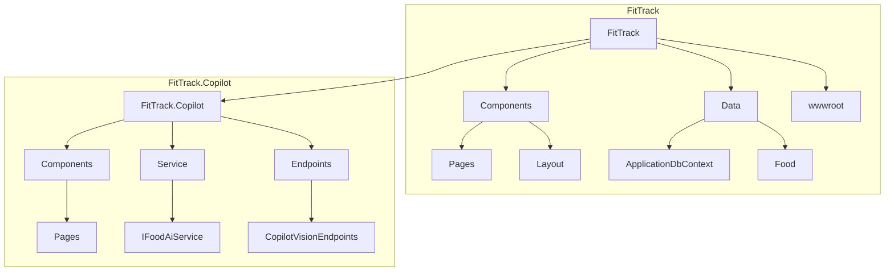
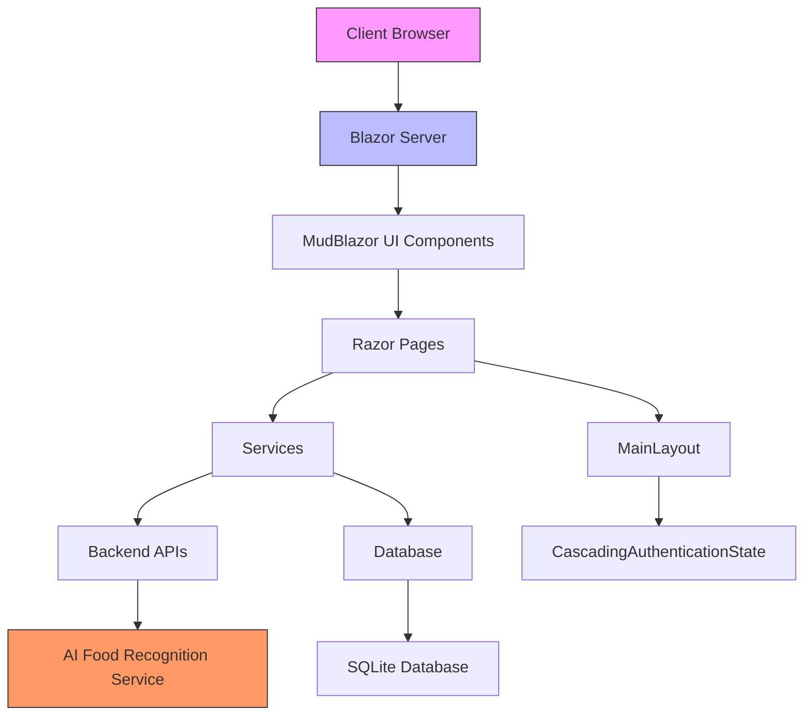
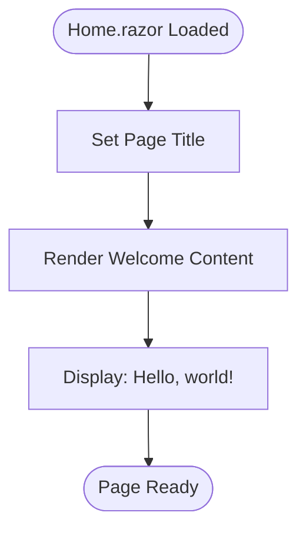
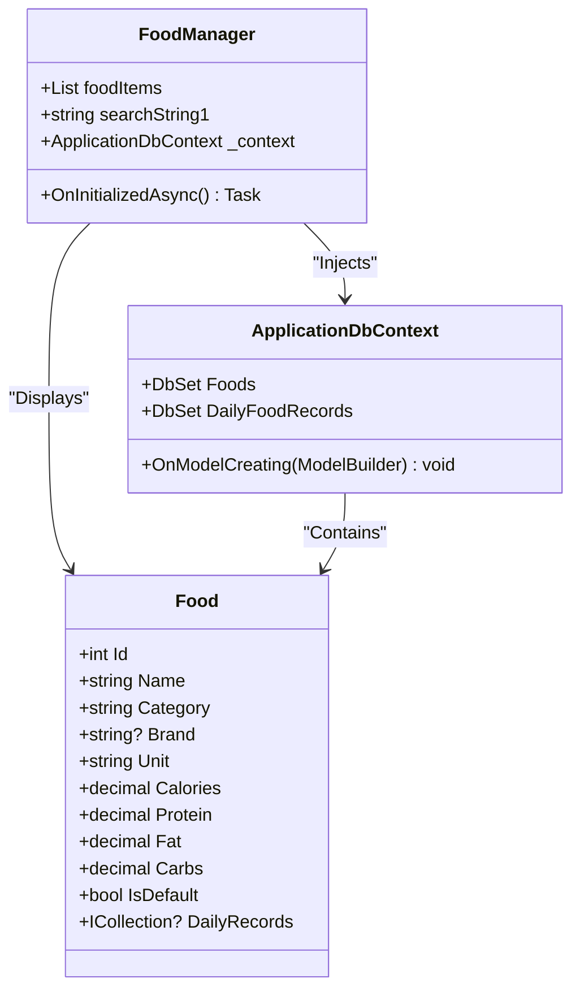
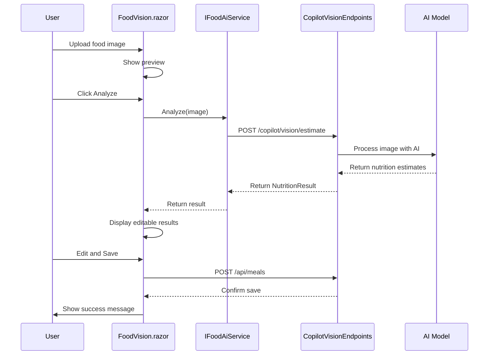
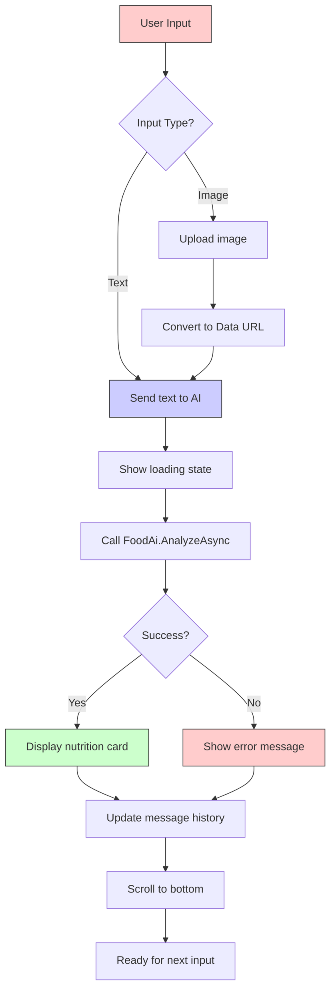
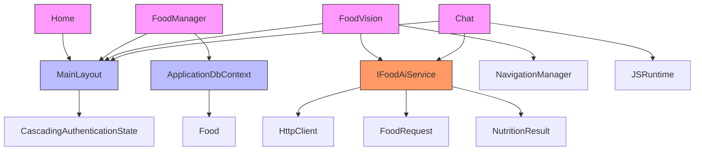

# Page Components

<cite>
**Referenced Files in This Document**   
- [Home.razor](file://FitTrack/FitTrack/Components/Pages/Home.razor)
- [FoodManager.razor](file://FitTrack/FitTrack/Components/Pages/FoodManager.razor)
- [FoodVision.razor](file://FitTrack/FitTrack.Copilot/Components/Pages/FoodVision.razor)
- [FoodVision.razor.cs](file://FitTrack/FitTrack.Copilot/Components/Pages/FoodVision.razor.cs)
- [Chat.razor](file://FitTrack/FitTrack.Copilot/Components/Pages/Chat.razor)
- [Chat.razor.cs](file://FitTrack/FitTrack.Copilot/Components/Pages/Chat.razor.cs)
- [MainLayout.razor](file://FitTrack/FitTrack/Components/Layout/MainLayout.razor)
- [NavMenu.razor](file://FitTrack/FitTrack/Components/Layout/NavMenu.razor)
- [IFoodAiService.cs](file://FitTrack/FitTrack.Copilot/Service/IFoodAiService.cs)
- [ApplicationDbContext.cs](file://FitTrack/FitTrack/Data/ApplicationDbContext.cs)
- [Food.cs](file://FitTrack/FitTrack/Data/Food.cs)
- [Program.cs](file://FitTrack/FitTrack/Program.cs)
- [Program.cs](file://FitTrack/FitTrack.Copilot/Program.cs)
</cite>

## Table of Contents
1. [Introduction](#introduction)
2. [Project Structure](#project-structure)
3. [Core Components](#core-components)
4. [Architecture Overview](#architecture-overview)
5. [Detailed Component Analysis](#detailed-component-analysis)
6. [Dependency Analysis](#dependency-analysis)
7. [Performance Considerations](#performance-considerations)
8. [Troubleshooting Guide](#troubleshooting-guide)
9. [Conclusion](#conclusion)

## Introduction
This document provides comprehensive documentation for the core page components in FitTrack, a fitness tracking application with AI-powered food recognition capabilities. The documentation covers the Home page as the landing page, FoodManager for manual food logging, FoodVision for AI-powered image analysis, and Chat for conversational food recognition. All components inherit layout and authentication context from MainLayout and CascadingAuthenticationState, ensuring a consistent user experience across the application.

## Project Structure
The FitTrack application follows a modular structure with two main projects: the core FitTrack application and the FitTrack.Copilot extension that provides AI-powered features. The core components are organized in a Blazor Web App structure with Razor components, data models, and services separated into distinct directories.

**Diagram sources**
- [FitTrack.sln](file://FitTrack.sln)
- [project_structure](file://project_structure)

**Section sources**
- [FitTrack.sln](file://FitTrack.sln)
- [project_structure](file://project_structure)

## Core Components
The core components of FitTrack include the Home page, FoodManager, FoodVision, and Chat interface, each serving a specific purpose in the food tracking workflow. These components are built using Blazor's component model with MudBlazor UI components for consistent styling. The Home page serves as the landing page with overview content and navigation links, while FoodManager enables manual food logging with form inputs and validation. FoodVision implements AI-powered image analysis for automatic food recognition, and Chat provides a conversational interface with streaming responses and message history.

**Section sources**
- [Home.razor](file://FitTrack/FitTrack/Components/Pages/Home.razor)
- [FoodManager.razor](file://FitTrack/FitTrack/Components/Pages/FoodManager.razor)
- [FoodVision.razor](file://FitTrack/FitTrack.Copilot/Components/Pages/FoodVision.razor)
- [Chat.razor](file://FitTrack/FitTrack.Copilot/Components/Pages/Chat.razor)

## Architecture Overview
FitTrack follows a client-server architecture with Blazor Server components rendering UI on the server and sending updates to the client. The application uses a layered architecture with presentation (Razor components), business logic (services), and data access (Entity Framework) layers. The AI-powered features in FitTrack.Copilot extend the core application with additional endpoints and services for food image analysis.

**Diagram sources**
- [Program.cs](file://FitTrack/FitTrack/Program.cs)
- [Program.cs](file://FitTrack/FitTrack.Copilot/Program.cs)
- [App.razor](file://FitTrack/FitTrack/Components/App.razor)

## Detailed Component Analysis

### Home.razor Analysis
The Home.razor component serves as the landing page for FitTrack, providing a simple welcome message and serving as the default route for the application. It inherits layout from MainLayout and displays basic introductory content.

**Diagram sources**
- [Home.razor](file://FitTrack/FitTrack/Components/Pages/Home.razor)

**Section sources**
- [Home.razor](file://FitTrack/FitTrack/Components/Pages/Home.razor)

### FoodManager.razor Analysis
The FoodManager.razor component provides a table-based interface for viewing and managing food items in the database. It uses MudBlazor components to display a searchable table of food items with nutritional information.

**Diagram sources**
- [FoodManager.razor](file://FitTrack/FitTrack/Components/Pages/FoodManager.razor)
- [Food.cs](file://FitTrack/FitTrack/Data/Food.cs)
- [ApplicationDbContext.cs](file://FitTrack/FitTrack/Data/ApplicationDbContext.cs)

**Section sources**
- [FoodManager.razor](file://FitTrack/FitTrack/Components/Pages/FoodManager.razor)
- [Food.cs](file://FitTrack/FitTrack/Data/Food.cs)
- [ApplicationDbContext.cs](file://FitTrack/FitTrack/Data/ApplicationDbContext.cs)

### FoodVision.razor Analysis
The FoodVision.razor component implements AI-powered food recognition through image analysis. Users can upload food photos which are processed by the backend AI service to estimate nutritional content.

**Diagram sources**
- [FoodVision.razor](file://FitTrack/FitTrack.Copilot/Components/Pages/FoodVision.razor)
- [FoodVision.razor.cs](file://FitTrack/FitTrack.Copilot/Components/Pages/FoodVision.razor.cs)
- [IFoodAiService.cs](file://FitTrack/FitTrack.Copilot/Service/IFoodAiService.cs)
- [CopilotVisionEndpoints.cs](file://FitTrack/FitTrack.Copilot/Endpoints/CopilotVisionEndpoints.cs)

**Section sources**
- [FoodVision.razor](file://FitTrack/FitTrack.Copilot/Components/Pages/FoodVision.razor)
- [FoodVision.razor.cs](file://FitTrack/FitTrack.Copilot/Components/Pages/FoodVision.razor.cs)

### Chat.razor Analysis
The Chat.razor component provides a conversational interface for food recognition, allowing users to describe meals or upload images in a chat-like format with streaming responses from the AI.

**Diagram sources**
- [Chat.razor](file://FitTrack/FitTrack.Copilot/Components/Pages/Chat.razor)
- [Chat.razor.cs](file://FitTrack/FitTrack.Copilot/Components/Pages/Chat.razor.cs)
- [IFoodAiService.cs](file://FitTrack/FitTrack.Copilot/Service/IFoodAiService.cs)

**Section sources**
- [Chat.razor](file://FitTrack/FitTrack.Copilot/Components/Pages/Chat.razor)
- [Chat.razor.cs](file://FitTrack/FitTrack.Copilot/Components/Pages/Chat.razor.cs)

## Dependency Analysis
The page components in FitTrack have a well-defined dependency structure, with each component depending on services and data models to provide functionality. The components inherit layout and authentication context from shared components, ensuring consistency across the application.

**Diagram sources**
- [MainLayout.razor](file://FitTrack/FitTrack/Components/Layout/MainLayout.razor)
- [ApplicationDbContext.cs](file://FitTrack/FitTrack/Data/ApplicationDbContext.cs)
- [IFoodAiService.cs](file://FitTrack/FitTrack.Copilot/Service/IFoodAiService.cs)
- [Food.cs](file://FitTrack/FitTrack/Data/Food.cs)

**Section sources**
- [MainLayout.razor](file://FitTrack/FitTrack/Components/Layout/MainLayout.razor)
- [ApplicationDbContext.cs](file://FitTrack/FitTrack/Data/ApplicationDbContext.cs)
- [IFoodAiService.cs](file://FitTrack/FitTrack.Copilot/Service/IFoodAiService.cs)

## Performance Considerations
The page components in FitTrack are designed with performance in mind, using async operations to prevent blocking the UI thread during data loading and API calls. The FoodManager component loads data once on initialization, while FoodVision and Chat components use on-demand loading for AI processing. Image uploads are handled with streaming to minimize memory usage, and HTTP clients are managed through dependency injection for connection reuse.

**Section sources**
- [FoodManager.razor](file://FitTrack/FitTrack/Components/Pages/FoodManager.razor)
- [FoodVision.razor.cs](file://FitTrack/FitTrack.Copilot/Components/Pages/FoodVision.razor.cs)
- [Chat.razor.cs](file://FitTrack/FitTrack.Copilot/Components/Pages/Chat.razor.cs)

## Troubleshooting Guide
Common issues with the page components typically relate to authentication, data loading, or AI service connectivity. The components include error handling for failed API calls and validation of user inputs. Loading states are displayed during async operations to provide feedback to users.

**Section sources**
- [FoodVision.razor.cs](file://FitTrack/FitTrack.Copilot/Components/Pages/FoodVision.razor.cs)
- [Chat.razor.cs](file://FitTrack/FitTrack.Copilot/Components/Pages/Chat.razor.cs)
- [FoodManager.razor](file://FitTrack/FitTrack/Components/Pages/FoodManager.razor)

## Conclusion
The page components in FitTrack provide a comprehensive food tracking experience with both manual and AI-powered food logging options. The Home page serves as a simple landing point, while FoodManager enables traditional manual entry. The FoodVision and Chat components leverage AI to make food logging more convenient through image analysis and conversational interfaces. All components share a consistent layout and authentication context, providing a cohesive user experience across the application.