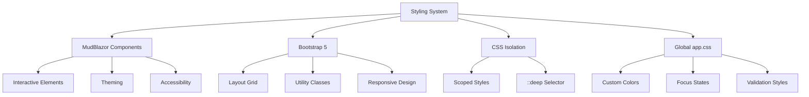
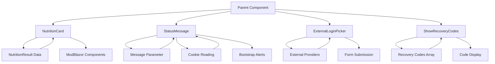

# UI Components and Controls

<cite>
**Referenced Files in This Document**   
- [NutritionCard.razor](file://FitTrack/FitTrack.Copilot/Components/NutritionCard.razor)
- [StatusMessage.razor](file://FitTrack/FitTrack.Copilot/Components/Account/Shared/StatusMessage.razor)
- [ExternalLoginPicker.razor](file://FitTrack/FitTrack.Copilot/Components/Account/Shared/ExternalLoginPicker.razor)
- [ShowRecoveryCodes.razor](file://FitTrack/FitTrack.Copilot/Components/Account/Shared/ShowRecoveryCodes.razor)
- [NutritionResult.cs](file://FitTrack/FitTrack.Copilot/Abstractions/Models/NutritionResult.cs)
- [app.css](file://FitTrack/FitTrack.Copilot/wwwroot/app.css)
- [MainLayout.razor.css](file://FitTrack/FitTrack.Copilot/Components/Layout/MainLayout.razor.css)
</cite>

## Table of Contents
1. [Introduction](#introduction)
2. [NutritionCard Component](#nutritioncard-component)
3. [StatusMessage Component](#statusmessage-component)
4. [ExternalLoginPicker Component](#externalloginpicker-component)
5. [ShowRecoveryCodes Component](#showrecoverycodes-component)
6. [Styling and Theming](#styling-and-theming)
7. [Component Composition and Usage](#component-composition-and-usage)
8. [Accessibility and Responsive Design](#accessibility-and-responsive-design)
9. [Performance Considerations](#performance-considerations)
10. [Conclusion](#conclusion)

## Introduction
This document provides comprehensive documentation for key reusable UI components in the FitTrack frontend application. The components are implemented using Blazor with a combination of MudBlazor and Bootstrap for styling and layout. The documentation focuses on four primary components: NutritionCard, StatusMessage, ExternalLoginPicker, and ShowRecoveryCodes, detailing their functionality, parameter inputs, event handling, and integration patterns. These components play critical roles in food nutrition visualization, user feedback, authentication flows, and security features respectively.

## NutritionCard Component

The NutritionCard component is a specialized UI element designed to display parsed food nutrition data derived from AI analysis. It serves as the primary visualization tool for presenting detailed nutritional breakdowns of food items detected through image or text analysis.

The component accepts a NutritionResult object as its primary parameter, which contains structured data about food items, their macronutrients, and confidence levels. The card displays the total calories prominently using a MudChip component, followed by a detailed table listing individual food items with their serving information, calorie counts, protein/carbohydrate/fat ratios, and detection confidence levels.

For items with confidence scores, the component renders a MudProgressLinear indicator to visually represent the AI's certainty level. When the analysis includes a summary note, this is displayed in a MudAlert component to provide contextual information about the nutrition assessment.

The component leverages MudBlazor's component library for consistent styling and interactive elements, while incorporating Bootstrap utility classes for spacing and layout. The card features rounded corners (rounded-2xl class) and organized content through MudStack for vertical spacing.

**Section sources**
- [NutritionCard.razor](file://FitTrack/FitTrack.Copilot/Components/NutritionCard.razor#L1-L64)
- [NutritionResult.cs](file://FitTrack/FitTrack.Copilot/Abstractions/Models/NutritionResult.cs#L1-L54)

## StatusMessage Component

The StatusMessage component provides standardized feedback display across authentication flows and other user interactions. It supports three message types: success, error, and informational messages, with visual differentiation based on content.

The component accepts an optional Message parameter and automatically retrieves status messages from HTTP cookies via the IdentityRedirectManager. Messages starting with "Error" are styled as danger alerts, while others are displayed as success notifications. This automatic classification ensures consistent visual feedback without requiring explicit severity parameters.

The component integrates with ASP.NET Core's authentication system by reading from the StatusCookieName cookie, which is typically set during redirect operations. After displaying a cookie-based message, the component automatically deletes the cookie to prevent repeated display on subsequent page loads.

Implemented using Bootstrap's alert classes, the component provides accessible feedback with appropriate ARIA roles. The styling is minimal but effective, leveraging the application's existing CSS variables and color scheme for visual consistency.

**Section sources**
- [StatusMessage.razor](file://FitTrack/FitTrack.Copilot/Components/Account/Shared/StatusMessage.razor#L1-L30)

## ExternalLoginPicker Component

The ExternalLoginPicker component facilitates OAuth provider selection in authentication flows, allowing users to sign in using external identity providers such as Google, Facebook, or Microsoft.

The component dynamically discovers available external authentication schemes through the SignInManager's GetExternalAuthenticationSchemesAsync method. For each provider, it renders a submit button displaying the provider's display name. The buttons are styled with Bootstrap's btn-primary class for visual prominence and consistency with the application's design language.

The component implements a form that posts to the Account/PerformExternalLogin endpoint, including antiforgery token protection and returnUrl parameter binding. This ensures secure authentication flows while maintaining state across the OAuth handshake.

When no external providers are configured, the component displays helpful guidance with a link to Microsoft's documentation on setting up external authentication, improving developer experience during configuration.

**Section sources**
- [ExternalLoginPicker.razor](file://FitTrack/FitTrack.Copilot/Components/Account/Shared/ExternalLoginPicker.razor#L1-L47)

## ShowRecoveryCodes Component

The ShowRecoveryCodes component provides a secure interface for displaying 2FA recovery codes, which are critical for account recovery when primary authentication methods are unavailable.

The component displays recovery codes in a warning-colored alert box with prominent cautionary text emphasizing the importance of storing these codes securely. The interface includes a clear warning that losing both the authentication device and recovery codes will result in permanent account loss.

Recovery codes are rendered in a grid layout using Bootstrap's row and col-md-12 classes, with each code displayed in a code element with the recovery-code CSS class for monospace formatting and visual distinction. This formatting enhances readability and prevents accidental copying of multiple codes.

The component accepts two parameters: RecoveryCodes (an array of strings) and an optional StatusMessage. It composes the StatusMessage component to display any additional feedback related to the recovery code generation or display process.

**Section sources**
- [ShowRecoveryCodes.razor](file://FitTrack/FitTrack.Copilot/Components/Account/Shared/ShowRecoveryCodes.razor#L1-L30)

## Styling and Theming

The FitTrack frontend employs a hybrid styling approach combining MudBlazor's component library with Bootstrap 5 for layout and utility classes. This combination provides both rich interactive components and flexible, responsive layouts.

MudBlazor components (MudCard, MudChip, MudTable, etc.) provide the application's primary interactive elements with built-in theming, accessibility, and animation features. These components are styled using their native properties and CSS classes, ensuring consistency across the application.

Bootstrap 5 is used extensively for layout, spacing, and responsive behavior. Utility classes like rounded-2xl, my-2, and col-md-12 are applied directly to components to control appearance without requiring custom CSS. The application leverages Bootstrap's grid system for responsive layouts and its alert classes for standardized feedback components.

CSS isolation is implemented for page-level components like MainLayout, allowing scoped styles that don't interfere with other components. The ::deep selector is used to pierce component boundaries when necessary, such as styling child component elements from a parent's CSS file.

Global styles are defined in app.css, which extends Bootstrap's default theme with custom colors and behaviors. The CSS includes focus styles, validation indicators, and error boundary styling to ensure a consistent user experience.

**Diagram sources**
- [MainLayout.razor.css](file://FitTrack/FitTrack.Copilot/Components/Layout/MainLayout.razor.css#L1-L99)
- [app.css](file://FitTrack/FitTrack.Copilot/wwwroot/app.css#L1-L60)

**Section sources**
- [app.css](file://FitTrack/FitTrack.Copilot/wwwroot/app.css#L1-L60)
- [MainLayout.razor.css](file://FitTrack/FitTrack.Copilot/Components/Layout/MainLayout.razor.css#L1-L99)

## Component Composition and Usage

The documented components follow Blazor's component composition patterns, enabling reusable and maintainable UI architecture. Each component exposes parameters for data binding and can be composed hierarchically to build complex interfaces.

NutritionCard is designed to be embedded in food analysis pages, accepting a NutritionResult object that typically comes from AI processing services. It can be used in both synchronous and asynchronous loading scenarios, with null-safe rendering to handle incomplete data.

StatusMessage is designed for composition within page layouts and forms, providing consistent feedback regardless of the source (direct parameter or cookie). Its cascading HttpContext parameter enables integration with ASP.NET Core's request pipeline without requiring explicit injection in every parent component.

ExternalLoginPicker and ShowRecoveryCodes are specialized for identity management flows, typically appearing within authentication-related pages. They follow the pattern of accepting returnUrl parameters for navigation continuity and composing other components (like StatusMessage) to create cohesive user experiences.

All components follow unidirectional data flow principles, with parameters flowing down and events (where implemented) flowing up. This pattern ensures predictable state management and simplifies debugging.

**Diagram sources**
- [NutritionCard.razor](file://FitTrack/FitTrack.Copilot/Components/NutritionCard.razor#L1-L64)
- [StatusMessage.razor](file://FitTrack/FitTrack.Copilot/Components/Account/Shared/StatusMessage.razor#L1-L30)
- [ExternalLoginPicker.razor](file://FitTrack/FitTrack.Copilot/Components/Account/Shared/ExternalLoginPicker.razor#L1-L47)
- [ShowRecoveryCodes.razor](file://FitTrack/FitTrack.Copilot/Components/Account/Shared/ShowRecoveryCodes.razor#L1-L30)

**Section sources**
- [NutritionCard.razor](file://FitTrack/FitTrack.Copilot/Components/NutritionCard.razor#L1-L64)
- [StatusMessage.razor](file://FitTrack/FitTrack.Copilot/Components/Account/Shared/StatusMessage.razor#L1-L30)
- [ExternalLoginPicker.razor](file://FitTrack/FitTrack.Copilot/Components/Account/Shared/ExternalLoginPicker.razor#L1-L47)
- [ShowRecoveryCodes.razor](file://FitTrack/FitTrack.Copilot/Components/Account/Shared/ShowRecoveryCodes.razor#L1-L30)

## Accessibility and Responsive Design

The components implement comprehensive accessibility features and responsive behavior to ensure usability across devices and assistive technologies.

All interactive elements include appropriate ARIA roles and attributes. The StatusMessage component uses role="alert" for dynamic feedback, ensuring screen readers announce important status changes. Data tables in NutritionCard include proper header cells (MudTh) and data labels for responsive contexts.

Keyboard navigation is supported through standard HTML form controls and MudBlazor's accessible components. Focus states are enhanced in app.css to provide clear visual indication of keyboard navigation, with custom box-shadow effects that meet contrast requirements.

Responsive design is achieved through Bootstrap's mobile-first approach. The ExternalLoginPicker buttons wrap naturally on smaller screens, and the ShowRecoveryCodes grid adapts from multi-column to single-column layouts. The MainLayout CSS includes media queries that adjust sidebar behavior and padding based on viewport width.

Text alternatives are provided where appropriate, and color contrast meets WCAG 2.1 AA standards. The application's color scheme, particularly the blue primary color (#1b6ec2), has been selected for adequate contrast against background elements.

**Section sources**
- [MainLayout.razor.css](file://FitTrack/FitTrack.Copilot/Components/Layout/MainLayout.razor.css#L1-L99)
- [app.css](file://FitTrack/FitTrack.Copilot/wwwroot/app.css#L1-L60)
- [StatusMessage.razor](file://FitTrack/FitTrack.Copilot/Components/Account/Shared/StatusMessage.razor#L1-L30)

## Performance Considerations

The components are optimized for performance, particularly in scenarios involving complex data rendering like the NutritionCard's table display.

The NutritionCard component implements efficient rendering of nutrition data by using MudTable's Dense and Hover properties to minimize visual clutter while maintaining usability. The conditional rendering of sections (items table, summary alert) prevents unnecessary DOM elements when data is absent.

Data binding is implemented efficiently, with the NutritionCard accepting a single NutritionResult parameter rather than multiple individual parameters. This reduces the number of property assignments during component initialization and updates.

The StatusMessage component minimizes cookie operations by reading the status cookie only once during initialization and immediately deleting it after display. This prevents repeated cookie reads on subsequent renders and ensures messages are displayed only once.

Event handling is kept minimal in these components, reducing the JavaScript interop overhead. The ExternalLoginPicker relies on standard form submission rather than JavaScript events, improving performance and reliability.

For applications displaying large nutrition datasets, virtualization could be considered for the items table, though the current implementation is sufficient for typical use cases with moderate numbers of food items.

**Section sources**
- [NutritionCard.razor](file://FitTrack/FitTrack.Copilot/Components/NutritionCard.razor#L1-L64)
- [StatusMessage.razor](file://FitTrack/FitTrack.Copilot/Components/Account/Shared/StatusMessage.razor#L1-L30)

## Conclusion

The documented UI components form a critical part of the FitTrack application's user interface, providing specialized functionality for nutrition visualization, user feedback, authentication, and security. These components demonstrate effective use of Blazor's component model, combining MudBlazor's rich interactive elements with Bootstrap's responsive layout system.

The components follow consistent patterns for parameter binding, event handling, and composition, enabling reuse across different parts of the application. Their implementation prioritizes accessibility, responsive design, and performance, ensuring a high-quality user experience across devices and contexts.

By leveraging CSS isolation and global styling, the components maintain visual consistency while avoiding style conflicts. The integration with ASP.NET Core's authentication system demonstrates effective coupling between UI components and backend services.

These components serve as excellent examples of reusable UI design in Blazor applications, balancing functionality, usability, and maintainability. Future enhancements could include additional customization options, improved error handling, and enhanced accessibility features.