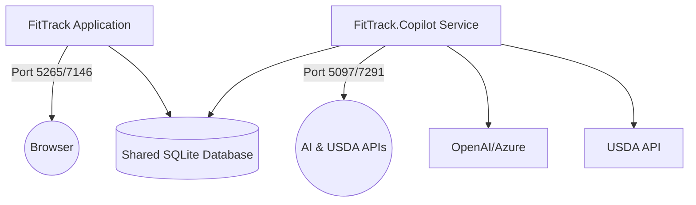
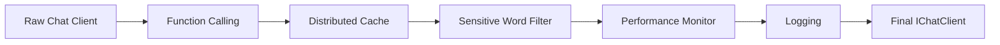

# Getting Started

<cite>
**Referenced Files in This Document**   
- [FitTrack/FitTrack/Program.cs](file://FitTrack/FitTrack/Program.cs)
- [FitTrack/FitTrack.Copilot/Program.cs](file://FitTrack/FitTrack.Copilot/Program.cs)
- [FitTrack/FitTrack/appsettings.json](file://FitTrack/FitTrack/appsettings.json)
- [FitTrack/FitTrack.Copilot/appsettings.json](file://FitTrack/FitTrack.Copilot/appsettings.json)
- [FitTrack/FitTrack/Properties/launchSettings.json](file://FitTrack/FitTrack/Properties/launchSettings.json)
- [FitTrack/FitTrack.Copilot/Properties/launchSettings.json](file://FitTrack/FitTrack.Copilot/Properties/launchSettings.json)
- [FitTrack/FitTrack/Dockerfile](file://FitTrack/FitTrack/Dockerfile)
- [FitTrack/FitTrack.Copilot/Dockerfile](file://FitTrack/FitTrack.Copilot/Dockerfile)
- [FitTrack/FitTrack.Copilot/Extension/CopilotServiceCollectionExtensions.cs](file://FitTrack/FitTrack.Copilot/Extension/CopilotServiceCollectionExtensions.cs)
- [FitTrack/FitTrack.Copilot/Api/Usda/UsdaServiceCollectionExtensions.cs](file://FitTrack/FitTrack.Copilot/Api/Usda/UsdaServiceCollectionExtensions.cs)
</cite>

## Table of Contents
1. [Cloning the Repository](#cloning-the-repository)
2. [Prerequisites](#prerequisites)
3. [Restoring NuGet Packages](#restoring-nuget-packages)
4. [Running the Application](#running-the-application)
5. [Configuration Requirements](#configuration-requirements)
6. [User Secrets Setup](#user-secrets-setup)
7. [Running FitTrack and FitTrack.Copilot Simultaneously](#running-fittrack-and-fittrackcopilot-simultaneously)
8. [Docker Build and Run Commands](#docker-build-and-run-commands)
9. [Troubleshooting Common Setup Issues](#troubleshooting-common-setup-issues)
10. [Service Registration and Startup Sequence](#service-registration-and-startup-sequence)

## Cloning the Repository
To begin development with FitTrack, first clone the repository from GitHub:

```bash
git clone https://github.com/your-organization/FitTrack.git
cd FitTrack
```

Ensure you have the correct permissions and access to the repository. The repository contains two main projects: `FitTrack` (the main web application) and `FitTrack.Copilot` (the AI-powered companion service).

**Section sources**
- [README.md](file://README.md)

## Prerequisites
Before setting up the development environment, ensure the following prerequisites are installed:

- **.NET SDK 9.0**: Required for building and running the application.
- **Git**: For cloning and version control.
- **Docker** (optional): For containerized execution.
- **Visual Studio 2022** or **Visual Studio Code** with C# extension: For development and debugging.

Verify the .NET SDK installation:
```bash
dotnet --version
```

## Restoring NuGet Packages
After cloning, restore the NuGet packages for both projects:

```bash
# Restore packages for FitTrack
dotnet restore FitTrack/FitTrack.csproj

# Restore packages for FitTrack.Copilot
dotnet restore FitTrack/FitTrack.Copilot.csproj
```

Alternatively, open the `FitTrack.sln` solution file in Visual Studio, which will automatically restore packages on load.

**Section sources**
- [FitTrack.sln](file://FitTrack.sln)

## Running the Application
You can run the applications using either the `dotnet CLI` or Visual Studio.

### Using dotnet CLI
Run the main FitTrack application:
```bash
dotnet run --project FitTrack/FitTrack/FitTrack.csproj
```

Run the FitTrack.Copilot service:
```bash
dotnet run --project FitTrack/FitTrack.Copilot/FitTrack.Copilot.csproj
```

### Using Visual Studio
1. Open `FitTrack.sln` in Visual Studio.
2. Set multiple startup projects: Right-click the solution → Properties → Common Properties → Startup Project → Select "Multiple startup projects".
3. Set both `FitTrack` and `FitTrack.Copilot` to "Start".
4. Press F5 or click Run to launch both applications.

## Configuration Requirements
The application requires configuration in `appsettings.json` for database, AI services, and USDA API.

### Database Configuration
Both projects use SQLite with the same connection string:
```json
"ConnectionStrings": {
  "DefaultConnection": "DataSource=Data\\app.db;Cache=Shared"
}
```

This creates a local SQLite database at `Data/app.db`.

### AI Services Configuration
In `FitTrack.Copilot/appsettings.json`, configure AI services:

#### OpenAI/Azure Configuration
```json
"AI": {
  "Endpoint": "https://my-openapi.openai.azure.com/",
  "ModelId": "gpt-4o",
  "ApiKey": "",
  "MaxTokens": 4000,
  "Temperature": 0.7
}
```

#### TokenAI Configuration
```json
"TokenAI": {
  "Endpoint": "https://api.token-ai.cn/v1/",
  "ModelId": "deepseek-v3.2-exp",
  "ApiKey": "",
  "MaxTokens": 4000,
  "Temperature": 0.7
}
```

### USDA API Configuration
```json
"USDA": {
  "ApiKey": "",
  "BaseUrl": "https://api.nal.usda.gov/fdc/v1/"
}
```

Obtain a free API key from [USDA FoodData Central](https://fdc.nal.usda.gov/api-key-signup.html).

**Section sources**
- [FitTrack/FitTrack.Copilot/appsettings.json](file://FitTrack/FitTrack.Copilot/appsettings.json#L12-L53)

## User Secrets Setup
For development, use user secrets to securely store API keys:

Set OpenAI API key:
```bash
dotnet user-secrets set "AI:ApiKey" "your-openai-api-key" --project FitTrack/FitTrack.Copilot
```

Set USDA API key:
```bash
dotnet user-secrets set "USDA:ApiKey" "your-usda-api-key" --project FitTrack/FitTrack.Copilot
```

The `Program.cs` in `FitTrack.Copilot` explicitly adds user secrets:
```csharp
builder.Configuration.AddUserSecrets<Program>();
```

**Section sources**
- [FitTrack/FitTrack.Copilot/Program.cs](file://FitTrack/FitTrack.Copilot/Program.cs#L21-L22)

## Running FitTrack and FitTrack.Copilot Simultaneously
Both applications can run simultaneously using different ports defined in `launchSettings.json`.

### FitTrack Ports
- HTTP: `http://localhost:5265`
- HTTPS: `https://localhost:7146`

### FitTrack.Copilot Ports
- HTTP: `http://localhost:5097`
- HTTPS: `https://localhost:7291`

The applications are configured to run independently but share the same authentication system and database. Use the multiple startup projects feature in Visual Studio or run both with `dotnet run` in separate terminals.



**Diagram sources**
- [FitTrack/FitTrack/Properties/launchSettings.json](file://FitTrack/FitTrack/Properties/launchSettings.json)
- [FitTrack/FitTrack.Copilot/Properties/launchSettings.json](file://FitTrack/FitTrack.Copilot/Properties/launchSettings.json)

**Section sources**
- [FitTrack/FitTrack/Properties/launchSettings.json](file://FitTrack/FitTrack/Properties/launchSettings.json)
- [FitTrack/FitTrack.Copilot/Properties/launchSettings.json](file://FitTrack/FitTrack.Copilot/Properties/launchSettings.json)

## Docker Build and Run Commands
Both projects include Docker support for containerized execution.

### Build Docker Images
```bash
# Build FitTrack image
docker build -f FitTrack/FitTrack/Dockerfile -t fittrack-app .

# Build FitTrack.Copilot image
docker build -f FitTrack/FitTrack.Copilot/Dockerfile -t fittrack-copilot .
```

### Run Containers
```bash
# Run FitTrack
docker run -d -p 8080:8080 --name fittrack-container fittrack-app

# Run FitTrack.Copilot
docker run -d -p 8081:8081 --name copilot-container fittrack-copilot
```

The Dockerfiles use multi-stage builds with .NET 9.0 SDK and ASP.NET runtime images, exposing ports 8080 and 8081.

**Section sources**
- [FitTrack/FitTrack/Dockerfile](file://FitTrack/FitTrack/Dockerfile)
- [FitTrack/FitTrack.Copilot/Dockerfile](file://FitTrack/FitTrack.Copilot/Dockerfile)

## Troubleshooting Common Setup Issues

### Missing SDK or Runtime
**Issue**: `dotnet` command not found or wrong version.  
**Solution**: Install .NET SDK 9.0 from [official site](https://dotnet.microsoft.com/download).

### API Key Configuration
**Issue**: `AI:Endpoint configuration missing` error.  
**Solution**: Ensure `AI:ApiKey` is set via user secrets or environment variables.

### Database Migration Errors
**Issue**: `Connection string 'DefaultConnection' not found`.  
**Solution**: Verify `appsettings.json` contains the correct connection string. The application automatically runs migrations on startup:
```csharp
using (var scope = app.Services.CreateScope())
{
    var context = scope.ServiceProvider.GetRequiredService<ApplicationDbContext>();
    context.Database.Migrate();
    DbInitializer.Initialize(context, env);
}
```

### Port Conflicts
**Issue**: Address already in use.  
**Solution**: Change ports in `launchSettings.json` or stop conflicting processes.

### USDA API 403 Forbidden
**Issue**: Invalid or missing USDA API key.  
**Solution**: Register at USDA FoodData Central and set the key via user secrets.

**Section sources**
- [FitTrack/FitTrack/Program.cs](file://FitTrack/FitTrack/Program.cs#L44-L50)
- [FitTrack/FitTrack.Copilot/appsettings.json](file://FitTrack/FitTrack.Copilot/appsettings.json#L50-L53)

## Service Registration and Startup Sequence
The `Program.cs` files in both projects follow a structured startup sequence for service registration and pipeline configuration.

### FitTrack Startup Sequence
1. Create `WebApplicationBuilder`
2. Add Razor Components and Identity services
3. Configure SQLite database with Entity Framework
4. Register MudBlazor and HTTP client services
5. Apply database migrations and seed data on startup
6. Configure HTTP pipeline with HTTPS, static assets, and routing

### FitTrack.Copilot Startup Sequence
1. Add user secrets for secure configuration
2. Register OpenAPI/Swagger for API documentation
3. Configure NLog for structured logging
4. Set up Semantic Kernel with AI chat client
5. Register USDA API client with typed HttpClient
6. Add middleware pipeline with caching, function calling, and monitoring

The AI chat client is built with a middleware pipeline:


This layered approach enables extensible AI interactions with monitoring and security.

**Section sources**
- [FitTrack/FitTrack/Program.cs](file://FitTrack/FitTrack/Program.cs)
- [FitTrack/FitTrack.Copilot/Program.cs](file://FitTrack/FitTrack.Copilot/Program.cs)
- [FitTrack/FitTrack.Copilot/Extension/CopilotServiceCollectionExtensions.cs](file://FitTrack/FitTrack.Copilot/Extension/CopilotServiceCollectionExtensions.cs)
- [FitTrack/FitTrack.Copilot/Api/Usda/UsdaServiceCollectionExtensions.cs](file://FitTrack/FitTrack.Copilot/Api/Usda/UsdaServiceCollectionExtensions.cs)