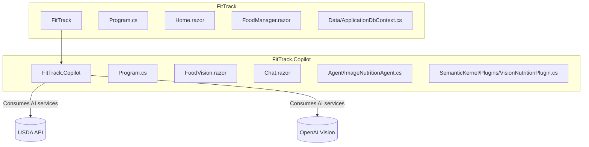
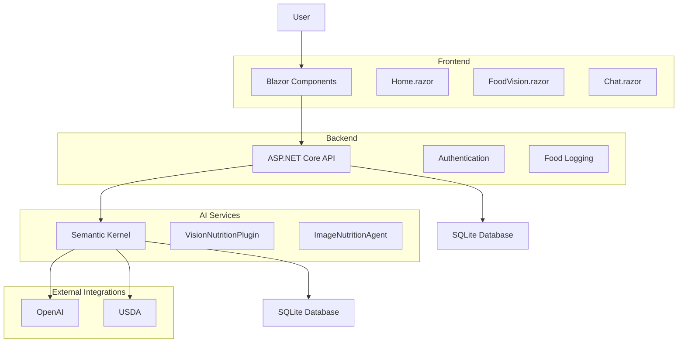
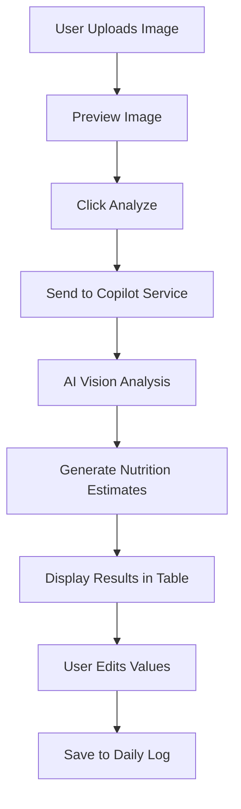
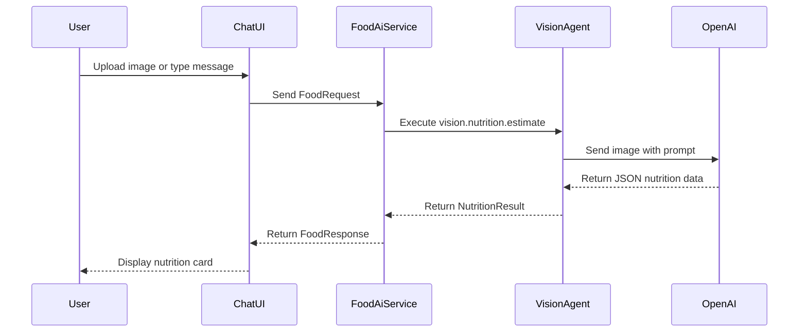
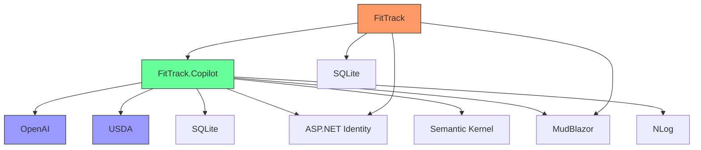

# System Overview

<cite>
**Referenced Files in This Document**   
- [README.md](file://README.md)
- [FitTrack/FitTrack/Program.cs](file://FitTrack/FitTrack/Program.cs)
- [FitTrack/FitTrack.Copilot/Program.cs](file://FitTrack/FitTrack.Copilot/Program.cs)
- [FitTrack/FitTrack/Components/Pages/Home.razor](file://FitTrack/FitTrack/Components/Pages/Home.razor)
- [FitTrack/FitTrack.Copilot/Components/Pages/FoodVision.razor](file://FitTrack/FitTrack.Copilot/Components/Pages/FoodVision.razor)
- [FitTrack/FitTrack.Copilot/Components/Pages/Chat.razor](file://FitTrack/FitTrack.Copilot/Components/Pages/Chat.razor)
- [FitTrack/FitTrack/Data/Food.cs](file://FitTrack/FitTrack/Data/Food.cs)
- [FitTrack/FitTrack/Data/DailyFoodRecord.cs](file://FitTrack/FitTrack/Data/DailyFoodRecord.cs)
- [FitTrack/FitTrack.Copilot/Data/ApplicationDbContext.cs](file://FitTrack/FitTrack.Copilot/Data/ApplicationDbContext.cs)
- [FitTrack/FitTrack.Copilot/Service/IFoodAiService.cs](file://FitTrack/FitTrack.Copilot/Service/IFoodAiService.cs)
- [FitTrack/FitTrack.Copilot/Agent/ImageNutritionAgent.cs](file://FitTrack/FitTrack.Copilot/Agent/ImageNutritionAgent.cs)
- [FitTrack/FitTrack.Copilot/SemanticKernel/Plugins/VisionNutritionPlugin.cs](file://FitTrack/FitTrack.Copilot/SemanticKernel/Plugins/VisionNutritionPlugin.cs)
- [FitTrack/FitTrack.Copilot/Endpoints/CopilotVisionEndpoints.cs](file://FitTrack/FitTrack.Copilot/Endpoints/CopilotVisionEndpoints.cs)
- [FitTrack/FitTrack.Copilot/Api/Usda/IUsdaClient.cs](file://FitTrack/FitTrack.Copilot/Api/Usda/IUsdaClient.cs)
</cite>

## Table of Contents
1. [Introduction](#introduction)
2. [Project Structure](#project-structure)
3. [Core Components](#core-components)
4. [Architecture Overview](#architecture-overview)
5. [Detailed Component Analysis](#detailed-component-analysis)
6. [Dependency Analysis](#dependency-analysis)
7. [Performance Considerations](#performance-considerations)
8. [Troubleshooting Guide](#troubleshooting-guide)
9. [Conclusion](#conclusion)

## Introduction
FitTrack is a full-stack fitness and nutrition tracking platform that combines user-centric health monitoring with AI-powered food recognition and conversational dietary insights. The system enables users to manage their weight loss journey through comprehensive food logging, AI vision analysis of meals, and interactive chat-based copilot assistance. Built using Blazor and Semantic Kernel technologies, FitTrack leverages modern AI capabilities to provide accurate calorie estimation and nutritional breakdowns from food images and text descriptions. The platform integrates with external services such as USDA food databases and OpenAI's vision models to deliver intelligent, data-driven dietary recommendations.

**Section sources**
- [README.md](file://README.md#L1-L3)
- [Home.razor](file://FitTrack/FitTrack/Components/Pages/Home.razor#L1-L7)

## Project Structure
The FitTrack repository consists of two main projects: FitTrack (the primary application) and FitTrack.Copilot (the AI-powered companion service). The main FitTrack project handles user authentication, food logging, and daily tracking through a Blazor-based frontend with SQLite persistence. The FitTrack.Copilot project provides AI capabilities including image-based nutrition analysis and conversational food recognition through a separate Blazor server application. Both projects share common authentication infrastructure and are designed to interoperate seamlessly, with the Copilot service exposing API endpoints that the main application consumes for AI functionality.

**Diagram sources**
- [FitTrack/FitTrack/Program.cs](file://FitTrack/FitTrack/Program.cs#L1-L76)
- [FitTrack/FitTrack.Copilot/Program.cs](file://FitTrack/FitTrack.Copilot/Program.cs#L1-L131)

**Section sources**
- [FitTrack/FitTrack/Program.cs](file://FitTrack/FitTrack/Program.cs#L1-L76)
- [FitTrack/FitTrack.Copilot/Program.cs](file://FitTrack/FitTrack.Copilot/Program.cs#L1-L131)

## Core Components
The FitTrack system comprises several core components that work together to deliver its functionality. The main application provides user authentication, food database management, and daily food tracking through the FoodManager component. The Copilot service offers AI-powered features including image-based nutrition estimation through the FoodVision interface and conversational food recognition via the Chat interface. The system uses a dual-database approach with the main application storing food records and daily logs, while the Copilot service maintains chat session history. AI processing is handled through Semantic Kernel integration with OpenAI's vision models, and nutritional data enrichment is provided through USDA API integration.

**Section sources**
- [Food.cs](file://FitTrack/FitTrack/Data/Food.cs#L1-L42)
- [DailyFoodRecord.cs](file://FitTrack/FitTrack/Data/DailyFoodRecord.cs#L1-L29)
- [ApplicationDbContext.cs](file://FitTrack/FitTrack.Copilot/Data/ApplicationDbContext.cs#L1-L34)

## Architecture Overview
FitTrack employs a dual-project architecture where the main application focuses on user-facing functionality while the Copilot service handles AI processing. The architecture follows a clean separation of concerns with the frontend (Blazor components), backend (API endpoints), and AI services (Semantic Kernel plugins) clearly delineated. User authentication is implemented using ASP.NET Identity and shared between both applications. The AI pipeline processes food images through a multi-step workflow: image upload → vision analysis → nutritional estimation → data presentation. External integrations with USDA and OpenAI enhance the system's capabilities by providing authoritative food data and advanced computer vision.

**Diagram sources**
- [FitTrack/FitTrack.Copilot/Service/IFoodAiService.cs](file://FitTrack/FitTrack.Copilot/Service/IFoodAiService.cs#L1-L109)
- [FitTrack/FitTrack.Copilot/Agent/ImageNutritionAgent.cs](file://FitTrack/FitTrack.Copilot/Agent/ImageNutritionAgent.cs#L1-L56)
- [FitTrack/FitTrack.Copilot/SemanticKernel/Plugins/VisionNutritionPlugin.cs](file://FitTrack/FitTrack.Copilot/SemanticKernel/Plugins/VisionNutritionPlugin.cs#L1-L70)

## Detailed Component Analysis

### FoodVision Component Analysis
The FoodVision component provides a user-friendly interface for uploading food images and receiving nutritional estimates. Users can upload images up to 20MB in size, which are then processed by the AI system to identify food items and estimate their nutritional content. The interface displays a table of detected items with editable fields for calories, protein, carbs, and fat, allowing users to refine the AI-generated estimates before saving them to their daily log.

**Diagram sources**
- [FoodVision.razor](file://FitTrack/FitTrack.Copilot/Components/Pages/FoodVision.razor#L1-L96)

**Section sources**
- [FoodVision.razor](file://FitTrack/FitTrack.Copilot/Components/Pages/FoodVision.razor#L1-L96)

### Chat Component Analysis
The Chat component implements a conversational interface for food recognition, allowing users to describe meals in natural language or upload images for analysis. The chat interface maintains conversation history and displays nutritional information in a card format. Users can clear their chat history or insert sample queries to explore the system's capabilities. The component integrates with the AI service to provide real-time responses with nutritional breakdowns.

**Diagram sources**
- [Chat.razor](file://FitTrack/FitTrack.Copilot/Components/Pages/Chat.razor#L1-L124)
- [IFoodAiService.cs](file://FitTrack/FitTrack.Copilot/Service/IFoodAiService.cs#L1-L109)

**Section sources**
- [Chat.razor](file://FitTrack/FitTrack.Copilot/Components/Pages/Chat.razor#L1-L124)

### AI Processing Pipeline
The AI processing pipeline in FitTrack.Copilot follows a structured flow from image upload to nutritional estimation. The system uses Semantic Kernel to orchestrate the interaction between the vision agent and OpenAI's models. The pipeline includes image preprocessing, vision analysis, nutritional data extraction, and response formatting. Error handling is implemented throughout the pipeline to provide meaningful feedback when analysis fails.

```mermaid
flowchart LR
A[Image Upload] --> B[Extract Base64 Data]
B --> C[Create VisionNutritionInput]
C --> D[Load System Prompt]
D --> E[Send to OpenAI with Image]
E --> F[Receive JSON Response]
F --> G[Deserialize NutritionResult]
G --> H[Return to Client]
H --> I[Display in UI]
style A fill:#f9f,stroke:#333
style I fill:#bbf,stroke:#333
```

**Diagram sources**
- [VisionNutritionPlugin.cs](file://FitTrack/FitTrack.Copilot/SemanticKernel/Plugins/VisionNutritionPlugin.cs#L1-L70)
- [ImageNutritionAgent.cs](file://FitTrack/FitTrack.Copilot/Agent/ImageNutritionAgent.cs#L1-L56)

**Section sources**
- [VisionNutritionPlugin.cs](file://FitTrack/FitTrack.Copilot/SemanticKernel/Plugins/VisionNutritionPlugin.cs#L1-L70)

## Dependency Analysis
The FitTrack system has a well-defined dependency structure with clear boundaries between components. The main application depends on the Copilot service for AI functionality through HTTP API calls. The Copilot service depends on external services including OpenAI for vision processing and USDA for nutritional data lookup. Both applications share dependencies on ASP.NET Identity for authentication and MudBlazor for UI components. The AI processing components depend on Semantic Kernel for orchestration and Microsoft.Extensions.AI for chat client abstractions.

**Diagram sources**
- [CopilotVisionEndpoints.cs](file://FitTrack/FitTrack.Copilot/Endpoints/CopilotVisionEndpoints.cs#L1-L47)
- [IUsdaClient.cs](file://FitTrack/FitTrack.Copilot/Api/Usda/IUsdaClient.cs#L1-L9)

**Section sources**
- [CopilotVisionEndpoints.cs](file://FitTrack/FitTrack.Copilot/Endpoints/CopilotVisionEndpoints.cs#L1-L47)

## Performance Considerations
The system is designed with performance in mind, particularly for the AI processing pipeline. Image uploads are limited to 20MB to prevent excessive processing times. The AI service uses asynchronous processing to avoid blocking the UI, with loading indicators displayed during analysis. Caching mechanisms could be implemented to store frequent food item results and reduce API calls to external services. The database schema is optimized for food tracking with appropriate indexing on user ID and date fields.

## Troubleshooting Guide
Common issues in the FitTrack system typically relate to AI service connectivity or image processing. If food vision analysis fails, verify that the image is in a supported format (JPG, PNG) and under the 20MB size limit. Ensure that the OpenAI API key is correctly configured in the application settings. For authentication issues, check that user secrets are properly set and that the identity database has been migrated. API endpoint accessibility can be verified through the OpenAPI/Swagger interface exposed by the Copilot service.

**Section sources**
- [Program.cs](file://FitTrack/FitTrack.Copilot/Program.cs#L19-L22)
- [CopilotVisionEndpoints.cs](file://FitTrack/FitTrack.Copilot/Endpoints/CopilotVisionEndpoints.cs#L14-L39)

## Conclusion
FitTrack represents a comprehensive solution for fitness and nutrition tracking that effectively combines traditional food logging with cutting-edge AI capabilities. The dual-project architecture allows for separation of concerns between the user-facing application and AI processing services. By leveraging Semantic Kernel and OpenAI's vision models, the system provides accurate food recognition and nutritional estimation from images. The integration with USDA data ensures reliable nutritional information, while the conversational interface makes food logging more accessible and user-friendly. This architecture provides a scalable foundation for future enhancements, including additional AI capabilities and expanded nutritional databases.