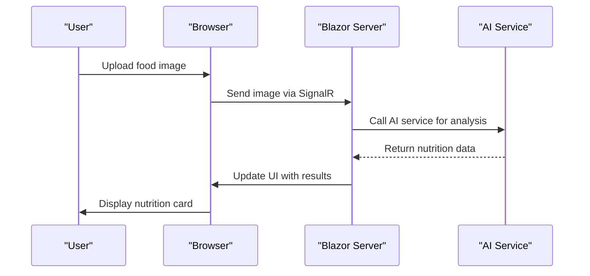
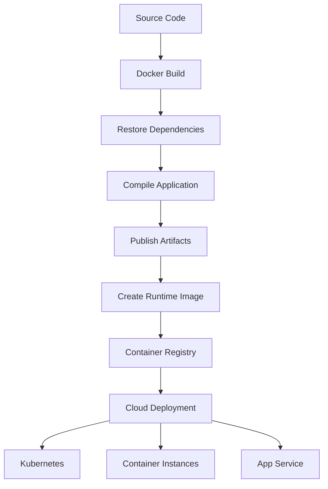

# Technology Stack

<cite>
**Referenced Files in This Document**   
- [FitTrack.csproj](file://FitTrack/FitTrack.csproj)
- [FitTrack.Copilot.csproj](file://FitTrack.Copilot/FitTrack.Copilot.csproj)
- [Program.cs](file://FitTrack/FitTrack/Program.cs)
- [Program.cs](file://FitTrack/FitTrack.Copilot/Program.cs)
- [appsettings.json](file://FitTrack/FitTrack/appsettings.json)
- [appsettings.json](file://FitTrack/FitTrack.Copilot/appsettings.json)
- [ApplicationDbContext.cs](file://FitTrack/FitTrack/Data/ApplicationDbContext.cs)
- [PromptLoader.cs](file://FitTrack/FitTrack.Copilot/SemanticKernel/Tooling/PromptLoader.cs)
- [CopilotServiceCollectionExtensions.cs](file://FitTrack/FitTrack.Copilot/Extension/CopilotServiceCollectionExtensions.cs)
- [Dockerfile](file://FitTrack/FitTrack/Dockerfile)
- [Dockerfile](file://FitTrack/FitTrack.Copilot/Dockerfile)
- [FoodVision.razor.cs](file://FitTrack/FitTrack.Copilot/Components/Pages/FoodVision.razor.cs)
- [Chat.razor.cs](file://FitTrack/FitTrack.Copilot/Components/Pages/Chat.razor.cs)
</cite>

## Table of Contents
1. [Introduction](#introduction)
2. [Core Framework and Full-Stack Architecture](#core-framework-and-full-stack-architecture)
3. [Data Persistence with Entity Framework Core and SQLite](#data-persistence-with-entity-framework-core-and-sqlite)
4. [AI Integration with Microsoft Semantic Kernel](#ai-integration-with-microsoft-semantic-kernel)
5. [UI Development with MudBlazor and Blazor Server](#ui-development-with-mudblazor-and-blazor-server)
6. [Cloud AI Services and SDKs](#cloud-ai-services-and-sdks)
7. [API Documentation with Swashbuckle](#api-documentation-with-swashbuckle)
8. [Structured Logging with NLog](#structured-logging-with-nlog)
9. [Dependency Management and NuGet Strategy](#dependency-management-and-nuget-strategy)
10. [Containerization and Cloud Deployment](#containerization-and-cloud-deployment)

## Introduction
FitTrack leverages a modern, full-stack .NET 9 architecture to deliver a comprehensive fitness tracking application with integrated AI capabilities. The technology stack is designed to maximize developer productivity, maintainability, and scalability while providing rich interactive experiences. This document details the key technologies used across the FitTrack solution, including the primary web application (FitTrack) and its AI-powered companion service (FitTrack.Copilot). The stack combines cutting-edge AI frameworks with robust data persistence, modern UI components, and enterprise-grade logging and deployment capabilities.

## Core Framework and Full-Stack Architecture
FitTrack is built on .NET 9 with ASP.NET Core and Blazor Server, enabling full-stack C# development. Both the main application and the Copilot service target `net9.0` as specified in their respective `.csproj` files, ensuring compatibility with the latest performance improvements, security updates, and language features. Blazor Server allows for interactive UIs without requiring developers to write JavaScript, as UI updates are handled via SignalR connections from the server. This architecture choice simplifies development by allowing C# to be used for both frontend and backend logic, reducing context switching and enabling code sharing.

The use of Blazor Server components is evident in the `Program.cs` files, where `AddRazorComponents()` and `AddInteractiveServerComponents()` are configured. This setup enables rich, dynamic user interfaces such as the FoodVision and Chat components, which handle image uploads and real-time AI interactions entirely in C#. The stack benefits from ASP.NET Core's middleware pipeline, dependency injection, and configuration system, providing a solid foundation for both applications.

**Section sources**
- [FitTrack.csproj](file://FitTrack/FitTrack.csproj#L4)
- [FitTrack.Copilot.csproj](file://FitTrack/FitTrack.Copilot/FitTrack.Copilot.csproj#L4)
- [Program.cs](file://FitTrack/FitTrack/Program.cs#L12-L13)
- [Program.cs](file://FitTrack/FitTrack.Copilot/Program.cs#L48-L49)

## Data Persistence with Entity Framework Core and SQLite
FitTrack uses Entity Framework Core (EF Core) with SQLite for data persistence, providing a lightweight, file-based database solution suitable for development and small-scale deployments. Both projects include `Microsoft.EntityFrameworkCore.Sqlite` in their NuGet dependencies, with versions aligned to .NET 9 (9.0.10 in FitTrack and 9.0.6-9.0.10 in FitTrack.Copilot). The database context is configured in `ApplicationDbContext.cs`, which inherits from `IdentityDbContext<ApplicationUser>` and defines entity sets for `Food`, `DailyFoodRecord`, and identity-related data.

The connection string in `appsettings.json` points to a local SQLite database file (`Data\app.db`), and EF Core migrations are used to manage schema changes. The `Program.cs` files contain database initialization logic that automatically applies migrations on startup using `context.Database.Migrate()`. This approach ensures the database schema is always up-to-date without requiring manual intervention. The use of SQLite makes the application portable and easy to set up, while EF Core's LINQ-based querying provides type-safe data access.

**Section sources**
- [FitTrack.csproj](file://FitTrack/FitTrack.csproj#L22)
- [FitTrack.Copilot.csproj](file://FitTrack/FitTrack.Copilot/FitTrack.Copilot.csproj#L19)
- [ApplicationDbContext.cs](file://FitTrack/FitTrack/Data/ApplicationDbContext.cs#L6-L17)
- [appsettings.json](file://FitTrack/FitTrack/appsettings.json#L3)
- [Program.cs](file://FitTrack/FitTrack/Program.cs#L27-L30)

## AI Integration with Microsoft Semantic Kernel
The FitTrack.Copilot service leverages Microsoft Semantic Kernel for AI agent orchestration, enabling sophisticated natural language processing and function calling capabilities. Semantic Kernel is integrated through multiple NuGet packages including `Microsoft.SemanticKernel`, `Microsoft.SemanticKernel.Agents.Core`, and connectors for Azure OpenAI. The system uses a plugin-based architecture where AI capabilities are modularized, such as the `VisionNutritionPlugin` that processes food images.

The `CopilotServiceCollectionExtensions.cs` file demonstrates how the Semantic Kernel is configured with an `AzureOpenAIClient` pointing to an Azure AI endpoint. The chat client is enhanced with middleware for function invocation, caching, performance monitoring, and sensitive word filtering. Prompts are managed through the `PromptLoader` class, which supports both file-based and embedded resource loading with culture-specific variations. This architecture allows for flexible, maintainable AI interactions where the system can call functions based on user input and maintain conversation state.

```mermaid
classDiagram
class PromptLoader {
+LoadAsync(name) Task~string~
+LoadTemplateAsync(name, placeholders) Task~string~
-_cache ConcurrentDictionary~string, string~
}
class PromptOptions {
+string RootDirectory
+string ResourcePrefix
+CultureInfo Culture
}
class VisionNutritionPlugin {
+AnalyzeImage(imageData) Task~NutritionResult~
}
class ImageNutritionAgent {
+AnalyzeAsync(request) Task~NutritionResult~
}
class IAgent {
<<interface>>
+AnalyzeAsync(request) Task~NutritionResult~
}
class PromptLoader --> PromptOptions : "uses"
class ImageNutritionAgent --> VisionNutritionPlugin : "uses"
class ImageNutritionAgent --> IChatClient : "uses"
class ImageNutritionAgent --> IAgent : "implements"
```

**Diagram sources**
- [PromptLoader.cs](file://FitTrack/FitTrack.Copilot/SemanticKernel/Tooling/PromptLoader.cs#L11-L131)
- [CopilotServiceCollectionExtensions.cs](file://FitTrack/FitTrack.Copilot/Extension/CopilotServiceCollectionExtensions.cs#L23)
- [ImageNutritionAgent.cs](file://FitTrack/FitTrack.Copilot/Agent/ImageNutritionAgent.cs)

**Section sources**
- [FitTrack.Copilot.csproj](file://FitTrack/FitTrack.Copilot/FitTrack.Copilot.csproj#L33-L38)
- [CopilotServiceCollectionExtensions.cs](file://FitTrack/FitTrack.Copilot/Extension/CopilotServiceCollectionExtensions.cs#L39-L83)
- [PromptLoader.cs](file://FitTrack/FitTrack.Copilot/SemanticKernel/Tooling/PromptLoader.cs#L11-L131)

## UI Development with MudBlazor and Blazor Server
FitTrack uses MudBlazor as its UI component library, providing a rich set of Material Design components for Blazor applications. Both projects include `MudBlazor` in their NuGet dependencies (version 8.11.0 in FitTrack and 8.13.0 in FitTrack.Copilot), and the services are registered in `Program.cs` using `builder.Services.AddMudServices()`. MudBlazor components are used throughout the application for forms, dialogs, cards, and navigation elements, creating a consistent, modern user interface.

The Blazor Server architecture allows for highly interactive components like the FoodVision page, where users can upload images and see real-time analysis results without full page reloads. Components such as `MudTextField`, `MudButton`, and `MudCard` are used extensively to create the application's visual elements. The integration with Blazor's component model enables rich state management and event handling entirely in C#, reducing the need for JavaScript while maintaining responsive user experiences.



**Diagram sources**
- [FoodVision.razor.cs](file://FitTrack/FitTrack.Copilot/Components/Pages/FoodVision.razor.cs#L9-L127)
- [Chat.razor.cs](file://FitTrack/FitTrack.Copilot/Components/Pages/Chat.razor.cs#L11-L174)
- [Program.cs](file://FitTrack/FitTrack.Copilot/Program.cs#L88)

**Section sources**
- [FitTrack.csproj](file://FitTrack/FitTrack.csproj#L24)
- [FitTrack.Copilot.csproj](file://FitTrack/FitTrack.Copilot/FitTrack.Copilot.csproj#L40)
- [Program.cs](file://FitTrack/FitTrack/Program.cs#L40)
- [Program.cs](file://FitTrack/FitTrack.Copilot/Program.cs#L88)

## Cloud AI Services and SDKs
FitTrack integrates with cloud-based AI services through the Azure AI / OpenAI SDKs, specifically using the `Azure.AI.OpenAI` package (version 2.5.0-beta.1) and `Microsoft.Extensions.AI.OpenAI`. The configuration in `appsettings.json` specifies an Azure OpenAI endpoint and model (`gpt-4o`), enabling advanced language and vision capabilities. The system is designed to analyze food images and provide nutritional estimates by combining vision models with domain-specific knowledge.

The AI integration is structured to support multiple providers, with configuration for both Azure OpenAI and Token AI services. The `UsdaClient` service integrates with the USDA Food Data Central API to supplement AI-generated nutrition information with authoritative data. This hybrid approach ensures accuracy while leveraging the flexibility of large language models. The system handles image uploads through multipart form data and processes them using the AI service endpoints configured in the application.

**Section sources**
- [FitTrack.Copilot.csproj](file://FitTrack/FitTrack.Copilot/FitTrack.Copilot.csproj#L24)
- [appsettings.json](file://FitTrack/FitTrack.Copilot/appsettings.json#L12-L19)
- [UsdaClient.cs](file://FitTrack/FitTrack.Copilot/Api/Usda/UsdaClient.cs)
- [FoodEndpoints.cs](file://FitTrack/FitTrack.Copilot/Endpoints/FoodEndpoints.cs)

## API Documentation with Swashbuckle
The FitTrack.Copilot service uses Swashbuckle.AspNetCore.SwaggerUI (version 10.0.1) to generate OpenAPI documentation for its HTTP endpoints. The `Program.cs` file configures OpenAPI with `builder.Services.AddOpenApi()` and maps the Swagger UI at runtime. This provides interactive API documentation that developers and consumers can use to understand and test the available endpoints.

The service exposes AI vision endpoints through `app.MapCopilotVision()` and food-related endpoints through `app.MapFood()`, both of which are automatically documented by Swashbuckle. The OpenAPI specification is served at `/openapi/v1.json` and rendered in the browser via Swagger UI, making it easy to explore the API's capabilities, request formats, and response structures. This documentation approach supports API discoverability and simplifies integration with external systems.

```mermaid
flowchart TD
A[Client Request] --> B{Endpoint Router}
B --> C[/copilot/vision/estimate]
B --> D[/api/meals]
B --> E[/openapi/v1.json]
B --> F[/swagger]
C --> G[AI Image Analysis]
D --> H[Data Persistence]
E --> I[OpenAPI Spec]
F --> J[Swagger UI]
I --> J
```

**Diagram sources**
- [Program.cs](file://FitTrack/FitTrack.Copilot/Program.cs#L25-L26)
- [Program.cs](file://FitTrack/FitTrack.Copilot/Program.cs#L101-L105)
- [CopilotVisionEndpoints.cs](file://FitTrack/FitTrack.Copilot/Endpoints/CopilotVisionEndpoints.cs)
- [FoodEndpoints.cs](file://FitTrack/FitTrack.Copilot/Endpoints/FoodEndpoints.cs)

**Section sources**
- [FitTrack.Copilot.csproj](file://FitTrack/FitTrack.Copilot/FitTrack.Copilot.csproj#L44)
- [Program.cs](file://FitTrack/FitTrack.Copilot/Program.cs#L25-L26)

## Structured Logging with NLog
FitTrack.Copilot implements structured logging using NLog, with packages `NLog.Extensions.Logging` (6.1.0) and `NLog.Web.AspNetCore` (6.0.1). The logging configuration is programmatically set up in `Program.cs`, creating a colored console target with a detailed layout that includes timestamp, log level, logger name, message, and exception information. This provides clear, readable logs during development and debugging.

The NLog configuration is initialized before other services, ensuring that all application components can write to the logging system from startup. The structured format enables easy parsing and analysis of log data, while the console coloring improves readability. This logging strategy supports operational visibility and troubleshooting, particularly important for AI services where understanding the flow of requests and responses is critical.

**Section sources**
- [FitTrack.Copilot.csproj](file://FitTrack/FitTrack.Copilot/FitTrack.Copilot.csproj#L41-L42)
- [Program.cs](file://FitTrack/FitTrack.Copilot/Program.cs#L28-L44)

## Dependency Management and NuGet Strategy
The FitTrack solution employs a careful NuGet dependency management strategy, with both projects targeting .NET 9 and using compatible package versions. The main FitTrack project focuses on core web functionality with EF Core, Identity, and MudBlazor, while FitTrack.Copilot adds AI-specific dependencies including Semantic Kernel, Azure AI, and additional tooling packages. Version alignment is maintained where possible, though some packages like EF Core have minor version differences (9.0.6-9.0.10) that are within the same major version and thus compatible.

The use of `ImplicitUsings` and `Nullable` features in the `.csproj` files enables modern C# development practices. Dependencies are organized into logical groups in the project files, separating core framework packages from AI-specific and utility packages. This organization improves maintainability and makes it easier to understand the purpose of each dependency. The shared use of MudBlazor, EF Core, and ASP.NET Identity components across both projects promotes consistency and code reuse.

**Section sources**
- [FitTrack.csproj](file://FitTrack/FitTrack/FitTrack.csproj#L1-L37)
- [FitTrack.Copilot.csproj](file://FitTrack/FitTrack.Copilot/FitTrack.Copilot.csproj#L1-L71)

## Containerization and Cloud Deployment
Both FitTrack applications are designed for Docker containerization, with identical `Dockerfile` configurations that follow multi-stage build patterns. The Dockerfiles use official Microsoft .NET 9 images (`mcr.microsoft.com/dotnet/aspnet:9.0` and `mcr.microsoft.com/dotnet/sdk:9.0`) to ensure consistency between development and production environments. The containers expose ports 8080 and 8081, and the final stage copies published artifacts into a minimal runtime image.

The containerization strategy supports cloud deployment by creating lightweight, portable images that can run on any platform supporting Docker. The use of environment variables for configuration (such as AI endpoints and connection strings) enables easy customization across different deployment environments. The `.dockerignore` file prevents unnecessary files from being included in the build context, optimizing build performance. This container-first approach facilitates deployment to cloud platforms like Azure Container Instances, Kubernetes, or other container orchestration systems.



**Diagram sources**
- [Dockerfile](file://FitTrack/FitTrack/Dockerfile#L1-L24)
- [Dockerfile](file://FitTrack/FitTrack.Copilot/Dockerfile#L1-L24)
- [appsettings.json](file://FitTrack/FitTrack.Copilot/appsettings.json#L12-L19)

**Section sources**
- [Dockerfile](file://FitTrack/FitTrack/Dockerfile#L1-L24)
- [Dockerfile](file://FitTrack/FitTrack.Copilot/Dockerfile#L1-L24)
- [FitTrack.csproj](file://FitTrack/FitTrack/FitTrack.csproj#L8)
- [FitTrack.Copilot.csproj](file://FitTrack/FitTrack.Copilot/FitTrack.Copilot.csproj#L8)