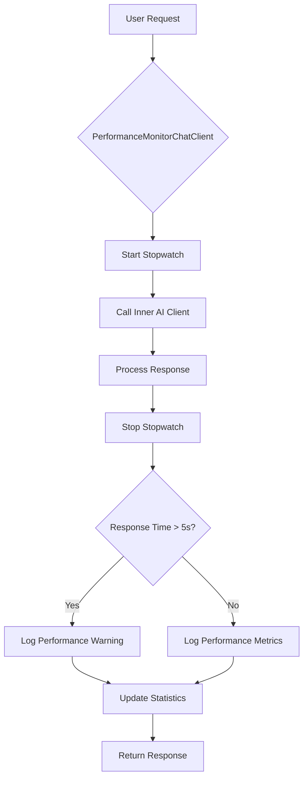
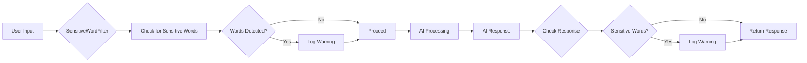
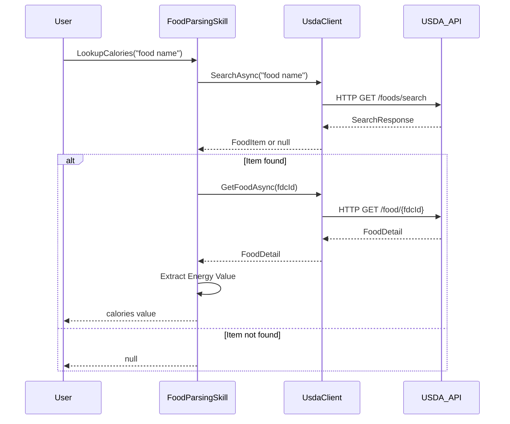
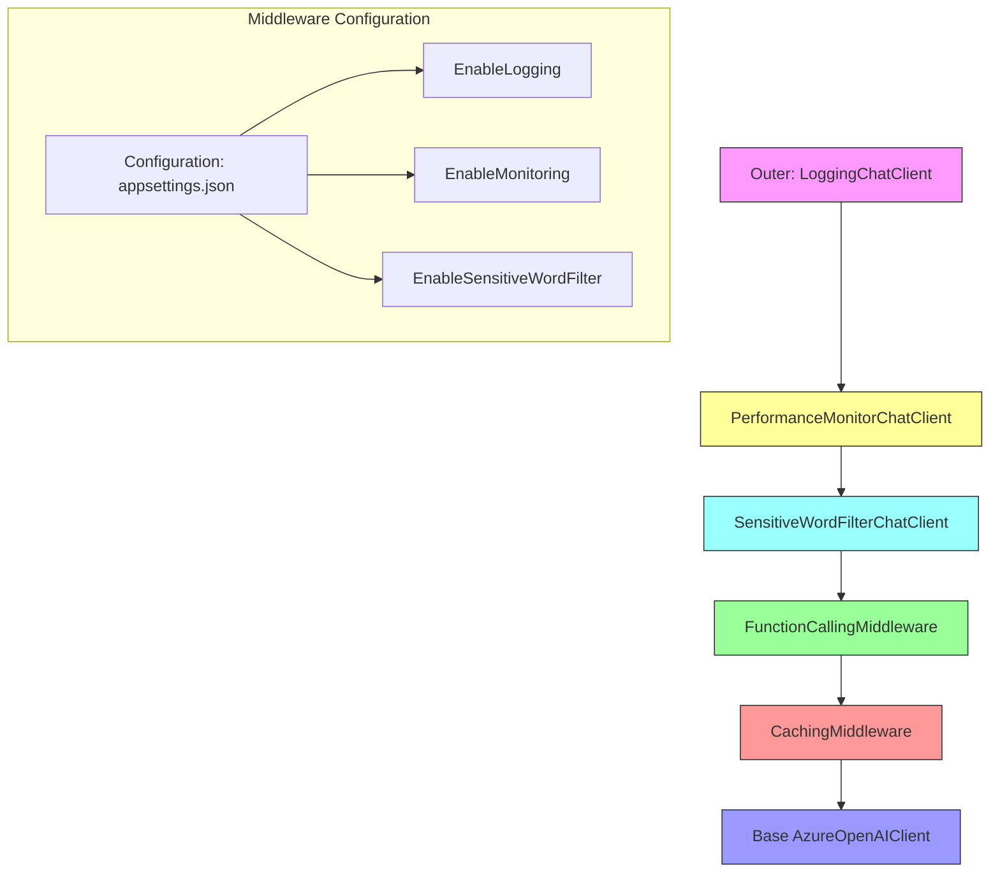
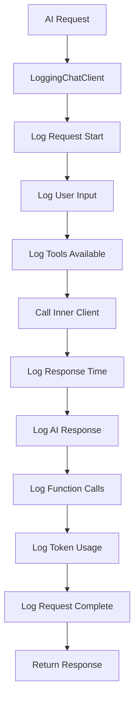

# AI-Related Issues

<cite>
**Referenced Files in This Document**   
- [PerformanceMonitorChatClient.cs](file://FitTrack.Copilot/Middleware/PerformanceMonitorChatClient.cs)
- [SensitiveWordFilterChatClient.cs](file://FitTrack.Copilot/Middleware/SensitiveWordFilterChatClient.cs)
- [LoggingChatClient.cs](file://FitTrack.Copilot/Middleware/LoggingChatClient.cs)
- [FoodParsingSkill.cs](file://FitTrack.Copilot/Tools/FoodParsingSkill.cs)
- [vision_nutrition.system.md](file://FitTrack.Copilot/SemanticKernel/Plugins/SystemPrompt/vision_nutrition.system.md)
- [UsdaClient.cs](file://FitTrack.Copilot/Api/Usda/UsdaClient.cs)
- [UsdaServiceCollectionExtensions.cs](file://FitTrack.Copilot/Api/Usda/UsdaServiceCollectionExtensions.cs)
- [CopilotServiceCollectionExtensions.cs](file://FitTrack.Copilot/Extension/CopilotServiceCollectionExtensions.cs)
- [Program.cs](file://FitTrack.Copilot/Program.cs)
</cite>

## Table of Contents
1. [Introduction](#introduction)
2. [Performance Issues and Monitoring](#performance-issues-and-monitoring)
3. [Content Safety and Filtering](#content-safety-and-filtering)
4. [Food Parsing and USDA API Integration](#food-parsing-and-usda-api-integration)
5. [AI Client Middleware Pipeline](#ai-client-middleware-pipeline)
6. [Configuration and Tuning](#configuration-and-tuning)
7. [Debugging and Logging](#debugging-and-logging)
8. [Prompt Engineering Best Practices](#prompt-engineering-best-practices)
9. [Conclusion](#conclusion)

## Introduction
This document provides comprehensive guidance on troubleshooting AI-related issues in the FitTrack application. It covers performance bottlenecks, content safety mechanisms, food parsing failures, and configuration best practices. The AI system in FitTrack leverages Semantic Kernel with Azure OpenAI services to provide nutrition analysis from food images and text inputs. Various middleware components are implemented to monitor, secure, and optimize AI interactions.

## Performance Issues and Monitoring

Slow AI response times can occur due to large image uploads, complex LLM calls, or inefficient API usage patterns. The `PerformanceMonitorChatClient` middleware provides comprehensive performance tracking to identify bottlenecks in the AI pipeline.

The performance monitor tracks key metrics including:
- Request count and response times
- Token usage (input and output)
- Average response time across requests
- First chunk arrival time for streaming responses

When response times exceed 5 seconds, performance warnings are logged to alert developers of potential issues. This allows for proactive identification of performance degradation before it impacts user experience.

**Diagram sources**
- [PerformanceMonitorChatClient.cs](file://FitTrack.Copilot/Middleware/PerformanceMonitorChatClient.cs#L24-L80)

**Section sources**
- [PerformanceMonitorChatClient.cs](file://FitTrack.Copilot/Middleware/PerformanceMonitorChatClient.cs#L7-L138)

## Content Safety and Filtering

Inappropriate or unsafe content generation is mitigated through the `SensitiveWordFilterChatClient` middleware, which implements real-time filtering of both user inputs and AI responses.

The filter maintains a configurable set of sensitive words and checks both incoming user messages and outgoing AI responses for these terms. When sensitive content is detected, a warning is logged, allowing for monitoring and potential intervention. The current implementation logs detected words without blocking the request, but could be extended to implement more restrictive policies such as content replacement or request rejection.

The sensitive word detection is case-insensitive and supports a flexible configuration that can be loaded from external sources in production environments.

**Diagram sources**
- [SensitiveWordFilterChatClient.cs](file://FitTrack.Copilot/Middleware/SensitiveWordFilterChatClient.cs#L28-L66)

**Section sources**
- [SensitiveWordFilterChatClient.cs](file://FitTrack.Copilot/Middleware/SensitiveWordFilterChatClient.cs#L7-L147)

## Food Parsing and USDA API Integration

The `FoodParsingSkill` handles parsing food items and retrieving nutritional information from the USDA API. Parsing failures can occur when the USDA API returns no results or ambiguous matches for a given food query.

When `SearchAsync` returns null, the skill gracefully returns null rather than throwing an exception, allowing the calling code to handle the absence of data appropriately. For ambiguous matches, the current implementation takes the first result (via `FirstOrDefault`), which may not always be the most accurate match.

The USDA API integration includes configurable timeout settings (60 seconds) and error handling through `EnsureSuccessStatusCode`, which will throw an exception for HTTP error responses, triggering appropriate error handling in the calling code.

**Diagram sources**
- [FoodParsingSkill.cs](file://FitTrack.Copilot/Tools/FoodParsingSkill.cs#L10-L22)
- [UsdaClient.cs](file://FitTrack.Copilot/Api/Usda/UsdaClient.cs#L17-L35)

**Section sources**
- [FoodParsingSkill.cs](file://FitTrack.Copilot/Tools/FoodParsingSkill.cs#L7-L24)
- [UsdaClient.cs](file://FitTrack.Copilot/Api/Usda/UsdaClient.cs#L6-L44)

## AI Client Middleware Pipeline

The AI client pipeline is constructed using a layered middleware approach, where each component wraps the previous one to form a processing chain. The middleware components are applied in a specific order to ensure proper functionality.

The pipeline construction in `CopilotServiceCollectionExtensions.AddChatClient` builds the middleware stack with the following layers (innermost to outermost):
1. Base AI client (Azure OpenAI)
2. Function calling middleware
3. Caching middleware (optional)
4. Sensitive word filter (optional)
5. Performance monitoring (optional)
6. Logging middleware (optional)

This layered approach allows for independent configuration of each middleware component while maintaining a clean separation of concerns.

**Diagram sources**
- [CopilotServiceCollectionExtensions.cs](file://FitTrack.Copilot/Extension/CopilotServiceCollectionExtensions.cs#L52-L83)

**Section sources**
- [CopilotServiceCollectionExtensions.cs](file://FitTrack.Copilot/Extension/CopilotServiceCollectionExtensions.cs#L28-L84)

## Configuration and Tuning

Key configuration options for optimizing AI performance and reliability are available through the application settings. These can be adjusted in `appsettings.json` or via environment variables.

Important configuration parameters include:
- **Timeout thresholds**: The USDA API client has a 60-second timeout, while the nutrition HTTP client has a 10-second timeout
- **Retry policies**: Not explicitly implemented but could be added using Polly policies
- **Caching**: Enabled by default using IMemoryCache with configurable expiration
- **Middleware toggles**: Performance monitoring, logging, and sensitive word filtering can be enabled/disabled independently

For prompt tuning to improve accuracy, the system prompt in `vision_nutrition.system.md` can be modified to adjust the AI's behavior, response format, and nutritional estimation approach.

**Section sources**
- [UsdaServiceCollectionExtensions.cs](file://FitTrack.Copilot/Api/Usda/UsdaServiceCollectionExtensions.cs#L13-L14)
- [Program.cs](file://FitTrack.Copilot/Program.cs#L55-L56)
- [CopilotServiceCollectionExtensions.cs](file://FitTrack.Copilot/Extension/CopilotServiceCollectionExtensions.cs#L55-L57)

## Debugging and Logging

The application uses NLog for comprehensive tracing of AI interactions and responses. The logging configuration in `Program.cs` sets up console logging with a detailed format including timestamp, log level, logger name, message, and exception details.

The `LoggingChatClient` middleware provides detailed logs for each AI request, including:
- User input messages
- AI response content
- Tool/function calls made
- Token usage statistics
- Request timing
- Completion reasons

Log levels are appropriately used with general information at Info level and detailed chunk data at Debug level, allowing for flexible verbosity control in different environments.

**Diagram sources**
- [LoggingChatClient.cs](file://FitTrack.Copilot/Middleware/LoggingChatClient.cs#L20-L88)
- [Program.cs](file://FitTrack.Copilot/Program.cs#L31-L44)

**Section sources**
- [LoggingChatClient.cs](file://FitTrack.Copilot/Middleware/LoggingChatClient.cs#L7-L134)
- [Program.cs](file://FitTrack.Copilot/Program.cs#L28-L47)

## Prompt Engineering Best Practices

The system prompt defined in `vision_nutrition.system.md` follows best practices for reliable AI responses in the nutrition domain:

1. **Clear role definition**: The AI is instructed to act as a professional nutritionist and food recognition expert
2. **Structured output format**: Strict JSON output is required with a defined schema
3. **No extraneous text**: The prompt specifies no explanations, markdown, or text outside the JSON
4. **Comprehensive nutritional data**: The schema includes calories, protein, carbs, fat, confidence scores, and serving hints

To reduce hallucinations, the prompt should be continuously refined based on observed output patterns. Additional strategies include:
- Adding examples of correct responses (few-shot learning)
- Including constraints on confidence scores
- Specifying handling of uncertain identifications
- Providing guidance on portion size estimation

The current prompt effectively enforces JSON output, which facilitates reliable parsing and integration with the application's food tracking features.

**Section sources**
- [vision_nutrition.system.md](file://FitTrack.Copilot/SemanticKernel/Plugins/SystemPrompt/vision_nutrition.system.md#L1-L26)

## Conclusion
The FitTrack AI system implements a robust architecture for nutrition analysis with comprehensive monitoring, safety, and error handling capabilities. By leveraging middleware components for performance monitoring, content filtering, and logging, the system provides visibility into AI interactions while maintaining reliability and safety. The modular design allows for easy configuration and extension of AI capabilities. Continued refinement of prompts and error handling strategies will further improve the accuracy and user experience of the AI-powered nutrition features.