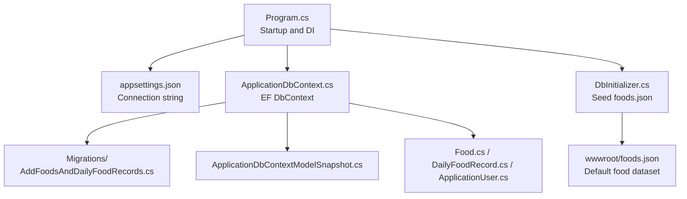
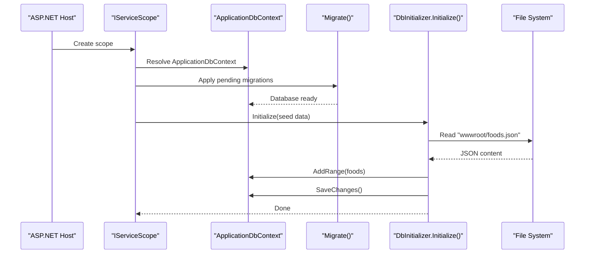
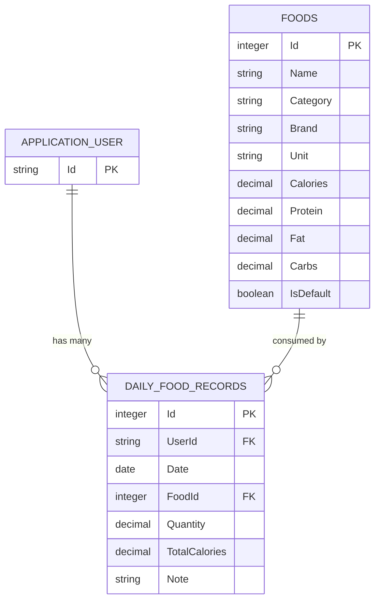
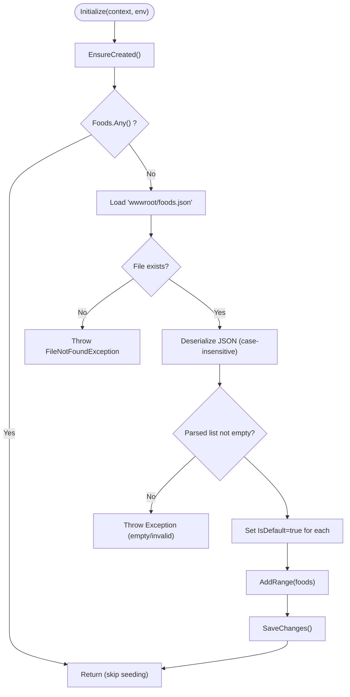
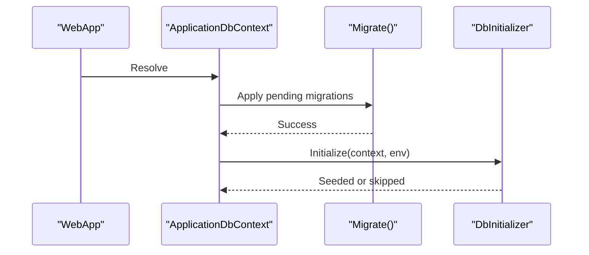
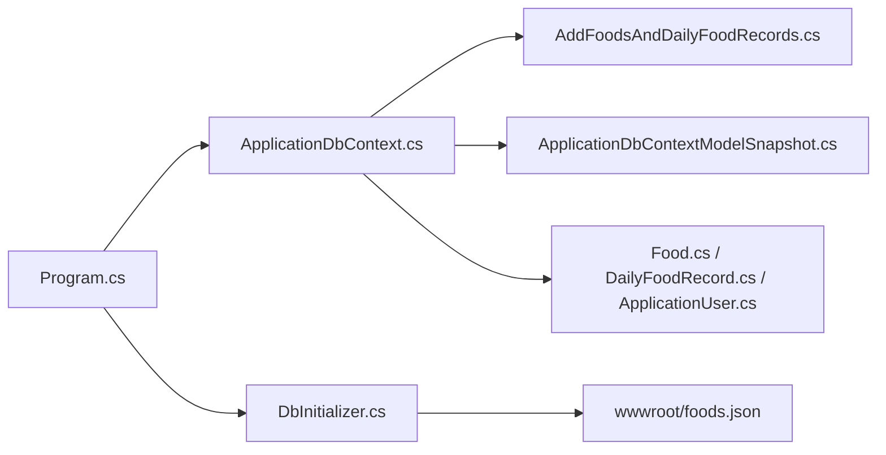

# Database & Migration Issues

<cite>
**Referenced Files in This Document**
- [Program.cs](file://FitTrack/FitTrack/Program.cs)
- [ApplicationDbContext.cs](file://FitTrack/FitTrack/Data/ApplicationDbContext.cs)
- [ApplicationDbContextModelSnapshot.cs](file://FitTrack/FitTrack/Data/Migrations/ApplicationDbContextModelSnapshot.cs)
- [DbInitializer.cs](file://FitTrack/FitTrack/Data/DbInitializer.cs)
- [20250826084318_AddFoodsAndDailyFoodRecords.cs](file://FitTrack/FitTrack/Data/Migrations/20250826084318_AddFoodsAndDailyFoodRecords.cs)
- [Food.cs](file://FitTrack/FitTrack/Data/Food.cs)
- [DailyFoodRecord.cs](file://FitTrack/FitTrack/Data/DailyFoodRecord.cs)
- [ApplicationUser.cs](file://FitTrack/FitTrack/Data/ApplicationUser.cs)
- [appsettings.json](file://FitTrack/FitTrack/appsettings.json)
- [foods.json](file://FitTrack/FitTrack/wwwroot/foods.json)
</cite>

## Table of Contents
1. [Introduction](#introduction)
2. [Project Structure](#project-structure)
3. [Core Components](#core-components)
4. [Architecture Overview](#architecture-overview)
5. [Detailed Component Analysis](#detailed-component-analysis)
6. [Dependency Analysis](#dependency-analysis)
7. [Performance Considerations](#performance-considerations)
8. [Troubleshooting Guide](#troubleshooting-guide)
9. [Conclusion](#conclusion)
10. [Appendices](#appendices)

## Introduction
This document focuses on database and migration troubleshooting in FitTrack. It covers:
- Resolving migration conflicts when multiple developers modify the schema
- Handling “The migration X has already been applied” errors
- SQLite connection timeouts under high load and mitigation strategies
- Seeding issues via DbInitializer.cs (missing JSON file, deserialization failures, duplicates)
- Using the AddFoodsAndDailyFoodRecords migration as a concrete example to explain table creation, foreign keys, and indexes
- Safely modifying migrations, generating new ones, and choosing EnsureCreated() vs. Migrate() per environment
- Debugging EF Core queries with logging and LINQ expression trees
- Production upgrade and rollback practices

## Project Structure
FitTrack uses Entity Framework Core with SQLite. The application initializes the database during startup, applies migrations, and seeds default food data from a JSON file.

**Diagram sources**
- [Program.cs](file://FitTrack/FitTrack/Program.cs#L27-L50)
- [appsettings.json](file://FitTrack/FitTrack/appsettings.json#L1-L4)
- [DbInitializer.cs](file://FitTrack/FitTrack/Data/DbInitializer.cs#L7-L39)
- [20250826084318_AddFoodsAndDailyFoodRecords.cs](file://FitTrack/FitTrack/Data/Migrations/20250826084318_AddFoodsAndDailyFoodRecords.cs#L1-L86)
- [ApplicationDbContextModelSnapshot.cs](file://FitTrack/FitTrack/Data/Migrations/ApplicationDbContextModelSnapshot.cs#L84-L116)

**Section sources**
- [Program.cs](file://FitTrack/FitTrack/Program.cs#L27-L50)
- [appsettings.json](file://FitTrack/FitTrack/appsettings.json#L1-L4)

## Core Components
- ApplicationDbContext: Defines DbSet for Foods and DailyFoodRecords and inherits IdentityDbContext for user management.
- DbInitializer: Ensures database existence, checks for existing seed data, loads foods.json, deserializes JSON, marks items as defaults, and persists them.
- AddFoodsAndDailyFoodRecords migration: Creates Foods and DailyFoodRecords tables, defines primary keys, foreign keys, and indexes.
- Model classes: Food and DailyFoodRecord define entity shapes and relationships; ApplicationUser extends IdentityUser.

**Section sources**
- [ApplicationDbContext.cs](file://FitTrack/FitTrack/Data/ApplicationDbContext.cs#L6-L17)
- [DbInitializer.cs](file://FitTrack/FitTrack/Data/DbInitializer.cs#L7-L39)
- [20250826084318_AddFoodsAndDailyFoodRecords.cs](file://FitTrack/FitTrack/Data/Migrations/20250826084318_AddFoodsAndDailyFoodRecords.cs#L1-L86)
- [Food.cs](file://FitTrack/FitTrack/Data/Food.cs#L1-L42)
- [DailyFoodRecord.cs](file://FitTrack/FitTrack/Data/DailyFoodRecord.cs#L1-L29)
- [ApplicationUser.cs](file://FitTrack/FitTrack/Data/ApplicationUser.cs#L1-L10)

## Architecture Overview
The startup sequence ensures the database is up-to-date and seeded before serving requests.

**Diagram sources**
- [Program.cs](file://FitTrack/FitTrack/Program.cs#L44-L50)
- [DbInitializer.cs](file://FitTrack/FitTrack/Data/DbInitializer.cs#L7-L39)
- [foods.json](file://FitTrack/FitTrack/wwwroot/foods.json#L1-L20)

## Detailed Component Analysis

### AddFoodsAndDailyFoodRecords Migration
This migration introduces two tables with explicit constraints and indexes:
- Foods: Primary key on Id; columns for name, category, brand, unit, and macronutrients; IsDefault flag.
- DailyFoodRecords: Primary key on Id; foreign keys to AspNetUsers (UserId) and Foods (FoodId); cascade delete on FoodId; indexes on FoodId and UserId.

**Diagram sources**
- [20250826084318_AddFoodsAndDailyFoodRecords.cs](file://FitTrack/FitTrack/Data/Migrations/20250826084318_AddFoodsAndDailyFoodRecords.cs#L14-L62)
- [ApplicationDbContextModelSnapshot.cs](file://FitTrack/FitTrack/Data/Migrations/ApplicationDbContextModelSnapshot.cs#L84-L116)

**Section sources**
- [20250826084318_AddFoodsAndDailyFoodRecords.cs](file://FitTrack/FitTrack/Data/Migrations/20250826084318_AddFoodsAndDailyFoodRecords.cs#L14-L83)
- [ApplicationDbContextModelSnapshot.cs](file://FitTrack/FitTrack/Data/Migrations/ApplicationDbContextModelSnapshot.cs#L84-L116)

### DbInitializer.cs: Data Seeding
Key behaviors:
- Uses EnsureCreated() to create the database if it does not exist.
- Skips seeding if Foods already contains data.
- Loads foods.json from web root; throws if missing or invalid.
- Deserializes JSON with case-insensitive property names.
- Marks all imported foods as default and persists them.

Common issues and resolutions:
- Missing foods.json: Ensure the file exists at the expected path in wwwroot.
- JSON deserialization failure: Validate JSON structure and field names; confirm case-insensitive deserialization is supported.
- Duplicate entries: The initializer checks for existing Foods and skips seeding if present.

**Diagram sources**
- [DbInitializer.cs](file://FitTrack/FitTrack/Data/DbInitializer.cs#L7-L39)
- [foods.json](file://FitTrack/FitTrack/wwwroot/foods.json#L1-L20)

**Section sources**
- [DbInitializer.cs](file://FitTrack/FitTrack/Data/DbInitializer.cs#L7-L39)

### Application Startup and Migration Execution
- The application resolves ApplicationDbContext and runs Migrate() to apply pending migrations.
- After migrations succeed, DbInitializer is invoked to seed default data.
- In development, migrations endpoint is enabled for convenience.

**Diagram sources**
- [Program.cs](file://FitTrack/FitTrack/Program.cs#L44-L50)
- [DbInitializer.cs](file://FitTrack/FitTrack/Data/DbInitializer.cs#L7-L39)

**Section sources**
- [Program.cs](file://FitTrack/FitTrack/Program.cs#L44-L50)

## Dependency Analysis
- Program.cs depends on ApplicationDbContext and DbInitializer.
- ApplicationDbContext depends on IdentityDbContext<ApplicationUser> and exposes DbSet for Foods and DailyFoodRecords.
- DbInitializer depends on FileSystem and System.Text.Json.
- The migration snapshot reflects the current model and indexes.

**Diagram sources**
- [Program.cs](file://FitTrack/FitTrack/Program.cs#L27-L50)
- [DbInitializer.cs](file://FitTrack/FitTrack/Data/DbInitializer.cs#L7-L39)
- [20250826084318_AddFoodsAndDailyFoodRecords.cs](file://FitTrack/FitTrack/Data/Migrations/20250826084318_AddFoodsAndDailyFoodRecords.cs#L1-L86)
- [ApplicationDbContextModelSnapshot.cs](file://FitTrack/FitTrack/Data/Migrations/ApplicationDbContextModelSnapshot.cs#L84-L116)

**Section sources**
- [Program.cs](file://FitTrack/FitTrack/Program.cs#L27-L50)
- [ApplicationDbContext.cs](file://FitTrack/FitTrack/Data/ApplicationDbContext.cs#L6-L17)
- [DbInitializer.cs](file://FitTrack/FitTrack/Data/DbInitializer.cs#L7-L39)

## Performance Considerations
- SQLite connection timeouts under high load:
  - Use connection pooling and shared cache settings from the connection string.
  - Reduce concurrent write contention by batching writes and avoiding long transactions.
  - Prefer asynchronous database operations in controllers/services.
  - Monitor and tune SQLite pragmas (e.g., WAL mode) if applicable to your hosting environment.
- Indexes from the migration:
  - IX_DailyFoodRecords_FoodId and IX_DailyFoodRecords_UserId improve join and filtering performance on these columns.
- EnsureCreated() vs. Migrate():
  - EnsureCreated() creates schema without migrations history; useful for local development or simple scenarios.
  - Migrate() applies migrations and tracks state; preferred for CI/CD and production environments.

**Section sources**
- [appsettings.json](file://FitTrack/FitTrack/appsettings.json#L1-L4)
- [20250826084318_AddFoodsAndDailyFoodRecords.cs](file://FitTrack/FitTrack/Data/Migrations/20250826084318_AddFoodsAndDailyFoodRecords.cs#L64-L73)
- [Program.cs](file://FitTrack/FitTrack/Program.cs#L44-L50)

## Troubleshooting Guide

### Migration Conflicts and “Already Applied” Errors
Symptoms:
- EF Core reports that a migration has already been applied.

Resolution steps:
- Verify the migration history table (in SQLite, EF Core stores migration metadata) and reconcile discrepancies.
- If multiple developers modified the schema, coordinate merging migration files and ensuring consistent order.
- Re-run Migrate() after resolving conflicts; if necessary, reset migrations locally (see “Safely Modifying Migrations” below).

Recommended practices:
- Treat migrations as immutable once applied to shared environments.
- Use descriptive migration names and keep a changelog.
- For local resets, drop and recreate the database or use a fresh SQLite file during development.

**Section sources**
- [Program.cs](file://FitTrack/FitTrack/Program.cs#L44-L50)

### “The migration X has already been applied” Errors
- Cause: EF Core detects the migration record exists in the migrations history table.
- Fix:
  - If the schema is partially applied, manually reconcile differences and re-run Migrate().
  - If resetting locally, remove the migration record from the migrations history table (not recommended in production).
  - Ensure all team members pull the latest migrations and run Migrate() before starting work.

**Section sources**
- [Program.cs](file://FitTrack/FitTrack/Program.cs#L44-L50)

### SQLite Connection Timeouts Under High Load
- Symptoms: Timeout exceptions when writing or reading under heavy concurrency.
- Mitigations:
  - Use a shared cache setting in the connection string.
  - Batch inserts and avoid long-running transactions.
  - Switch to asynchronous database APIs.
  - Consider WAL mode and appropriate pragmas if supported by your deployment platform.
  - Scale out reads using read replicas or caching strategies.

**Section sources**
- [appsettings.json](file://FitTrack/FitTrack/appsettings.json#L1-L4)

### Data Seeding Failures (DbInitializer.cs)
Common issues:
- Missing foods.json:
  - Ensure the file exists at the expected path in wwwroot.
  - Confirm the web root path resolution aligns with the deployed structure.
- JSON deserialization failures:
  - Validate JSON structure and field names match the Food model.
  - Case-insensitive deserialization is enabled; ensure property names are compatible.
- Duplicate entries:
  - The initializer checks for existing Foods and skips seeding if data exists.
  - If duplicates occur later, implement de-duplication logic or unique constraints.

Resolutions:
- Place foods.json in wwwroot and redeploy.
- Validate JSON content and schema.
- If seeding must run regardless, adjust the initializer to clear existing data or enforce uniqueness.

**Section sources**
- [DbInitializer.cs](file://FitTrack/FitTrack/Data/DbInitializer.cs#L7-L39)
- [foods.json](file://FitTrack/FitTrack/wwwroot/foods.json#L1-L20)

### Safely Modifying Migrations and Generating New Ones
- Do not edit an already-applied migration; instead:
  - Create a new migration to reflect desired changes.
  - Test locally by dropping the database and re-applying migrations.
  - Commit the new migration and update the seed logic if needed.
- For local resets:
  - Drop the SQLite database file and re-run Migrate() and DbInitializer.
- For production:
  - Use Migrate() to apply new migrations.
  - Back up the database before applying breaking changes.
  - Use transactional migrations where possible and test rollback scripts.

**Section sources**
- [Program.cs](file://FitTrack/FitTrack/Program.cs#L44-L50)
- [20250826084318_AddFoodsAndDailyFoodRecords.cs](file://FitTrack/FitTrack/Data/Migrations/20250826084318_AddFoodsAndDailyFoodRecords.cs#L75-L83)

### Using EnsureCreated() vs. Migrate()
- EnsureCreated():
  - Creates schema without migrations history; convenient for local development.
  - Not suitable for production due to lack of version control and rollback support.
- Migrate():
  - Applies migrations and tracks state; recommended for CI/CD and production.
  - Use in Program.cs to ensure schema readiness before serving requests.

**Section sources**
- [DbInitializer.cs](file://FitTrack/FitTrack/Data/DbInitializer.cs#L7-L11)
- [Program.cs](file://FitTrack/FitTrack/Program.cs#L44-L50)

### Debugging EF Core Queries (Logging and LINQ Expression Trees)
- Enable logging:
  - Adjust log levels in appsettings.json to capture EF Core logs.
- Inspect generated SQL:
  - Use logging providers to print SQL statements and parameter values.
- Analyze LINQ expression trees:
  - Use logging to observe translated SQL and optimize queries.
  - Prefer explicit includes and projections to reduce unnecessary data transfer.

**Section sources**
- [appsettings.json](file://FitTrack/FitTrack/appsettings.json#L1-L12)

### Production Database Upgrades and Rollback Procedures
- Upgrade procedure:
  - Create a new migration with breaking changes.
  - Test in staging with a backup restored from production.
  - Deploy the new migration and run Migrate() in production.
- Rollback procedure:
  - Create a down migration to revert schema changes.
  - Test rollback in staging.
  - If needed, restore from pre-upgrade backups and re-apply migrations selectively.
- Best practices:
  - Always back up before applying migrations.
  - Use feature flags or gradual rollouts for risky changes.
  - Keep migration scripts minimal and reversible where possible.

**Section sources**
- [20250826084318_AddFoodsAndDailyFoodRecords.cs](file://FitTrack/FitTrack/Data/Migrations/20250826084318_AddFoodsAndDailyFoodRecords.cs#L75-L83)
- [Program.cs](file://FitTrack/FitTrack/Program.cs#L44-L50)

## Conclusion
FitTrack’s database lifecycle is straightforward: migrations are applied at startup, followed by seeding from foods.json. For robust operations:
- Use Migrate() in production and EnsureCreated() for local development.
- Coordinate migrations among team members to avoid conflicts.
- Monitor and tune SQLite performance under load.
- Validate seeding inputs and handle errors gracefully.
- Maintain backups and scripted rollbacks for production changes.

## Appendices

### Appendix A: AddFoodsAndDailyFoodRecords Migration Highlights
- Table creation for Foods and DailyFoodRecords
- Primary keys and foreign keys
- Cascade delete on FoodId
- Indexes on DailyFoodRecords.FoodId and DailyFoodRecords.UserId

**Section sources**
- [20250826084318_AddFoodsAndDailyFoodRecords.cs](file://FitTrack/FitTrack/Data/Migrations/20250826084318_AddFoodsAndDailyFoodRecords.cs#L14-L83)
- [ApplicationDbContextModelSnapshot.cs](file://FitTrack/FitTrack/Data/Migrations/ApplicationDbContextModelSnapshot.cs#L84-L116)