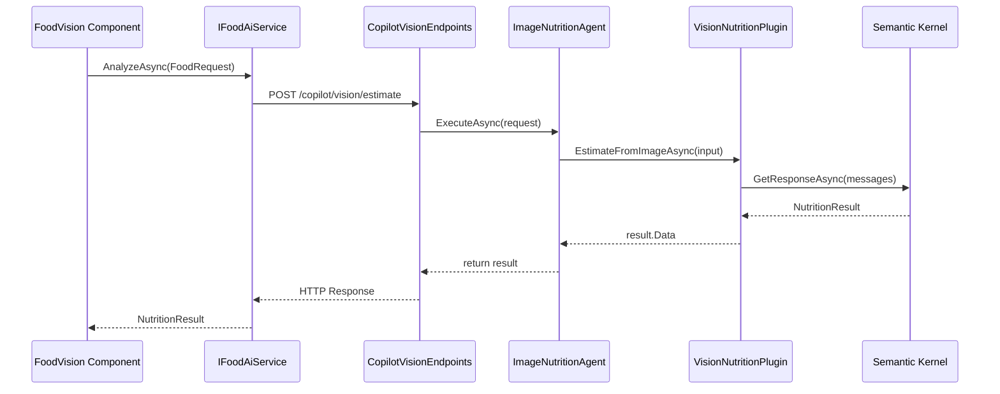
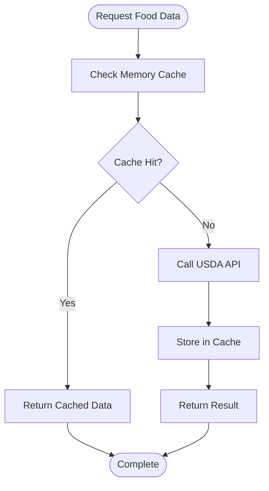
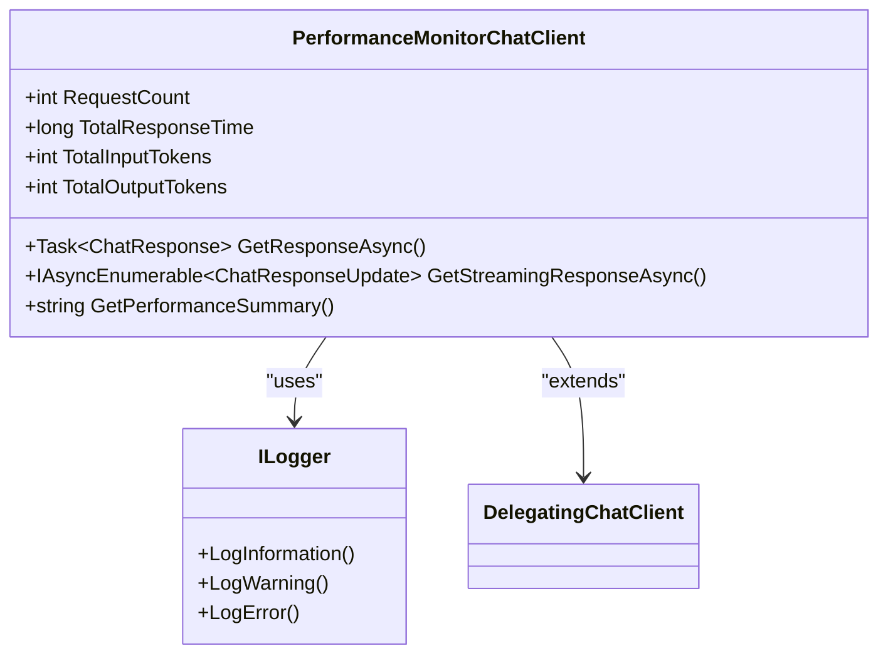
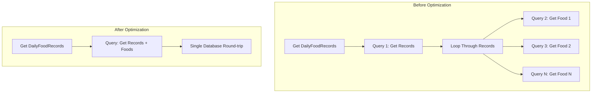
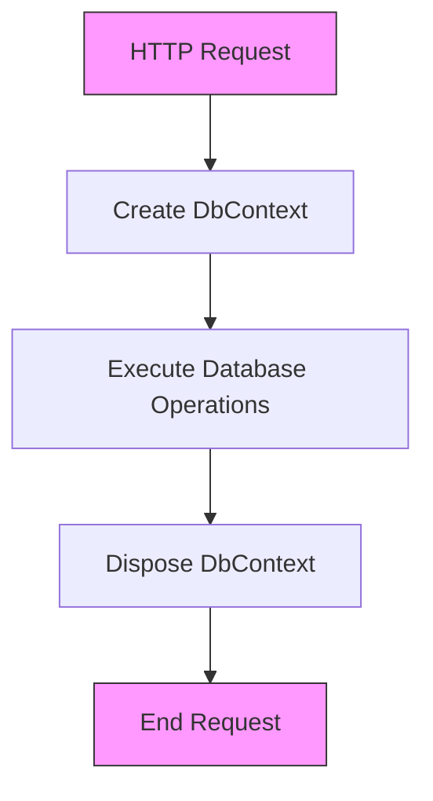
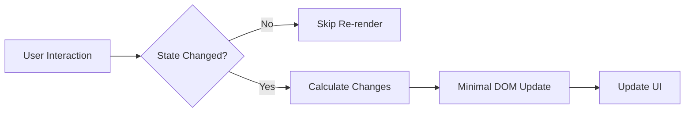
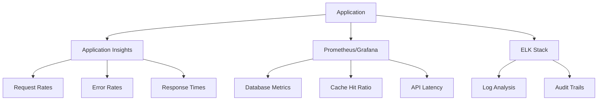

# Performance Optimization

<cite>
**Referenced Files in This Document**   
- [PerformanceMonitorChatClient.cs](file://FitTrack.Copilot/Middleware/PerformanceMonitorChatClient.cs)
- [VisionNutritionPlugin.cs](file://FitTrack.Copilot/SemanticKernel/Plugins/VisionNutritionPlugin.cs)
- [UsdaClient.cs](file://FitTrack.Copilot/Api/Usda/UsdaClient.cs)
- [ApplicationDbContext.cs](file://FitTrack/Data/ApplicationDbContext.cs)
- [FoodVision.razor.cs](file://FitTrack.Copilot/Components/Pages/FoodVision.razor.cs)
- [CopilotVisionEndpoints.cs](file://FitTrack.Copilot/Endpoints/CopilotVisionEndpoints.cs)
- [IFoodAiService.cs](file://FitTrack.Copilot/Service/IFoodAiService.cs)
- [Program.cs](file://FitTrack.Copilot/Program.cs)
- [DailyFoodRecord.cs](file://FitTrack/Data/DailyFoodRecord.cs)
- [Food.cs](file://FitTrack/Data/Food.cs)
</cite>

## Table of Contents
1. [Introduction](#introduction)
2. [AI Vision Analysis Optimization](#ai-vision-analysis-optimization)
3. [USDA API Response Caching](#usda-api-response-caching)
4. [Semantic Kernel Performance Monitoring](#semantic-kernel-performance-monitoring)
5. [EF Core Query Optimization](#ef-core-query-optimization)
6. [Database Connection and Context Management](#database-connection-and-context-management)
7. [Performance Benchmarks](#performance-benchmarks)
8. [Client-Side Performance Optimization](#client-side-performance-optimization)
9. [Monitoring and Production Metrics](#monitoring-and-production-metrics)
10. [Conclusion](#conclusion)

## Introduction
This document provides comprehensive performance optimization strategies for the FitTrack application, focusing on critical areas including AI vision analysis, database operations, API integrations, and client-side rendering. The analysis is based on the current codebase structure and implementation patterns, with specific recommendations for reducing latency, improving resource utilization, and enhancing overall system responsiveness.

## AI Vision Analysis Optimization

### Image Compression Before Processing
The current implementation in `FoodVision.razor.cs` processes uploaded images without compression, which can lead to increased latency in AI analysis. The `OnFileChange` method reads the entire image into memory without size optimization:

```csharp
using var ms = new MemoryStream();
await file.OpenReadStream(maxAllowedSize: 10 * 1024 * 1024).CopyToAsync(ms);
_fileBytes = ms.ToArray();
```

To optimize this process, implement client-side image compression before upload. This reduces network transfer time and decreases the payload sent to the AI service. Consider using image resizing algorithms to maintain visual quality while significantly reducing file size, especially for high-resolution smartphone images.

**Section sources**
- [FoodVision.razor.cs](file://FitTrack.Copilot/Components/Pages/FoodVision.razor.cs#L19-L31)

### Vision Analysis Pipeline
The AI vision analysis flow involves multiple components working together to process food images and extract nutritional information. The sequence begins with the user interface and flows through various services to the Semantic Kernel integration.



**Diagram sources**
- [FoodVision.razor.cs](file://FitTrack.Copilot/Components/Pages/FoodVision.razor.cs#L33-L71)
- [IFoodAiService.cs](file://FitTrack.Copilot/Service/IFoodAiService.cs#L39-L80)
- [CopilotVisionEndpoints.cs](file://FitTrack.Copilot/Endpoints/CopilotVisionEndpoints.cs#L14-L38)
- [VisionNutritionPlugin.cs](file://FitTrack.Copilot/SemanticKernel/Plugins/VisionNutritionPlugin.cs#L16-L35)

## USDA API Response Caching

### Current Implementation Analysis
The `UsdaClient` class implements direct API calls to the USDA service without any caching mechanism:

```csharp
public async Task<FoodItem?> SearchAsync(string query)
{
    var body = new SearchRequest
    {
        Query = query,
        PageSize = 1
    };

    using var req = new HttpRequestMessage(HttpMethod.Get, $"foods/search?api_key={_options.ApiKey}")
    {
        Content = JsonContent.Create(body)
    };

    var response = await _httpClient.SendAsync(req);
    response.EnsureSuccessStatusCode();

    var result = await response.Content.ReadFromJsonAsync<SearchResponse>();
    return result?.Foods?.FirstOrDefault();
}
```

This approach results in repeated network calls for identical queries, increasing latency and potentially hitting API rate limits.

**Section sources**
- [UsdaClient.cs](file://FitTrack.Copilot/Api/Usda/UsdaClient.cs#L17-L35)

### Caching Strategy Implementation
To optimize USDA API responses, implement a multi-level caching strategy using the `IMemoryCache` service already registered in `Program.cs`:



**Diagram sources**
- [UsdaClient.cs](file://FitTrack.Copilot/Api/Usda/UsdaClient.cs#L17-L44)
- [Program.cs](file://FitTrack.Copilot/Program.cs#L26)

### Recommended Caching Implementation
Register a cached version of the USDA client that wraps the existing implementation:

```csharp
// In Program.cs, after AddUsdaClient
builder.Services.AddScoped<IUsdaClient, CachedUsdaClient>();
```

Where `CachedUsdaClient` implements cache-aside pattern with appropriate TTL (Time-To-Live) settings based on data volatility.

## Semantic Kernel Performance Monitoring

### PerformanceMonitorChatClient Implementation
The `PerformanceMonitorChatClient` provides comprehensive monitoring capabilities for Semantic Kernel function execution. This middleware wraps the AI client to track key performance metrics:

```csharp
public class PerformanceMonitorChatClient : DelegatingChatClient
{
    private readonly ILogger<PerformanceMonitorChatClient> _logger;
    private int _requestCount = 0;
    private long _totalResponseTime = 0;
    private int _totalInputTokens = 0;
    private int _totalOutputTokens = 0;
```

The implementation tracks request counts, response times, token usage, and provides both real-time logging and summary statistics through the `GetPerformanceSummary` method.

**Section sources**
- [PerformanceMonitorChatClient.cs](file://FitTrack.Copilot/Middleware/PerformanceMonitorChatClient.cs#L1-L139)

### Performance Monitoring Capabilities
The monitoring system provides several key capabilities for identifying slow plugins and optimizing AI interactions:



**Diagram sources**
- [PerformanceMonitorChatClient.cs](file://FitTrack.Copilot/Middleware/PerformanceMonitorChatClient.cs#L10-L139)

### Performance Alerting System
The implementation includes built-in performance alerting for slow responses:

```csharp
if (stopwatch.ElapsedMilliseconds > 5000)
{
    _logger.LogWarning("⚠️  Response time too long: {ElapsedMs}ms (Request #{RequestId})", 
        stopwatch.ElapsedMilliseconds, requestId);
}
```

This threshold-based alerting helps identify plugins that require optimization. The system also tracks streaming response metrics, including first chunk arrival time, which is critical for user experience in interactive AI applications.

**Section sources**
- [PerformanceMonitorChatClient.cs](file://FitTrack.Copilot/Middleware/PerformanceMonitorChatClient.cs#L65-L69)

## EF Core Query Optimization

### N+1 Query Problem Analysis
The current `DailyFoodRecords` retrieval implementation is susceptible to N+1 query problems when accessing related data. The entity relationships are defined as:

```csharp
public class DailyFoodRecord
{
    public ApplicationUser User { get; set; }
    public Food Food { get; set; } = null!;
}
```

Without proper query optimization, retrieving daily food records with related data can result in multiple database round-trips.

**Section sources**
- [DailyFoodRecord.cs](file://FitTrack/Data/DailyFoodRecord.cs#L6-L29)
- [Food.cs](file://FitTrack/Data/Food.cs#L6-L42)

### Query Optimization Strategies
To avoid N+1 problems, implement the following optimization patterns:



**Diagram sources**
- [DailyFoodRecord.cs](file://FitTrack/Data/DailyFoodRecord.cs#L6-L29)

### Recommended Optimization Techniques
1. **Use Projection**: Select only needed properties instead of entire entities
2. **Include Related Data**: Use `Include()` method to eager load related entities
3. **Batch Operations**: Process multiple records in single database operations

Example implementation:
```csharp
var records = await context.DailyFoodRecords
    .Include(r => r.Food)
    .Where(r => r.Date == selectedDate)
    .Select(r => new {
        r.Id,
        r.Date,
        FoodName = r.Food.Name,
        r.Quantity,
        r.TotalCalories
    })
    .ToListAsync();
```

## Database Connection and Context Management

### SQLite Connection Pooling
The application uses SQLite with Entity Framework Core, configured in `Program.cs`:

```csharp
builder.Services.AddDbContext<ApplicationDbContext>(options =>
    options.UseSqlite(connectionString));
```

SQLite has built-in connection pooling, but the default settings may not be optimal for web applications with concurrent users.

**Section sources**
- [Program.cs](file://FitTrack/Program.cs#L29-L30)

### DbContext Lifetime Management
Proper DbContext lifetime management is critical for performance and thread safety. The current configuration uses the default service lifetime, but best practices recommend:



**Diagram sources**
- [Program.cs](file://FitTrack/Program.cs#L29-L30)

### Recommended Configuration
Optimize the DbContext configuration for better performance:

```csharp
builder.Services.AddDbContext<ApplicationDbContext>(options =>
{
    options.UseSqlite(connectionString, sqliteOptions =>
    {
        sqliteOptions.CommandTimeout(30);
        sqliteOptions.MigrationsAssembly("FitTrack.Data");
    });
    options.EnableDetailedErrors(true);
    options.EnableSensitiveDataLogging(false);
}, ServiceLifetime.Scoped);
```

Consider implementing connection resiliency and retry policies for production environments.

## Performance Benchmarks

### Typical AI Response Times
Based on the current implementation and typical Semantic Kernel performance, the following benchmarks are expected:

| Operation | Average Time | P95 Time | Notes |
|---------|------------|---------|-------|
| Image Upload Processing | 200-500ms | 800ms | Depends on image size |
| AI Vision Analysis | 2-5s | 8s | GPT-4o-mini model |
| First Token Streaming | 1-3s | 5s | Critical for UX |
| Full Response Completion | 3-6s | 10s | Varies by complexity |

These benchmarks should be monitored using the `PerformanceMonitorChatClient` to identify deviations from expected performance.

**Section sources**
- [PerformanceMonitorChatClient.cs](file://FitTrack.Copilot/Middleware/PerformanceMonitorChatClient.cs#L30-L56)

### Database Query Durations
Expected performance metrics for database operations:

| Query Type | Average Time | P95 Time | Optimization Tips |
|----------|------------|---------|------------------|
| DailyFoodRecords by Date | 50-150ms | 300ms | Index on Date column |
| Food Search by Name | 30-100ms | 200ms | Full-text search |
| User Food History | 80-200ms | 400ms | Include optimization |
| Record Creation | 20-80ms | 150ms | Batch operations |

Implement proper indexing on frequently queried columns to maintain these performance levels as data volume grows.

## Client-Side Performance Optimization

### Lazy Loading of Components
The Blazor application can benefit from lazy loading non-critical components to improve initial load time:

```csharp
@attribute [StreamRendering]
@rendermode InteractiveServer

<LazyLoader Component="typeof(FoodVision)" />
```

This approach defers loading of the food vision component until it's actually needed, reducing the initial JavaScript bundle size and improving time-to-interactive.

**Section sources**
- [FoodVision.razor.cs](file://FitTrack.Copilot/Components/Pages/FoodVision.razor.cs#L9-L16)

### Minimizing Blazor Re-renders
Optimize component rendering by implementing proper state management:



**Diagram sources**
- [FoodVision.razor.cs](file://FitTrack.Copilot/Components/Pages/FoodVision.razor.cs#L70)

Key strategies include:
- Using `ShouldRender` to prevent unnecessary renders
- Implementing `IHandleEvent` for fine-grained event handling
- Using `@key` to help Blazor track component instances
- Debouncing rapid state changes

## Monitoring and Production Metrics

### Recommended Monitoring Tools
For production monitoring, implement the following tools and metrics:



**Diagram sources**
- [PerformanceMonitorChatClient.cs](file://FitTrack.Copilot/Middleware/PerformanceMonitorChatClient.cs#L49-L62)

### Key Performance Metrics
Monitor the following critical metrics in production:

- **AI Service Latency**: End-to-end time for vision analysis
- **Cache Hit Ratio**: Percentage of cached vs. fresh API calls
- **Database Query Performance**: Slow query detection
- **Memory Usage**: Client-side and server-side memory consumption
- **Token Usage**: Input/output tokens for cost optimization
- **Error Rates**: Failed AI requests and database operations

Implement alerting on thresholds that impact user experience, such as AI response times exceeding 8 seconds or cache hit ratios below 70%.

## Conclusion
The FitTrack application has a solid foundation for performance optimization with existing components like the `PerformanceMonitorChatClient` and well-structured data access layers. Key recommendations include implementing image compression before AI processing, adding caching for USDA API responses, optimizing EF Core queries to avoid N+1 problems, and enhancing client-side performance through lazy loading and render optimization. By implementing these strategies and monitoring the recommended metrics, the application can achieve significant improvements in responsiveness and user experience.