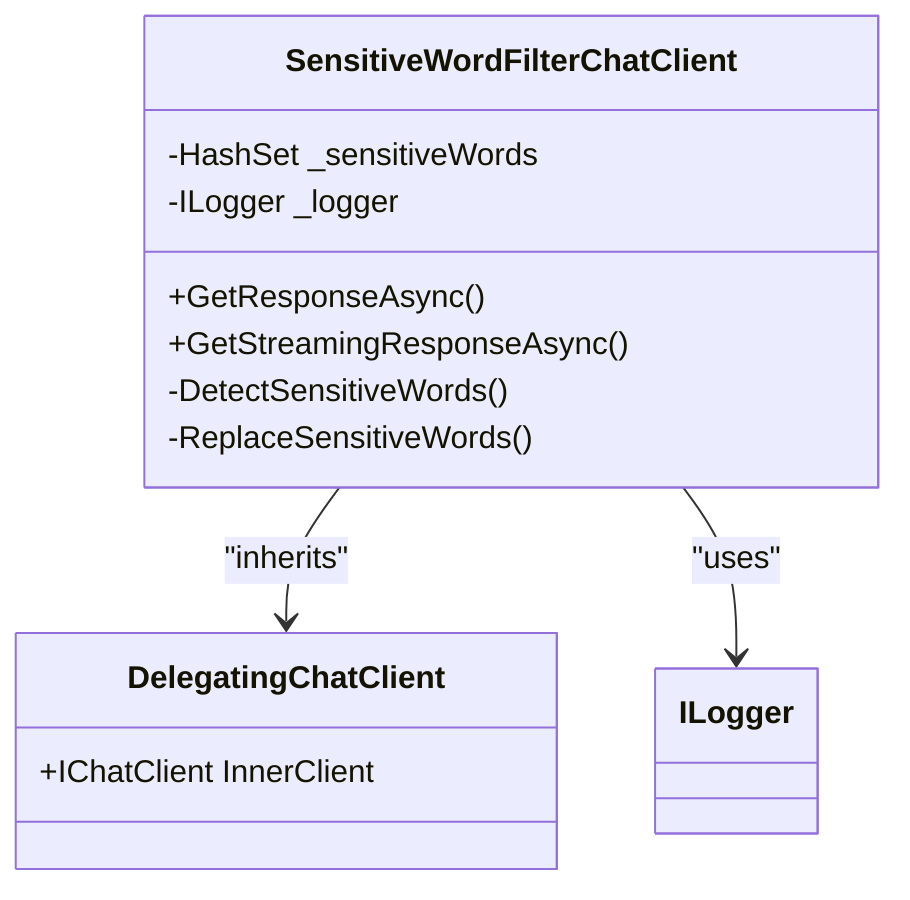
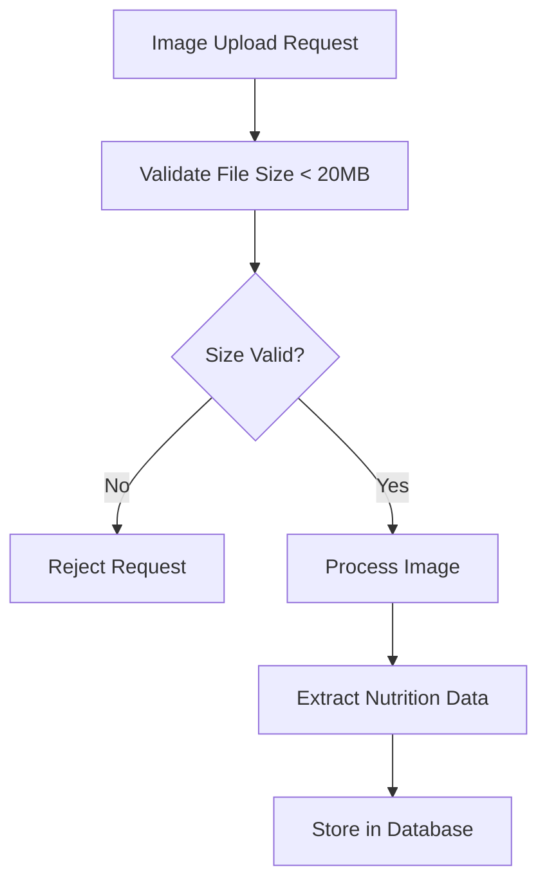
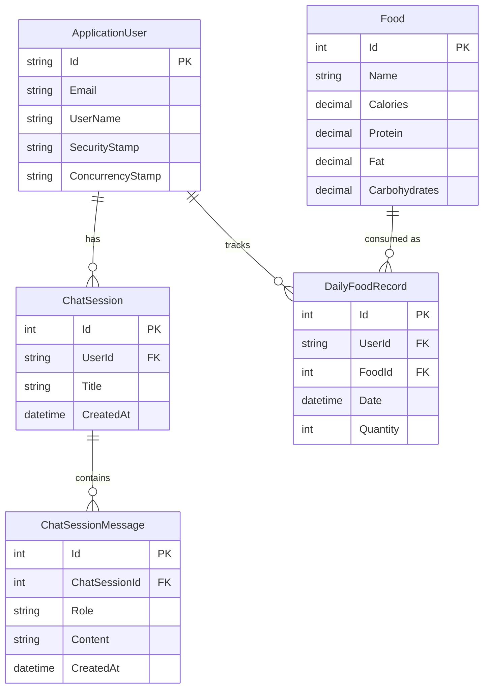
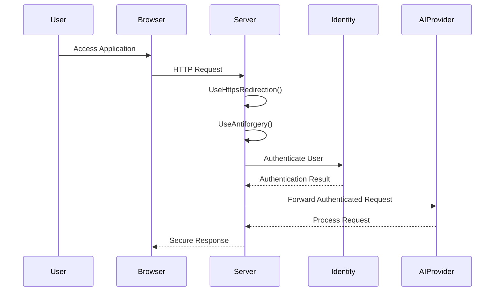
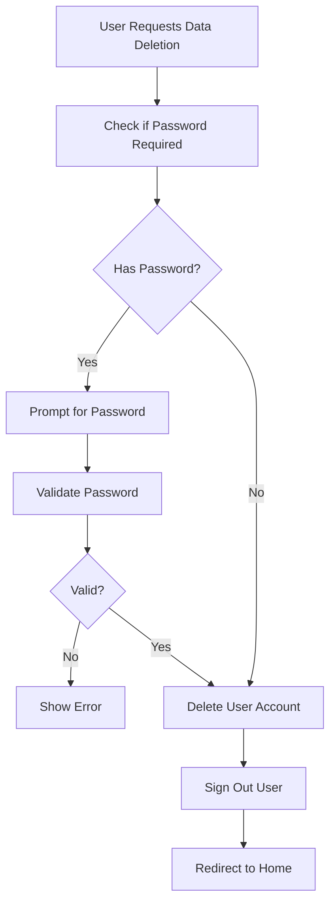

# Security & Data Protection

<cite>
**Referenced Files in This Document**   
- [appsettings.json](file://FitTrack/FitTrack/appsettings.json)
- [appsettings.json](file://FitTrack/FitTrack.Copilot/appsettings.json)
- [SensitiveWordFilterChatClient.cs](file://FitTrack/FitTrack.Copilot/Middleware/SensitiveWordFilterChatClient.cs)
- [Program.cs](file://FitTrack/FitTrack/Program.cs)
- [Program.cs](file://FitTrack/FitTrack.Copilot/Program.cs)
- [DeletePersonalData.razor](file://FitTrack/FitTrack/Components/Account/Pages/Manage/DeletePersonalData.razor)
- [PersonalData.razor](file://FitTrack/FitTrack/Components/Account/Pages/Manage/PersonalData.razor)
- [CopilotServiceCollectionExtensions.cs](file://FitTrack/FitTrack.Copilot/Extension/CopilotServiceCollectionExtensions.cs)
- [ApplicationDbContext.cs](file://FitTrack/FitTrack/Data/ApplicationDbContext.cs)
- [ApplicationDbContext.cs](file://FitTrack/FitTrack.Copilot/Data/ApplicationDbContext.cs)
</cite>

## Table of Contents
1. [Introduction](#introduction)
2. [AI Content Security](#ai-content-security)
3. [Image Upload Security](#image-upload-security)
4. [Data Protection Strategies](#data-protection-strategies)
5. [Authentication Configuration](#authentication-configuration)
6. [GDPR Compliance](#gdpr-compliance)
7. [Dependency Security](#dependency-security)
8. [Conclusion](#conclusion)

## Introduction
FitTrack implements comprehensive security measures to protect user data, prevent harmful AI-generated content, and ensure compliance with data protection regulations. This document details the security architecture and best practices implemented across the application, focusing on AI content filtering, secure image handling, data encryption, authentication configuration, and GDPR compliance features.

**Section sources**
- [appsettings.json](file://FitTrack/FitTrack/appsettings.json)
- [Program.cs](file://FitTrack/FitTrack/Program.cs)

## AI Content Security

### Sensitive Word Filtering
The `SensitiveWordFilterChatClient` middleware provides content safety for AI-generated responses by detecting and logging sensitive words in both user inputs and AI responses. The filter is implemented as a delegating chat client that wraps the core AI client, allowing it to inspect messages before and after processing.

The filter maintains a case-insensitive hash set of sensitive words and scans both user input and AI responses for matches. When sensitive content is detected, it is logged with a warning level, enabling monitoring and auditing without blocking legitimate user interactions. The current implementation includes a basic set of Chinese-language sensitive words ("垃圾", "废物", "骗子", "投诉", "举报") which should be expanded in production.

**Diagram sources**
- [SensitiveWordFilterChatClient.cs](file://FitTrack/FitTrack.Copilot/Middleware/SensitiveWordFilterChatClient.cs)

The filtering system is configurable via the `Performance:EnableSensitiveWordFilter` setting in `appsettings.json`, allowing the feature to be toggled without code changes. In production, the sensitive word list should be loaded from a secure configuration source or database rather than being hardcoded.

**Section sources**
- [SensitiveWordFilterChatClient.cs](file://FitTrack/FitTrack.Copilot/Middleware/SensitiveWordFilterChatClient.cs)
- [CopilotServiceCollectionExtensions.cs](file://FitTrack/FitTrack.Copilot/Extension/CopilotServiceCollectionExtensions.cs)

## Image Upload Security

### File Handling Configuration
FitTrack configures secure file upload handling through form options in the `Program.cs` file. The application sets a reasonable limit of 20MB for multipart body length, preventing denial-of-service attacks through excessively large file uploads.

The configuration is applied globally through the `FormOptions` service configuration, ensuring consistent behavior across all endpoints that handle file uploads. This approach prevents individual endpoints from inadvertently accepting larger files.

**Section sources**
- [Program.cs](file://FitTrack/FitTrack.Copilot/Program.cs)

## Data Protection Strategies

### Encryption and Database Security
FitTrack uses SQLite for data persistence with connection strings configured in `appsettings.json`. The database file is stored in the `Data/app.db` location, and the connection string specifies shared cache mode for performance optimization.

User data including dietary logs and personal identifiers are stored in the database through Entity Framework Core models. The `ApplicationDbContext` classes in both the main and Copilot projects define the data models and relationships, with proper configuration for identity management and chat session storage.

Sensitive data such as API keys are not stored in configuration files. Instead, they are retrieved from user secrets during development, as indicated by the `AddUserSecrets<Program>()` call in the Copilot project's `Program.cs`. This practice prevents accidental exposure of credentials in source code repositories.

**Diagram sources**
- [ApplicationDbContext.cs](file://FitTrack/FitTrack/Data/ApplicationDbContext.cs)
- [ApplicationDbContext.cs](file://FitTrack/FitTrack.Copilot/Data/ApplicationDbContext.cs)

All data in transit is protected by HTTPS, enforced through `app.UseHttpsRedirection()` in both applications. This ensures that sensitive user information is encrypted during transmission between clients and servers.

**Section sources**
- [appsettings.json](file://FitTrack/FitTrack/appsettings.json)
- [Program.cs](file://FitTrack/FitTrack/Program.cs)
- [ApplicationDbContext.cs](file://FitTrack/FitTrack/Data/ApplicationDbContext.cs)

## Authentication Configuration

### JWT and Security Policies
FitTrack uses ASP.NET Core Identity for authentication, configured in `Program.cs` with application and external sign-in schemes. The configuration includes anti-forgery protection through `app.UseAntiforgery()`, preventing cross-site request forgery attacks.

The application implements role-based access control foundations through the Identity framework, allowing for future implementation of admin roles and permissions. The current configuration supports confirmed accounts, requiring email verification before full access is granted.

CORS policies are not explicitly configured in the provided code, indicating that the application relies on default security settings that restrict cross-origin requests. In production, explicit CORS policy configuration should be implemented to define exactly which origins are permitted to access the API.

API keys for external services like USDA and OpenAI are configured to be retrieved from secure sources:
- OpenAI API key is accessed from configuration with the path `AI:ApiKey`
- USDA API key is accessed from configuration with the path `USDA:ApiKey`

The system is designed to integrate with Azure Key Vault or user secrets for secure credential storage, as evidenced by the use of `AddUserSecrets<Program>()` in the Copilot project.

**Diagram sources**
- [Program.cs](file://FitTrack/FitTrack/Program.cs)
- [Program.cs](file://FitTrack/FitTrack.Copilot/Program.cs)

**Section sources**
- [Program.cs](file://FitTrack/FitTrack/Program.cs)
- [appsettings.json](file://FitTrack/FitTrack.Copilot/appsettings.json)

## GDPR Compliance

### Personal Data Management
FitTrack provides GDPR-compliant personal data management through dedicated Razor pages that allow users to download or delete their personal information. The `PersonalData.razor` page provides access to both data export and deletion functionality, with clear warnings about the permanence of account deletion.

The `DeletePersonalData.razor` component implements a secure deletion workflow that:
1. Requires password confirmation when the user has a password
2. Validates credentials before proceeding with deletion
3. Uses ASP.NET Core Identity's `UserManager.DeleteAsync()` method for secure account removal
4. Signs out the user after deletion
5. Logs the deletion event for audit purposes

The data download functionality is implemented through a form POST to `Account/Manage/DownloadPersonalData`, which should generate a structured export of all user data in a standard format like JSON or CSV.

**Section sources**
- [DeletePersonalData.razor](file://FitTrack/FitTrack/Components/Account/Pages/Manage/DeletePersonalData.razor)
- [PersonalData.razor](file://FitTrack/FitTrack/Components/Account/Pages/Manage/PersonalData.razor)

## Dependency Security

### Vulnerability Management
The application should implement regular dependency scanning to identify and remediate vulnerabilities in NuGet packages. While not explicitly shown in the code, the use of modern .NET features and third-party libraries like MudBlazor, Semantic Kernel, and NLog necessitates a proactive approach to dependency management.

Best practices include:
- Regularly updating NuGet packages to their latest secure versions
- Using tools like `dotnet-outdated` or GitHub Dependabot to monitor for updates
- Implementing automated security scanning in the CI/CD pipeline
- Reviewing security advisories for all third-party dependencies

The application's use of Semantic Kernel and Azure AI clients indicates reliance on Microsoft's security updates, which should be monitored and applied promptly.

**Section sources**
- [FitTrack.csproj](file://FitTrack/FitTrack/FitTrack/FitTrack.csproj)
- [FitTrack.Copilot.csproj](file://FitTrack/FitTrack/FitTrack.Copilot/FitTrack.Copilot.csproj)

## Conclusion
FitTrack implements a comprehensive security framework that addresses AI content safety, data protection, authentication, and regulatory compliance. The sensitive word filtering system helps prevent harmful AI-generated content, while secure configuration practices protect API credentials. The application provides GDPR-compliant personal data management and uses modern authentication practices with HTTPS enforcement.

Key recommendations for enhancing security include:
1. Expanding the sensitive word database and implementing dynamic loading from secure storage
2. Implementing explicit CORS policies tailored to the application's needs
3. Integrating Azure Key Vault for production credential management
4. Adding input validation and virus scanning for uploaded images
5. Implementing automated dependency scanning in the development workflow
6. Enhancing the data export functionality to provide complete GDPR-compliant data packages

These measures ensure that FitTrack maintains a strong security posture while delivering valuable AI-powered nutrition tracking features.