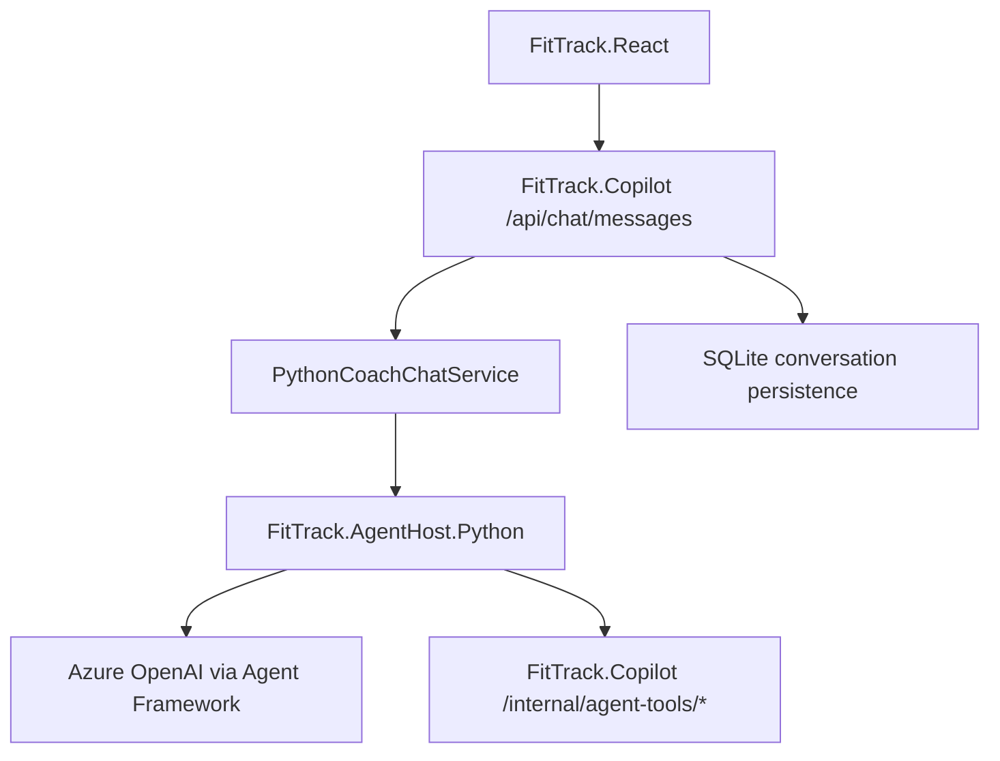
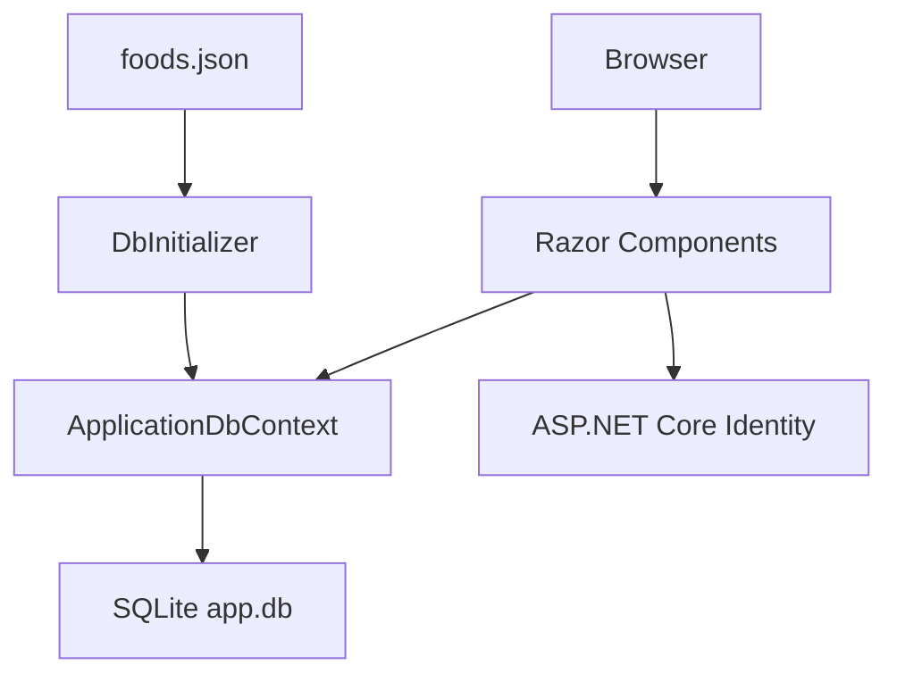
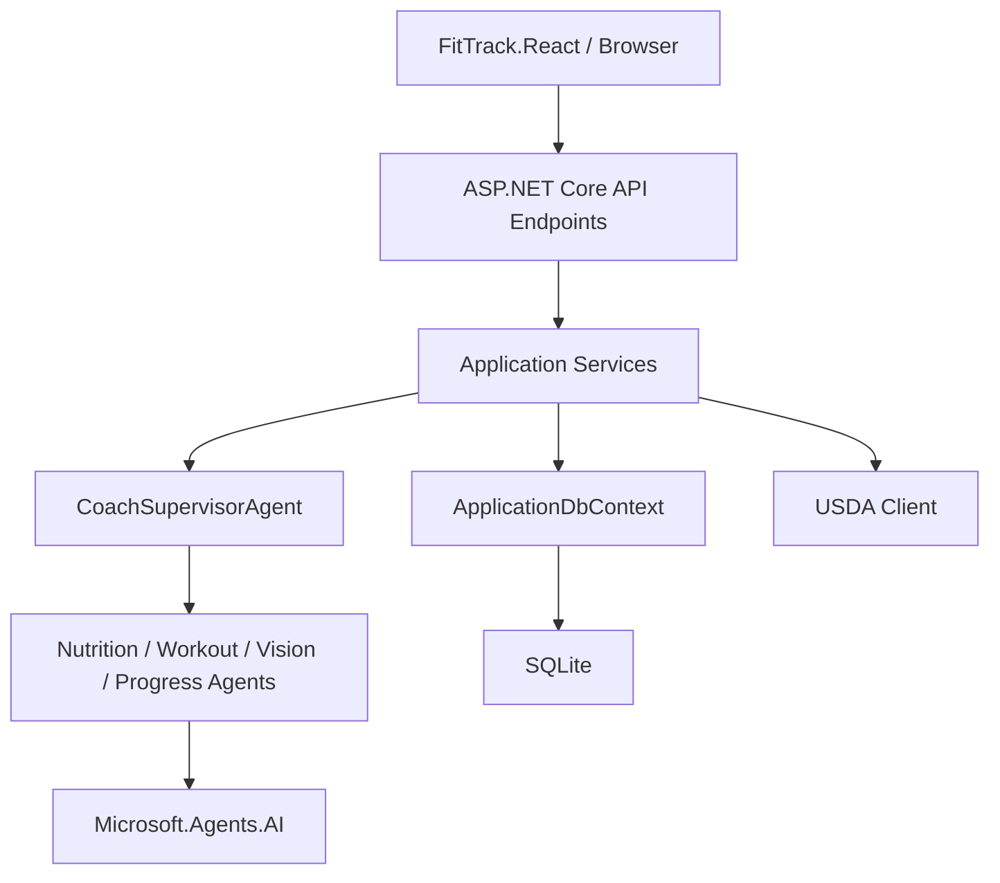
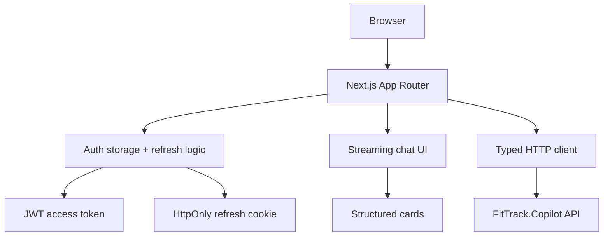

# ARCHITECTURE.md

## Python Agent Sidecar

Phase 1 增加了一个独立的 Python agent host:



关键边界:

- 前端仍只调用 `FitTrack.Copilot`
- Python sidecar 不负责认证
- Python sidecar 不负责 conversation 数据持久化
- `.NET` 在 Python 不可用或失败时会 fallback 到当前进程内 `CoachSupervisorAgent`
- `/internal/agent-tools/*` 仅在 Development 下启用，并限制 loopback 调用

## 1. 总览

仓库当前是一个双 .NET 后端 + 独立前端的工作区:

- `FitTrack`: 基础健身/饮食记录 Web 应用，仍是 legacy 参考实现
- `FitTrack.Copilot`: 带 AI 能力的主后端 API / Agent Host
- `FitTrack.React`: Next.js 前端工作台

当前真正的主交付链路是 `FitTrack.React -> FitTrack.Copilot API`。`FitTrack` 仍然保留，但不再承接新的主线能力。

## 2. Solution 结构

```text
FitTrack.sln
├── FitTrack/                  # 旧主应用，net9.0
│   ├── Components/            # UI、路由、布局、账号页面
│   ├── Data/                  # DbContext、实体、迁移、SQLite 文件
│   ├── Properties/
│   ├── wwwroot/               # 静态资源、foods.json
│   └── Program.cs             # 启动入口
└── FitTrack.Copilot/          # AI 扩展应用 / API Host，net10.0
    ├── Api/                   # 外部 API 集成，如 USDA
    ├── Agents/                # Supervisor + 专家 Agent
    ├── Components/            # 仍保留的旧 Razor/MudBlazor UI
    ├── Data/                  # Copilot 自己的数据层
    ├── Endpoints/             # Minimal API/HTTP 端点
    ├── SemanticKernel/        # 既有 AI 编排、插件、RAG、skills
    ├── Service/               # 应用服务层
    ├── Properties/
    └── Program.cs

FitTrack/FitTrack.React/        # 独立 Next.js 前端，不在 .sln 中
├── src/app/                   # App Router 页面
├── src/components/            # React 组件与工作台布局
├── src/lib/                   # API 配置、认证、HTTP 客户端
└── src/types/                 # 前端 DTO 类型
```

## 3. 主应用 `FitTrack` 架构

### 3.1 运行时结构



### 3.2 关键模块

#### UI 层

- `Components/App.razor`: 根组件
- `Components/Routes.razor`: 路由入口，使用 `AuthorizeRouteView`
- `Components/Layout/*`: 主布局和导航
- `Components/Pages/*`: 页面集合

#### 身份认证层

- 使用 ASP.NET Core Identity 默认模式
- 认证组件位于 `Components/Account/*`
- 通过 `MapAdditionalIdentityEndpoints()` 暴露账户相关端点

#### 数据层

- `ApplicationDbContext` 继承 `IdentityDbContext<ApplicationUser>`
- 当前业务实体:
  - `Food`
  - `DailyFoodRecord`
- 迁移文件位于 `Data/Migrations`

### 3.3 主应用数据模型

#### `Food`

字段重点:

- `Name`
- `Category`
- `Brand`
- `Unit`
- `Calories`
- `Protein`
- `Fat`
- `Carbs`
- `IsDefault`

用途:

- 作为食物主数据表
- 支撑默认食物库导入

#### `DailyFoodRecord`

字段重点:

- `User`
- `Date`
- `FoodId`
- `Quantity`
- `TotalCalories`
- `Note`

用途:

- 记录用户每日饮食摄入
- 当前实体已存在，但主应用 UI 尚未形成完整闭环

### 3.4 启动流程

`FitTrack/Program.cs` 中的重要行为:

1. 注册 Razor Components Interactive Server
2. 注册 Identity 与认证状态提供者
3. 注册 EF Core Sqlite
4. 注册 MudBlazor 与 `HttpClient`
5. 应用启动后自动执行数据库迁移
6. 调用 `DbInitializer.Initialize(...)`
7. 映射静态资源、Razor Components、Identity 端点

## 4. Copilot 应用 `FitTrack.Copilot` 架构

### 4.1 运行时结构



### 4.2 模块划分

#### API 与前端分层

- `FitTrack.Copilot/Endpoints/*`: 对外 API
- `FitTrack/FitTrack.React/src/app/*`: 新前端页面
- `FitTrack/FitTrack.React/src/components/chat/chat-view.tsx`: 线程式聊天工作台

#### 服务层

位于 `FitTrack.Copilot/Service/`，当前主线包括:

- `ConversationService`
- `ProfileService`
- `ProgressService`
- `AuthTokenService`
- `FoodAiService`
- `FoodRecordService`
- `FitnessService`
- `WorkoutSessionService`

职责:

- 将 UI 请求转换为数据库操作、AI 调用和外部 API 查询

#### AI 层

位于 `FitTrack.Copilot/Agents/` 与 `SemanticKernel/`

包括:

- `CoachSupervisorAgent`
- `NutritionAgent`
- `WorkoutAgent`
- `VisionNutritionAgent`
- `ProgressCheckInAgent`
- Semantic Kernel 现有 orchestration / plugins / RAG

职责:

- 聊天代理编排
- 食物文本/图片识别
- 健身知识检索
- Prompt 与系统提示管理
- 多轮线程消息与结构化卡片输出

#### 集成层

- `Api/Usda/*`: USDA 食物数据库客户端
- `Endpoints/*`: HTTP 接口暴露
- `AddCopilotServices(...)`: 集中注册 AI 能力

### 4.3 Copilot 启动流程

`FitTrack.Copilot/Program.cs` 中的重要行为:

1. 加载 user-secrets
2. 注册 OpenAPI、ProblemDetails、Health Checks 和 Rate Limiting
3. 配置 NLog
4. 注册命名 `HttpClient("nutrition")`
5. 注册 Identity、EF Core、CORS、JWT 认证
6. 注册 USDA Client
7. 注册 Copilot / Agents / 应用服务
8. 配置表单上传上限为 20MB
9. 映射业务端点和健康检查

## 5. `FitTrack.React` 架构

### 5.1 运行时结构



### 5.2 关键模块

- `src/app/*`: 登录、聊天、饮食、训练、进度、档案页面
- `src/components/chat/chat-view.tsx`: 线程式聊天工作台
- `src/components/layout/app-shell.tsx`: 全局壳层、导航和会话守卫
- `src/lib/http.ts`: API 封装、401 自动刷新、`/api/auth/me` 读取
- `src/lib/auth.ts`: 本地 token/user 存储
- `src/types/fittrack.ts`: 与后端 DTO 对应的前端类型

### 5.3 前端数据流

1. 用户访问 `FitTrack.React`
2. 应用壳层检查本地 token 和 `/api/auth/me`
3. 聊天、饮食、训练和进度页面通过 `src/lib/http.ts` 调用后端
4. 后端返回 DTO、流式事件和结构化卡片数据
5. 前端负责渲染线程、历史消息、快照和登录态切换

## 6. 关键架构差异

### `FitTrack`

- 更接近传统 CRUD Web 应用
- 架构简单
- 易于稳定交付
- 当前 UI 完成度低于数据层

### `FitTrack.Copilot`

- 偏 AI orchestration 应用
- 外部依赖多
- 可扩展性更强，但复杂度和运行前提也更高
- 更需要配置治理、测试和可观测性

### `FitTrack.React`

- 专注于会话体验、线程列表、结构化卡片和表单交互
- 不直连数据库，所有业务写入都走 `FitTrack.Copilot` API
- 通过 bearer token + refresh cookie 维持登录态
- 作为前端壳层，承担主用户体验和移动/桌面布局

## 7. 主要数据流

### 主应用饮食数据流

1. 用户访问 Razor 页面
2. 页面直接或间接使用 `ApplicationDbContext`
3. 读取 `Foods` / `DailyFoodRecords`
4. 返回 UI 展示

### Copilot AI 数据流

1. 用户在 `Chat` 或 `FoodVision` 输入文本/图片
2. 页面调用服务层
3. 服务层按需调用:
   - 本地数据库
   - USDA API
   - Semantic Kernel / AI provider
4. 结果回填到 UI 或保存为记录

### Next.js 前端数据流

1. 用户访问 `FitTrack.React`
2. 应用壳层检查 token 并调用 `/api/auth/me`
3. 页面通过 typed HTTP client 调用 Copilot API
4. 聊天页解析 NDJSON 流式事件并增量渲染
5. 结构化卡片与历史线程由前端本地状态和后端 DTO 共同驱动

## 8. 当前架构缺口

- 仓库层面没有统一的共享 domain 层
- `FitTrack.React` 仍是 `FitTrack/` 下的独立目录，不在 `.sln` 中
- 两个 .NET 项目的数据模型和能力边界仍未在代码结构中显式统一
- 主应用页面和业务模型不匹配
- 缺少测试项目，架构回归很难被自动发现
- AI 相关失败兜底、限流、超时、审计规则仍需要继续固化
