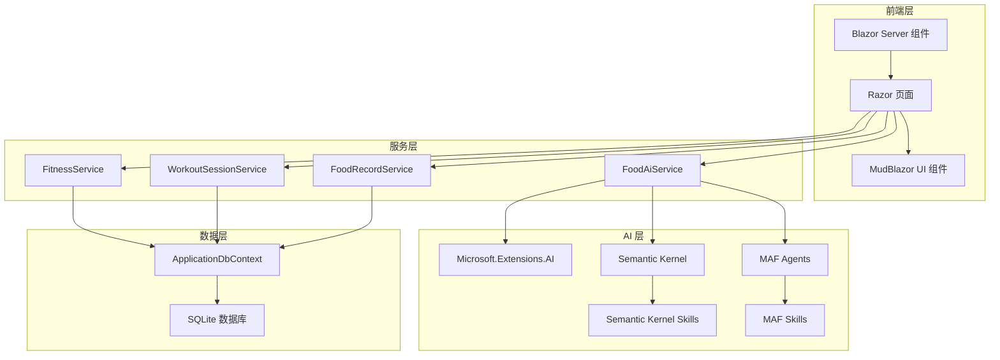

# FitTrack 系统架构文档

## 1. 技术栈

- **框架**: .NET 10.0
- **前端**: Blazor Server
- **后端**: ASP.NET Core 10.0
- **数据库**: SQLite
- **AI 技术**:
  - Microsoft.Extensions.AI
  - Semantic Kernel 1.67.0
  - Microsoft Agent Framework (MAF)
- **UI 组件**: MudBlazor 8.13.0
- **日志**: NLog
- **依赖注入**: Microsoft.Extensions.DependencyInjection
- **数据访问**: Entity Framework Core 10.0

## 2. 系统架构图

## 3. 架构说明

### 3.1 前端层
- **Blazor Server 组件**: 提供实时的服务器端渲染，支持组件化开发
- **Razor 页面**: 包括用户认证、健身目标、健身计划、锻炼记录、食物记录等页面
- **MudBlazor UI 组件**: 提供现代化的 UI 组件库

### 3.2 服务层
- **FitnessService**: 管理健身目标和健身计划
- **WorkoutSessionService**: 管理锻炼会话和训练记录
- **FoodRecordService**: 管理食物记录和营养统计
- **FoodAiService**: 集成 AI 功能，提供食物识别和营养分析

### 3.3 AI 层
- **Microsoft.Extensions.AI**: 提供 AI 聊天客户端和核心功能
- **Semantic Kernel**: 提供 AI 编排和技能管理
- **MAF Agents**: 实现 FitnessAgent 等智能代理
- **Semantic Kernel Skills**: 提供食物识别、营养分析等技能
- **MAF Skills**: 提供健身建议、营养建议等技能

### 3.4 数据层
- **ApplicationDbContext**: Entity Framework Core 数据库上下文
- **SQLite 数据库**: 轻量级本地数据库，用于存储用户数据和健身相关信息

## 4. 核心功能模块

### 4.1 健身目标管理
- 创建、编辑、删除健身目标
- 跟踪目标进度
- 提供目标完成建议

### 4.2 健身计划管理
- 创建、编辑、删除健身计划
- 管理计划中的锻炼日和练习
- 提供计划执行跟踪

### 4.3 锻炼记录
- 记录锻炼会话
- 跟踪锻炼时间、消耗卡路里等指标
- 管理练习详情（组数、次数、持续时间）

### 4.4 食物记录
- 记录食物摄入
- 提供营养统计（卡路里、蛋白质、碳水化合物、脂肪）
- 按日期过滤和查看

### 4.5 AI 功能
- 食物图像识别（通过 Semantic Kernel Vision）
- 营养信息分析
- 健身建议和指导
- 膳食计划建议

## 5. 数据流

1. **用户操作** → **前端组件** → **服务层** → **数据层**
2. **AI 功能** → **FoodAiService** → **Semantic Kernel/MAF** → **服务层** → **前端组件**
3. **数据查询** → **服务层** → **数据层** → **前端组件**

## 6. 安全考虑

- **用户认证**: 使用 ASP.NET Core Identity
- **数据保护**: 敏感数据加密存储
- **AI 安全**: 输入验证和敏感信息过滤
- **API 安全**: 适当的授权和认证

## 7. 性能优化

- **缓存**: 对频繁访问的数据使用内存缓存
- **异步操作**: 采用异步编程模式
- **数据库优化**: 适当的索引和查询优化
- **AI 调用优化**: 合理使用 AI 模型，避免过度调用

## 8. 扩展点

- **AI 模型集成**: 支持不同的 AI 模型和提供商
- **营养数据源**: 可集成更多营养数据库
- **健身设备集成**: 可添加健身设备数据同步
- **第三方服务集成**: 可集成其他健康和健身相关服务

## 9. 部署考虑

- **容器化**: 支持 Docker 部署
- **环境配置**: 不同环境的配置管理
- **数据迁移**: 数据库迁移策略
- **监控**: 应用性能和健康监控
