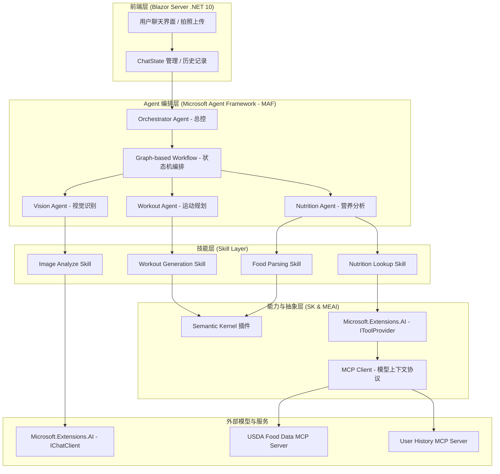

# FitTrack Agent 系统架构设计 (v2.0)

本文档描述了基于 .NET 10, Microsoft Agent Framework (MAF), Semantic Kernel (SK) 和 Microsoft.Extensions.AI (MEAI) 重构后的 FitTrack Agent 系统架构。

## 1. 核心技术栈

- **框架**: .NET 10 (Preview/Stable)
- **Agent 框架**: Microsoft Agent Framework (MAF) - 用于多 Agent 协作、图工作流编排和状态管理。
- **AI 抽象**: Microsoft.Extensions.AI (MEAI) - 提供统一的 `IChatClient` 和 `IToolProvider` 接口，解耦模型供应商。
- **AI 能力**: Semantic Kernel (SK) - 用于定义复杂的插件、提示词管理和特定的 AI 任务处理。
- **技能组件 (Skill)**: 原子化的功能单元。一个 Skill 可以是一个 SK Plugin、一个 MEAI Tool 或一个 MCP 工具，供 Agent 调用以完成具体任务。
- **扩展协议**: Model Context Protocol (MCP) - 用于连接外部数据源（如 USDA 食品数据库、用户历史数据）。
- **前端**: Blazor Server (Interactive Server Mode)

## 2. 系统架构图 (Mermaid)

## 3. 核心组件说明

### 3.1 Microsoft Agent Framework (MAF)
MAF 是本架构的核心，负责管理不同 Agent 之间的通信和任务流转。
- **Orchestrator Agent**: 接收用户意图，判断是需要识别食物还是规划运动，并调用相应的子 Agent。
- **Graph-based Workflow**: 使用 MAF 的图工作流定义复杂的任务流（例如：识别食物 -> 查询营养 -> 生成建议）。

### 3.2 Microsoft.Extensions.AI (MEAI)
MEAI 提供了标准的 `IChatClient` 接口，使得我们可以轻松切换底层模型（Azure OpenAI, Ollama, GitHub Copilot SDK 等）。
- **Middleware Pipeline**: 利用 `ChatClientBuilder` 构建中间件链，实现全局的日志记录、审计和安全过滤。

### 3.3 Semantic Kernel (SK) Integration
SK 作为高级能力插件的容器。虽然 MAF 负责编排，但 SK 的插件机制依然是定义 AI 功能（如复杂的提示词模板、原生函数调用）的最佳方式。我们将 SK 插件通过 MEAI 的 `IToolProvider` 暴露给 MAF Agent。

### 3.4 技能组件 (Skill Component)
Skill 是 Agent 的“手和脚”，是执行具体逻辑的原子单元。
- **解耦执行**: Agent 只需要声明它需要的 Skill，而不需要关心该 Skill 是由 SK 插件、本地代码还是 MCP 服务实现的。
- **统一包装**: 所有 Skill 都通过 `Microsoft.Extensions.AI.IToolProvider` 或类似的抽象暴露，确保 MAF Agent 可以通过统一的工具调用接口 (Tool Calling) 驱动它们。
- **FitTrack 核心技能**:
    - `FoodParsingSkill`: 负责将自然语言解析为结构化食品。
    - `ImageAnalyzeSkill`: 视觉分析技能，识别图片中的食物。
    - `NutritionLookupSkill`: 通过 MCP 连接 USDA 查询营养数据。

### 3.5 Model Context Protocol (MCP)
引入 MCP 协议，将 FitTrack 的核心业务数据（食品库、运动库）以 MCP Server 的形式提供。这使得 Agent 可以以标准化的方式查询实时上下文，而无需编写特定的数据访问逻辑。

## 4. 下一步重构计划

1.  **升级项目文件**: 将 `FitTrack.Copilot.csproj` 升级到 `net10.0`。
2.  **配置 MAF**: 引入 `Microsoft.AgentFramework` 相关包并初始化 Agent 容器。
3.  **MEAI 重构**: 将现有的 `FoodAiService` 重构为基于 `IChatClient` 的中间件模式。
4.  **MCP 集成**: 为 USDA 客户端创建一个 MCP Server 包装器。
5.  **Agent 定义**: 定义 `VisionAgent` 和 `NutritionAgent` 并在 MAF 中注册。
